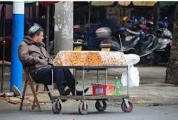
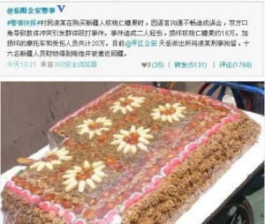

# 切糕、合理质疑与阴谋论

** **

#### 兄弟

本科时候班上有一个维族兄弟和一个藏族兄弟，真是两朵奇葩。我们第一次去农家乐过夜，藏族这兄弟喝高了不省人事，随便往哪儿一放就能打鼾。维族那哥们也喝高了，但整个人像打了鸡血，说不行不行，你不能这么躺着，得走走。于是他把那个藏族兄弟拎起来，一会扔到这间房躺着，看看，不行不能这么躺着，再拎起来扔到另一间房里。来来回回折腾了好多趟，看得我们哭笑不得。最后维族这哥们累了，把藏族这兄弟扔到给女生准备的房间里，自己回屋睡觉去了。于是我只好陪着那几个屋子被占了的女生打了一通宵的牌。

班上还有两个维族妹子，我们去烧烤的时候，就请她们跳舞，那维族哥们在一旁唱歌。维语的歌听起来节奏鲜明，而那兄弟又中气十足。乐声绕着两个起伏旋转的漂亮妹子，说实在的，那场景真是美不胜收。

到毕业的时候，我们班一群傻帽，什么节目都想不出来，我就只好临危受命出来组织。但其实我是个傻帽中的傻帽，五音不全四体不勤，只能求爷爷告奶奶的，托班上一个羌族的哥们做艺术总监，编段子写剧本。最后还是藏族那兄弟出手相救，决定写一首班歌，我来填词他来配曲。他真是专业，尽心尽责的谱曲，自己找设备试音，请自己的藏族兄弟们帮忙伴奏。那歌挺让我感动的——因为词是我写的。其实毕业晚会那天我们唱得很烂，十七个汉族兄妹声音都跟蚊子似的。但那首歌真的挺让我感动。每次一哼起那个旋律，我就想起在楼道里，那个汉语不太流利的藏族兄弟对我说，“嘿，贵州汉，快点叫大家练歌了。”

说真的，我真挺想他们的。想他们再把女生挤到我房里来玩个通宵。想听那藏族兄弟说，“贵州汉，你妹！”想听那维族哥们说，“巴扎嘿，你个傻逼啊！”

他们是我的兄弟，我的同学。这时候你会想，“同胞”是个多虚伪的词啊，“同胞”和你一起喝酒吗？同胞会和你一起看着美女，然后说“嘿嘿，你个猥琐男”吗？那只是陌生人的称呼，而我们是兄弟，一样霸气懒惰装逼有礼或是猥琐的兄弟。

#### 不平

但有时别的什么事会提醒我们，我们不一样。

大一时候没买电脑，我们就一起去网吧。菊园外那个奇绝的只有巨大“网吧”两个字没有别的什么名字的网吧。那网吧是个巨大的活动板房，比我们体育馆还大。每次手痒了我们就从北门出来，一溜小跑冲进去，然后喊开房开房，不是，开机。人很多我们就各自去找空位子，等我开了机喊他们上线，却看到一个警察站到了那个藏族兄弟旁边。我凑过去看看。恩，原来只是查身份证。说了我们都是法大的新生，我就也把身份证递过去。那警察说你不用，然后就去看了维族兄弟的身份证。说了几句走了。挺奇怪的，只查他们？无所谓了，打游戏要紧。

等进学校都熟悉了，不再装纯洁，我们就聊起开房。我说哪有便宜的地方啊。他们说你又没妹子，问这个干什么。于是我就只好闭嘴。等后来我说，南门对面那家只要80，还四张床，就是不能洗澡，还是麦当劳过去点那都市花雨和锦水芙蓉不错。他们就说，是，那有便宜的，不过我们一去警察就会来查。我说只要有身份证就能入住啊。他们说，我们是少数民族嘛，你看宾馆柜台里不是贴着“维藏人员严查”吗。于是后来我去一看，耶，还真有，要求立刻通知警方。

#### 切糕

大四我准备我的考研，藏族那兄弟弄他的泡面和音乐，维族那哥们陪他的女朋友（也是维族妹子，美得真是没话说），加上我这人也不好玩，大家就聊的少了。

正好那时我妈去喀纳斯徒步，考完研回去就听她聊。新疆太美了。我说你见着水怪没有。她说没有。然后我就只好听她一个人说。新疆好大，面好难吃，走得好累……然后她说，国家的政策真好。我：……

她说她们的司机是哈萨克族的，说党和国家对我们好啊，孩子从小就免费送到内地读书。我说我知道，我那维族兄弟普通话比我还标准，不时就鄙视我发音。然后她说，那司机讲维族人真坏，国家对他们这么好，还要闹。然后我就火了，你胡说个什么乱七八糟的，好个屁好。她说你哥哥是军人，军队内部通报过，有一队士兵全被杀了，这还不坏啊。我说你知不知道王震（其实我也不知道）？我说你知不知道伊宁开展“淡化宗教意识 崇尚文明健康生活”，不准少数民族居民穿阿拉伯服饰、蒙面纱、留大胡子？（链接：[http://www.yslzc.com/news/Class150/201112/20111215221449.html](http://www.yslzc.com/news/Class150/201112/20111215221449.html)），你知不知道全国各地对维藏同胞的区别对待？（链接：[http://www.cdwh.gov.cn/subwebs/detail.aspx?subwebid=33&articleID=30186](http://www.cdwh.gov.cn/subwebs/detail.aspx?subwebid=33&articleID=30186)、[http://www.0735c.com/3/20120514/201205140700486378.htm](http://www.0735c.com/3/20120514/201205140700486378.htm)等）这时我老爸插嘴说，这个，当然是有点不对。我说，什么叫是有点？什么叫是有点？你就会听共党的就会看新闻联播的。然后我妈说，你就听美国的。我：……

吵了几架后我回到北京，听到斜对面寝室的一哥们买切糕，被黑了。

#### 合理质疑

今天早上一起床看微博，到处都是黑切糕的段子。查了查岳阳16万切糕传言，还真是一刀杨幂上床，二刀帝都买房，三刀兰博入手，四刀盖茨喊娘。我想起那个被黑了的兄弟，心想，黑的好，太黑了。

等晚上看到网上认识的一位值得尊敬的藏族大哥转了几条状态和日志，其中一条是：“打壓他們的文化和宗教，進一步限制他們本來作為國人就少得可憐的參與公共事務的空間，設立政治屏障限制他們通過努力改變自身階層和財富狀況的可能，然後通過大眾傳播邊緣化他們的形象，但是！卻意外地在其犯罪的法律成本上格外寬鬆——不是我說某些民族怎麼樣，而是現在的某些民族政策根本就在把他們往犯罪道路上培養。爲什麽要這麼幹呢，你猜。”

我这才想起我毕业论文不是还在讨论民族问题吗，怎么投了国政就变得这么不专业了。于是我也跟着转了个段子：“看到个评论说，你打工、创业、出国、乘飞机，住宾馆各种设限各种阻扰，但你小偷小摸好了不管了。这不是在说，来吧欢迎来干坏事我们有民族优惠政策哦，但你要想走正道这可不行我要歧视你。”

当然我再次提醒自己是专业人士，黑别人和替别人辩护，都得立足于可查证的经验事实。所以尽管我看到了网吧查身份证、宾馆查房、机场分开走以及伊宁那群狗日的不准人家穿戴民族服装，但我还是相信，或者严谨的说，还是认为没有证据证明岳阳这事是六扇门有意偏袒切糕党，没有证据证明朝廷是恩威两条线让他们堕落让我们憎恨让自己感到被需要。

是的，没有证据。我自己也更认为，如果岳阳这事是真的，警察们也只是不敢惹切糕党，也只是顾全所谓的大局，也只是想用他们自己方式给市民们提个醒不要伤害民族感情——当然他们的方式一向是很娱乐的，如果不考虑造成的伤害的话。

但是治罪不严是事实，歧视行为也是事实。同一国的公民，在好的和坏的方面，都被明显的观察和感受到不平等。是否应该被质疑？这质疑是否是合理的？你们这是在干什么？你猜？

坏就坏在你猜。

#### 阴谋论

一个不知怎么加上的哥么又转了我的状态，说：“阴谋论段子来了哦亲~请查收哦亲~”

“你猜？”你猜我在暗示什么？恩，我们生活在谎言的世界里，就像我极为厌恶地听到马克思老师在课上大谈非典是生化武器之类阴谋论一样，这个“你猜”的阴谋论味道太浓了。通过罗列没有逻辑联系的时间，加上有倾向性的评论，以一个不置可否的问句结束。这确实是阴谋论的标准句式。我愿意声明，无论何时何地，面对何种观点，皆努力坚持严谨审慎、依据事实、符合逻辑的态度，反对一切选择性罗列、倾向性暗示的阴谋论立场和方法。

然而就像前面说的，这种能够同时被观察到的正反两方面的不平等，到底是怎么回事？我们确实不该用阴谋论的调子去问。那就堂堂正正的去问好了：为何一罪不能同罚？为何一国不能平权？为何他们的胡须面纱，要像我们中小学生的头发裤脚一样被审查？

#### 言说的意义

历史和理论的知识没有被普及的时候，我们偶然有幸了解得多一小点的人，应该牢记这句话：“我们每多学到一个知识，就意味着对不知道它的人们缺乏一份理解。”我感到自己的变化和愚钝，故而一刻不敢忘记它。然而这不是我们闭嘴不言的理由。

如果每个人都谈论公共舆论，却是指去掉了自己意见的公共舆论。如果人人都认为自己对公共舆论的那份贡献是消极的，而认为别人的贡献是积极的。如果人人都放弃自己的想法而屈从于一个普遍的论调，那么这个论调本身就意味着一种屈从。我想有时我们得拿着尚未打磨锋利的剑，舞着尚未圆通的招，去保卫处于危险之中的圣物。谦逊，是因为我们确实很烂，不仅打得不好，还可能打得不准伤到本想保护的事物。但言说，偶尔是种责任。

见识了众人的愚蠢与做作，并陷入自身知识和理念的困惑之后，我曾决定不再在这个平台上讨论公共话题。我有我爱的人，我有我好的物，珍视并培养生活美好的那一面，不只是逃避公共事件，更是以不被它占据的方式去促进它。

所以我要写前面一段来给自己找个理由发言。突然觉得这显得好愚蠢啊要不要删掉保持形象？

算了，继续说事吧。

#### 正当，而非立场

切糕党、小偷、宗教迫害和政治压制。它们足以让每一方都有理由对对方愤怒。政府也许也不是我们汉族老百姓的，但就更不是少数民族老百姓的。所以我们没有理由说那些不平等不关我们的事。也许你们和我一样懦弱，既无勇气也无力量去帮助他们，但在面对那些压制的时候，我们不可以不保有道义上的同情，不可以不保有心底里的厌恶。而面对偷窃和抢劫，我们同样不可以不声明反对，不可以不谴责“大局”。

有人会问，你站在哪方的立场上？我们回答，我们站在“正当”的立场上。正因为我们爱我们的家人，所以我们不仅希望他们幸福，也希望他们高尚。我们与他们分享食物、饮料，不独占电视和卫生间，但我们也为他们殴打邻居、不守交规而真诚的愤怒。这就是正当，在每一个具体事情上选择正确的立场。

写到这里，我也正好看到李承鹏主页上的话：“一、得蠢到什么程度，才会认为调侃16万切糕是不顾大局，破坏民族团结。不管汉族还是别族，公平买卖是自古最基本原则，跟什么族无关。二、有多不厚道，才会把一部分人的欺诈扩大到赶走别族。这种人离我远点，我跟你不是一堆。公平是民族团结的前提，学一下诸葛亮，别宽严皆误。”

的确，正当，否则不审势即宽严皆误。“爱他的人而罚他的罪”，我们最学不会的就是这点。

#### 镜鉴

回到那个阴谋论的话题上。当一件事我们毫无证据，只凭模糊没有逻辑的个案以及强烈的偏见来推测，那的确会沦入阴谋论。但回顾前清、回顾苏联、回顾奥匈帝国的历史，我们不难发现这次的事件是任何一个多民族国家都会遇到的事。而有政府时候故意的挑拨，就和它经常努力的缓和与平息族群矛盾一样，很难说是阴谋的结果。他们和我们一样也身陷困局，而且比我们陷得更深。张承志的《心灵史》所展现的，并非是清朝故意挑拨宗教对立，而只是扶植多数稳定地方的一种自然选择。苏联选取少数族群的部分舞蹈、绘画、技艺来扶植，也与它的党国缠绕政治压制一样是方便的政策选择。而奥匈帝国对匈牙利、捷克、斯拉夫人和意大利人的交叉使用，也只是它能找到的不多的方法。

这样说是因为我一直有一种感觉，如果知道不是只有我们自己在面对这样的问题，知道不是只有我们经历过这样的矛盾，知道有些今天看似和睦的国家也曾与我们一样充满争执，那我们或许会把这些矛盾看淡一些——不是回避它们，而是少一些火气，多一些耐心。

上面讲前清、苏联，讲奥匈帝国，是一些与我们今天情况更像的例子。一部分人们往往怀有希望，认为民主到来的时候，可能就不再有政府的“阴谋”，也不再有族群的对立。但我们要警惕，事情不一定是这样的。社会依然分裂的时候，政治自由与民主反而会促进族群对立。台湾就是很好的例子，在族群对立的情况下身份认同甚至会经常摧毁理性选择。这并不是在为专制找借口。正当的执法而不分族群，平等的复权而不分多寡。这些是我们通常能想到的，也是本就该做到的基本正义。而要免于民主制度下依然存在的那种族群冲突，我们或许要进行更多的探索。

平等的不满、民主的不满，族群问题甚至在比利时、加拿大、西班牙这样的国家都依然存在。在找到有效解决的办法之前，我们或许能先学着像他们一样，一遍争论，一边和平和友善的生活。

 

（采编：马特，责编：马特）

 
