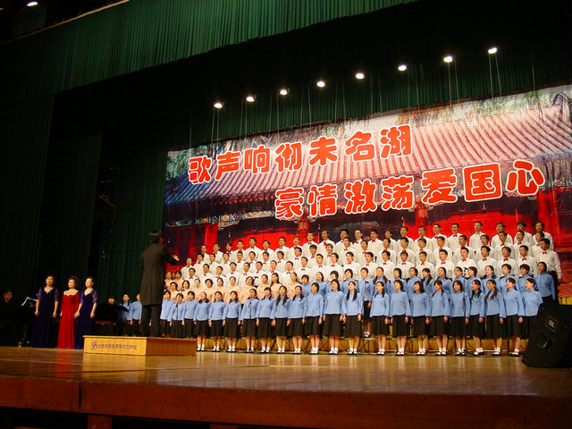
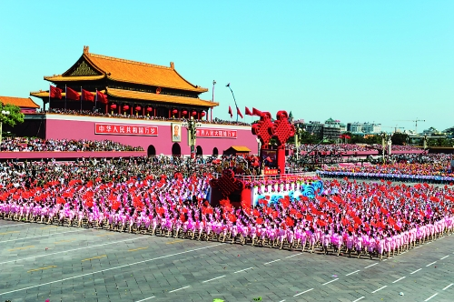
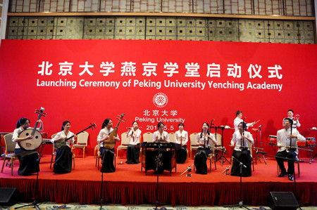
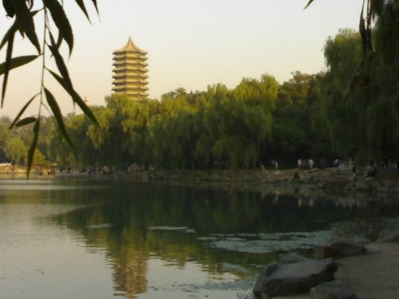

# 初恋

作者是北大校方派出的高级五毛，挖空心思写了一篇超级棒的小说，为燕京学堂狡辩和吹捧而不着痕迹。青年学子对这种新型宣传手段往往缺乏警惕，特此提请广大读者注意辨别。

我叫刘方，江苏盐城人，二〇〇八年考入北京大学。我的初恋叫张小雪，张小雪家和我家住同一条巷子，二〇〇八年张小雪高中毕业参加工作。

我报到的时候，一手拖着拉杆箱，一手拿着电话告诉张小雪我到了不用担心快去忙吧。她说现在没事，问我有没有去看奥运会，我说奥运会早过了，现在只能看残奥会。她又问我哥有没有来接我，那不肯定的嘛。我哥大老远就看见我了，一直冲这边招手。他叫刘锐，比我早三年进北大。我不和你说了，先挂了，张小雪说她也要有事了。

张小雪在汽修厂上班，穿油乎乎的工作服，屁股兜里放两把扳手。她爸爸是黑社会老大，家里好多车，张小雪是玩汽车长大的。汽修厂是流氓出没的地方，张小雪不怕，她比谁都流氓，我从小到大都打不过她。张小雪的爸爸，也就是黑社会老大，经常醉醺醺地拿大手拍拍我瘦削的肩膀，我就喜欢你这种有文化的小伙子，做我女婿吧。

我哥陪我去乒乓球馆看残奥会，说我们这种理科院系，大一就争取把托福GRE过了，以后省心。那场比赛中国人拿了金牌，我用诺基亚手机拍了一张照片，QQ传给张小雪，她回了一个鼓掌的表情。

宿舍住四个人，包括我在内，都是大学霸。其他两个除了学习什么都不会，刘哲类不一样，他会抽烟，还会打DOTA。当我们谈起人生、理想，刘哲类说自己想学核物理，将来炸平全世界。我说学那玩意小心生不出孩子，刘哲类脱掉裤子，指了指两腿之间，问我，会吗？我受到了惊吓，并说，不会。

入学忙了一阵之后就是一二九大合唱。我举手，报告老师，我建议唱水浒传里的好汉歌。大家哄笑，并表示赞成。老师脸上尴尬了一阵，同学们，我（sha）们（bi）觉得还是唱祖（yi）国（tuo）颂（shi）更合适。这时候我电话响了，是张小雪，在干嘛呢，我说一二九合唱排练，她问唱什么歌，我说祖国颂，她表示没听说过。张小雪说天冷了，我给你织了毛衣寄过去，你好好唱吧。挂了电话，我心里烦得很，刘哲类凑过来，把手机里存的A片放给我看。

一二九那天，我们每个人的脸都被师姐化得跟猴屁股一样，我穿着新毛衣，让刘哲类给我拍了一张，传给张小雪，她回了一个大笑的表情。

忙完一二九就快过年了。我哥喊我出去喝了一顿酒，说他过年不回去了，留在北京专心考试等申请。他说我就要出国了，五六年不回来，爸妈老了，你多担待。你好好学，以后比我厉害了，我就回来照顾爸妈，让你飞出去。他给我一张银行卡，说里面有五万块钱，是他大学四年攒的，让我带回去。等哥哥喝醉了，我就把卡塞回他口袋。

寒假回盐城，我见到了张小雪。一见面我就把她扑倒了，她说你等一下，然后从屁股兜里掏出一把铁扳手，往我脑门上敲了敲，“硌得难受”。有一天，我约她到沙滩散步，冻得要死。我说想出国，下学期得考个托福什么的，出国前先得和你结婚把你肚子搞大。她笑笑，说你有钱报名吗，没钱我给你。我说有。那天是正月十五，我俩逃了家里的团圆饭，双双冻感冒，不过月亮很美。

我当然没钱报名。回校后，我穿着西装，系着领带，搞得人模狗样，站在中关村欧美汇购物广场，见人就问：

“先（xian-er）生！学英（ying-eng）语吗？华尔街英（ying-eng）语！”

从西面的VANS开始，一直到东面的innisfree，我每天来回走足100趟就下班，推销一份有一份的提成。

等钱赚够，我没日没夜狂背了两个月，把托福、GRE过了。我哥的申请也成功了，去普林斯顿。我在电话里跟张小雪说，干脆你也申请一个吧，就去哥伦比亚。我哥没等毕业季就回家了，在海边给别人当帆船教练，赚学费。

宿舍两个学霸都申请了暑期项目，去美国逛逛。我听了我哥的建议，申请了一学期的海外交流，为以后出国做铺垫。刘哲类哪也不去，继续打游戏、抽烟、研究核物理。张小雪说下学期我就见不到你了，我说是啊，不能把你肚子搞大了，她笑笑，说你先把护照办好。去大使馆那天，我看见对方是个黑人，一下就High起来了，直接喊了一句“Hey, you”，黑人脸上绽出巨大笑容，站起来和我握手，“Dude, I'm shocked”。

放暑假了，我收拾行李准备回去见张小雪。我的诺基亚响起了经典的铃声，然后被告知共和国今年六十岁了，年轻人要去走方阵。党委书记在动员大会上说年轻人踊跃报名自愿走方阵，我从教育材料上撕下一页纸，写下“张小雪”，折成纸飞机，向主席台掷去。那一天，北京大学百年纪念讲堂，起哄声此起彼伏，纸飞机漫天飞舞，领导讲话被打断。十月一号，张小雪打电话来，说你不是在第一排吗，我怎么没看见你。我说反正胡锦涛看见了。

十一假期刚过，我准备出国交流了，班主任到宿舍来看我。她嘘寒问暖一阵，然后拿出一张表，让我填，学校心理辅导中心要对全校学生做个抽样调查，考虑到你各方面条件都比较好，我们班让你去。我把表填了，她让我星期六早上八点过去。我很礼貌地把她送到楼下，刘哲类一直不喜欢班主任，自始至终他都光着膀子打DOTA，一言不发。

心理辅导老师是个大胡子，上来就问我体重多少，我说我经常游泳健身，体重一直控制在一百四。他指着屋角的健康秤，是吗，去称称。我站上去，电子屏显示105。我的第一反应是电子秤坏了，大胡子说你回来吧。他让我坐下，手里拿着一叠材料，班主任老师让你来不是做抽样调查的，我们发现你有严重的精神疾病，所以今天对你进行一次治疗，治疗已经得到你所在院系和你家人的同意。大胡子递过来一张表，上面有班主任和我父母的签名。

我心里有些害怕，但还是装冷静，问大胡子我有什么问题。

他反问我和室友关系怎么样，我说和刘哲类关系很好，其他两个也很融洽。

他点点头，问我看没看过电影《美丽心灵》。我说看过，你什么意思？大胡子说电影里纳什的室友是他想象出来的。我说不可能，我和三个室友天天在一起，都快一年了。

今年是你在北大的第几年？第一年啊。第一年还是第二年？我肯定是第一年。

你的室友，他们现在在哪呢？我说刘哲类正在打DOTA，其他两个申请交换项目去美国还没回来。

大胡子若有所思地问我，刘哲类是北京人吧？我说是啊。他问刘哲类北京人干嘛不回家住要在宿舍，我说这很正常啊。

他把双手撑在桌上，半俯身子对我说，刘哲类根本没申请宿舍，你们宿舍从一开始就只有三个人，其他两个室友根本没有出国交流，现在就在北大，他们被你惊吓，向宿管中心申请搬到别的楼了。

惊吓？

最开始是半夜上厕所的同学发现的，你每天夜里两三点在走廊里来回走，推销华尔街英语。后来是宿舍楼保洁员凌晨五点发现你一个人搬了两把椅子在浴室，坐在其中一把椅子上说外语。

可是？

你有个哥哥叫刘锐吧？

我说是。大胡子说你哥哥大学最后一学期溺水死了，毕业证和学位证现在还在教务中心。

我头痛欲裂，身子一歪倒下了。

等我醒来，已经躺在医院的病床上。病房里很安静，只有我一张床，父母陪在床边，我感到很安全。爸妈专程从盐城赶过来，听说我的事情他们都很着急。妈妈眼里含着泪，说儿子你别这么辛苦了，小锐已经走了，小雪也走了，妈不能再失去你。我见妈妈哭了，不好再问她什么，把脸转向爸爸。爸爸说医生诊断你是精神分裂，你哥和小雪谈恋爱，小雪瞒着家里去北京，就在你们学校附近的商场打工，陪着你哥，照顾他。后来他俩偷偷结婚，你哥准备把她带出国，当帆船教练就是为了多赚点钱。眼看熬到头了，有天两个人一起出海，翻船淹死了。这些你都记不得了？我摇摇头。医生说你一个人扮演好多人，精力不济才这么瘦的，需要静养一段时间才能动手术。

我想起《美丽心灵》里面的场景，只要不看见那些人，病就差不多好了。在心理辅导中心晕倒之后，我再没看见刘哲类，也再没接到张小雪的电话，这是个好迹象。院系领导也来看过我，说我病得这么重还能学得这么好不容易，准备向学校的“燕京学堂”计划推荐我。

“燕京学堂”计划是一项根植于北大深厚的历史文化，利用北大人文社科领域学科完备的优势，为来自海内外一流大学的学生开设的一年制“中国学”硕士学位项目。该项目倡导在全球化的语境中认识和了解中国，希望聚集国际顶尖师资和一流学生团队，打造全球领先的“中国学”教学研究中心。在燕京学堂，我可以和来自全球各一流大学的本科应届毕业生一起学习、交流。

我已经精神分裂了，还要接受脑部手术，即便术后痊愈，估计脑子也废掉了，去燕京学堂算是最好的归宿。我没想到校领导能为我考虑得这么周全，我说我一定好好治疗，治好了一定好好学，给北大争气。他们临走前嘱咐我好好养着，不要有压力。

要上手术台了，妈妈抓着我的手不放，她害怕。我说别怕，北大校医院是全国一流的综合性医院，这里的医生受过很好的训练，技术过硬，治个精神分裂、做个开颅手术，没问题的。妈妈年纪大了，受到的打击太多，即便我这样安慰，她还是流泪了。我心里难过，抱了抱她，自己也哭了。

手术很成功，我康复得也很快。爸爸妈妈每天陪在我身边，他们在南门外租了房子，每天做饭给我补充营养。

以前的事情我都记起来了，张小雪是我们高中最漂亮的女生，她爸爸、黑社会老大不喜欢我哥哥，反对他们在一起。我上大学来北京以后，张小雪对我也很照顾。她和我哥溺水之后，黑社会老大接受不了，自杀了。

医生允许我偶尔出去活动活动。现在，我坐在住院部门口的花坛上，夕阳挂在博雅塔尖，地上蒸出让人舒服的热气，头顶飞过一两只鸟，但是我不能抬头看，会疼。校园慢慢安静下来，此时此刻，生活的真实仿佛触手可及。

一个护士走过来，拿了一些表格让我签字。可能今天出来的时间有点长，头很晕，我说让我爸妈签吧，现在看字头晕。她说什么爸妈，我说就是每天来病房照顾我的老夫妻啊，她说哪有什么老夫妻，一直都是我们在照顾你啊。

护士瞪大眼睛，从她的眼里我看见自己的脸，脸上掠过一抹诡诈的笑容。

（采编：徐蕾；责编：刘铮）