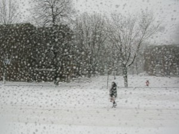

# 剃头匠

** **

走进这所旅馆，我费了半天口舌，才讲到五十块钱住两天。

华北平原上空夜幕低垂，覆盖村镇与庄稼，眼看暴风雪快要来了。我躺在发霉的床铺上，睁大眼睛，空气黑暗又黏稠。风夹着冰雪击打在窗棂上，凌厉得让人全无睡意，我想起来应该给你写一封信。扯到床头灯的开关线，一用力就掉了下来。我躺回到床上，在脑海中虚拟一个躲藏在黄金时间里的故事。

毋庸置疑，随着年龄增大，我深感头发愈渐稀疏，记忆力也随之衰弱，结婚的打算便迫在眉睫。这也是我因何再次来到这个异乡的缘由。老人们常说，人一旦上了岁数，就容易回忆往事，装修着过去的幻想。至于那是不是自己，加上许多修饰和篡改后，也并不需要那么执着。总得来说，人难免也会回想一路过来时，究竟得到了什么结果。如果找不到，就得继续想，随后还得往前走。

但人年纪大了，总该结婚，你说对吧。

五年前，我才二十七岁。因为一些工作上的琐碎，经过这个城镇。也同样在一个初冬的雪夜，走入一家荒村野店。大红灯笼将野地照的血红，室外漫天雪花，站久了能冻死人。隔着幕帘，看见室内莺声燕语，春意融融。我拍下棉袄上的积雪，走进这个歌厅。

我就是在这里认识她的，那时她才二十岁。当时我吼着嗓子唱《2002年的第一场雪》，混合着满室的烟雾，劣质白酒从歪倒的瓶子里倾洒在地上。然后我不停的咳嗽，烟雾不停侵蚀肺部，医生曾告诉我阴影正在扩大，可能活不了几年了。我拿着手机，弓着身子剧烈咳嗽，盯着屏幕上黑色方块。她轻拍着我的背部，等我缓过气来，就和她交谈了下去。

你其实也看得出来，每次我都故意忽略这个故事的重点，同时我也并不擅长描写场面。

若干年后，我再次来到此地，为完成那时醉酒后的婚娶誓言。此刻，我走出旅馆狭窄的通道，马路上积雪耀眼，她那时候应该是个小姑娘吧。是啊，也是二十岁。这让我痛苦的蹲在地上，冰棱融下的水滴在头发上。你看，我一定是忘记了什么重要的东西，不用来提醒我想起来，一定不要。只不过应该沿着早先走过的道路，找到那时二十岁的陪唱姑娘，拉着她的手，去结婚。

我看到她了，岁月彷佛遗漏了她，还是那样年轻。我怎么知道一定是那样，彷佛通常就应该如此叙述。她绽放笑容，如同故乡的迎春花，从台地上垂直倾斜，记载着年轻无忧的往事。但想必你也记得，在归来的路上，冬天的冰棱刺穿身体，对面鲜花盛开的时辰，青春恣肆的阳光烂漫，我已不能够融化，而逐渐稀薄，消失殆尽。

我的意思，我想你清楚了吧。

不存在的表达对象，是不计时光与坚定精神筑造的终点。过去存在于想象之中，未来也同样如此。无论是虚拟对象还是现实存在，话说回来，亲爱的朋友，我们割裂下来叙述，但事实上又有什么区别。我想说的每一个故事，每一个故事里面都没有“我”。

如果有心的话，我们总会在不同的场景中看到，无数个藏在角落里的人，他们无能为力，剃头匠就是那个穿白袍子的人。

我们那地方，过去极少有专门剪头发的门铺。

一般大人们剪头发，都是极为隆重的事情。比如每逢过年，就要去剃个头，迎接新年的喜气；又或者哪家的男人要出远门，也必须将剃头匠请上门，把头发剪得整整齐齐，这样就会带来好运气。方圆十里地的赤霞镇，有不计其数的河川与良田，有无数低头行走的汉子，但会剃头的却很鲜见。马瘸子就是这样一个出名的剃头匠。

马瘸子之所以得名，只完全是因为他一只腿瘸了。

每当他来我们村给人剃头，孩童便成群跟在他后面，唱着“马瘸子，来剃头，剃头匠，没媳妇。”因此，每当马瘸子看见我们这些孩童，从来就没法给好脸色看，甚至还用手里的拐杖驱逐嘲笑他的人。所以，一旦我看见马瘸子那张阴沉的脸，心里就有些忐忑。事实上，马瘸子是有媳妇的，儿子跟我岁数差不多，不过很少和我们一起玩。

我一直觉得马瘸子很怪异。虽然马瘸子是方圆十里唯一的剃头匠，但不讨人喜欢也是众所周知的。每次他来剃头，总是爱跟大姐大嫂们调笑，颇为擅长惹人不快，但又看在不得不让他剃头的份上，就容忍他三分。至于马瘸子从哪里学来的这一套令人刮目相看的手艺，我也记不清了。

他永远随身携带着一个木箱子，箱子里装有一把推剪，再加上剪刀和剃刀。方圆十里的地盘里走村串户，带着吃饭的宝贝，剃头匠拖着悠长的音调，边走边吆喝，周而复始。若是在此刻，村子里的人闻声出来把剃头匠招呼进了院子，那么他们家便会像过节一样的热闹起来。

马瘸子剃过头的人，可还真不少。后世的人如果说起这话，可以作为剃头匠的墓志铭了。

二伯也曾请他剃过一回。当时我堂哥还是个半大的孩子，跟随同乡的大人去了广州城，一晃两年毫无音讯。二伯急坏了，堂哥可是家里的独生子，万一死在了外边，谁来养老？于是二伯决定远赴广州，把堂哥寻回来。出门之前，家里人极为隆重的将马瘸子请上门来剃头。

虽然马瘸子剃头的样式都比较简单，老人剃光头，中年人推平头，儿童则一般都是剪“锅铲头”。但是二伯是个迷信人，这剃过无数乡下人头颅的手艺，一定能够带给他好运气，在茫茫的广州城找到堂哥。剃完头后，二伯家便照例在马瘸子的碗底藏几块大肉，这是祖传的规矩，也是我们讨厌他的理由之一。

二伯坐上火车，第一次走出大山，穿过一望无垠的平原，具体经过了几天几夜才到，并不清楚，因为我至今也没到过广州城。走出火车站，乡巴佬的二伯一定无比晕眩，身后三个巨大的红字“广州站”让他稍微有些安心。人们操着叽里哇啦的发音，好不容易才从妇女手里花高价买了一桶泡面，蹲在垃圾桶旁边大吃起来。吃完吐了一口浓痰，不小心又被戴着红袖章的大妈罚走了一张皱巴巴的十块钱。

高楼与霓虹，车水流成马龙，二伯走啊走，拿着一张写有地址的字条，走进了广州城。

或许真是家乡的剃头匠带来了好运气，二伯终于是把堂哥从广州城带了回来。当然，那天村口必然是堆满了看热闹的人，堂哥就像个小叫花子跟在二伯后面，脸上黑糊糊的，像是从大同府挖煤回来似的。随后的几天，村口各个地方都能看到二伯的身影，围着几个闲汉，讲述在广州城的见闻。我猜想，二伯一定会说到广州城的飞机很大，奔跑起来的汽车多么迅速，走着的姑娘多么漂亮先生又是如何气派，高楼大厦多么了不起，这么多足以写成一本《广州奇闻录》了。

后来，当我爷爷死去的前几天，剃头匠马瘸子也勉为其难的将他剃成了光头。

他快要死的时候，一大家子人基本上都在，远房亲戚出于情面也都来了。子孙辈的哥哥妹妹们都齐聚一堂，等待着老人不太麻烦的驾鹤西游。我当时并不在，直到后来，我经过一个陌生的城镇，看到路边一排人坐在椅子上，系着白围裙；另一排剃头匠站在后面，脸色麻木，胡须铁青。我并没有想起马瘸子。

但人年纪大了，总该结婚，你说对吧。

两个发廊的杀马特站在门口，替我拉开了理发店的大门。

我坐在椅子上，盯着镜子里的中年人，头发稀疏，坐久了一口浓痰飞出来。后面的杀马特连忙将脚移开，我盯着他身上的川久保玲，菜市场买来新鲜还带着露水，三十块钱一斤。这么说起来，我肯定是一副精英人士的嘴脸。

大哥有女朋友没，发廊杀马特问。

“零三年毕业后，她就去了投行，现在做IPO企业上市。每天见到各色各样的大客户，都是见过大世面的，那些名字说出来真心了不得。她在写PPT写的乏味的时候，去阿尔卑斯山脉散散心，给闺蜜们寄几张明信片，发几条露美人头的微博，评论全是清一色的羡慕嫉妒恨。这样从一个城市飞到另一个都市，积累下来的留影都得花两个钟头看完。“

大哥有女朋友没，发廊杀马特问。

“说起来，我认识她已经有十年了。现在她走在街上，恐怕我也未必认得出来。她那种自由的人，辗转于世界各国，从拉丁语系走到美利坚的乡村公路，从平城京进入小津安二郎的宿命。嗨，我们都等不到她了，她活在我们偶尔兴致一来，无所事事的谈话里。你看不到二零零一年，我们经过台地上垂落的迎春花，灰败宿舍与教室林立，她朝我们迎面走来，侧头微笑。”

大哥有女朋友没，发廊杀马特问。

“我知道，我是在胡乱瞎说。从那年的图书馆开始，她师从法兰西的尼采，再加上海德格尔一起，对脑袋不停冲击，结果就成了脑残。这么多年，我在她鄙薄的眼神下苟延残喘。我们从未形成交叉的沟通，她脑海中的典籍足以买下黄浦江畔的一平米。我曾经以为，我能够坦然站在这阴影下，在无人问津的河流上，载着一只小船，去远航。”

大哥有女朋友没，发廊杀马特问。

“我最安逸的生活，是在陆水湖畔度过的。那时她还小，我们还在一起看亨利·米勒。她说成为弗里达那样的人，从不放过任何一个让血液喷薄的机会。可能走过许多条街道，以及网吧烟蒂堆砌，在阳光底下喝了无数瓶汽水，但没有留下任何值得回忆的故事。就此一别，她在家乡落地生根，嫁人生子，苍老病死，也没有任何音讯传来。“

“大哥，你都说的些啥咧？咋一句都听不懂咧……”

“大哥好有趣，下次还来噢。”

“我操你妈了个逼。”

 

（采编：孙梦予；责编：姚昕毅）

 
