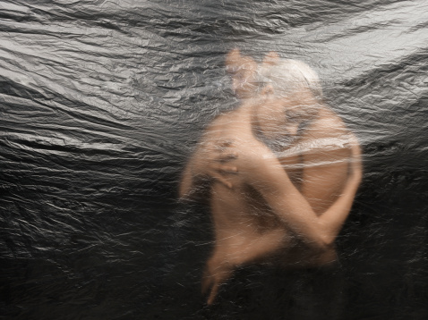

# 剩女W小姐脱光记

** **

#### **一**

W小姐二十五岁的时候就觉得自己很老了。

老得对一切新事物都无精打采，老得认为一切美食都足以败坏她的胃口。

W小姐不待见她的表姐堂姐们，这群妇人只要聚在一起话题永远绕不过家长里短。尽管前一刻她们嘴里的老公还是多么地不体贴，婆婆多么地愚蠢粗鄙，小姑子多么地不近人情，可转眼她们又争先恐后地在facebook或twitter上秀着自己为老公准备的丰盛晚餐，anniversary的浪漫礼物，节日家庭甜蜜出游照（当然有宠物）……

W小姐也不喜欢她的表妹堂妹们，一群不知天高地厚的鸡雏儿，鸡蛋壳还在鸡屁股上粘着呢，就扎堆在一起开口闭口男人、爱情、天荒地老。她们的爱情里限量奢侈名牌包与最近又被谁追求了同等重要——爱情之于她们，都是些看得见摸得着的拿来比拼炫耀的筹码。和她们交谈用不了一刻钟，你就透过她们稚嫩的外壳目睹到外壳里的那些苍白与空洞了。

然而，W小姐最年长的姐姐已经一路心猿意马观着花畅通无阻地迈进围城，成功俘虏了那个倒霉抑或幸运的男人；而W小姐最年幼的妹妹更换掉的男朋友加在一起，数量早已超过了妹妹本人来月经的年数统计。

唯独，W小姐尚未谈过恋爱。没错，W小姐是剩女，被剩得漫不经心却又可歌可泣。尽管W小姐表面上认同剩女的美学价值：剩女大多是聪明，优秀，挑剔的。可内心深处，W不无凄凉地感觉剩女这个词的意境和修女一样，足以让人不寒而栗。

洗完澡的W小姐正在对着镜子，从上而下仔细地打量着镜中的自己：和二十岁时相比，现在她的面部线条已经发生微妙的改变，皮肤似乎不再如之前般紧实了。噢，这该死的流失掉的胶原蛋白！乳房看起来也没那么直耸挺拔了，噢，这万恶的地心引力！腰围，双腿……W小姐不耐烦地离开了镜子。从二十五岁开始，W小姐对照相和镜子也丧失了曾经的热情和兴趣。

#### 二

若以W小姐为中心，向周围辐射，就会呈现出一个数量确定，元素互异，状态稳定，关系密切的剩女非空集合。

剩女们尽管挑剔但又对彼此的身份感颇为认同。她们觉得不俗的自己与婚姻恋爱中的那群女人缺乏难以深入交谈的共同话题。然而，剩女们不愿承认也却羞于承认的是，她们潜意识里对那些婚恋中的女人充满着敌意，因为那群傻女人脸上洋溢的感觉，哪怕是虚伪造作的幸福感，都总能不经意间无情地拨动剩女们敏感的神经，动摇剩女们不堪一击的骄傲。于是，尽管剩女与剩女之间也会相互看不起，但在结盟问题上，她们毫不含糊。总体来说，她们还是惺惺相惜。

在W小姐的剩女非空集合中，露易丝刘是最出挑的一个元素。

W小姐觉得露易丝刘的身材和脸蛋能满足无论是原始洞穴时代还是后工业化时代的男人对女人的一切遐想。操着一口阴冷潮湿伦敦腔的外语系高材生露易丝刘工作两年后，顺利地完成系花向交际花的蜕变，如今担任某知名公关公司宴会策划的露易丝，辗转于名流云集的各种宴会酒席，顾盼于各色阔佬之间，远远看去一片纸醉金迷歌舞升平。要说起来，露易丝在大学期间算是手不离卷——除了专业书就是《VOGUE》。两年下来，露易丝竟然鬼使神差地青睐起一个寒酸窘迫犹太穷鬼的理论。对此转变。露易丝直接引用犹太大胡子的原话向大家做了解释：

“要是现象和本质一致，那一切科学研究都是多余了。”

露易丝认为两年来她卧薪尝胆深入名利场内部，掌握了一手详实资料，早已在真理层面上把握了问题的实质。于是，她停止了在剩女非空集合中八卦名流私生活，开始迫不及待地兜售她的哲学观点，企图拯救W小姐等剩女于无知的水火。

交际花露易丝刘又再次蜕变为布道者露易丝刘。

从此，露易丝的高频词汇转变为：阶级、资本、剥削、利润、异化、革命……据说上个世纪三四十年代年轻进步的漂亮姑娘总会在蠢蠢欲动之后，踏上延安的朝圣之路。没想到这个时代的妙龄女郎露易丝说起那些一度被打入冷宫，如今又崭露头角的词汇来也是那么地性感时髦。

露易丝眉飞色舞：“要我说，阶级分析法不过时，人生来就被打下阶级烙印了，比方说无产阶级与资产阶级，今天的屌丝与高帅富。屌丝们尽管在大无畏地自嘲，哪一个又不是钻营着想成为高帅富，所以还是马克思最彻底，与其成为下一个高帅富，不如消灭屌丝与高帅富的界限。”

“财产是人类不平等以及贪婪欲望的物化，这些阔佬家族财富的积累，没几个能经得起推敲，随便曝光哪一个，都充斥着大量罪恶的勾当。别给我提什么贵族多知书达理，英国倒是老牌贵族绅士国家，可又怎么样？得势时给美国人当爹，失势时给美国人当孙子。”

“别那么恨嫁，别那么迷恋婚姻制度了，一夫一妻制从产生那天起便以通奸和嫖娼互为补充。婚姻不是以自然条件为基础的，而是以经济条件为基础。王子会爱上灰姑娘，可王子不会娶灰姑娘为正妻，王子要登基，需要军事和经济的支持，王子要么和他国联姻要么娶宰相的女儿。至于灰姑娘嘛，等王子成为国王，羽翼丰满后会拿她填充后宫的。别这么看我，你们觉得阔佬喜欢我就一定会娶我么？六十岁的地产大佬估计会，不过我可忍受不了他们衰败的肉体、老年斑和老人味。”

W小姐毫不怀疑，要是再来一个延安，无数个时髦解放的露易丝刘将会蜂拥而至。W小姐也承认，比起露易丝讲得那些似是而非的真理，她更痴迷露易丝布道时放射出来的诱人光芒。有些话从露易丝嘴里说出来比从严谨古板的公共课老师嘴里说出似乎更容易令人信服些。

可哲学系科班生S小姐对此却嗤之以鼻。

W和S本科毕业后都不约而同地选择了继续深造。哲学系科班生S小姐更刻意地将自己装扮成一个不怎么食人间烟火的高贵圣女。S是剩女里唯一一个会为自己的拿不出手的追求者感到羞愤的。W知道，S心里觉得这种质地的男生竟敢追求自己，追求行为本身就是对自己的亵渎。哲学女S酷爱读书，从柏拉图读到笛卡尔，从笛卡尔读到克尔凯郭尔。读了这么多书，可除了上课时可以参与高谈阔论外，S小姐也并未写出任何像样儿的要么打动学术要么打动人心的文章来。S小姐不喜欢高帅富屌丝此等低贱的词语，更不喜欢这些低贱的词和她的高贵哲学发生任何关系，她和她的哲学要永远纤尘不染。S小姐之前不喜欢跟W这些理科女谈哲学，偶尔提起，也是一副降贵纡尊的表情。

所以，S小姐直接将露易丝刘半路出家的哲学玩票定义为牛嚼牡丹。不过还好是马克思的，S暗暗舒了一口气。

在S小姐看来，不懂德语就谈古典哲学无异于隔山打虎。然而，当露易丝在剩女非空集合中兜售她的半吊子哲学并大获成功后，S小姐气急败坏。

“露易丝，你讲异化，异化的德文是什么？”

“露易丝，我建议你还是先把康德和黑格尔的著作读完再读马克思的。”

“露易丝，请你不要把哲学和阶级私有财产联系在一起，哲学没那么世俗化！”

露易丝，露易丝……S把露易丝那布尔乔亚的英文名念得充满了东北大茬子味儿。

面对S的拆台和刁难，露易丝倒是阳奉阴违地接受批评，并不时地假模假样请教S些问题。私下里，露易丝告诉W，不给S秀优越的机会，S会憋死的。可怜的S小门小户小家子气，单亲家庭，家境不好，没有阶级觉悟不说，还总是试图掩盖，所以听不得屌丝高帅富，没办法，S的尊严总是比常人要来的异常猛烈些。

只是偶尔被S逼急了，露易丝难免也会青面獠牙：“管你这个问题哪个哲学家之前提过之后论及，德语什么希腊语什么，我对这个哲学感兴趣是因为丫能解释清楚现实的问题。你道行深你继续在你们圈里糊弄人，你他妈的别再给我整那些虚头巴脑的玩意了！”

S小姐一时语无凝噎，眼球由绿转红，再转烟灰。后来两次剩女非空集合聚会，她都没出现。再出现时，已经是一个月以后了。一个月后的S愈加清瘦，楚楚动人。不知这一个月里S是如何下定决心忍痛放弃哲学高贵论，伴随她的再现的还有她的哲学教化。然而比起露易丝的亦庄亦谐，荤素搭配，S的一堆枯燥概念名词立刻让剩女们一颗准备被接受洗礼的心，瞬时恢复了正常的搏动。

露易丝偶尔也会不怀好意：“S呀，你讲了半天不觉得克尔凯郭尔的孤独都是狭隘的么？他继承了巨额遗产，不愁吃喝一辈子不曾工作，无所事事的人一般都会无形放大自己的痛苦。我觉得这种痛苦都是无病呻吟，克尔凯郭尔不过是把呻吟上升到哲学呻吟。”

趁着S去卫生间的功夫，剩女们如获大赦，露易丝不无讥诮：

“S的哲学和她的床上功夫一样令人昏昏欲睡。”

说罢，将一粒葡萄投入嘴中，红唇白齿，口舌摩擦。在露易丝那里，咀嚼都被诠释得如此性感。W突然想起，露易丝的完美唇形和鲜艳唇彩似乎从不曾因为吃食而受到破坏过。

#### 三

W小姐是不得已才走上万恶的相亲之路的。

W的妈妈总会在每个星期的固定通话里，巧妙打探着W的情感状况。W将她与她妈的每周通话形容为冷气流和低气压过境，因为随之而来的是W极不稳定的情绪。

春节回家时，W小姐的大表哥和二表姐都将准未婚妻和准未婚夫带回了家。尽管W小姐的外婆早已从W的舅妈和二姨妈那里掌握了准孙媳妇和准外孙女婿的一切资料——生辰八字、身高体重、籍贯工作、毕业院校、父母家庭甚至是几只狗几只猫，但在家庭聚会上，外婆不知是慈祥地装傻还是装傻地慈祥：“孩子，你在哪里上班？你父母……”

“奶奶您身体真硬朗，一定能活到一百岁。”

W小姐不习惯这比春晚还热闹和谐的虚假气氛，于是跑去逗比利了。比利是W小姐外婆的爱犬。放在平时，比利见到W小姐总会摇着尾巴，讨好地为W表演几个拿手动作。可这几天，准孙媳妇和准外孙女婿竭尽所能地巴结着比利，他们心里盘算着讨老太太欢心，先要买通老太太的狗。比利在被他们的牛奶香肠喂得肠满肚圆后，愈发地狗仗人势，骄矜起来。腆着狗肚子的比利看到W后，竖起的耳朵又懒洋洋地耷拉下来，任W怎么拨弄，它都纹丝不动。家庭聚会接近尾声时，老太太给准孙媳妇和准外孙女婿分别包了红包，这红包的分量当然不能太厚也不能太轻，要是和去年大表姐那次一样轻重，精明的舅妈自然会有意见，嫡亲的孙子倒是比不过外孙女了。要是两份红包的重量不一样，爱唠叨的二姨妈自然会牢骚满腹，老太太你这偏心都摆到明面上来了。

W当然知道她外婆的为难。W小时候看《红楼梦》就明白，人人都羡慕贾母的养尊处优，可哪里懂得贾母要维持一大家子的政治平衡也需要煞费苦心。

春节回来后，W小姐无可奈何地接受了相亲。再没有男朋友，狗眼都要看她低了。终于，在吃了很多顿记不住什么的味道的相亲饭，说了许多言不由衷的莫名其妙话后，W小姐遇见了她的幸运概率：0.007。从概率学的角度讲，假设一个人一生会爱十个人，在可选择的范围内遇见这个爱人的概率是0.007，而你爱他，他恰好也爱你的几率是0.000049。

现在0.007先生正坐在W的对面，W对他一见钟情。

0.007是刚刚毕业回国的美国名校博士。0.007目测起来没什么短板：长相干净清爽，举止谦虚得体，主修计算机，辅修摄影，爱好古典音乐，工作家世无可挑剔。最令W满意的是，0.007在国外求学这几年一直处在类寺庙的环境中，异性交往史约等于零。想想0.007第一次和W说话时的目光羞涩地躲闪，脸颊轻微地泛红，W小姐心中就漾起一蓬又一蓬的莫名甜蜜。

W的近期目标设计是早日实现0.000049。有了目标，W的行为就有了合法性。于是她的约会装就越发清纯了，说话越来越温柔，博士喜欢的都是清纯的姑娘吧？当然，还需要内涵，于是，W和0.007的每次聊天，从形而上聊到形而下，从冯诺依曼聊到图灵，从虐猫大神薛定谔聊到G男维特根斯坦。W使出浑身解数配合着，她甚至暗暗懊恼S报告时，自己因为去了太多次厕所而漏听了太多名词。

脑海里， W还在迫不及待地构想着0.007拍摄他俩的婚纱照的感人画面，可现实中，第三次见面后，0.007就再也没有约过W了，甚至当W自掉身价鼓起勇气主动约他时，0.007也推托说最近太忙，下次吧。

下次，下次。

明白人都明白这是什么意思。

可明白人W这次更宁愿自欺欺人，也许0.007是真忙IT行业嘛，要理解理解。

耐心一点，再耐心一点。

当W把最近的遭遇在剩女非空集合聚会上说给露易丝刘时，露易丝恨铁不成钢。W呀，W，再怎么说你也受我荼毒很多年，怎么出手如此S的作风？谁说博士就喜欢清纯女了？你们约会约得比学术沙龙还学术报告，对一个满脑子都是性憧憬的清纯博士，你觉得合适？

你要是早点向我汇报，我给你出谋划策，结局就是另外一个了。清纯的男人最经不起受风骚女人的诱惑了，《聊斋》里清一色书生过不了美妖精关，自古这个理都没变。要我说，你约会时裙子短点，事业线深点，看电影黑灯瞎火貌不经意地在他耳边说说话吹吹气，让他某个部位有点该有的反应，放心吧，以后你就擎等着他主动约你吧。噢，可怜的W，你读书都读傻了。算了，别伤心了。下次遇见喜欢的，记得早点向我报告。

下次，下次，W最近快被这个词折磨的神经衰弱了。

#### 四

接到贾莫娜的邀请时，W觉得不可思议。

她和贾莫娜已经很久没联系了，久得看到手机上莫娜的名字，大脑神经中枢需要好一阵子才传递过来信号。上次听说起莫娜还是在去年的同学聚会上，一干女同学谈论起莫娜来，心中的嫉妒不甘与复杂都不屑于掩饰。资质平平的莫娜毕业后竟然嫁了一个金龟婿，不是镀金的，而是二十四K纯金。

嫉妒，永远是和人类历史一样古老的人类古典情感。

有人不怀好意的猜忌莫娜的金龟该不会有什么难以启齿的隐疾？有人大胆的怀疑莫非莫娜是一个不显山露水的隐性二代……

在W的记忆里，莫娜是平的，她扁平的身材扁平的脸，还有她再怎么刻苦却依旧扁平的成绩，莫娜的确是一个没有丝毫立体存在感的人。高考结束后，莫娜怀揣着扁平的分数，肩负着终于不扁平的行李箱，去了大洋彼岸念书。

女孩莫娜是扁平的，但妇人莫娜却有着敦实的存在感。无论在保姆司机眼里，女主人莫娜是如何的好修养没有架子平易近人，可此刻站在W面前的莫娜，心中却充满了不自在——在某些人眼里恐怕她一辈子都是原形毕露矫正不过来的自卑笨女孩莫娜。

男人之间打开心扉讲点真话要靠酒精的催化，女人之间拉近感情只消聊点别的女人的八卦就可以了。坐在莫娜家不可估价的黄花梨沙发上，喝着莫娜沏泡地充满玄妙学问的功夫茶，在和莫娜八卦了班中几位女生的近况后，女主人莫娜终于还原为女孩莫娜了。

莫娜在国外念书时，她的男性室友姓温。温本来一个人住在一套大房子里，可纽约是一个热闹地让人感到时时寂寞的城市，为了打发时间，也为了方便和其他留学生鬼混在一起，温就搬进了这个留学生聚集的街区，偶然的成为了莫娜的室友。很久之后成为莫娜老公的温告诉莫娜，世间哪有那么多纯粹的偶然，必然性总是寓于偶然性之间嘛。当年他选择室友莫娜哪里是漫不经心，他参观莫娜的房子，除了注意到莫娜公寓的整齐温馨，还有心地留意到莫娜公寓桌上胶带的末端都被折成了三角形，温由此断定莫娜一定是一个不会给自己惹麻烦的室友。人人说会说公子哥温花钱大方稀里糊涂，岂不知公子哥温那一双半闭半睁怎么也揉不醒的马虎双眼早把一切不动声色地明察秋毫了。

你看，最聪明的人其实是那种让任何人都觉得自己会比他聪明然后对他失去提防的人。

温经常安慰因为教授给分不慷慨而把眼睛哭肿成一条缝的莫娜。噢，可怜的莫娜，分数只有傻子才在乎呢，只要能顺利混毕业就OK啦，这个世界不是优等生的，你要明白这一点就不会难过啦。莫娜依旧哭哭啼啼着：“我，我，我，当然在乎成绩了，我没有你那么能干的爸……我留学的学费都是父母省吃俭用攒来的，我没有漂亮的资本，脑子也不好使，即使回国也找不下好工作……”

那一刻，温脸上惯有的不正经突然消失了，尽管他的表情依旧垮着想让人把它揉碎，可他的承诺却半真半假着：“别发愁了，莫娜，在我眼里你是聪明的。那种人类愚蠢的工作你最好不要干，回国后我聘请你当高薪管家，你看，你做好吃的总会叫我一起享用，做清洁也会帮我洗掉脏衣服……”

温周围不乏性感火辣热爱歌剧会跳芭蕾的上流姑娘，可从小被父亲拧着耳朵学习钢琴练习书法的温憎恨一切高雅，他对待高雅永远玩世不恭，这世间徒有其表的还少他温一个么？

莫娜努力地看着温，想从此刻半认真的温那里找到熟悉的那个不正经的温。

除了偶尔的感情慰藉，温在其它方面也算是个合格的室友：他却总记得把冰箱填满，尽管他很少享受莫娜的厨艺；他交房租水电费时一如既往地大方，尽管他一个月中大多数日子你都不知道他人在哪里。

温家里后来还是出事了，他的父亲进去了，财产被全部冻结。温的食客朋友还有风情小妞们的手机一夜之间要么信号不好要么都设置为留言状态。温焦头烂额地在纽约和北京之间往返。有天夜里三点当他回到纽约的公寓时，看到桌上莫娜的留言以及不少的美元。莫娜留言说，希望他保重身体，不要太劳累了，有些事情过去了就好了，他的父亲会化险为夷的。这些钱是温的房租水电费，温平日里填充冰箱的高档食物费用都超过房租了，希望这些不多的钱可以解决燃眉之急。

不喜欢做决定的温就在娼妓容光焕发，酒鬼吆三喝四，下水道气息泛滥的纽约深夜里做了一个充满雄性荷尔蒙的决定。

温渐渐地不飞北京了。尽管他的成绩还是一如既往的烂透了，但他的迟到逃课不再是家常便饭了，泡夜店也被陪莫娜泡图书馆所代替。温难得的从旖旎又麻醉的日子里呈现出清醒干燥的状态来。毕业的时候，温向莫娜求了婚。

其他人嘲笑莫娜，有钱的温瞅都不瞅莫娜，落难的凤凰倒是成全了不起眼的莫娜。莫娜笑笑，温比韩国偶像剧明星还帅气，温的气味嗅起来永远如青草地般清新，不落难当然轮不到我莫娜了。

后来，回国后的温，慢慢再次高调起来，百足之虫死而不僵嘛。温利用父亲旧部下的关系做生意做得风生水起。再后来，温的父亲据说答应了不牵扯出其他人，于是这些其他人在风声过后努了把力，把温家的财产解冻了。莫娜又笑笑，谁说是落难的凤凰呢，不过是淋了场大雨，雨过初霁，凤凰抖抖毛，依然威武神气着呢。

莫娜放下手中毫不惊艳却价格不菲的茶杯：“W，我其实高中时特别羡慕你，你成绩好，模样好，人缘也好，我那时的理想就是以后要像W你一样优秀呢，这样才能找到优秀的男朋友。”

W一阵窘迫：“我还没有男朋友呢。”

“你这么聪明一定会找到的。”

“就是因为聪明才找不到。”

“一定要找一个对自己好的。”

“那莫娜，你现在幸福么？”

“温对我还是很好的，尽管他身边又聚集了各色美女，她们看我的眼神都充满了挑衅，大概觉得我配不上温。温现在做生意是场面上的人，免不了对那些女人说俏皮话，可温的些俏皮话在我这里全省了。我刚和温刚结婚时，才发现他脖子里的其实一直挂着一颗哨子。在温六岁时，他一辈子强装欢颜的母亲就得癌症去世了，他父亲忙工作顾不上他，缺乏安全感的他就买了一颗哨子系在脖子上，倘若发生地震等灾难，温望能通过大声吹哨让别人来救他。”

W那一刻突然觉得露易丝是对的，这世间万物的运行法则归根到底还是辩证法：在不平衡中寻觅平衡，在不般配中制造般配。

从莫娜家出来时，已经是下午了，这个城市的冬天永远是铅灰色的。

#### 五

W小姐从莫娜家回来之后，似乎开始觉醒了。

W小姐的觉醒是不自觉的，好像日子就这样一天天的，两三年也就这么过去了。殊不知，这剩女之路也是暗藏着峰回路转的玄机。

有那么一天，W小姐终于谈了恋爱。男朋友是她实验室的师兄。在W曾经对未来男友的无数次幻想，精心勾勒的种种细节，细致描摹的点滴特质中，师兄的影子是绝对与此绝缘的。当然，无数次的失望才能孕育出无数次的惊喜，W的师兄没有儒雅的外表，却有宽厚的肩膀；师兄没有高雅的爱好，却愿意陪同W欣赏他一辈子也听不出个所以然的歌剧；师兄没有绅士般的斯文举止，待W却充满温柔怜惜；师兄没有引以为傲的才华，却会熬夜帮助赶实验的W完成数据结果……

当W小姐曾经构想过的种种形象全部破碎后，然后重新拼凑成，她面前的男朋友。打破，重建，理想与现实不一致，正是这不一致让W进入一个从未见过的新奇世界。

说到底，人类的爱情没有小说传奇里那么情深如许，更多地恰恰是不那么传奇的“浮屠不三宿桑下，不欲久生恩爱”。

事后，W小姐自己也在回想，当初怎么就突然答应了曾被她拒绝过又迎难而上再次追求她的师兄？莫非是露易丝刘与S那场关于哲学的理论与现实之争使她明白理想男友和现实男友的差异？莫非是遭遇0.007滑铁卢后意识到自己的自负是多么地滑稽？莫非是贾莫娜的那场不般配的般配？

W小姐自己也说不清，反正就在那个点上，一连串不相关的事情串联了起来，稀里糊涂地使W小姐完成了剩女的自我救赎。

脱光后的W有一堆事情要忙，忙着约会忙着见父母忙着订婚忙着结婚，忙到忘记还有剩女非空集合的存在了。只有偶尔和露易丝刘通个电话她才能知晓大家的近况：

路易斯刘继续花团锦簇颠倒众生着，并在电话那头嘱咐良家妇女W赶快嫁吧，男人是灯笼——三十才亮；女人是圣诞树，过完二十五就没人要了。但你若问露易丝她今后有什么打算，露易丝笑着说她正在寻觅下一个默多克呢，最好比默多克还老，她前脚进门，后脚就能成为阔寡妇。

倒是S的新闻让人大吃一惊，如芙蓉般圣洁的S居然让哲学院的海归教授搞出婚外恋加师生恋。据说海归教授的老婆大闹哲学院，当众狠狠羞辱了S。S的清纯扫地。W乍一听觉得不可思议，细细一想倒在情理之中。

那其他剩女呢，依旧没什么新闻，没新闻就是最好的新闻。

#### 六

转眼，W小姐从师妹熬成了师姐。

新生入学时，实验室来了个颇似之前W的师妹M。

偶然一次，W听到了M在讲电话：“我才二十五岁都就觉得自己很老了，老得对一切事物都提不起兴趣，我不喜欢和实验室的师姐们聊天。我师姐W要结婚了，她们在一起张口闭口装修地板家俱一地鸡毛蒜皮……”

W听了，意味深长地笑了笑，走开了。

终点就是起点。

 

（采编：黄梅林；责编：徐海星）

 
