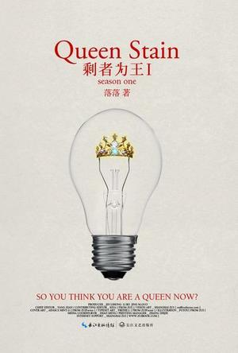

# 剩女时代

如今中国各大城市的奇观之一，就是常能在某些公园角落里看到年过半百的父母们张贴着自己子女的征婚启示。这些年轻人的学历背景、工作、收入、甚至长相，都相当不错，只是都迟迟不肯、不愿或不能结婚。所谓“剩女”早已成为受普遍关注的社会现象，关于这类话题的讨论也一直热度不减，但通常人们更多地是从个人生活的角度去考虑，因而很少有人会注意到：这些晚婚的年轻人基本上都是中产阶级的一分子，“剩女”之成为一种社会现象的时间也与中产阶级在中国的兴起同步，这并非巧合。

无论在哪个传统社会，大龄不婚都是社会无法容忍的，有的社会（如古希腊）甚至会对这样的人予以公开惩罚和羞辱；大批年轻人（尤其女性）自发地不愿结婚更是不可能发生的事，事实上，这是现代化之后才在西欧率先出现的新现象。

全世界最先实现现代化的英国，也是最早受这一社会现象之苦的国家。传统英国社会中的婚姻更多的是家族之间而非个人之间的事，绝大部分夫妇之间并无感情，往往是“他们过得非常不和谐但有许多小孩”（William Stout对1699年一桩婚姻的评论）。虽然变迁极为缓慢，但现代化进程给英国社会带来了许多越来越明显的变化，其中之一就是人们对爱情的重视、个人意识的兴起、识字率（尤其女性）的提升、以及伴随着纺织业发展带来的女性经济独立，这些事实上都是与中产阶级经济地位确立和价值观形成分不开的。这种种变化分别看大多都是积极的进步因素，但奇怪的是，其总和的结果却造成了许多年轻人结婚生育的意愿下降。

在英国，到50岁还未结婚的女子所占比例，从16世纪的10％上升到一百年后的15％，再过一百多年则升至25％。这意味着每四个女性中就有一个几乎终生未嫁，而即便出嫁者，其初婚年龄也在两百年里推迟了三岁左右。按英国旧习俗，女子出嫁前要先织好床单、枕套等，因而“纺纱女”（spinster）一词又有“未婚女性”的含义，到18世纪，该词又有了“老处女”的意思，这固然是从原先的“未婚女性”延伸过来的；但也是因为当时大量纺织厂（纺织是工业化的最早行业）里出现了大量挣工资养活自己的女性，这些纺织女工（spinster）许多都迟迟不婚。经济独立事实上至关重要，本人就终身未婚的简•奥斯丁就曾说：“独身女子常常对贫困有可怕的畏惧，这是人们赞同婚姻的最大理由。”到18世纪初，新一代受过良好教育的中产阶级女性已成型，她们改变和提高了英国文化，大大增强了婚姻中的伴侣关系质素（体现为一种越来越强烈的要求：人们找寻的婚姻对象如今是一个Soul mate），但终身不婚女性却仍在日渐增加，也在历史上首次变为严重问题。这第一批“剩女”的处境比其后辈同类艰难得多，有教养的老小姐在当时的英国社会受到无情的嘲讽，认为她们都脾气乖戾而恶毒，单身女性被人（有时甚至被她们自己）视为一种“社会渣滓”。

同样的情景，每当一个社会实现现代化并开始出现稳定的中产阶级时，几乎都会重演。曾有学者在研究了20世纪前期欧洲的人口普查资料后得出结论：以圣彼得堡和的里雅斯特为连线，以东部分的欧洲女性几乎都会选择结婚，且多在十几岁时；而该线以西地区则有多达1/5的女性会选择独身终老，而且即便结婚也大多也会拖到二十多岁。后一种情形被称为“欧罗巴婚姻模式”——但它其实并非西欧所特有，只是因为这一地区最早成为工业化社会罢了。在新西兰的情况也大致如此：坎特伯雷大学最初五十年的历史中，55%的女性毕业生都终生未婚，而即便是那些结了婚的女毕业生，其组建的家庭规模也很小。

因此，并不奇怪，在亚洲最先出现类似现象、如今仍深受其苦的，也正是率先追赶上西方社会发展水平的日本。日本传统社会也推崇早婚，更没有大量女性终身不婚的现象。但随着战后日本工业化的完成，中产阶级兴起（到1970年代初有所谓“一亿总中流”，即全国一亿人都成为中产阶级的口号），这一现象就如影随形地越来越严重。1955年日本的单身家庭比例仅为3.4％，1975年升至13.6％，十年后增至17.5％。到1995年，日本年龄在25－29岁之间未婚者的比例，女性为48％而男性为67%，在东京等大城市，30岁来岁的女性有一半多都还未结婚，已婚者也迟迟不想生育：1997年，结婚四年的夫妇中40%没有要孩子。虽然如今有些日本社会学家提出了“单身寄生时代”等概念，认为单身年轻人依赖家人，甚至“下流社会”的十二项特征之一就是男性33岁以上、女性30岁以上还不结婚，但单身问题在日本最初完全是中产阶级现象。1990年代初还曾有一本备受年轻女性欢迎的杂志《羊角面包》（Croissant）刊登了一系列文章介绍三四十岁、既有人气又成功的单身女性，引起了社会上对女性独身的艳羡，被社会学家戏称为“羊角面包综合症”，有人认为正是对这一单身形象的赞美加重了日本的剩女现象。

对中国而言，这也完全是个新现象、新问题——也正因此，才使得那些还抱着传统观念的父母们焦虑不已。中国传统价值观是提倡早婚多子的，以至于为了实现人口计划生育，国家还要在《婚姻法》里规定法定结婚年龄，反复提倡晚婚——但男性25周岁、女性23周岁的法定晚婚年龄，如今在受过高等教育的年轻人看来，乃是不折不扣的早婚。社会学家许烺光曾写过，1972年时中国人对婚姻的看法普遍还较为传统，当时一个中国女孩在回答一位西方访问者关于未婚同居的问题时，反问道：“为什么要未婚同居？在美国，结婚那么困难吗？”她不会料到，就在中国，一代人的时间后，结婚也变得相当困难了。

虽然如今许多社会舆论把“剩女”现象归咎于当事人自己择偶要求太高、或过分挑剔等性格缺陷（当然这也不是没有，例如有年薪60万的女性征婚，希望对方薪水也和自己的至少差不多），但她们并不是世界史上第一批“剩女”，如果在几乎每个社会完成现代化时都多多少少出现了类似的情形，那似乎就不能说是某些个人的原因了。如果说历史上男性单身汉较多的社区常有各种缘故（外出经商者、移民、且光棍比例高的往往是较为贫困的地区），那么“剩女”现象几乎向来都是中产阶级社会兴起的一个可靠标志。事实也是如此：中国能明显感受到中产阶级的兴起是在近十年间，而“剩女”也是到2007年才被教育部列为汉语新词的。

一个社会中如果中产阶级尚未成形、女性尚难以通过职业途径获得经济地位（及随之而来的自由独立），这种现象是不可能出现的；而这种现象本身又意味着一系列长期条件已准备完成：如女性良好的受教育程度（否则就不能胜任工作，也就不能挣钱养活自己了）、她们对现代价值观的接受、对配偶的看法变成主要是灵魂伴侣（因此也越来越难找到）、社会对这类现象的相对宽容。这些条件往往在大城市比农村更早准备好，因而几乎在世界各地都是发达城市这类现象远比欠发达地区严重。在农村是很少会有“剩女”的——前两年有次去内蒙古旅行，在火车上和一个当地农民谈及这一现象，他感到十分费解，连说“怪了怪了，俺们这里只有男的找不到老婆，女的不会嫁不出去”。

不仅绝大多数城市剩男剩女都是中产阶级（以收入衡量往往还是中上层的中产阶级），他们的行为理念常具有典型的中产阶级价值观的特征，而且，他们的很多理念和趣味也正被相对欠发达地区的年轻人所效仿。在全国各地，乡村地区结婚的年轻人大多都是在模仿流行的城市文化——从婚礼的着装、程序和嫁妆里的现代器具都能看出：他们所希望自己过上的，正是一种城市中产阶级的生活。农村姑娘在见过世面后，往往也萌生出追求自我实现和个人自由的强烈愿望，而不愿那么早早回家结婚生子。

鉴于这一心理趋势还只刚刚呈现出它强大的惯性，我们大体可以想见未来中国社会将面临更严重的“剩女问题”——虽然某种意义上它其实是个伪问题，因为将之视为一个“问题”，本身就表明了一种心理不适，这种看法未能充分意识到它和所有现象一样具备的双重性：它尽管是一个社会问题，但本身却正是社会发展的结果；它或许使一些个人和家庭苦恼，但这又正是女性整体自我解放和自我实现所导致的。它不仅是原因，也是结果——并不是“为什么条件这么好却嫁不出去”，而恰恰是因为女性整体上条件的提高，才导致了“嫁不出去”这一个别的后果。尽管第一代人或许会在社会双重的压力（既有开放的机会，又受传统价值约束）下感受到痛苦，但这至少仍是一次公平的交换。

（采编：佛冉，责编：佛冉）
