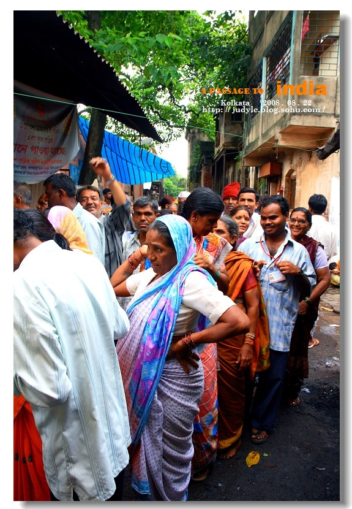
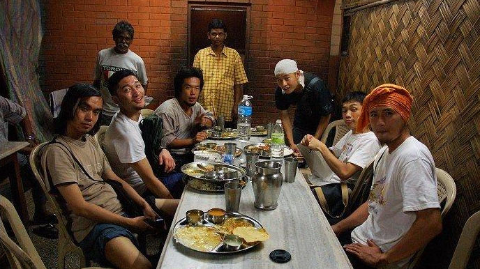
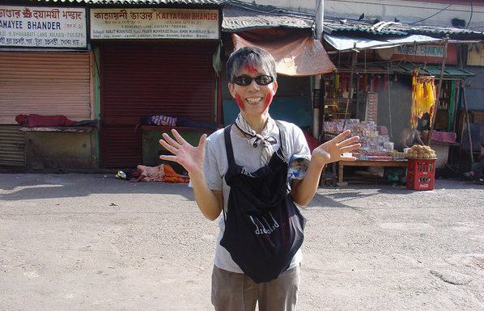

# 加尔各答之You just can’t walk away（三）：走出另一个平行世界

** **

每天工作结束后，义工们都结伴搭车回去萨德街（Sudder Street）。

是的，几乎所有的外国义工都住在萨德街。这里是加尔各答的背包客大本营，便宜的旅馆、餐厅和商店一应俱全，一条小街就足以满足你所有的物质生活需求——虽然背包客实在没什么物质需求，都是为了省钱宁可拉肚子也要吃路边摊的主儿。

仁爱之家和萨德街是最容易结识新朋友的地方。工作的时候，喝茶休息的时候，在小摊上吃饭的时候，坐在旅馆里发呆的时候，一个眼神一个微笑，你们就自然而然地聊起天来。会说中文的韩国人，会说日语的中国人，会说西班牙语的德国人......近几年来，英语在跨国交流上的垄断地位开始受到挑战，多多少少懂得一点第二门外语的人越来越多。距离拉近了，世界变得那么小。日子一天天过去，朋友也越来越多，走在街上总是不停地和人打招呼。有一天和刚认识的韩国男生小卜一起走出餐厅，他看见我们一路上呼朋引类的架势，惊讶得合不拢嘴：“你们怎么什么人都认识！”

真的，连我们自己也觉得不可思议。之前在拉丁美洲的六个半月虽然精彩却常感觉孤独，而加尔各答这个脏乱喧嚣的城市却让我们体会到了久违的友谊和温暖。

旅行令人心态年轻，可是和眼前这群真正的年轻人相比，我和铭基已经不幸沦为背包客里的“老家伙”。发生了什么事？到达萨德街的第一天我就纳闷地到处 打量——这个世界上怎么到处都是二十岁左右的年轻人！好不容易遇见年纪略为相仿的旅人，互报年龄之后大家还要客气地彼此恭维：“看起来真的不像啦！”有一次台湾来的慧果和昱方问起我和铭基于何时何地初次相遇，“非典的时候，在西藏，”我说，“非典就是SARS，SARS你们肯定知道吧？”两位可爱的台湾同学有些迟疑地点头。很久以后我才反应过来——对他们来说这真是个一万光年以外的词汇啊！SARS那一年，他们一个十岁，一个十三岁。

与慧果和昱方一样，很多义工都是大学生，特地趁着放寒假前来印度旅行和做义工，开学时间一到就要赶回去。时代真的不一样了，我感慨地想。我上大学的时候，绝大多数同学的旅行路线仅限于国内，能去一趟西藏已经被视为勇敢和奢侈的行为。寒暑假时除了旅行就是打工、实习、雅思托福GRE，“义工”这个概念遥远得就像西伯利亚的月亮。十几年过去，虽然和日本韩国及西方发达国家相比人数还是很少，可是如今的中国大学生却已经开始走出国门，用年轻人独有的热情拥抱各种全新的可能性。去哪里和做什么其实都不重要，能够跳出井底本身已经是摆脱狭隘和偏见的第一步，你从此便会知道外面的世界广袤无边，而世上有那么多人正在过着你的想象力无法触及的生活。

去仁爱之家报名那天，璐君是除了我和铭基之外唯一的中国人。她迟到了至少半个小时，冲进来的时候整个人像一团旋风。“我一开始走错了去了另外一 边，我不认识路，有个小孩子给我带路，最后还问我要钱......” 她大汗淋漓，双颊红扑扑，一串串句子像连珠炮一般从口中发出。一问之下才知道她从尼泊尔乘车过来，刚刚抵达加尔各答，找到旅馆放下背包就来报名了。

璐君此行就是冲着仁爱之家来的。在上海读大学的她趁着过年和开学之间的空档，经过西藏和尼泊尔辗转来到加尔各答，为了省钱一路转车完全没有沿途停留观光。这是她第一次出国，没带任何旅行指南书，手里只攥着一张皱巴巴的纸，上面是一路上遇见的背包客写给她的各种关于交通和便宜住宿的琐碎信息。

第一次出国就直奔印度这么incredible的国家，果然是初生牛犊不怕虎的年轻人。璐君也同样震惊于印度的“脏乱差”，可是她适应得很好——什么乱七八糟的路边小摊她都敢试，而且从来不拉肚子。认识不认识的旅人她都能上去搭话，约别人一块去参观景点。工作之余我们有时只想在旅馆休息，然而年轻的璐君浑身都是精力，一刻也闲不下来。“你们等会儿去哪里啊？”、“你们昨天去哪儿玩了？”、“看我刚买的裤子！你猜多少钱？”......她以一种令人叹为观止的劲头兴致勃勃地生活在这个日薄西山的城市。每次在萨德街看见她吃着炸土豆之类的东西迎面走来，满脸津津有味，一身热气腾腾，我都会不由自主地微笑起来， 仿佛看见了当年第一次孤身上路时那个天不怕地不怕的自己。

和刚认识的朋友聊起天来，听到我和铭基旅行的经历，很多人都会发出“哇”的赞叹声，从此将我们视为经验丰富的“老驴”。可是去过的地方多又有什么了不起呢？我现在越来越觉得，若是单纯追求走得远，时间长，经验多，花钱少，其实真是相当容易（尤其是在物价便宜的国家），你看连璐君这样的新手上路都不落人后，旅游论坛上更有无数前辈的经验贴。可是我们这些人的旅行细节看似不同，大体上却其实千篇一律，而且终有一天会结束旅程回到原来的生活。然而这世上还存在着另一些旅人，他们同样走在路上，却过着你无法轻易复制的另一种生活。

有一天我和铭基在萨德街的路边摊吃饭，和坐在旁边的一位女生攀谈起来。她是英国人，可是听说我们是中国人之后，忽然改用中文和我们聊天。她的中文标准流利，简直吓了我们一跳（她居然称韩国人为“高丽人”，令我们绝倒......）。原来她小时候跟随做文化交流工作的父母来到中国，在云南生活了五年。她还会说泰语，因为后来又在泰国清迈住过四年。这女孩不是嬉皮，却是个不折不扣的“世界人”。她不喜欢英国，觉得英国人思想狭隘，每次攒了一点钱就跑去别的国家做义工，一去就是一年半载。这次她专门来加尔各答待上六个月，一半时间在仁爱之家做义工，一半时间为另一个慈善机构工作，收留和照顾车站的流浪儿童。与此同时她还在写一本书，关于这些日子在印度的经历。

她的语气是轻松淡然的，完全没有炫耀或是自恃清高，令我觉得非常亲切，可是她思维的方式和观察事物的角度又是那么特别。或许是因为特殊的成长经历和家庭教育，她整个人的世界观和人生观都跟我们这些在笼子里长大的家伙不一样。在她的世界里，完全不存在所谓的“世俗的羁绊”，依照自己的心意而生活是理所当然的事，对物质的需求可以降到最低，帮助受苦的人们却是生活中最大的意义。

和她聊天令我心情矛盾——一边欣赏她的眼界和谈吐，一边对自己的庸俗感到惭愧。道别的时候我们才想起问对方的名字。“中文名还是英文名？”她眨一眨眼睛。

“你还有中文名啊？”

“施恩慈。我叫施恩慈。”她的笑容如一滴朝露般清浅可爱。

不同于施恩慈的精灵气质，在垂死之家认识的另一位英国人小P却是个老实淳朴的大高个儿。不知道他到底是大智若愚还是本性如此，我不论说什么他都认真听完然后随声附和，而且一脸诚恳：“我觉得你说得太对了！”，“很有道理！我怎么从没想到过。”小P算是垂死之家的老义工了，有一次我们谈论起加尔各 答的天气，他说：“我最喜欢这里的夏天。”

我很惊讶：“夏天不是很热吗？”

“对啊，”他一脸憨厚地点着头，“那时候垂死之家就没有那么多粘了大便的毛毯需要洗......”

然而这哥们儿也不是普通人——他每次回英国打上两、三个月的工，然后再带着赚到的钱回到印度继续义工生活，直到钱用完为止，就这样年复一年周而复始。每次想到这个我就感觉奇妙：我们拼命赚钱是为了离开原来的生活去外国旅行，有些人去外国赚钱却是为了回到印度来继续原来的生活——在路上的生活已然变成了他们“原来的生活”。

很少有地方能像仁爱之家这样让你遇见那么多值得敬佩的人：

我和法国人Francesco在“革命”这一话题上有巨大的分歧，甚至因此吵过一架，可这不妨碍我佩服他这个人。在垂死之家工作时，每次洗衣他都主动承担最腌臜的任务——用手把残留在衣物上的大便搓洗掉。至今我每次想起他，记忆总是定格在同一幅画面：他皱着眉头拎起一件脏衣服，用带有浓重法国腔调的英语说：“Full of shit！”Francesco只不过是个普通的天主教徒，可是他已经在加尔各答的垂死之家服务了整整六个月，马上又要去耶路撒冷帮助那里正在受苦的人们。

一位在美国读书的香港女生先后来过七次加尔各答做义工，连大学都特地副修了印地语。大学毕业后她终于再次回到此地长住，为一家NGO工作，在当地的小学教书。她周一到周六都要上班，却连唯一的休息日也不闲着，每个星期天都来垂死之家服务。她说：“来这儿工作比在家休息更令我开心。”

义工报名时提供中文讲解的香港女生Steph，从广告公司辞职去了慈善机构宣明会，如今又从宣明会辞职来到加尔各答，计划在仁爱之家做上三年的义工。为了更好地服务病人，她工余时间还在大学进修孟加拉语。

面对这些人的时候，我常会觉得自己一直都生活在另一个平行世界。在那个世界里，个人的喜怒哀乐被放到无限大，外界的苦难只是报纸上的统计数字。我走过很长的路，却从未走出世俗眼光的束缚；我游历了很多国家，却很少航游我自己的单调。惭愧地说，即便是在受到了极大感动和震撼的现在，我的心中仍然欠缺像施恩慈他们那样的“大爱”，无法将扶危济贫作为此生最大的追求。可是他们身上还有一种东西令我着迷予我鼓励，那就是主动选择自己命运的勇气。在人生这场漫漫长旅中，他们选择了这世上最令人畏惧的道路——通向自己的内心。

（未完待续）

编者注：经作者授权，本文主标题为编者所拟。

 

（采编：楼杭丹；责编：应鹏华）

 
