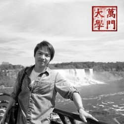

# 勺见沙龙 :万门大学创建人童哲 经验分享会

【主题】 “知识创造乐趣，你是你的大学“

【主办方】勺见沙龙

【时间】2013年4月5日（周五）晚上18：00～20：00

【地点】中国人民大学校内 明德商学楼地下1层 泊星地咖啡 会议室

（问路电话：15201149195）

【主讲人】 童哲

简介：万门大学校长。1987年生人。祖籍福建，北京大学物理系学士，巴黎高等师范学院理论物理硕士，硕士毕业后归国，在人人网建立了

一个名为“万门大学”的公共主页，在短短6个月里，万门大学公共主页已拥有了上万名学生，其中有理科生，也有文科生；有中学生，也有研

究生。（资料摘自百度百科）

【活动流程】：

18：00～18：15 观众提问（目的是让之后嘉宾的主讲更有针对性，因此请你提前准备好问题）

18：15～19：00 童哲主讲

19：00～19：30 观众提问

19：30 正式活动结束

19：30～20：00 开放交流 （我们的场地租借到八点，在此之前你都可以跟童哲继续在场地里私下交流）

【入场条件】免费，不论是不是人大学生都可以。

【报名方式】： 有意参与者请在日志后回复报名，以便我们估计人数；你只用在人人日志、飞信回复以及新浪微博中的一个里面报名就可以

了。

【活动链接】 [请点击这里](http://blog.renren.com/share/286446217/15561243665)

(采编：周凌希，责编：周凌希）
