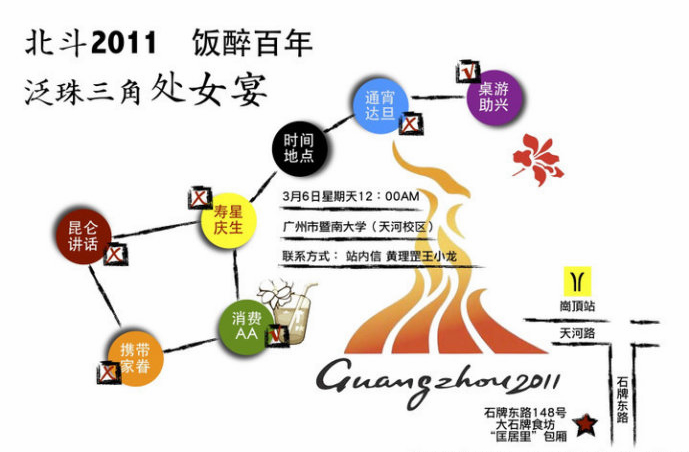

# 北斗人泛珠三角首聚在暨南大学举行

编者按：3月6日，“北斗2011·泛珠三角处女饭醉”在暨南大学广州天河区校本部附近的大石牌酒楼“匡居里”举行，北斗网的几位编辑、撰稿人和读者十多人进行了小规模的聚餐活动。这里为您带来此次饭醉活动的现场报道~ 

# 北斗人泛珠三角首聚在暨南大学举行

## 采写/谷卿（北斗特约撰稿人）

3月6日，“北斗2011·泛珠三角处女饭醉”在暨南大学广州天河区校本部附近的大石牌酒楼“匡居里”举行，北斗网的几位编辑、撰稿人和读者十多人进行了小规模的聚餐活动。当时选定暨大为聚会地点，有一个重要的原因是早些时候得知张大春先生将以“终结的武林：这就是民国”为题来暨大进行一场讲座，时间正是6日晚上。于是我们的想法和安排是，中午聚餐、下午喝茶聊天，晚上去大春老师讲座现场。可惜因为母亲卧病，大春老师不能远游，故取消了此次广深之行，当晚在暨大的演讲活动一并取消。北斗人泛珠三角首聚时间地点不变，照常举行。 聚餐结束后，其中九人来到暨大餐厅玩三国杀。我此番杀较之今年春节时与仕赫、熊鹏、曼丽、杨振等人初练之时，毫无长进，依然是在他人指导下出牌，再被干掉………琼娜比我也好不到那里去，她说得最多的是：“没关系，我会学习的！”鹏璋多次担任“主公”，无比淡定；张杰、陈纯技术高超，杀得酣畅无比，这种高级的快感是我、渊航和琼娜等一干菜鸟无法体会的，悲催……… 

[gallery] 此次参加泛珠三角首聚的北斗人有：（出于对个人隐私的尊重，这里对部分与会者使用化名） 【北斗 编辑】副主编黄理罡、中山大学港澳珠江三角洲研究中心研究生Joanna（天枢时评版前责编）。 【北斗撰稿人】中山大学哲学系博士生A、暨南大学新闻与传播学院研究生B、暨南大学文学院研究生C、暨南大学文学院研究生D、暨南大学文学院研究生E。 【北斗 读者】香港科技大学硕士F、中山大学药学院研究生G、暨南大学新闻与传播学院研究生H、暨南大学管理学院研究生I、南方医科大学公共卫生与热带医学学院J、上海外贸大学法学院K、华南理工大学电力学院L、中山大学资讯管理系M、华南师范大学法学院N。 

（摄影：Joanna 责编：白泽）
