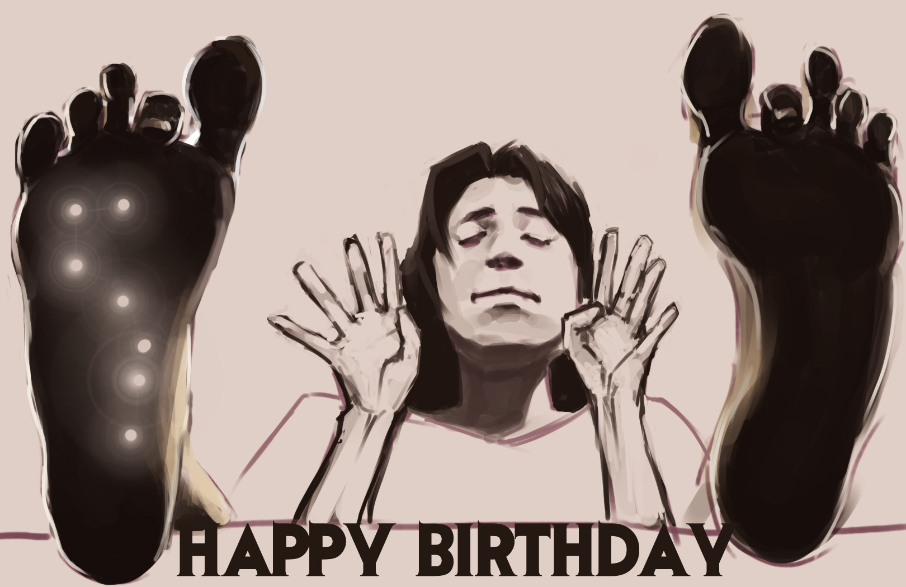
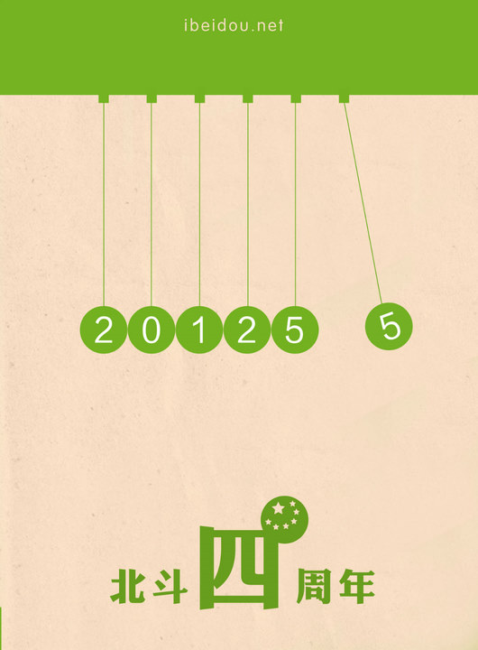

# 北斗四年：从人格化到平台化

** **

这是四年前的事了，但我还清楚记得刚加入北斗时那股新鲜劲。

那时候我是大一下学期，还会认真地看《南风窗》的每篇文章，还建了一个博客，写写对生活中现象的体验，大学上得很无聊。有个北外的高中同学跟我介绍了她的学长，也就是薄然了，创办的一个叫《北斗》的电子杂志。于是我就又兴奋又满怀期待地给薄然发了两篇我写的很单纯（或者说傻）的文章，自荐加入。最初我只是做撰稿人，我还清楚记得自己写的第一篇时评《从肤浅的悲观到深沉的欢乐》，马马虎虎。后来很晚才开始做编辑工作，我接手的第一个工作是征集暑假的社会调查报告，那天半夜接到任务一次性就写好通过了，当时还暗自得意。大四的寒假去襄阳参加第一次北斗全国性的聚会，回来的时候在春运出川大通道的火车上挤着站了一夜。当时我也是个新人偶尔在QQ群里探头探脑，到现在每天的生活都被北斗占据。当时全北斗只有一个QQ群，志愿者只有个位数，到现在不知道有多少人加入过北斗，受过影响了。

我们还没有老态龙钟，四年时间足够改变很多，而且这大概是好的改变吧，我想。

我一直爱说北斗的历程是历史的，就像人的命运。命运包含三个因素，先赋地位、社会结构和随机事件。而命运又是一个动态的过程。所以命运大概就是个人先赋地位因经历的一系列随机事件影响而在社会结构中不断进行路径依赖的变动的过程。北斗也是这样的。我们的先赋地位是由草根大学生自发创办，就决定我们的性格是有些青年人的自负，有些书生的迂腐，非常理想主义，又有些故作成熟。不过我们不需要对某个集团或某种利益负责。而社会结构也就是我们所受到的社会背景——当下的政治生态，舆论氛围等等影响。北斗一直在和国家机器有所摩擦，也一直与网络环境进行对话。这些都决定北斗不能为所欲为地生长。而北斗也不断经历随机事件。比如各种事故，比如北斗核心成员的个人风格，都是随机的因素。总之这是一个前脚往哪迈出后脚就在哪里落下的过程；也是一个边扔石头边过河，又看不清水下路径的过程。

作为一个基本见证了这个过程的参与者，我还是想简单概述一下其中的一条线索。这样是为了帮助认识自己。因为在同时有人质疑我们“精英主义，姿态太高”和“要保持小众，维持精品”的时候，自己不要乱了阵脚。而且，即使我们不知道结果会如何，我们也要往自认正确的方向努力啊。这就需要经验的建构，而不是想当然。

 

### 人格化到平台化

北斗到现在，在很多志愿者和读者心目中，还是一个人格化的形象。比较典型的就是把北斗当成一个有自己立场的发言者，或者把北斗和一些核心人物联系起来，觉得这些人的立场就代表北斗的立场，这些人的言行就是北斗的言行。（一个例子就是之前陈轩玩笑性地随口损了别人一句，就惹来当事人对北斗理想主义价值的批评，我对这个事的比喻是：陈轩不小心骂了句粗口，整个北斗就被认为是不雅的）这个原因很多，北斗刚开始从校内网发起，虽然作为一个电子杂志，但是校内网的参与模式就是个人角色的参与。即使现在在人人网设立的瓢虫君、瓢虫妹平台，还是人格化的形象。而且北斗初创时期，团队短小精悍，团队成员比较相似的志趣和特点，编辑作者集于一身，可由几个核心的人物代表。北斗的文章虽然多样，但跟普通学生接受的那些东西还是很明显区分开，而且可以由典型文章代表，也容易被认为是有统一价值观和立场的。这样就给北斗留下了些刻板印象。比如很多人认为北斗是右派的。

北斗走出校内网，开始创办一个独立的网站，打造平台的意图就比较明显了。多元的平台是一个比小众的杂志更有雄心的目标，而且也更利于网络时代的生存和发展。但谁知北斗在网站刚搭建好的时候，就被警告而被迫退出校内，加之第一批核心成员因为其它事务的淡出，当时北斗遭受了一个萧条期。不过这时候华语大学生人文思想平台的旗号已经打出来了。而且内部自我定位已经坚定地从《北斗》转变为“北斗网”。峰回路转，北斗网站依靠文摘恢复了生机。这时候北斗曾经尝试网站改版，改成一个类似牛博网那样的博客集的形式。但这个计划没有推行。这时候渐渐有了要把北斗做成一个门户网站的诉求。后来北斗就开始尝试自己加工一些原创性的栏目。我们现在北斗内容输出主要就是文摘部和栏目部两个部门。不得不说我们的无论文摘还是栏目的内容都还带着最初杂志性的烙印，北斗的产品仍然可以被看做是杂志。但平台的内涵不在于形式，而在于开放的精神。

在现在的网络舆论环境中，已经有了很多独立的发言者，大大小小的意见领袖都已经很熟练于自己的那种文体、那套宣讲词。这样也可能会获得很多拥趸。但个人的尴尬就在于，他的视角永远是局限的。如果个体的角色既左又右，既理想主义又末世情绪的话，只能是个精神分裂。北斗经常会遇到两种相反意见的指责，这就是因为批评者在北斗发现了自己反感的内容，把北斗作为一个这种内容所代表的人格进行批评。而这恰恰说明北斗开始平台化了。北斗提供了一方批评另外一种内容的平台。

人人都爱说平台，似乎这成了一个讨巧又很虚的概念。我们讲平台，绝对不是姿态性的客套话，北斗是想提供实实在在的服务。目前我们可以采集大学生优秀原创文章放到你面前，而且我们会进行更加专题化，也更利于标签检索的改革。也已经开始尝试进行社科常识普及（比如《七星说法》谈法治、《七星百科》对议题关键词进行注释），把优秀的人物介绍到你面前（《七星人物》），还有瓢虫妹综合转载服务。而且我们不是做一个意见领袖，而是做一个意见平台。此意见是指公共话题的讨论和观点。（《七星视点》、《七星微语》都是基于人人网的意见收集和整理）我曾经看到有人说：某某吐槽段子高手如果充当瓢虫君，瓢虫君的编辑都失业了。那就是说明他对瓢虫君理解的太浅薄了。一个人再会吐槽，哏就那么几个。我们编辑的微语，每周都要开例会逐条讨论，哪些值得发哪些不值得发，这里面是有我们的标准的。标准就是如何利于平台的进化。接下来，北斗还要提供多种新的服务，有思想沙龙活动发布平台、青年公益发布平台、大学生新闻转载平台等等。

有人批评北斗姿态过高，这个我们已经改正了，我们采取的不是一种居高临下的硬梆梆的启蒙，而是想做一个实实在在的平台。有人批评说北斗不要迎合大众，要保持精品化，对于这个质疑我是觉得我们提供服务是面向所有大学生的，所有大学生在思考与交流中都是平等的。当然产品是要精品，但这个产品跟精英主义是不同的。还有人经常批评北斗具体的某些文章的观点，这个恰好就是我们所期望的，最近我们开始硬性规定编辑必须认真对待读者的批评，并尽量沟通作者与批评者交流。当然一直有一种批评是说北斗文章太烂，水准下降。这个问题编辑内部经常在讨论，但平台毕竟是对网络思想现状的客观反映。这些说得好像辩解，但期望大家都能理解北斗到底在做什么。

### 选择与被迫

前面说过，北斗一直处在与社会结构和网络环境的对话中。从人格化到平台化，既是一种选择也是一种被迫。这里面有很多慷慨的担当，也有很多辛酸。四年时间，已经经历了快两代北斗人的更迭。北斗依然存在着，也还有新鲜劲。从一个人的想法，到这么多人的行动，确实是个奇妙的过程。我相信北斗的边界是一点点扩大的，虽然当你身处内部时会觉得做点什么都很难。理想和激情也不会闪耀在每日的殚精竭虑中。但我们依然联结在一起。大概这也是一种选择与被迫。

选择与被迫，看起来很矛盾，但就是一个人的命运，也是一个群体的历史。当我们了解后，才知道其中的真谛：勇敢把握选择，淡然面对被迫。

 

（采编：麦静 责编：麦静）

 
