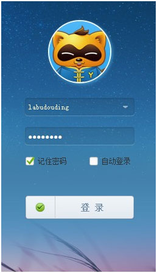
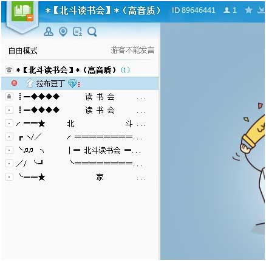

# 北斗线上读书会语音软件使用指导

亲爱的读者，大家好。由于北斗线上读书会在YY语音这一平台上进行，本文将为大家指导YY语音的下载和使用方法。

第一步，点击进入页面[http://www.yy.com/yy5/](http://www.yy.com/yy5/) ，选择右方立即下载，将安装包下载至任何电脑上能找到的地方，双击安装，考虑到YY占用电脑内存极小，推荐将其安装在D盘，E盘，F盘等非移动存储设备中。

第二步，在页面[http://www.yy.com/yy5/](http://www.yy.com/yy5/) 中，单击上方悬挂的“申请YY号”，在新打开的页面中输入合理合法的通行证号，密码和验证码。

 

第三步，双击打开刚才安装好的YY软件，在打开的主面板中，输入刚才注册好的通行证和密码，恭喜你亲爱的读者，这个时候你已经进入YY的神奇世界啦！

第四步，在打开的主面板中，找到“我的频道”，右键选择查找频道，选择按照频道ID搜索，输入**YY号89646441**，回车进入北斗读书会。

   

好啦~至此大家就已经来到北斗读书会YY群啦~你们可以在这里欢快的聊天，拌嘴，逗哏，捧哏，撒欢，调笑~各位北斗志愿者都在这里，殷切的期盼着你们的加入哦！让我们携手开创一个和谐美满的读书新世界吧~
