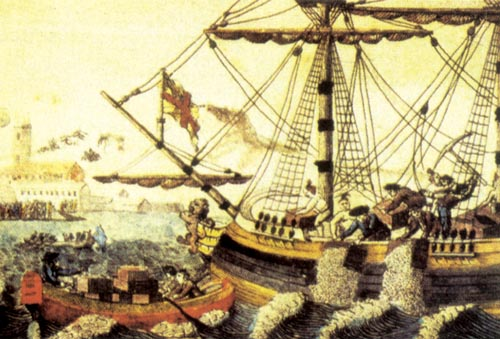
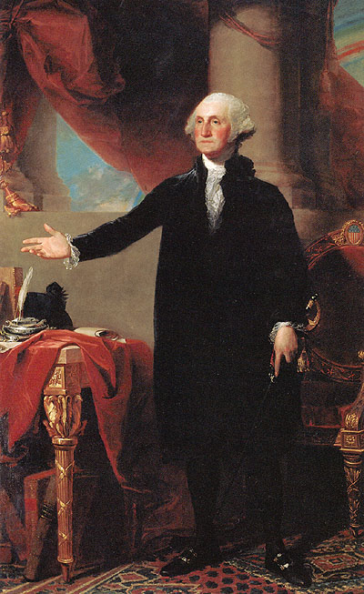
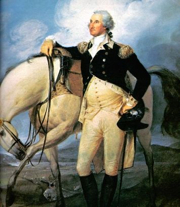

# 北斗荐书：一个国家的诞生——简明美国史书目

1773年12月16日夜，月黑风高，正是杀人放火的好天气。萨缪尔·亚当斯应当不会想到，他在这个晚上的所作所为，将会给这个世界带来多大的影响。趁着夜色，这位激进的革命分子带着他的他的手下们悄悄潜入英属东印度公司的货船上，将满满一船茶叶倾倒进了广袤的波士顿港。

事情的起因是，大英帝国为了更好地控制殖民地和攫取更大的商业利益，推行了《印花税法》和《茶叶法案》等一系列法律。这些举措激起了当时英属北美殖民地人民的极大不满，倒不是因为税收有多重（事实上他们的税负并未增加，某些地区还有所减少），而是英国不经他们同意便制定法案的行为让这些人无法接受。

波士顿倾茶事件发生后，英国当局震怒，便制定了一系列惩罚性法令，规定英军可以强行搜查民宅、取消了马萨诸塞地区的自治权等等，史称“强制法令”。美利坚人民不甘示弱，在宗主国的步步紧逼之下，他们开始团结起来，为自己寻找新的出路，风起云涌的美国独立战争就此酿成。

有趣的是，美国的形成和中国有着难以割裂的联系，英属东印度公司所贩卖的茶叶自然来自神秘的东方帝国。在美国建国后，美国人民便迫不及待地与中国发生了贸易关系，一艘名叫“中国皇后号”的商船最早连接起处于新旧世界的两个国家。连美国国父华盛顿都对来自中国的瓷器爱不释手，以至于在皇后号第二次起锚时，他定制了好几件东方瓷器，这当然都是后话了。

与之相对应的，中国人在晚清便已经对美国表现出了极大的兴趣，像徐继畲的《瀛寰志略》和魏源的《海国图志》都不约而同地给予了美利坚合众国极高的评价。但是，这种情况和今天的中国不无相似，时人的赞誉并未建立在对美国的深入了解上，更加谈不上促进对美国的深入研究。

以美国为镜鉴的自然不止是中国人，而在诸多以观察美国著称的观察家中，托克维尔无疑是其中最出色的一位。1835年，这位法国贵族的后裔来到美立坚这一块土地上，带着他对贵族制、对法国前途的疑惑。在这里，他看到了欧罗巴大陆上从未见过的平等，贵族制被废除，人民获得了平等的身份。托克维尔以为，这样一种平等正是人类发展的趋势：“翻阅一下我们的历史，可以说我们在过去的七百年里没有一件大事不曾推动平等。”我们可以想象，托克维尔写出这句话时的心情一定是无比沉痛的。正是在法国大革命中，托克维尔的祖父被送上了断头台，成为法兰西民族通向平等道路上的牺牲品。正是怀着这样一种复杂的情绪，托克维尔来到了美国的土地上，去寻找理想中的政治制度。

可能托克维尔的同胞拉法耶特并不那么想，作为一个亲历了美国革命进程的参与者，他曾和华盛顿一起了约克镇大捷。对于他而言，美国革命不仅是一个事件，而是体验。这样一种差别导致拉法耶特忽视了在其他国家重新建造一套政治制度的困难。在法国大革命的语境下，这样一种失误无疑是致命的。由于时间上的相近和结果上的巨大反差，美国革命和法国大革命往往被人当做一个有趣的对比推上台面，同为近代世界上重要革命的两者堪称“姊妹革命”。但这对“姊妹”之间的性格差别是如此巨大，就好似灰姑娘故事中灰姑娘与后母的女儿一般。早在1790年，美国人莫里斯就以阳光和闪电作为比喻来形容法国革命和美国革命，认为法国“以天才人物取代理性作为革命的指导，以实验代替经验，在闪电和阳光之间，他们更愿意选择前者，也正因为此他们一直在黑暗中措索徘徊”《姊妹革命：美国革命与法国革命启示录》。

当我们仔细审视美国革命的时候，不觉会产生一种困惑：18世纪发生在美洲大陆上的一系列事件真的能算作“革命”么？

一念及此，我们不得不重新思考“革命”一词的深层意涵，正如《姊妹革命：美国革命与法国革命启示录》一书的作者邓恩所说：“他们（美国国父们——笔者注）的革命是一种‘复归’，正如‘革命’（revolution）一词在天文学上准确的意义所示——围绕某一中轴的圆周运动，至于其所始。”正是从这样一种视角出发，我们才能更好地把握美国革命的深层意涵。

在美利坚的殖民地最终脱离了大英帝国的控制后，这块上帝应许的新迦南地需要怎样的大卫王就成了美国国父们所需要考虑的问题。从战争中遗留下来的邦联体制无疑体现出了种种弊端，但应对邦联体制进行何种调整却成为了美国国父们所争论的焦点。在费城的制宪会议上，以汉密尔顿为代表的联邦党人强调加强中央政府权威，认为一个强大的中央政府是今后美国发展的保障。而反对者也基本赞成这一观点，他们的异议在于，这样一种政府的权力应该大到何种程度，并且，这样一个中央政府的合法性究竟是来自于普通民众还是州政府。纽约州的代表莫里斯提出了后面一个问题，他区分“联邦最高政府”（federal supreme government）和“全国最高政府”（national supreme government）这两个概念，即美利坚合众国到底是“各州合众为一”还是“人民合众为一”？

康涅狄格代表谢尔曼和弗吉尼亚代表乔治·梅森分别代表着这两种权力主张。前者认为州政府是人民的直接管辖机构，联邦政府与民众关系不大，所以联邦的机关不应该由民众直选，而应当由各州立法机构的代表在联邦行使权力；梅森则持相反的意见，人民主权原则要求联邦中央政府的权力应当直接建立在人民的选举上，联邦政府的代表应该有人民直接选举。

这样一种分歧并非仅仅是政治理念的不同，背后更有着利益的复杂的利益：大州和小州因人口差异而引发的权力争夺，甚至各个代表自身利益的影响也都无时无刻不缠绕在立宪的过程中。从联邦宪法的讨论记录中，可以清晰地看出代表们的利益纠葛，也正因如此，许多代表甚至认为这份珍贵的会议记录应当被销毁。幸而，这件历史文件被保存下来并得以出版。

另一本可以佐证美国国父们“自私”行径的书则是美国史家查尔斯·比尔德的大作《美国宪法的经济观》，作者对美国的建国者时期的经济状况做了考察，进而重建了关于美国建国时期美国国父们所做的决定是如何为自己的社会经济地位所左右的史实。从这一点来看，美国宪政的初步建立虽然不排除少数政治家的抱负，但也不必将之神化成一群毫不利己的超人。

然而，从文本的宪法到宪政制度的建立还有很长的路要走，甚至是代表们闭门商讨出的宪法草案都不是可以让民众轻松接受的。正如前文所言，美国国父们在宪法制定中就产生了巨大的矛盾，部分州权党人并不认同联邦宪法，拒绝在联邦宪法上签字。在支持宪法与强大中央政府的联邦党人和反对者，即反联邦党人之间，一道深深的裂缝就此印下。但是，在这种矛盾的真正爆发并公之于众，则是要等到宪法批准时期。按照宪法的批准过程，各州的代表必须回到各州去，向本州人民解释新宪法的内容并对其进行表决。反联邦党人就利用这一机会发起了一场向联邦党人的挑战，他们在报纸上发起对联邦宪法的强烈质疑，希望借此阻止新宪法在各州的批准进程。联邦党人自然也不甘示弱，以麦迪逊和汉密尔顿为代表的联邦党人以“普布利乌斯”为笔名与反联邦党人进行了激烈的论战。

反联邦党人对宪法的批评是多方面的，尤其是联邦党人强烈的精英色彩。这种色彩在以下言论中体现得最为明显：“首先，一个议会不管由什么人组成，其人数越多，众所周知的是，感情就越胜于理智。其次，知识肤浅、能力薄弱的人所占的比例就越大。”正是在这样一种前提下，联邦党人本能地认为，这样的一种政治形式更容易使得大众为人所蛊惑，进而威胁到联邦制的根本。在这样的一种威胁下，联邦党人选择比例代表制，限制政治参与人数，以提高民主质量，维护共和国。这种想法不能说没有道理，我们应该不会忘记，在美国建国以后的这几百年时间里，世界上通过民主选举而上台的那些独裁者给世界带来了怎样的危难。

联邦党人以代议原则取代了规模原则，其起因是由于“在任何协商集团中都存在着基本的限制条件，它起源于这一事实，一次只有一个演说者被倾听并得以理解……由于一次一个规则所固有的根本局限，集团越大，每个成员表达自己思想的机会也就越小”。联邦党人这样表述他们的观点：“再没有把我们的政治估计建立在算数原则上这样更不合理的事了……事实是，为了保障自由协商和讨论的益处以及防止人们为不适当的目的而轻易联合起来看起来至少需要一定的数目，另一方面，为了避免人数过多而造成的混乱与过激，人数也应该有个最大的限度。”

从辩论的结果来看，联邦党人取得了最后的胜利，但是反对者也未曾大败亏输。最简单的一个反例就是权利法案，即美国宪法的前十条修正案，被加入宪法。今天常常为人称颂的权利法案，就其内容而言，这些宪法修正案无疑可以算作反联邦党人的政治遗产。该法案详细规定了以言论自由和宗教自由为代表的公民的各项基本权利，对于今天的美国乃至世界政治文明都有着巨大的贡献。

由此看来，自诩世界“民主灯塔”的美利坚合众国并非建立在民主的基础上，甚至，对于民主弊端的防范始终是不少美国国父们念兹在兹问题。该体制对于分权和制衡的强调，远远超过了对人民主权原则的贯彻，共和政治而非民主政治才是美国制度设计的中心议题。假如美国国父们于九泉之下能看到今天美国所标榜的价值，真不知他们会作何感想。

然而，抛却政体确立过程中具体成就，更值得我们关心的则是在这一政体建立过程中的一些细节。毫无疑问，美国宪法绝不是一部完美的宪法，这部法律简直漏洞百出，诸如奴隶制、妇女权利等等，可以诟病的点太多太多。甚至连华盛顿自己都以为这部宪法无非就是数十年寿命，但神奇的是，那些以百年千年为单位规划的政权一个个都倾覆了，而这个仿佛简易房一样的政体却能磕磕绊绊走到了今天，不能不说是一场奇迹。这无疑都要感谢美国建国者们留下的这套制度。

美国史的专家王希老师曾言道：“美国宪法之所以具有一种超稳定性，恰恰因为它处在一种永恒的、因循现实的动态之中。”诚如他所说的，“妥协而果的宪法本身也成为一种妥协的机制”，美国宪法本身是联邦党人和反联邦党人妥协的结果。而美国宪法的发展历程正是各政治派别以宪法为核心的进行博弈和谈判的过程，这也正是王希将自己的著作取名为《原则与妥协》的原因。

现在，让我们回到对“革命”一词的定义：回到起点，复归原初。虽然我们无法认同美国建国者的无私与高尚，但是他们对自由和权利的追求却是无法否认的。这或许就是一切美国宪政制度的原点，同时，也是联邦最高法院法官们所热衷追溯的建国者原意。今天的美国早已不复当年的模样，在成为超级大国的同时，也招致无数批评，“誉满天下，谤亦随之”，应当是美国的真实写照。二百年来美国经历了国家分裂、解放黑奴、平权运动等等、无疑都使美国的政权形态发生了巨大地改变，建国者的许多谬误之处也得到了修正。但是，这些错误的修正何尝不含有建国者们的遗泽呢？

或许，我们可以这么说，美利坚合众国至今的年头里，虽然无数次修正了建国者的政策方针和制度，却始终没有跳出这套古老而简陋的体制。这可能不仅是对传统的坚守，而是历代探索者发现了隐藏在这套制度中的古老智慧，明白了“革命”的终点到底在何方。正如T·S·艾略特诗中所言：

我们将不停止探索

而我们一切探索的终点

将是到达我们出发的地方

并且是生平第一遭知道这地方。

 

### 【推荐书目】

 [袁明主编：《美国文化与社会十五讲》，北京大学出版社，2003年。](http://ftp111.book118.com/12%E5%9C%B0%E7%90%86/4%E5%9B%BD%E5%A4%96%E5%9C%B0%E7%90%86/%E7%BE%8E%E5%9B%BD%E6%96%87%E5%8C%96%E4%B8%8E%E7%A4%BE%E4%BC%9A%E5%8D%81%E4%BA%94%E8%AE%B2_%E4%BD%9C%E8%80%85%EF%BC%9A%E8%A2%81%E6%98%8E.pdf) [加里•纳什 (Gary Nash) 等编著《美国人民》(上、下卷), 刘德斌主译, 北京大学出版社2008年版](http://ishare.iask.sina.com.cn/f/22333603.html) [埃里克·方纳：《美国自由的故事》，商务印书馆，2002年](http://ishare.iask.sina.com.cn/f/21326981.html) [王希：《原则与妥协：美国宪法的精神与实践》，北京大学出版社，2000年。](http://ishare.iask.sina.com.cn/f/23400253.html) [苏珊·邓恩：《姊妹革命：美国革命与法国革命启示录》，上海文艺出版社，2003年。](http://ishare.iask.sina.com.cn/f/23582063.html) [麦迪逊：《美国制宪会议记录辩论》，辽宁教育出版社，2003年](http://ishare.iask.sina.com.cn/f/19701387.html) [汉密尔顿：《联邦党人文集》，商务印书馆，2004年](http://ishare.iask.sina.com.cn/f/21110795.html) [斯托林：《反联邦党人赞成什么》，北京大学出版社，2006年](http://ishare.iask.sina.com.cn/f/16633880.html) [奥斯特罗姆：《复合共和制的政治理论》，上海三联书店， 1999年](http://ishare.iask.sina.com.cn/f/8039862.html) [托克维尔：《论美国的民主》，商务印书馆，1988年](http://ishare.iask.sina.com.cn/f/25310764.html) [李道揆：《美国政府和美国政治》，商务印书馆，1999年](http://ishare.iask.sina.com.cn/f/23444036.html) [威廉·曼彻斯特：《光荣与梦想: 1932-1972年美国社会实录》](http://ishare.iask.sina.com.cn/f/23546119.html) 资中筠：《20世纪的美国》（冷眼向洋系列），三联书店，2007年 

（采编：徐驭尧；责编：陈芝）

