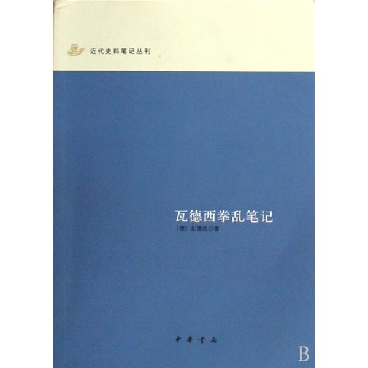
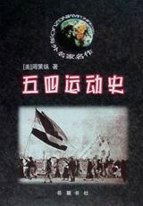
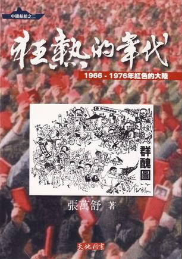
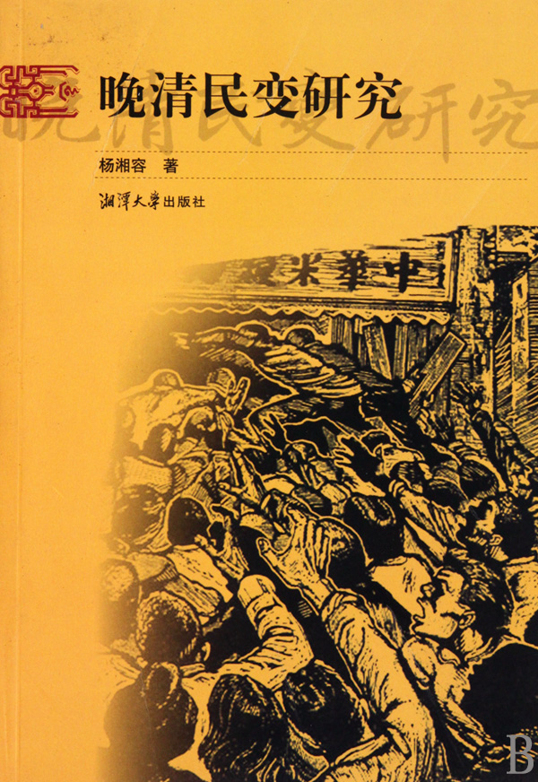
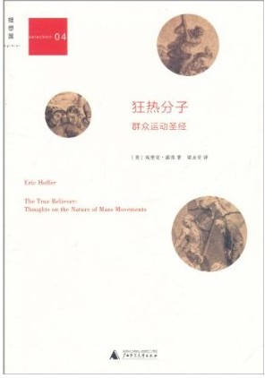

# 北斗荐书：奉旨造反与杀民救国

 

# 本期主题：奉旨造反与杀民救国

## 荐书人/谷卿（暨南大学）

 

近日内地多个城市所进行的大规模反日示威游行，直接让我们穿越到庚子拳祸和文革爆发的初期。高喊口号、砸店烧车，目标说是针对日资商户，榔头和拳头却对准自己的同胞和亲友。一时间，“现代化”的都市里处处冒起烽火狼烟，惊心骇目之情，莫可名状。

面对这样的情境，我们满腹狐疑：这究竟是一种什么样的爱国？愚昧、暴戾、残忍似乎都不足以形容我们的“爱国者”们了。这股裹挟着大批民众的“神圣”洪流看起来真的令人不寒而栗，忽然想起某刘的这段话来：“民族主义的鼓噪往往要走向反面。特别是独裁政权煽动的民族主义，甚至连‘双刃剑’都不是，而只是单刃毒剑——恶棍的最后避难所。独裁民族主义是政客们弄权的意识形态工具，也是一个心智不成熟的民族坠入蒙昧深渊的标志。”

高中时读《随笔》杂志，看过一篇张鸣写的《又想起了王大点》，印象很深。这个王大点是闹义和团时北京城里五城公所的一名衙役，他在义和团在北京城里杀教民、打洋人，攻使馆的时候跟着看热闹，还留下了一部日记来。据该王回忆，义和团杀的教民（信基督教的老百姓）一律手无寸铁，不知道反抗，其中还有不少妇女和小孩。拳民一般是抓住就杀，没有任何审讯甚至排查，“怎么知道人家就是教民呢，或是有人举报，或是……，据说有义和团的大师兄火眼金睛，搭眼一看，就能看出教民额头上有十字印记，所以，拖出去砍了就是。也有谨慎一点的，抓住了嫌疑教民，升坛（义和团的拳坛），焚黄表，让义和团供的关老爷、猪八戒之类的神来判定真伪，只是这些神仙老爷好像一点都不慈悲为怀，但凡焚表的，几乎没几个饶过的，结果还是杀”。

拳民抓人杀人似乎也讲证据，比如在人家身上搜到一些洋货，“哪怕一只铅笔，一张洋纸，都足以让他们丧命”——“这种人，义和团叫他们三毛子。真的洋人是大毛子，信教的是二毛子，用洋货的排第三，义和团发誓要从大毛子一直杀到十毛子。值得一说的是，义和团在剿杀那些用洋货的三毛子时，剿出来的洋货，并没有砸掉了事，而是拿走了。比如王大点记载，某日‘冰窖胡同义和拳将长香（巷）四条照象（相）馆张子清俱家三口剿办，剿得自行车、话匣子、洋物等物不少，解送南横街老团。’”

我深信历史是循环往复的，超越千百年依然相似的历史事境有时实在让人惊惧不已。从庚子拳祸到十年文革，再到新世纪的反日保钓，打砸焚烧、破坏（抢夺）私产、伤及无辜的集体暴乱居然屡屡上演，而有司居然不闻不问，甚至以放任、引诱、撺掇的态度介入事件甚或说是“事变”中来，实在令人齿冷心寒。

一个在日本留学的网友发微博这样写道：“在国内烧抢砸打的时候，我们在日本的中国学生，有自愿出钱出力免费教我们口语的老太太，也有怕我们不会防灾给我们送避难包的邻居。还有去了便利店买东西，却告诉我们晚一小时来就可以有优惠的店员小哥。该说什么好呢？希望父母不要担心，中国人在日本很安全，大家可以放心在公共场合用中文交流。晚安。”看着这样的叙述，真正的爱国人士一定会潸然的吧。

 

### 【推荐书目】

**《辛亥革命前十年间民变档案史料》**

**《瓦德西拳乱笔记》**

**《五四运动史》**

**《狂热的年代：1966-1976年红色的大陸》**

**《单刃毒剑——中国民族主义批判》**

**《晚清民变研究》**

**《狂热分子：群众运动圣经》**

 

（采编：李冰心；责编：陈芝）

 
