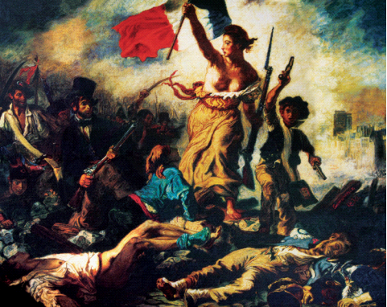
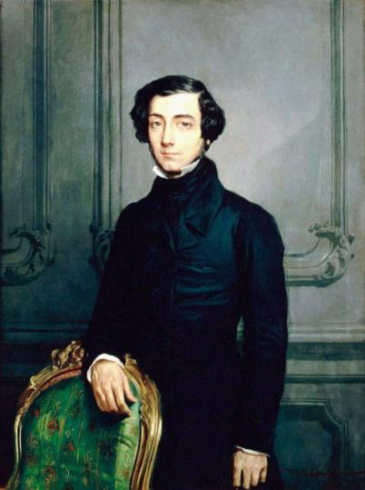
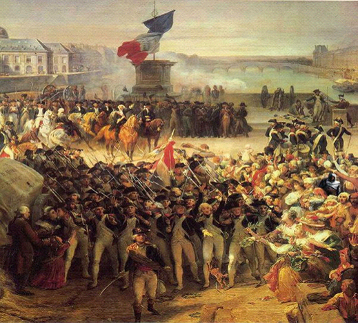
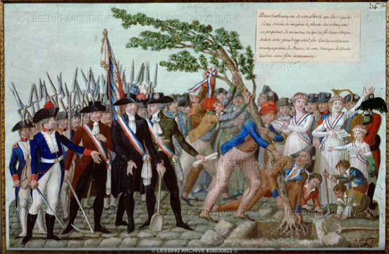
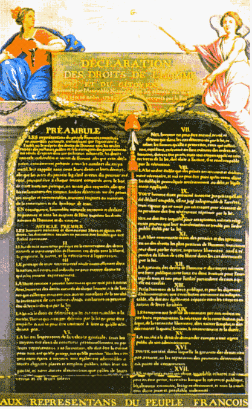

# 北斗荐书：法国大革命结束了吗

《自由引导人民》 德拉克罗瓦（法）

突然被约稿推荐法国大革命的书目，我自然是很激动的。对于一只徘徊在启蒙与大革命史门外的学术小菜鸟来说，法国大革命是个难解的、迷一般的话题。其实压力也是很大的，毕竟法国大革命是被后世涂抹最多的地带，任何意识形态都从这里，寻找合法性所在。

在很长时间，在世界范围内法国大革命都是被当成某种可租[]的历史来源，从中概括出某种意识形态。列宁主义者们从雅各宾派发现了革命崇拜的道理，于是把法国大革命变成了共产主义革命的鼻祖，然后发明了革命解放世界的话语。自由主义们，则略有些尴尬，虽然自由民主此类观念，都来自于大革命，但是怎么也不愿意承认大革命的暴戾层面。更有人们，因为大革命时期，雅各宾派的公安、暴力与屠杀，以公意的名义压制公民权力，像极了前极权主义的缩小模型，所以每逢说到极权主义的时候，都不免用回旋镖的形式，打到法国大革命身上。连警惕“民主”这个叫好词语的时候，人们也会想起法国大革命时期变幻莫测的民意，于是“暴民”、“乌合之众”此类词语也在法国大革命被发现了。

那么法国大革命本身到底是什么呢？哪个才是真正的大革命呢？由于法国大革命持续如此长的时间，而本身也是多面混乱的一团，那么哪个才能代表大革命呢？上面说的这些，人们是不是早已进行后设史学[]的行动。根据自己的意识形态，对法国大革命进行了编排和遴选，然后起草一种符合自己解释的大革命。在法国大革命里，有坚持君主立宪的立宪派，也有起草人权宣言的爱国党人，也有温和的共和党人吉伦特派，当然也有臭名昭著的雅各宾派们，也还有寻求稳定的威权主义者们，如此众多的派别林立，那么哪个才可以代表大革命呢。

在大革命史学界，有这样的共识：就是作为严肃的历史学者，大革命史有必要采取多元的角度，并不赞成把大革命看成一个统一的整体。特别是傅勒，明确提出概念史批判理论，提出将法国革命事件开创的民主文化，同革命者行为方式分开解读，将作为史案（全部的原因与结果）的大革命与作为变革方式（亦即作为集体行动的特殊动力）的大革命区分开来，然后回到大革命本身。首先，停止继续把大革命作为当下政治辩论的资本投射给未来，然后是批判并清理那些以法国大革命中的特定历史人物行为方式掩盖民主悖论的观念。也就是说我在第二段中提出的种种的大革命历史解读在大革命史学中都是不可取的，都是当下时代的解释机制，都是将政治场所扩大的表现。

因为要写这篇推荐书目的稿件，我在人人上推荐了一本 《追踪1789法国大革命》的纸上RPG游戏，提供pdf 和豆瓣相册两种版本。跟普通的游戏相比，这个大富翁的游戏，无论怎么玩，都不会改变历史的既定进程，毕竟它是一个模拟的历史游戏。但你可以选择你的意识形态，在大革命时代进行一次冒险。无论是保王党、爱国党、吉伦特派、雅各宾派还是热月党人，甚至你可以选择当墙头草，当政治投机者，都是可以的，来亲身经历下大革命。可是很悲剧的事情是，你唯独不能选择历史走向本身。可能是因为好奇，出于法国大革命是革命祖母的关系，或者对改良革命的话题充满好奇，不少朋友纷纷都参与其中。有直接以活着为目标的，于是干脆当墙头草，甚至革命的投机者；有的朋友则认为暴力革命并不可取坚持改良在游戏里上了断头台，于是痛骂暴民政治；有的朋友则选择当了保皇党，死在旺代森林里，第一次真切理解了雨果笔下的《九三年》。可能对于很多人来说，游戏并非是面对大革命本身，而是另外一种的参与态度，参与纷繁混乱的当下。

法国大革命其实离当下尚不算久远，也不过是两百年的事情罢了。但两百年足够让历史变成风干的过去，然后由人们各自解说。从法国大革命伊始，大革命就是这样的事情，人们都在谈论大革命，但是你我眼中的大革命则是南辕北辙。大家都在进行着大革命历史的叙事，只是如此不尽相同。

最早最著名的争论，大概是柏克与潘恩之争了。柏克本人其实是个开明自由派，他对爱尔兰反抗行动、美国革命都报以赞赏，甚至对英国在印度的殖民行动都予以谴责，只是一本《法国革命论》彻底改变了他在历史上的声名。他成了保守主义的代名词，以至于现在保守派依旧以柏克的门徒自居。那么柏克究竟是基于何种立场对法国大革命进行谴责，甚至辱骂的。柏克认为法国大革命打破了欧洲一贯的自由主义传统，即贵族自由的传统，以激进的方式要求自由平等，这在柏克看来是不可取的。跟柏克截然相反的就是潘恩和他的《论人权》，这位《常识》的作者，他曾经用小册子激励了美利坚人民反抗英王，在法国大革命上也一如以往。虽然因为不赞同大革命中对路易十六的死刑，他甚至被罗伯斯比尔下狱，身陷囹圄。但他不改初衷，依旧为大革命辩护，他显然是将法国大革命和美国革命联系在一起，认为是自由民主平等理念的又一次继续，显然更看重的是法国大革命对自由平等的信念普遍传播，因此对法国大革命进行辩护。

跟柏克潘恩这些大革命时代的人们激切，非此即彼的倾向相比，复辟王朝的史学家、政治家们——基佐、梯也尔们，对大革命的态度要暧昧了许多。他们是温和派保守派的典型代表，虽然二人还是区别明显的，他们既赞赏大革命的信念，即民主自由平等的追求，但显然又不能认同革命中出现的种种激进行为，特别是对雅各宾派们。

之后不久，继承这一传统的就是托克维尔和他的《旧制度与法国大革命》。托克维尔身为贵族，他的家族在大革命中受到重创，但托克维尔作为认真负责的史学家，还是对大革命进行了客观仔细的分析。他不仅继承了基佐跟梯也尔的传统，还对大革命的起源问题进行深入的研究。与托克维尔的《论美国的民主》的清晰易懂广受欢迎相比，《旧制度与大革命》则是显得暧昧沉重也不易读。当然不排除某些特殊的时刻会受到追捧，诸如前不久的《旧制度与大革命》热。这本书并不是一本大革命史，而是一本大革命研究，更准确的说是大革命起源的研究。托克维尔搜集了大量的第一手材料，时到今日，也许此书作为政治学名著不像往日那么熠熠夺目了，但他的史料分析却依旧清晰如许。

托克维尔

在书中他娓娓道来，与人们刻板印象并不相同，大革命爆发的时代，并非民不聊生的时代，政治上也还算是相对开明的。比起路易十四的“朕即国家”，路易十六的专制统治则是小巫见大巫了。那么为什么大革命会爆发，甚至将革命的狂潮遍布整个欧洲呢。托克维尔进行了详细的分析，因为自文艺复兴以来，慢慢有一种“公民社会”的倾向发展起来了，或者说是“公权力”的东西出现了。如果说路易十四的朕即国家，是建立在君权神授的基础上，国王的国家就是整个社会。那么等到路易十六的时候，随着经济的发展，路易十六执政的时代成为法国经济最为繁荣的时期。而经济的发展，也意味着自由空间的扩展，社会关系比起路易十四的时代要复杂繁冗的多，这时国王的国家已经不能代表整个社会。公权力慢慢发生转移，于是到了权力重新定义的时代。所以启蒙的所有主题都是关于权力如何定义的，而自由平等民主这些话题都是在重新定义权力的基础上出现的。但是旧制度显然无法适应这种变化，包括国王本人在内，虽然他已经尽了他的最大努力来进行改革，但是限于种种原因，旧制度自身的改革，还是远远无法满足人民的需要。于是一场大革命不可避免。所以托克维尔最终得出了结论：大革命是旧制度的发展和继续，是旧制度的必然结果。作为史学家，托克维尔对大革命的态度显然是赞赏的，同时他又提出了一个新的命题，就是革命中是不是必然会出现暴戾的现象，这些用公意的名义剥夺自由的现象是不是不可避免的，其实是具有很多偶发性。遗憾的是，这个话题，长时间的被人们所忽略，直到傅勒这个命题才又重新被挖掘出来，并形成了重要的革命侧滑论[]的观点。

到了20世纪，法国大革命史研究是一个颇为耐人寻味的过程。在20世纪初期，对法国大革命的研究形成了由本土的左翼雅各宾派史学家建立的稳固大厦，后来由于英美的修正主义史学的兴起，这座大厦开始倾斜，轰然倒塌，并开始了重构大厦的过程。最后在此基础上，法国本土史学家傅勒在这场旷日持久的论战中，吸取了英美史学家的观点，并自成体系，赢得辩论。随之，一幢新的大厦重新建立起来，在高毅和伊格内教授的访谈中，伊格内教授认为法国大革命研究已经陷入死胡同里。

可能对普通人来说，这段公案或者有那么点陌生。有必要梳理下。左翼雅各宾派史学家建立的稳固大厦大概是由勒费弗尔 Georges Lefebrve 等左翼史学家和他的代表作《八九年》Quatre-Vight-Neuf 奠定的，达成了共识，即使有细枝末节的理解不尽相同，但是在总体描述上非常相近。(国内有翻译版本,名字使用的是他的英译本的名字《法国大革命的降临》）作为法国大革命的经典著作，他的观点大概包括法国大革命是由中产阶级兴起的，他同时用详实的史料证明了法国大革命分为四个有机组成，贵族革命、资产阶级革命、民众的革命和农民革命，各自都有自己不同的缘由，又汇成了大革命的洪流。在当时即使是右翼学者，也对于他的这个革命起源的并无异议，只是在民主政治和公共秩序方面有不同观点而已。他们都同意大革命的主要动力是中产阶级，国王有意改革，而贵族阻挠，而启蒙运动事实上摧毁了人们对传统的信心。

发生改变的是50-60年代，由英美国家修正史学家发动的。最早是由伦敦大学的教授科本Cobban发难 （《法国大革命的神话》The Myth oftheFrench Revolution）。他认为资产阶级的中产阶级的秩序取代封建制度，这是长久以来构造的虚拟的神话。通过分析革命期间各届议会成员组成的职业类别，他发现旧制度下的官吏和律师等自由职业者的人数在各届革命议会中均占绝对优势，所以革命的原动力并非上升的资产阶级，而是衰落的资产阶级，因为通过购买的官职获得的利益日益下降，他们是希望通过革命可以人尽其才。

受到科本的影响，随后一大批的英美大革命史学者纷纷发难。他们论证了贵族的资产阶级化，并证明了资产阶级和贵族已经形成了了一个具有共同经济行为、生活方式、文化价值、社会期望以及享有各种特权的精英集团。那么早先左翼学者的资产阶级和封建贵族的矛盾的解释变得很荒诞，于是法国大革命的起源开始有了新的政治解释。

最著名的就是多伊尔的《法国大革命的起源》。他从舆论制约上探讨，他认为并不存在一个完全对立的阶层，推向大革命的则是一系列政治危机，诸如财政危机、改革危机、君主制度危机等等。而此时却形成了强大的社会舆论，它限制了政府的行动自由，一系列的解决办法都为公共舆论所拒斥。由于一系列突发因素出现却无从解决，再加上精英阶层之间的互不理解、误算(miscalculation），导致了精英阶层之间权力斗争的加剧，最终酿成了大革命。

后来的史学家们顺应了整个文科的文化转向，和文学、社会学、人类学等学科一起，开始了文化研究。不再关注具体的因果链，而是着重于大革命时期的社会文化。以两派为代表，一个是年鉴派史学家傅勒和他的《思考法国大革命》，另一派是林亨特、达恩顿的对启蒙大革命文化的新文化史研究。

傅勒堪称是这种大革命史学争论者里最大的赢家，由他重新奠定了另一座大革命史的大厦的根基。他承袭了托克维尔的观点，认为旧制度应为大革命的爆发负责。他认为革命是一场贵族革命，即渴望自由。他认为法国大革命产生了一个更加中央集权、更加理性的、更加官僚化的国家，因此只不过是现代化过程中的一个片段。他赞同托克维尔，认为法国大革命是实现法国现代国家化的工具和手段。而大革命中间，由于权力的真空，导致了平等主义的形态意识，最终超过了宪政的观念，发生了革命的侧滑。

而达恩顿林亨特则顺延着傅勒的思路，将这种意识形态的转变的权力运作，即下层民众思想的转变，通过各种文化体系的调查，去研究话语和仪式的运作机制、技术手段与所达到的成果。达恩顿关注旧制度时代的书籍史和舆论传播史，他仔细研究当时承载舆论的小册子、宣传与同旧制度形成悖论的新文化。 林亨特的关注点则是普遍原则、革命象征物在历史过程中的实际运作方式与纪念革命的仪式，认为革命通过各种语言、行为、符号甚至每天的行为，重构了与旧制度完全不同的社会关系，从而重构社会本身。

经过了大革命史的破坏重建的过程，大革命史走向了一个迷茫困惑的方向，因为广泛的共识已经重新达成，各个角度都有学者研究，好像大革命史已经被研究透了，缺乏新的研究视角。在法国大革命200周年之后，大革命史学陷入了某种死寂的状态。

到此，有关大革命是非的种种争论都做了最粗浅的介绍。对于大革命来说，最尴尬最难解的问题是何以这个以民主自由平等为目标的革命，并未产生代议政的现代国家体制。在功利主义目的论的角度看来，大革命是以失败告终的，借此对大革命进行了种种的攻击与谩骂，以至于完全否定法国大革命，而更有人将此后革命里出现种种的暴力极权，都追溯到法国大革命身上。大革命于是一次次的躺着中枪，即使民变中出现的一些不理智的行为，也会被冠以大革命的重现。这种态度其实是很不负责的。

《栽种自由之树》

近三十年来受到英美学术文化的影响，我国学术界反而对其他非英美系的学术文化非常不了解，甚至到某种无知的状态。在此背景下，批评法国大革命的人，通常是英美自由主义传统的信奉者，对改良的现代化经验满是崇拜。因而把法国的现代化经验看做一个并不好的存在，甚至是个失败的典型。这样是在刻意夸大英法在现代性上的不同，二者的同一性是超过其不同性的。在最初通往现代性的道路上，并没有任何民族国家的区分。光是看看三权分立这个观念的发明传播，就大致可以看出来。三权分立的观念，就是从洛克到孟德斯鸠，到转战新大陆，再以返回到大革命中成为西埃士等人的代议制政府的实践。

如果再仔细深究，我们会发现法国差不多是和英国同期完成现代转型的，在革命近一百年后，于勒费礼[]确立了现代民主制的公共自由，确立了政教分立的原则，开办公共学校，进行共和教育。而19世纪的英国，也是在一次次的议会改革中，完成了现代民主制的确立的，也就是说相去并不远。而与英国内战光荣革命相比，法国大革命完全抛开了宗教的面纱，是第一次真正意义的现代化革命，第一次将自由民主平等这些现代政治原则作为基本的原则，甚至信仰确立起来。而在代议政制度方面法国也做了最早的尝试，虽然因为革命的侧滑，没有能够进行到底，但是代议政制度也成为了现代国家的最基本原则。

在傅勒的《思考法国大革命》一书里，提到最多的问题就是法国大革命结束了吗。对于法国当然是，因为法国早已完成了现代国家的转型，法国大革命终于可以200年后盖棺定论。但是对于我们这些尚未完成现代国家的转型的国家，法国大革命依旧是一个不可或缺亦不可回避的话题。在此意义上，法国大革命并未结束。

 

### 【附注】

 1.可租 即说明大革命史阐述的混乱不一，任何意识形态都可以从大革命史找到其认为的根源。 2.后设史学 metahistory 元历史，或元史学 ，美国历史学家海登 怀特认为历史和文学并无明显的区分，都是由语言进行虚构，从而历史学的本质也是阐释学。 3.革命侧滑论 法国大革命史学家傅勒提出，由于大革命中一些偶然因素，导致了革命偏离了原来的方向，发生了侧滑。 4. 于勒·费礼作为法国公共教育部长在教育、人权等一系列政府政策上开始真正将法国革命原则落实到具体社会实践上。 

#### **书目推荐：**

** **

**1.柏克[《法国革命论》](http://rrurl.cn/3PEAkl)**

**2.潘恩[《潘恩选集》](http://rrurl.cn/e4IG4O)**

**3.托克维尔[《旧制度与大革命》](http://rrurl.cn/1S5Jan)**

**4.阿克顿[《法国大革命讲稿》](http://rrurl.cn/i0U2ai)**

**5.勒费弗尔[《法国大革命的降临》](http://rrurl.cn/8i54qP)**

**6.傅勒[《思考法国大革命》](http://rrurl.cn/pPEN2R)**

**7.多伊尔[《法国大革命的起源》](http://rrurl.cn/n7gTbl)**

**8.达恩顿《[法国大革命前的畅销禁书](http://rrurl.cn/tShAtQ)》[《旧制度时期的地下文学》](http://rrurl.cn/5ylKbD)**

**9.林亨特[《法国大革命中的政治、文化和阶级》](http://rrurl.cn/dxp2py)[《法国大革命时期的家庭罗曼史》](http://rrurl.cn/d2ldaD)**

**10. 斯考切波[ 《国家与社会革命》](http://rrurl.cn/l7YUa4)**

**11. 格里穆[《追踪1789法国大革命》](http://rrurl.cn/bmp0lT)**

 

（采编：陈芝；责编：陈芝）

 
