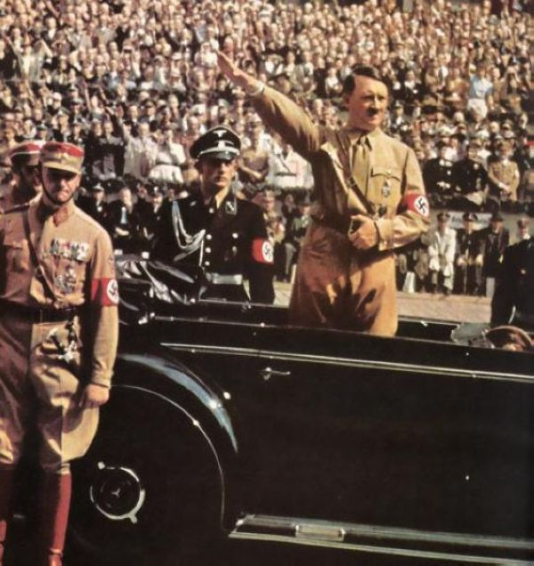

# 北斗荐书：法西斯主义群众心理学

历史的车轮转入二十世纪时，马克思在前五十年所疾痛的劳资关系进入了一个相对缓和的阶段。与其说缓和，不如说是被马克思视为希望的工人阶级选择了无意识的沉默。他们没有阻止1914年的战争，也没有阻止全球金融危机的出现。在一片死寂当中他们眼睁睁地看着贫富差距的进一步扩大，看着帝国主义此起彼伏地兴起，并且成为了其中重要的助力。就像卢卡奇和柯尔施等人在20年代所质问的一样——工人阶级，他们为什么不革命？究竟是什么力量使他们沉默不语？

也正是此时，威尔海姆.赖希在弗洛伊德的研究所里面，一边研习着精神分析学派纷繁复杂的理论体系和临床范式，一边审视着在德国悄然兴起的法西斯主义浪潮。当时的德国，希特勒被视为中下层民众的榜样和救星，他也承诺要为他们谋求福利。然而以这些底层民众为政治筹码上位之后，希特勒一系列维护既得利益者的举措不仅没有引起民众的警惕，对他的个人崇拜反而有愈演愈烈的趋势。随着卍字徽挥舞的，是民众举起的镰刀斧头，希特勒大手一挥，他们便冲向了一个个被视为社会毒瘤的族群，因此才有了那则著名的墓志铭：“当他们捕杀犹太人的时候，我没有说话，因为我不是犹太人......当他们杀我的时候，再也没有人能站起来为我说话了。”

对于每一个头脑清醒的人而言，这个社会都不能被称之为正常和安全。因此必须有人站出来戳穿纳粹这个空前而不绝后的传销组织，于是赖希站了出来。1928年，他加入了奥地利的社会民主D，试图把他在弗洛伊德那里学来的临床心理学和GC主义运动结合在一起，开展一场仿佛堂吉诃德式的性-政治运动。之所以说这场运动是堂吉诃德式的，在于旁人给予这个开拓者的待遇——尽管有数千人接受了赖希和他的助手们在六个性卫生诊所当中提供的的调整治疗，社会民主党仍然害怕赖希的活动干扰他们的经济体系而在1930年将其开除。随后赖希来到了法西斯的大本营德国，希望直接接受到了纳粹压力的德国GCD能够给他一个容身之处，然而这一次的结果更糟糕，在他发展了四万多名参与会员之后，他的性-ZZ运动因为与德国共产党的宗旨不合而遭到了党内的批判，最终在1933年，赖希再一次被开除出党，性-ZZ运动也由此无疾而终，留下的只有赖希出版于1932年的两本著作——《法西斯主义群众心理学》和《性格分析》。

在赖希之前，所有研究马克思主义的学者都将太多的注意放在了政治学和经济学上，却对物质的社会实在投射转化成为人们的意识形态这一过程语焉不详。因此本文一开始就提出的那个问题，成为了西方马克思主义学派的学者们共同的疑惑。在《法西斯主义群众心理学》当中，赖希试图从解答这个问题入手，来展开他的论述。本书第一章第一节的标题即为“断裂”——不仅仅是产生于十九世纪的马克思主义的预言与二十世纪初的资本主义发展状况之间的断裂，也是民众的意识形态和他们实际的经济、政治地位的断裂。

对于意识形态，传统的马克思主义者（又被称为庸俗马克思主义者，这个词简直就是为某些我们很熟悉的宣传口径设计的）将其归结于客观现实的附庸地位，对于客观现实如何投射转化成为我们赖以评判是非，指导行为的价值观往往语焉不详。因此我们才会看到高中课本里面诸如笛卡尔被画成了一个被两匹马拉到树上阿鲁巴的小丑之类的笑话。事实上在哲学史上能够留名的人当中，从未有人否定过精神力量相对独立于现实而存在的地位，即使是马克思本人也不例外。因此对于意识形态的形成机制，这当中的空白就需要心理学者的填补和重构。

在通过逻辑上的倒推之后，赖希发现，马克思的理论固然阐明了我们应该如何做的问题，然而马克思没有进一步地追问，为什么我们往往不愿意这么做。就像萨特指出过的一样，自由固然是人人都向往的，然而在面对着真正的自由时，我们却往往面临着焦虑和彷徨，从而又退回到被规定的标签当中，以寻求心理上的倚靠。与此同时，马克思所划定的阶级，又是一种人们往往难以接受的标签，民众并不因为自己被定义为无产阶级而主动去寻求革命，而是试图寻求在生存的夹缝中获得比别人稍微大一点的空间就得到了满足。因此，阶级绝对不是对浩如烟海的民众最好的划分方式，人就是人，拥有共同的心理形成机制。这种心理形成机制，在师从弗洛伊德的赖希看来，就是乃师所称的爱欲[Eros]，在赖希这里，被称为生物性本能。

由此，赖希推导出了属于他自己的理论架构——性格结构没有阶级之分，只有革命的和反革命的；先进的社会构架也不在于建立社会主义或共产主义社会，而在于形成一套通过劳动释放升华爱欲的社会体系。以本文一开始提出的问题作为原点，以心理学作为工具，赖希的逆推颠覆了阶级和共产社会这两个马克思主义的体系构架，他所从马克思处继承的遗产只剩下一个命题：经济形式决定了性形式。然而马克思留给他的这个命题又成为了他早期思想最重要的原点之一，从这个原点开始，在《法西斯主义群众心理学》里，赖希开始了对于两个问题的探索——现有的不合理社会形态如何被民众接受，以及我们应当构建怎样的社会体系。

赖希对这两个问题试图做出的解答，我无意在这里进一步的阐述。一来随便找一篇赖希的生平简介和学术思想分析，里面都有比我更为精当的概括；二来不论是赖希也好，他之后的马尔库塞也好，将精神分析学说和马克思主义合二为一的社会理论，无一不在实践中遭到了挫败。我没有资格断定这是不是他们的错误，但是时间可以向我们证明一些问题。更重要的是，比起这两个社会学范畴的问题，赖希被人所铭记更多还是因为他在心理学方面的成就。

与《法西斯主义群众心理学》同年出版的另一本赖希的著作《性格分析》可以被看做赖希前期思想当中心理学部分的总纲，在这部著作中，他把人的性格分为三个层次：表面层次由含蓄、有礼、有同情心、讲道德、负责任等构成；中间层次表现为残忍、贪婪、好色、嫉妒、虐待等，与弗洛伊德所说的“无意识”是同一概念，”；深层则是自我的生物核心，是人自然健康的基础。每个出自生物核心而投入行动的自然的冲动，都不得不经过中间层次，扭曲为反常的表现；另一方面，脱掉修养的外衣，最先显露的不是自然的社会性，而是反常的虐待狂的性格层次。自由主义仅体现了性格的表面层次，法西斯主义体现的是中间层次，而真正革命的东西、真正的艺术和科学，都来自人的自然的生物核心。之前我说过赖希以心理学为工具重构马克思主义，事实上也不够准确。与其说心理学是他的工具，不如说他架构理论的另一个原点正在于这一套层次说。基于这套层次说，法西斯狂热者们、乃至于所有的宗教信徒的心理像洋葱一样被他一片片剥开展示。

就像那部叫做《浪潮》（Die Welle）的电影里一样，大学讲师师法希特勒的故智，在学生当中做了一个实验。学生们本习惯于自由主义的价值体系，对于老师的伎俩不屑一顾，然而随着行动的推展，阶级、出身、天性的差异被组织纪律所取代，那些平日缺乏关怀、无所事事的学生“发现”了他们了无生趣的生活源自于整个社会的不合作，于是在共同的信条下他们开始竭尽所能地推广这个叫做浪潮的组织，成为了老师输出的价值观的二道贩子。于是浪潮开始蔓延，一切敌视浪潮的人们被视为妒忌者和破坏者，这个时候普世的平等博爱被人格的中间层次所代替，血腥暴力在所难免。

从文明到暴力，替代的转化过程在哪里呢？电影里的一句台词非常精彩地体现了这个过程：“‘我们’是一个很响亮的词眼，你不属于‘我们’，你必须被消灭。”这里的“我们”是什么？在学生们看来，是一群有理想有信仰的人构成的群体，是这个虚无冷漠的世界必然的救星。这就是赖希所说的自居作用：将自己视为另一个人或者另一种意识形态的化身。一旦这种自居作用产生效应，那么这个人所自居的对象将成为行为引导和价值评判的标尺。在自居作用引导下，人无意识地形成了施虐-受虐倾向，从而成为工具和暴徒。

对于自居作用的形成机制，赖希将其解释为在权威制家庭当中对于父亲角色的模仿。在精神分析学说当中，父亲角色是一个非常重要的概念。弗洛伊德把人的意识分成了本我、自我和超我三个层面，而超我人格很大成分上是人的童年时期在大脑中对父亲角色的投射，从而形成了道德强制力而压抑本我人格当中来自天性的欲念，并将其升华为社会认可的形式而表现出来。然而这个时候一个悖论出现了——即使在纯粹形而上层面上的反思当中，我们甚至可以像笛卡尔一样怀疑一切甚至怀疑到自己的存在上面，但是在社群生活当中，我们依然被迫遵循着一套意识形态，而这种意识形态或来自于一个纯粹理性的伦理体系，或者如大多数人一样，是对于某一类人或者价值观的自居作用产物。无论是选择了其中的哪一种，都改变不了我们在用着一套不自由的价值观威胁着别人的自由这一事实。看到了这一点，我们就不得不悲哀地脱掉所有文明的外衣，直指价值虚无的现实。对于此弗洛伊德在其著作《文明及其不满》（Civilization and Its Discontents / Das Unbehagen in der Kultur）当中早就有过相关论述。或许赖希注定失败的社会理论实践就为乃师做了一个最好的注脚。而由上帝之死和爱欲文明论而开始的后现代思潮，在其影响下的社会当中，虚无和犬儒的再一次滥觞成为必然。人类究竟将死于信仰还是死于怀疑，就像巴尔扎克和卡夫卡那个著名的联句一样，终将成为我们在毁灭之前永远都不可能彻底解答的问题。

#### 推荐书目：

**赖希[《法西斯主义群众心理学》](http://ishare.iask.sina.com.cn/f/6459962.html?retcode=0)**

 

（采编：刘丞；责编：陈芝）

 
