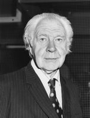
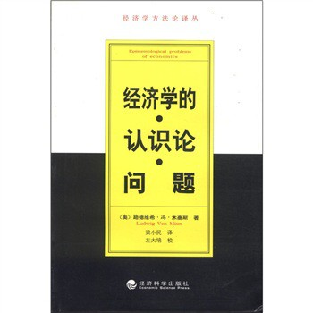

# 北斗荐书：经济学元勘

多数同学接触经济学的第一本书，是格里高利.曼昆的《经济学原理》或者保罗.萨缪尔森的《经济学》，两本书行文风趣易读，实是新手入门的佳品。然而很多初次接触经济学并对自己有着很高要求的同学却并不满足于这两本书科普层次的讲解，他们寻求对一些关键问题的深入讨论，譬如，是谁定下的经济学的研究对象？为什么现代主流经济学和国富论乃至高中经济常识根本不是一回事？为什么经济学回避对本质、善恶的讨论而单纯研究人类行为？这些超越了对经济现象的研究，而升华到了对经济学本身的研究的，所谓元经济学领域，或者说经济哲学领域，是否有人做过研究和探讨？此次荐书，由笔者为您推荐一些这些领域的佳作与糟粕。佳作借以解疑，而糟粕则衬托佳作的光辉。

第一本，莱昂内尔.罗宾斯《经济科学的性质和意义》

罗宾斯是伦敦学派的扛鼎经济学家，同时在经济学与经济思想史领域有着卓越的建树。英国的经济学家往往都不专攻于单一领域，正如凯恩斯沉醉于摩尔的直觉主义元伦理学和给学院前辈做传，罗宾斯的兴趣爱好则是业内八卦，这使得他对经济学圈子内的各种讨论如数家珍，从而将各式各样的讨论进行总结归纳，将其中已成公议的内容在本书中彻底落地而成为定论。伦敦学派是以罗宾斯和哈耶克领衔的和凯恩斯专心致志的对着干的反政府干预派经济学家，以神经紧张的哈耶克“在每个床底下寻找妖魔”而著称。但罗宾斯的专业性著述却不会将任何对政治、经济制度的情绪代入这种学术写作中，更不会扯着嗓子用那种熊孩子得不到关心的哭嗓大喊“只有我是虔诚的自由主义经济学家”。所以在本作中，我们可以看到很多非常客观公正的对问题的深入讨论，包括并不仅限于“对稀缺资源的分配”、“序数效用与基数效用”、“理性人假设”、“经济规律与现实世界的关系”等等。需要注意的是，伦敦学派由于哈耶克的加入，在经济思想史中处于一种有趣的位置，一方面，他们基本是主流经济学的，另一方面，他们有受到一些非主流的如奥地利学派、旧制度学派乃至韦伯的社会学的影响，我们可以在书中一些不起眼的小地方见到罗宾斯引用门格尔而非马歇尔，希望读者们注意的是，这并不代表罗宾斯对奥地利学派信仰有任何偏好——事实上，在第一版的序言中，他春心荡漾的感谢了路德维希.冯.米塞斯，而在第二版序言中提都不愿意提这个人（对经济学嘴炮史有一定了解的人一定能注意到，罗宾斯在第二版续中控斥了某些瞎给他带“行为主义”帽子的人，而这样的帽子往往来自于欧洲偏东的某个国家）。

第二本，路德维希.冯.米塞斯《经济学的认识论问题》

读者们可能并不理解我为何会对罗宾斯充满一种钦佩与赞赏的心情，相信读者们在读了这本《经济学的认识论问题》并和《经济科学的性质和意义》做了比较之后一定会理解我的心情。路德维希.冯.米塞斯，暂且不提这位装逼侠满嘴“托老子的福奥地利才没变布尔什维克”，单看看他的门徒们跟他学成了什么逼样就能理解这人为啥在哪都不招人待见了。以米塞斯为旗手的所谓新奥地利学派，将毕生精力用在了喷主流经济学上，当然，所有的非主流经济学包括马教、旧制度、时寒冰经济学、宋鸿兵经济学都在和他做同样的事情。但米塞斯的不同则是他活活毁了自门格尔以来的一种，继承自边际革命的，本应很优秀的理论传统。在这本书中，米塞斯干了经济学家很忌讳的事情，他以一个民科的身份对本应属于哲学领域的问题做了断言，而完全无视了哲学史上在这些问题上已有的讨论。在先天知识是否存在直到21世纪仍是个知识论难解的议题之时，米塞斯以其先(kuang)知(wang)先(zi)觉(da)的前(er)瞻(pi)性(lian)，毫不客气的断言了不仅先天知识是存在的，而且经济学就是先天知识。这样的断言也就顺手把那些承认自己是来源于经验的经济学清除出Economics这个词的范畴了——幸亏是后者成了主流经济学，而前者成了民科的代名词。“存在而且应该存在先验的人类行动理论是无可争议的”、“普遍正确的人类行动科学的逻辑特征”、“它(奥教经济学)不是得自经验，它先于经验”这种本应在圣经和资本论中看到的断言大量充斥在一本研究经济学元勘的著述中。当然，米塞斯的特长远不止做教主和下断言，对论敌扣自己命名的帽子然后对手边还没扔出去的米牌稻草帽令人发指的瞎喷也是其为人特色，《理论与历史》一书中充斥此类手法，可惜网上只能找到台湾的竖排版文本，幸亏米教主考虑到了我们找书的不易，特地先知先觉的在这本在大陆先出版的著述中高密度的运用了此种手法，可以给我们做一些借鉴。对于那些擅长不加怀疑背书“自洗脑”的纯文科同学而言，本书是像考研政治那样的毫无疑问的佳作；然而对于任何闲暇时喜欢上上果壳和松鼠会的骚年们，此书绝对是考验你们对自恋性精神障碍之承受能力的试金石。

第三本，马可.布劳格，《经济学方法论》

《经济学方法论》一书有着划时代的意义——甚至可以说它是现代经济学元勘的开山始祖。出版自1980年的它有着得天独厚的优势，一方面，新古典综合派和芝加哥货币学派的经济学已经相互融合而成为现代主流经济学。另一方面，经维也纳学派、波普尔、库恩和拉卡托斯等人发展的科学哲学也已进入成熟期。此前，经济学已经在方法论领域发生过一些有意义的论战了，比如萨缪尔森和弗里德曼这对冤家对头的F扭曲之战。尽快将两个学科的新进展进行总结归纳，并拓展经济学元勘的边界，成为这个学科的当务之急。马可.布劳格是一位研究经济思想史和科学哲学的行家，历史将这个使命落到了他的肩上——当然，也可以说成是在条件成熟一堆学者拼速度的比赛中他抢先得胜了。这本书从科学哲学讲起，对主流经济学的研究方法驾轻就熟的商科生会很快进入状态理解布劳格对科哲的描述，在第二篇中，他开始谈关于经济学的哲学基础发生过的论战，比如假设不相关议题、实证与规范之争。第三篇中，他开始对现代主流经济学内部的各种理论假设进行逐一的分析与阐述。相比埋头故纸堆一个劲的叫骂古人行为主义实证主义的某些非主流学派，在出版自1980年的本书中我们欣慰的看到布劳格所评论的理论包括了许多70年代的主流经济学前沿理论，比如兰开斯特的消费者行为理论等等，这甚至在21世纪的商科生教育中也是研究生阶段的内容。可以说对于商科生，这本书有助于打下坚实的方法论基础，而对于非商科生，这本书的价值在于让你廓清思维，看清楚哪些是主流，哪些是民科。此外，马克布劳格在若干年之后还将对本书的讨论与批判总结成《经济学方法论的新趋势》一书出版，里边有来自各个不同主张的非主流派别对波普尔主义和逻辑实用主义的主流经济学方法论的批判，包括并不仅限于多元论、建构主义和话语分析。要特别注意的是，某些非主流学派自以为在经济学非主流领域里所拥有的话语权，在经济学元勘这个领域并不存在，比如马教和奥教，哲学的科技树都攀到21世纪的今天仍然在拿德国古典哲学当理论基础，老夫子终归是难以出现在前沿舞台的，谁让理论创新不等人呢。

（采编：杨修；责编：杨修）
