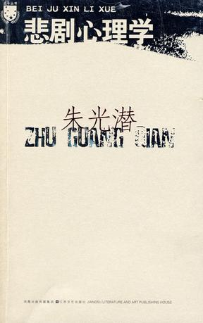

# 北斗荐书：阅读私经验（一）·理解艺术

# ** 本期主题：阅读私经验（一）·理解艺术**

主持人/谷卿（暨南大学） 荐书人/蒙页（Universität Hamburg）

 

**【主持人语】几乎所有文明的源头，都会或多或少地留下那时人们为认识世界所作努力的记忆。艺术就是人们认识世界和记录物我互证的一种最重要的方式。人们总想用恰当的手段来表达对“我”外之一切的认知，各种艺术遂在此基础上发生发展，而主题则万古不易。艺术不必伟大，但必定高贵；艺术也不必唯美，但必定忠实——忠实于神灵、忠实于客观、忠实于内心。因此，艺术成为我们逃离世俗、寻求超越、接近神明的最为理想的途径——人创造了艺术，艺术也切实地将人拯救。**

中国艺术或言文明，向来以和悦为尚，如李泽厚所言“乐感文化”与“实用理性”相辅成。因而千百年来，文艺的抒情传统特地发达，艺术也在追求美的道路上愈走愈远，直指人心而致极度主体化与个体化。西人艺术则似在神性的引导下生成，理智与浪漫两不失偏，而科学或竟与之殊途同归，展现出艺术所能创造的另一些可能。

全球化时代，大众文化的窜行迅速而尖利地剖示出了“土”和“洋”、“俗”与“雅”的对比，仿佛又让我们体会到了那种“狂暴的”历史时代特征。符号的力量和掌握符号后所拥有的力量令我们震惊。语言、文字和视觉艺术的叙述越来越被视为是一种隐性的权力，对它们的争夺显得尤为重要。当代社会，“创新”被号召着成为一种文化，人们为使创新形成一种机制而进行着各种各样和多种多样的努力。实际上，大众文化与艺术有着与生俱来的趋新性，只不过它过多地停留在形式上的改变。但是我们应该注意到，大众文化与艺术所能够号召起的力量是巨大的，特别是有了自由意志的参与，使得其对于社会转变也起着相当大的影响。

本期起，我将邀请我的朋友们和大家分享他们的阅读经验，由北斗网陆续编发。阅读是私密的活动，是个人的行为，因此每个人的阅读经验和体验都是独一无二的，每期我们推出的主题及其内容，也仅仅代表阅读者/荐书者个人的理解与体会。正如人们常说的那句“只有民族的才是世界的”一样，我始终认为只有最为个性化的思想与意识才是最值得交流的——至于那些建立在揣测对方意志基础上的所谓跨语际交流，多半只是些无聊的喧闹和虚伪的乡愿而已。

 ** 【荐书人语】**

### **布迪厄《区隔——品味判断的社会批判》**

莎士比亚、马尔克斯、曹雪芹、乔哀思、巴尔扎克、钱钟书、杜拉斯、伍尔芙、昆德拉，他们与奥斯汀、郭敬明、安妮宝贝、木子美、安意如、琼瑶、亦舒有什么区别？看昆曲黄梅戏的人与看“中国好声音”的人，有什么区别？收集玉瓷书画与收集镶钻名表有什么区别？听歌剧与听“神曲”的有什么区别？逛博物馆的与逛名牌店的有什么区别？闲时抚琴的与夜场霸麦的，有区别吗？念佛经比跳大神更有智慧吗？兰雪惠泉与海碗红砖，一般不过是口茶而已，又有什么区别？与其说这些“对立面”之间具有与生俱来的区别，不如说它们是被人为“区隔”开来的——这是布迪厄此书的终旨。我们为什么如此热衷于给各式各样的“品味”划分等级？尤其是牵扯到艺术的时候，即使“雅”与“俗”之间并无最终界限，但这些概念本身的存在已经说明了我们那永不停歇的为彼此一分“高低”的渴望。在布迪厄看来，一个社会人的一切行为准则、品味体现都不过是他所生活的“场域”的反映——他所来自并所处的社会阶层、他所受的文化教育、他所掌握的物质与人脉资源的共同作用。当我们的艺术品味在这样的背景下不可避免地被标签化的时候，我们所追求的，究竟是凝视艺术本身时的经历，还是标签背后的社会符号？换言之，你喜欢读乔哀思，是因为你喜欢读乔哀思呢，还是因为你喜欢被当作一个读乔哀思的人？

### **《悲剧心理学》**

麦克白嗜权杀主，林黛玉郁死残春，“悲剧”作为主题贯穿人类文明横向纵向的各个地域时空。从神话到戏剧，从小说到史诗，从古典艺术到现代电影，“悲剧"这一概念所表述的，既是艺术载体本身所包含的内容特质，也是受众在消费作品时所受到的的感官及智识触动。那么，究竟何为悲剧？陌生人的悲剧会对我们的心理感情产生怎样的影响？既为“悲”彻骨髓，我们又何以“乐”此不疲呢？朱光潜于此有独到的美学阐释，与《诗论》并读，可一窥广义上艺术的形式与语言规律。

### **《启蒙辩证法》**

其实此书讨论的是启蒙时代之后媒介大众化所带来的种种负面影响，但当中提出的“文化产业”概念对于当代流行艺术的定位也有着至关重要的奠基作用。阿多诺所属的法兰克福批判理论学派在今天的视角看来带有相当重的精英主义色彩，比如他强调的艺术应当具有的独一性与原创性——卢浮宫里的蒙娜丽莎与塞纳河边地摊上卖的印有蒙娜丽莎的挂历不可同日而语。依此类推，现代社会中种种可复制的艺术、文化产品——包括电影、唱片——都抱有愚昧大众的目的。这或许是个有些片面而极端的论断，但在人人皆可被称为“××家”、艺术更大程度上是被消费而不是被欣赏、批判的今天，我们更能够从中找到用以反思的立足点。

 

（采编：李冰心 责编：陈芝）

# [北斗荐书：阅读私经验（四）·理解快乐](/archives/36677)

# [北斗荐书：阅读私经验（三）·理解战争](/archives/25982)

# **[北斗荐书：阅读私经验（二）·理解时光](/archives/25384)**

