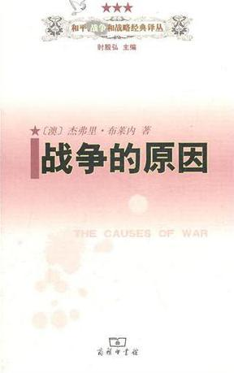
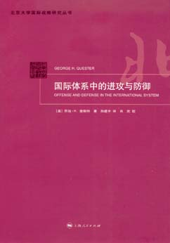
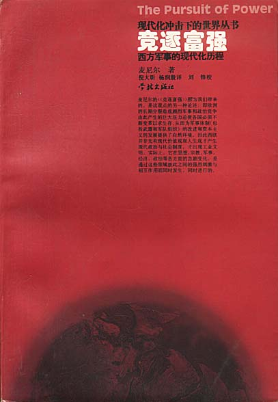
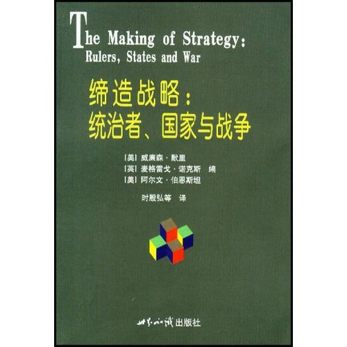
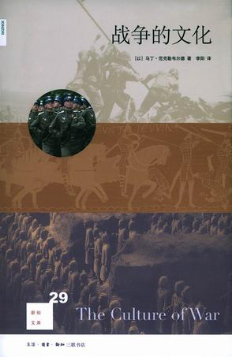

# 北斗荐书：阅读私经验（三）·理解战争

# ** **

# **本期主题：阅读私经验（三）·理解战争**

主持人/谷卿（暨南大学）荐书人/顾全（早稲田大学）

**【主持人语】上月与一位治世界史的朋友谈及宋史及明史时，朋友笑言赵朱二朝均未能体会到战争的功用与妙处，盖其对于少数民族作战，或不战即畏而称臣，或小战即胜而不知止。其实，战争只是一种手段，其背后是有着明确的目的性的，既与参战国内政治经济状况相关，也与国际间关系发展变化密切联系。随着双方或多方矛盾的产生、爆发和化解，其间关系的变化直接决定了战争的有无和规模的大小、持续时间的长短、破坏影响程度的深浅。本期荐书主题即与战争有关，荐书人顾全兄先后在外交学院和北京大学主修国际关系，因对战争这一国际关系的主要表现方式和敏感话题特别关注。只有理解了历史上既有的战争与国际关系的双向影响，才能理解当下我们所处的这个世界为什么会如此以及将会向何处去。**

### **[《战争的原因》](http://ishare.iask.sina.com.cn/f/11892118.html?retcode=0)**

“战争”——人类冲突的最高形式——及其对立面——“和平”——可算是政治学研究话题中的传统方面。而且，所谓“国际关系”作为一门独立学科的发端，也来自第一次世界大战后欧美世界对战争与和平问题的关切和讨论。为什么会爆发战争？战争在什么情况下最可能爆发？而哪些因素又可以抑制其发生？该书不仅概览和分析了18世纪至20世纪80年代近三个世纪的几乎所有重要国际战争，而且为众多解释战争原因或形态的理论提供了“同场竞技”的舞台以检验其各自解释力。最重要的是，作者主张，“战争的开始、战争的延续、战争的结束以及和平时期的延续或缩短全都有着同一个因果框架。”对战争与和平进行如此连贯的把握和理解，在学术界并不多见。故而，著名国际关系理论家赫德利·布尔称赞该书对战争原因进行了“一项富含创见和鞭辟入里的考察”。

### **《国际体系中的进攻与防御》**

在国际关系学中，体系层次的理论注重从分析体系结构开始，描述、分析、归纳国家行为，并力图在一定世界跨度内预判或展望国际关系走向。而战争或军事因素毫无疑问地扮演了重要角色。该书的讨论从西方古希腊时代开始，着力探讨军事技术变如何塑造了战争中的“攻防”平衡，并进而影响到国际体系的形态和演变。核武器、有限战争、游击战、裁军军控等和今天关联度很高的话题也在本书的讨论范围之内。总之，该书是国际关系和军事战略专业研究者以及感兴趣的业余读者不可错过的佳作。

### **[《竞逐富强：西方军事的现代化历程》](http://ishare.iask.sina.com.cn/f/18565081.html)**

以中国为代表的东方为何在文明竞赛中落败于后来居上的西欧？在某种程度上作为对“李约瑟难题”的回应，作者认为，政治与宗教分裂为欧洲国家的冲突与竞争准备了火种，而“适者生存”的体系压力迫使各国革新图强，为军事革命和生产方式革命准备了环境条件。随着竞逐富强的运动不断盘旋上升，最后欧洲列强似乎“不自觉”地作为一个群体在19世纪获得了世界的主宰权。一场持续数个世纪的集体崛起和全球扩张，也许使古代任何一个帝国的宏业都显得相形见绌。作者凭借对相关历史的深邃洞察和娴熟的叙事分析技巧为读者带来了一场知识和思想的盛宴。

### **[《缔造战略：统治者、国家与战争》](http://ishare.iask.sina.com.cn/f/33844524.html)**

该书是一部汇集了当今西方战略史学界诸位大家思想的重要论文集。它跨越了片面聚焦某个体战略思想家或军事家的角色或思想的窠臼，以17个案例为平台，重点考察了国家战略被“塑造成型”的曲折过程。其中，地理、政治、经济、技术乃至心理观念因素以复杂组合的形式对缔造战略的过程形成冲击和作用。而当时当地的领导者或核心人物则为回应对手的挑战，在各种不确定和矛盾的环境中努力规划出一种连贯的、经历战争铁血考验的国家大战略。阅读本书能让读者身临其境地在诸位巨匠洋洋洒洒、快意驰骋的行文间去体会不同时代和国家的决策者在战略缔造中的创造力、开拓性以及局限和困境，并进而获得一种理解和认识自身时代大战略问题的灵感与智慧。

### **[《战争的文化》](http://ishare.iask.sina.com.cn/f/22955120.html)**

身处发达大众消费文化的今天，战争似乎离人们很遥远。而且部分人将战争轻易斥为一种“病态”、“反常”的社会现象，或简单冠之以“军国主义产物”之类的标签。克勒维尔德作为颇具声望的军事史和战略学者，从社会心理、文化、行为等维度入手，认定战争不仅是人类争夺利益的斗争，而且其本身也迎合了人类的某种心理需求。从事战争对一部分人也意味着精神上的解脱和快乐。在这个过程中，产生了一系列与战争相关的工具、习俗、传统、仪式、规则、游戏乃至包括建筑、绘画、音乐在内的艺术。该书观念新颖、视野开阔、见解独到、材料丰富，极具阅读趣味性和思想启发性。

 

（采编：李冰心 责编：陈芝）

# [北斗荐书：阅读私经验（四）·理解快乐](/archives/36677)

# **[北斗荐书：阅读私经验（二）·理解时光](/archives/25384)**

# **[北斗荐书：阅读私经验（一）·理解艺术](/archives/25173)**

