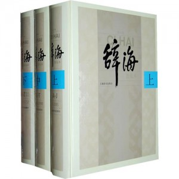

# 北斗荐书：阅读私经验（二）·理解时光

# ** **

# **本期主题：阅读私经验（二）·理解时光**

主持人/谷卿（暨南大学）荐书人/张弛（香港中文大学）

**【主持人语】爱伦坡说过这样一句话：“你最好的时光已经过去，欢乐也不会在一生中再次出现，惟有玫瑰可以一年两度绽放。”时光正和童年一样，当你意识到它、开始珍视它的时候，它其实已经离你远去了。因此每当人们谈到时光，话语和文字中总会透出一种特别的况味，或悠远，或凝重，或快慰，或沉潜。既然我们选择了投身俗世，就注定不能像山中老僧那样不计花甲，望一叶落而知天下秋；我们会安静而浮躁地随着时光的流逝，细细地体味生活、品咂人生，即使现实的世界如此糟糕透顶，我们依然甘之如饴。“生年不满百，常怀千岁忧”，面对不舍昼夜而逝的时光，叹息和感慨终究是徒劳的，可是，千百万年以来，我们一直坚持和传承着这一叹息和感慨的传统。只有当你真正理解了世界原来是这样的令人无可奈何，你才可能踏上那条长长的成长之途。**

### **《伊斯坦布尔.一座城市的记忆》**

伊斯坦布尔，这座奥斯曼帝国曾经的雄都，在全球化的浪潮中被边缘化，乃至变得面貌模糊起来。跟随帕慕克平静的叙述，我们可以看到作者个人、家族与伊斯坦布尔这座伟大都市的命运怎样深深纠缠在了一起，而时光的翻云覆雨手怎样将他们玩弄于股掌之间。作者的家族因帝国的衰亡与随之而来的西方化浪潮而兴，最终却不免走出一条同帝国一样的抛物线。这似乎又是一个“眼看他起朱楼，眼看他宴宾客，眼看他楼塌了”的伤感的故事，但我更愿意用文中提到的一个土耳其词语“呼愁”（土耳其语忧伤）来形容这种感受——正如作者自己所言，文明的凋落“不是某一个孤独的人的忧伤，而是数百万人共有的阴暗情绪”。

### **《大师与玛格丽特》**

发生在西元前的圣经故事与苏联时代的世相百态，被作者用创造性的方式放在了一起，毫无违和感。跨越千年的时光，不变的是人性。单纯为了愉悦，布尔加科夫文字里天马行空的想象力和无处不在的黑色幽默也绝对不会让读者失望。但多读几遍，收获绝对不止于此。

### **《老照片——20世纪中国图志》**

在大部分人家，《辞海》（如果有的话）估计都难逃放在书架上蒙尘的命运。但相信这套厚度不输《辞海》的书会幸运很多，与枯燥无味的文字说明不同，该书通过一张张珍贵的老照片及说明，生动地展现了一百年来我们脚下这片土地上发生的变迁。闲来无事翻阅一下，可以透过时光的迷雾，看看我们的父亲、祖父乃至曾祖父生活的世界是什么模样。如果能通读下来，对波澜壮阔的中国近代史也就有了一个初步的了解。此外殊为不易的是，该书虽然对一些敏感历史事件采用了春秋笔法，但至少没有完全回避。作为一本上世纪九十年代的内地出版物，在去意识形态方面算是做得比较成功。——毕竟是台海出版社出品，也许是出于统战需要也未可知，但这种“置身事外”恰恰是治史应有的态度。

 

（采编：李冰心 责编：陈芝）

# [北斗荐书：阅读私经验（四）·理解快乐](/archives/36677)

# **[北斗荐书：阅读私经验（三）·理解战争](/archives/25982) **

# **[北斗荐书：阅读私经验（一）·理解艺术](/archives/25173)**

