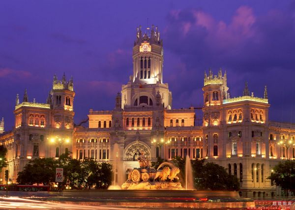
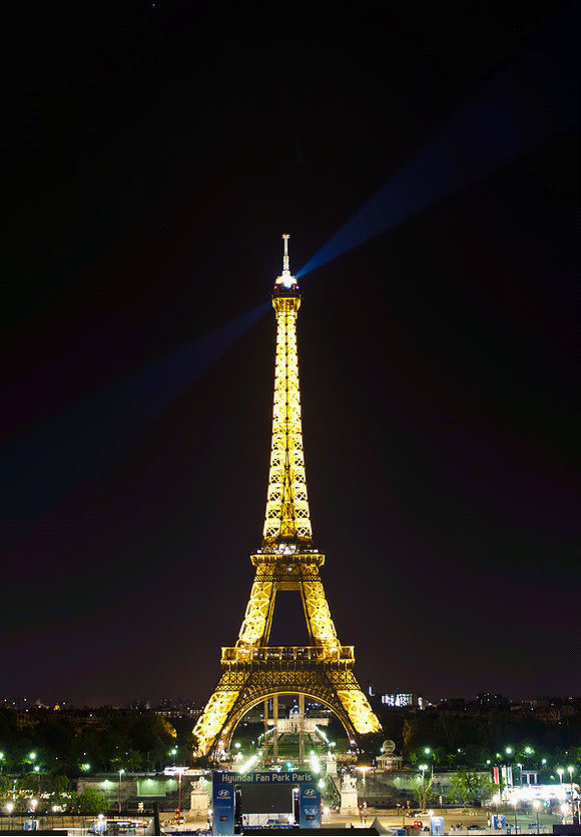

# 午夜巴黎

** **

其实我是个很懒的人，刚加温好的情绪或者灵感，若不能立刻端上桌来吃掉，就在我温吞吞的懒惰中冷却得悄无声息了。所以我得抓紧写写巴黎，在它还没从我记忆的桌上淡掉之前。

我从小有很多情结。小时有小溪情结，大点有大海情结，多愁善感的少年时有蓝色情结有蒲公英情结有夕阳情结有丁香情结。我有时候想，情结是个什么东西呢，大概总是一些不易实现的愿望和不常遇见的美好，寄托在人平凡庸碌的生活中，当做海上飘飘摇摇那盏让人有所期待的灯塔吧。

但和大多数有法兰西情结有巴黎情结的女生略有不同，我倒真是从来未有过巴黎情结。

我当然听说过这里，也知道所有旅游社的网站上提起它就一定要加上浪漫之都这样的形容，也在各种名人的传记电影的镜头中看到过黑白的它，彩色的它，喧闹的它，静默的它。但我是一个更容易被真正的自然所吸引的人。城市很好，人文景观很好，但是那种能够激荡起我心灵深处微妙如蝉翼般震动的美，总还是在山色流转之间，在海天一色的地方，在那种能把我所有的孤独所有的喜悦所有的悲伤都凸显的天地一样大又卑微到蜉蝣一般小的自然中。

所以对于巴黎，我没有期待的。在北京学德语的时候有个俄罗斯来的老师，她提起巴黎时眉头皱的要从额头顶上冒出来：那个城市太可怕了！但是在德国的时候遇见的女友在提起巴黎的时候，怀恋到眼里的光都是柔的，动的。巴黎好像一面多棱多面的镜子，在每个人的眼睛里都折射着不同的光。我对它，好奇大于期待。

法国之行的首站就是巴黎，但因为基本上只是从巴黎转车到尼斯，所以也并不能算是到过阳光下的巴黎：我只是像个仓皇奔逃的老鼠一样在巴黎四通八达的地铁里钻出钻进。前两天的状态上也已经写过，巴黎人民的英语之坑爹绝对不是我能够用语言形容的地步。不会说英语倒不是最可怕的，最可怕的是所有人都默认你听得懂法语。。那一脸的热诚真挚和一腔优美的天书一样的blablabla，让我直接吐槽不能。在张煌逃窜的路途中我还是忍不住的看看这个初见的巴黎。脏，挤，吵，从容。前三个词和最后一个词在这个城市的共存，居然没有违和感。这是件有意思的事。你会顿不顿地在某个地铁漫长的过道里被不新鲜的气味和摩肩擦踵的人给震惊到，暗以为自己是来到了欧洲的大北京。但是有意思的是在那种熙熙攘攘中又暗自流动着各自的从容，从疲倦的背包客到精致的戴着珍珠首饰的老太太，谁也不惊讶谁的存在，谁也不介意谁的相遇，就是有个暗暗均衡的节奏在那里，各有各的快慢。

这是对巴黎的第一印象，说不上好坏。倒是地铁4号线的过道里，由各路街头艺人齐聚一堂组成的小型乐队的音乐，在进了地铁门之后都隐隐约约的传来。那种被空间和时间挤压得略有些变形的声音，让我略略有些恍惚，好似体会到一点点的，所谓的巴黎。

在尼斯和普罗旺斯玩了四天之后，重新坐上了北上的车，再次到了巴黎。这一回，是来和它正式照面了。

和身为医科高才生和狂热的摄影爱好者的吕大师一起游巴黎的好处就是，他永远都在看地图。基本上，我说快看，灰机！他在看地图。我说快看，云彩！他在看地图。我说快看，美女！他在看地图。我说快看，帅锅！他终于抬起头来说哪儿呢哪儿呢。（哈哈，纯属搞笑兼调戏一下吕大师，大师别介意）。这个省心的同伴让我像洗空了脑袋一样，带着一颗空荡荡晕乎乎的脑袋，舒服的漂游在这个城市的四处。到了几乎所有应该到的地方，卢浮凯旋埃菲尔那是样样都不能落下的，香榭丽舍大街的法国梧桐也是来来回回走了遍。景色很好，好得像个经典范明信片，但又有点无趣，无趣的像个经典范明信片。若说动心，或许最令我动心的，是在略阴沉的天空下造访的巴黎圣母院。

在普罗旺斯旅游的时候，同行的苏格兰导游说，在很多电影中看到普罗旺斯，看到现在我们正在走的这些路，正在看的这些景，那种在大荧幕上看到你的日常生活的感觉，特神奇。当时附和着笑笑。看见巴黎圣母院的第一眼并不觉得什么，待到走了进去，却突然有种铺天盖地的感动从心底咕嘟嘟地往出来冒。巴黎圣母院，这是我十三四岁时在脑海里描了画了无数次的图啊；这是那个叫做雨果的忧愁的先生不肯放过我年轻的忧伤的故事啊；这是那个叫做艾丝美拉达的吉普赛女郎带着她海藻一样卷曲而浓密的头发，在所有男人女人复杂的眼神里，在巴黎忽晴忽阴的天空下舞蹈的广场呢；这也是驼着背，独着眼，丑到没人愿看第二眼的敲钟人卡西莫多，在阴影里在角落里，孤单，炽热，滚烫，却沉默的爱着艾丝美拉达的地方。我至今记得雨果描写他如野兽一样孩童一样在钟楼独自游荡，只有为艾丝美拉达而燃烧的爱，让他喜悦到发狂，他不能言语，不能表达，不能优雅的歌唱，也不能美好的舞蹈，他只是不能自已地悬在钟绳上在空寂而高悬的钟楼上，像个发了疯的钟摆一样剧烈地摆荡。

而现在，我居然就站在这里。这不是我的日常出现在了荧幕。这是我青春时的荧幕出现在了我的日常。从那些斑斓的彩窗下走过，想到这里居然也在时空的另一端，曾储藏着我的哀愁，喜悦，眼泪，与感动，那些塑造过我对于爱情，对于浪漫，对于忠贞，对于美丑的想象中的细节，如今是我置身于其中的世界。好像是绕了地球一大圈，与一个老友，与一个灵魂的导师相逢，这其间的跌宕与默契，在瞬间让人眼热。

吕大师离开巴黎的前一天，我们坐在埃菲尔铁塔的对面，看着22点的夕阳，等着23点的灯光。连伪球迷都算不上的两人，莫名其妙地看着警察严阵以待的坐镇街道，不清楚是谁赢了球，甚至都不能确定是赢球还是输球，只知道在这陌生的城市，一大群陌生的人，关注着一个陌生的比赛。面前的法国蜗牛在餐馆的暗红色灯光里，发着蓝发着紫的透着诡异，从食物，到人群，到语言，到空气，都陌生，又都新鲜。就像一个里面微微动来动去的漂亮盒子，你又带着怕，你又带着惊，你又带着不安，但你就是不能不打开它。

本质上，我大概就是这样的一个小孩。而默默地想了一圈，发现我爱的人，我爱的朋友，我欣赏的陌生人，大大略略，都是带有这样潜质的人。就是不能不好奇，不能不天真，不能不美。这简单的词语，在生活渐渐加大力度的磨砺中，慢慢成了疲惫生活之英雄梦想一样难的事情，要坚持，需要的不仅是勇气之流，也需要足够的运气。我眼见着那些孩童一样天真着好奇着捕捉着空气里各式美好的人们，因为各式的因由，或许是家庭，或许是父母，或许是孩子，放弃，或者搁置了自己的那些英雄梦想，搁置了他们各自的巴黎圣母院。我从前总觉得这是懦弱的妥协，但现在，我不再这么觉得了。

站在凯旋门顶上看巴黎的时候，觉得这多么像个蛛网一样的城市。那些呈三角状发射去很远很远的街区与道路，像网一样密密麻麻被编织和设置。每一个交叉口，每一条道路，都埋藏着一场可能的邂逅，一场可能的离别，一场别处的生活。在人生某个阶段，站在这样的高处举棋不定本身，是一件极其令人着迷的事情，光是想到有这么条路能走，这么多的可能性能选，就已经令人欣喜莫名了。然而棋子是因为要落定才有意义的，路是因为要走才有前方的。可能性在被确定之前，永远都是可能而已。我想，那些不再执着于拥有无数可能，而是转而去实现有限可能的人生，未尝不是需要极大的勇气与毅力的。

而我，只是还不能够停止我的好奇，我的天真，我对于这世上所有美不可遏制的贪婪。

这是我和大吕在等待埃菲尔铁搭灯起的时候，谈着的话。0点的时候，荷尔蒙燃烧旺盛的年轻人们，还在借足球或者青春或者夏日之名，或者只是借巴黎之名，在午夜的巴黎尖叫，澎湃，迷离，晃荡。我和大吕穿过形迹可疑的种种人群，在行走中看到像钻石一样变幻着灯光浑身闪耀的埃菲尔铁塔。我们张大了嘴巴。在这样倾尽全力的璀璨过一把之后，它一声不响地熄了灯。我们错过了拍摄它那个璀璨的瞬间。

这大概是巴黎美好而残忍的地方，大概也是生活美好而残忍的地方。它不会提醒你美将至，也不会告诫你美将逝，它自顾自地来，自顾自地走，你所能做的，只是瞠目结舌地看着它，像个傻子一样，孩子一样，张大了嘴巴。

（照片版权，大吕所有）

 

（采编：何凌昊；责编：何凌昊）

 
