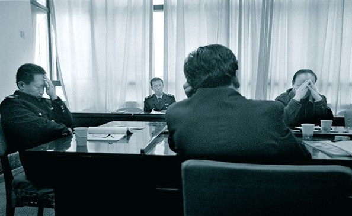
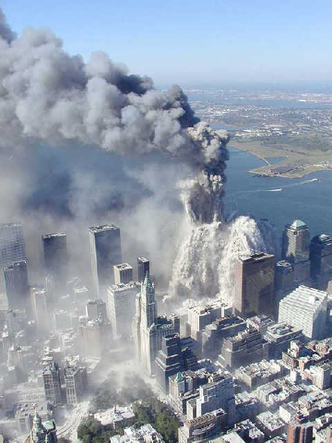

# 历史烂泥滩的赌注

** **

1

在这个神奇的国家每有重大安全事故或灾难发生，在公共舆论一片质疑、问责、批评声中，总少不了一些呼吁宽容的声音。汶川如此，温州亦然。即使身为被世界媒体称为对政府容忍度最高最宽容的中国国民的一员，我也时常被他们傻逼兮兮的仁厚所感动。

宽容界通常有四个流派：

一是祖国母亲派：“祖国这么大人口这么多人均资源这么少，出些问题有些不好的现象是正常的，我们在逐渐进步，要对政府有耐心给政府时间啊！”

二是实干派：“你们这些人只会在网上打嘴炮，为中国的进步做过什么？你们骂的人不上网，有本事当面骂去啊！”

三是余秋雨派：“事情已经发生了，死了这么多了，大家都很心痛，但讽刺批评有什么用？骂有什么用？这时候对政府说风凉话有什么用？含泪劝告大家，灾后重建，安抚人心要紧。”

四是有本事你干派：“中国这么大问题这么多，很难管理，出些事故很正常。有本事你去管理啊，有本事你去铁道部调度火车不让它出事啊，站着说话不腰疼！”

这四个流派在江湖上威名赫赫，影响甚广。灾难发生后，愤怒和悲伤的情绪弥漫，相较之下，宽容界“温和冷静”的声音很容易让不明真相的人们有“眼前一亮”之感。

那么，嘲讽批评和愤怒不满到底是不是建设性意见？

2

记得有个崔永元发飙的视频流传甚广，面对听众的提问，他说（大意）：“抱怨就是建设性意见。我抱怨二环路堵，就骂搞城市规划的那些人。我又不懂设计规划，但你没有给我搞好，我交钱养那么多城建专家是干什么吃的！”

普通人有平庸的权利。如果每个人都是学贯中西的大学者，面对新闻事件吐槽出一大堆学术理论，从经济、社会、法律、技术角度侃侃而谈，写出逻辑清晰思考缜密的技术分析报告，呼吁人大成立特别事件调查委员会，那这个世界简直疯狂了。

从古至今，中国民间有着自己一套朴素的议政话语体系，公共空间从茶馆和寻常巷陌到如今的互联网，政治话题从宫廷秘闻皇帝韵事李公公升迁张首辅失势到如今的先帝病重铁路事故电梯逆行红十字会腐败，“时代在发展，社会在进步”，但这一整套表达方式和话语体系，其实质是变化不大的。

在大变革大发展的转型社会，老百姓写不出“兴，百姓苦；亡，百姓苦”这样的话，也无法像《万历十五年》一样有条理地分析皇帝和官僚系统的博弈、“以道德代替法治”的体制运转逻辑，他们顶多在风尘仆仆谋取营生的间歇，坐在茶馆里擦一把汗，叹一句“我爱这个国家，可这个国家爱我吗？”更多时候，他们遭受不公和冤屈时的反应是简单粗暴的，仅仅是一句简单的“操你X”，或“我丢你老母”。

如果什么都能搞定的话，要政府干嘛？

一幅糟糕的画、一篇逻辑混乱的文章、一部烂片，常听人说，人家画了那么久，写得那么诚恳，拍得那么辛苦，能不能别那么刻薄啊，说几句好听的不行啊。这还算客气的，更多人喜欢使用以下逻辑：不满意你去画啊，你画得成这样吗？有本事你也去出唱片啊，你唱歌就好听？有种你去拍，给你一个亿拍《无极》，你拍得成这样吗？

多熟悉啊。让我们默默倒带回放：这么大的国家，有本事你去治理啊？

没错，我只是一个普通人，不会画画，五音不全，给我十个亿可能也拍不出《无极》的水平，让我去设计北京的环路可能会比现在拥挤一百倍。

可是我以为，一个画家、一个作者、一个导演在拿出自己作品给世人看的时候，就已经默认了欢迎各方点评，无论褒贬。好坏跟付出没有关系，人会好心做坏事，也可能一番辛劳后拿出糟糕的作品。换句话说，在一个受众掏出口袋里的钱买下画展的入场券、一本书、一张电影票的时候，他就天然地拥有了对这个事物表达满意或不满的权利。

我掏了钱，你怎么画那么差？写那么傻？拍那么烂？唱那么难听？什么是建设性意见？这就是建设性意见。你让我提建议给你，指导你怎么画得美、写得棒、拍得好看、唱得好听？我没义务懂这些。要你是干什么吃的？出来混，谁也别装可怜。

哪怕是去银行办理业务，或是打10086客服，都有评判服务好坏的权利，更何况公共服务？

如果说政府是公共服务的供货商，你通过纳税购买公共服务，如果这个供货商提供了糟糕的产品，消费者最合理最冷静的表现就是一句：操你X。什么是建设性意见？这就是建设性意见。花了冤枉钱嘛。脾气不太好的顾客还可能会嚷嚷着，再也不在这家买公共服务了。当然，在中国这样的国家，你只有一家供货商可以选。所以，骂几句娘，讽刺批评几句，简直是这个世界上最宽容最温柔的消费者，令人感动。

这个道理是如此清楚，所以我竟不知“宽容论”是如何流行起来的。在最普通的政治学解释里，人们也倾向于默认政府是恶的，是敌人，是随时可能侵犯自身权利的。所以你要时刻盯着它，监督它，骂它，让它浑身难受，不得好死。

“祖国母亲派”喜欢说要对我们的政府有耐心，多宽容，但恰恰相反，在现代社会，国民的底线素质就是对政府苛刻。对人苛刻是性格尖锐，对政府苛刻则是一种美德。

为什么不呢？六十年前，一个君子模样的江湖骗子敲开了你家的门，经过口蜜腹剑花言巧语一番忽悠：每天/月/年交付给他一笔费用，他承诺给你一块土地，给你医疗保障，等你老了给你生活费，邻居寻衅滋事的话帮你打他，受了冤屈帮你伸张正义。你听起来还挺美，就相信了。六十年过去了，你发现这个江湖骗子，口口声声说是自己仆人的家伙，牛逼得不得了，说的话一句都没兑现，而且还时不时地打你，骂你，把你关起来，不让你乱说话，从你的口袋里抢钱，拿着你的钱花天酒地风流潇洒。

你为什么不生气？

或许你不会因言论被删帖跨省，因家有冤屈上访被截访关押；或许你家的高档小区不会被强拆，高物价你消费得起；你养孩子不怕结石，托亲友从国外寄奶粉；你摆摊不怕城管，内部有人；你只想做一个踏实、安稳过日子的普通人，一个上学工作娶妻生子了此一生的小民。这想法很自然，很好。当别人告诉你那些苦难的新闻，你大喊着，这关我什么事？我只想过日子。可是亲爱的，你并不安全。一个有毒的体制提供的公共服务也是不安全的，你每天乘坐的地铁有可能突然逆行，你常年乘坐的火车、飞机可能由于非技术原因出事故。你或许多次坐火车从北京去福州，你发着微博，憧憬着电视台精彩的实习，可是突然就出事了。没有人能监督这个体制不犯错，没有媒体敢为你说话，没有独立的司法体系为你讨要公正的赔偿，甚至你留给世界的物件也被就地掩埋，名字不被人们知道。你为什么不生气？这是你的切身利益，这是你站立的土地。

你为什么不生气？

3

人们嘲讽整天在网路上发言的网民：你们整天打嘴炮，能有什么用？你们骂的那些人，都不上网的。

是啊，能有什么用呢？

一声呼喊、一次表达的确没有什么用，但十万人、一百万人一起关注，就是建设性的表达。姿态也好，造声势也罢，打嘴炮的人是在降低行动者的风险成本，同时提升对方罔顾舆论所向的风险成本。

对方早已肆意妄为到不在乎舆论的地步，但有声音，总比没有强很多。没有人关注毒奶粉，对方就会毫无压力地把呼吁赔偿的结石宝宝家长抓起来；没有人呼吁问责，对方就会若无其事地掩埋残骸顺利通车邀功炫绩。

你必须清楚的告诉对方：NO。它也许没什么直接作用，但这样的表态很重要。我想笑蜀老师的“围观改变中国”也是基于这样的逻辑内核。

4

很多人说，体制内的人都是笨蛋，呆瓜。

毋庸置疑，体制外有非常多优秀的人才，但这并不能直接推导出体制内的都是蠢猪的结论。逻辑不是线性的。事实上，体制这台大机器早已锈迹斑斑，是个低效而愚蠢的大怪物，但莫要小觑了我党吸纳精英的能力。

你可以嘲弄每年醉心于国考的数十万人的价值观和道德，但你不能否认，其中一小部分人放在哪里是极其出色的人才。甚至你不能否认，《日人民报》本身是一纸笑话，但编写这份笑话的一些人是这个国家最出色的传媒人才之一，无论你每天骂多少遍CCAV，这个国家做电视做得最出色、最有经验的一批人才一定是在这个国家电视台里。

你骂他们投机也好，庸俗也罢，但道德跟能力一码是一码。

我无意为体制辩护，只是说，想当然的思维方式是百害无一利的。认为体制内全是蠢蛋，时代的未来、命运的喉咙一定掌握在屁民手里的是视野局限的幼稚天真臆想症；认为体制外全是微不足道的屁民，自己一定高位稳坐垄断利益得享万年的也一定是高傲愚蠢目光短浅的傻逼。

某体制内高级编辑，我曾坐在办公室他的后面等他码字，一条几百字的官方通稿，20分钟搞定，一字不改，直接可以发。他合上电脑，转过来跟我聊天。

你觉得我只会写这些东西吗？他问。

我点点头。我一度的确是这么认为的。

他打开了话匣子。我们从改革聊到21年前，从个人选择聊到未来局势，从体制内聊到体制外，从80年代的大学生聊到现在的大学生。他聊他真实抗战的看法，对百年来思潮的梳理，你都不好意思觉得自己看过《盛世2013》《大江大海》《追寻现代中国》等禁书有多么了不起，人家都看过。

放下成见，我只想感叹，操，原来是自己人。

这是我不到一年的体制内经历所给我的最大触动。由于体制环境本身的僵化污浊，一等一的人物进去后也不免受到影响，所以我很清醒，不能以肯定个体来肯定体制的整体。从比率来看，在国家官方媒体这一块儿，90%的人被体制搞成了傻逼或本来就是傻逼，10%则是人中龙凤。

这是价值观层面。至于利益和道德，我想起了在北京的室友。我俩合租一套家属院的房子，他去年P大毕业后国考中标，现任职于所有媒体人咬牙切齿的阎王殿——真理部。他学传媒的，我开玩笑说，他供职于一个扼杀自己同行和职业理想的单位。所谓的自我阉割。由于本能的反感和鄙视，初始我跟他不甚熟，住在一间屋子里也不常来往。后来随着接触增多，我们开始聊起天来。在对新闻事件交换看法时，我俩很多时候观点惊人的一致。他也痛恨对信息的垄断和封锁，对官场诸多潜规则和腐败愤愤不平。翻墙？开玩笑，人家熟得很。禁书？开玩笑，人家一书柜。抛却符号化和想当然，坐在我对面的就是一个活生生的真理部工作人员。仅此而已。

在摸清了他的价值观之后，我更好奇了，他，为什么要加入体制？而且是“体制中的体制”的真理部？

聊了聊对局势和未来走向的看法后，我恍然大悟。而且我觉得他的想法代表了绝大多数想要挤进体制的年轻人：价值观不认同，但是夹着尾巴捞可见的福利。他出身农家，若能进入体制内，获得铁饭碗和一份丰厚的福利，也算在京城立足了，日后父母和弟妹的生活，都可以有很好的帮扶。所谓“鲤鱼跳龙门”，货于帝王家。

虽然他也同意体制迟早会崩溃，但历史的盘口还远没到来。换句话说，对于绝大多数想要进入体制的年轻人来说，他们倾向于认为加入体制的可能风险小于可见利益。在自己退休之前，也就是50年内，体制会继续运转下去，福利和特权会继续供给。

说白了，就是赌命运。

如果体制不幸玩完，那就倒霉认命；如果体制运转如常至自己退休，那就皆大欢喜。总体上来说，如果加入体制获得利益的可能远大于体制崩溃承担的潜在风险，这单生意就值得做。

你戏谑说“1911年了还在参加科举，1948年了还在加入国民党”，但分歧的关键就在于有人认为现在已经皇族内阁了，有人认为刚刚同治中兴；有人认为国民党已经退守海南岛穷途末路了，有人认为北伐刚刚开始蒋总司令意气风发。

你此刻的选择，取决于你对未来的判断和预估。但人生的什么选择不需要承担风险呢？求学，工作，婚姻。都是赌，赌命运，赌这条路对不对。愿赌服输。奔向体制的青年当然要承担二十年内体制崩盘大清算的风险，而体制外的屁民也要做好五十年后退休在家对着电视机看建党140周年庆典的心理准备。

宁死不食周粟的青年别再嘲讽辱骂那些挤破头进入体制的同龄人，他们选了这条路，注定得承担这个决定的一切后果和风险——当然，还可能是稳赚不赔的利益。

而违背自己价值观和内心进入体制捞钱获利投机上位的青年也别苦着脸说自己身不由己，好像谁拿着刀逼你进体制一样。一身本事在哪里不能混口饭吃呢？忍辱陪睡就别想要牌匾，人不能太贪心。

5

哎呦，我差点忘了另外一批可爱的精英青年。

他们的理念是，我既不想当屁民在体制外被蹂躏，也不想像那些“庸俗势利、没有理想”的同龄人那样进入体制投机获利。没错，我们想进入体制，因为我们要改变这个体制。未来是我们的，我们是20年后的精英，是社会的中流砥柱。我们怎样，中国就怎样。我们光明，中国就不黑暗。所谓“好人一定要从政”。

请看：

“我想知道10年后的中国是如何的，当我们这些人30多岁，成了科学家，医生，局长，红十字工作人员，甚至是铁道部部长。是否惨剧就不会发生？贪官会被罢免？ 医院可以合理收费？小摊不需要城管也能够清除？不公平的要骂，但是请保证我们的心灵没有被侵蚀，因为你——就是中国的明天！

“令你们不满的官员总会死的。如果作为学生，学商的以后能诚信守法经营，学政的以后能真心为民，学工的以后有产品安全让人民放心，那么二十年以后中国就是另一个模样。可是如果现在只转抱怨的日志只发抱怨的状态，那么二十年以后中国还将是充斥着下一代人们的抱怨日志和状态的令你们不满的中国。”

啧啧啧啧。小清新有没有，感天动地有没有。好友里至少50人以上在转这些状态，忍不住想吐槽。还是那句话，“总有一些人，明明是幼稚天真幻想症，却自称理想主义者；明明是认输的怂逼，却自诩成熟稳重深谙世事。这世上只有一种理想主义，那就是认清生活真相后依然热爱生活。”

为什么还不明白呢？体制的问题根本不在于人的好坏，而在于这个惯性运作的体系本身。体制是台轰鸣的锈迹斑斑的机器，是钢铁，是冰冷的，无关人心、人性。腐败不是因贪官污吏没有底线，而是制度性腐败；社会问题不是因道德伦理滑坡，而是体制性溃烂。

换言之，你想改，派对给你改吗？体制内多少能人都无能为力，你以为他们都是吃白饭的？500家庭治国的格局已然形成，在派对看来，挤进体制的这些无背景的精英青年也不过是给他们打杂的，不过是随时可以牺牲的棋子、家犬，你以为你进了体制就有地位？你以为那些在海外接受教育的红二代、红三代都是闲看着给你空间给你权力折腾、施展理想抱负的？更不要说，你的那些“理想抱负”是要砍他们的胳膊，断他们的手，剥夺他们已到手的实实在在的既得利益。这不比搏命轻松吧？进入体制，你也不过是从整体的弱势者成为一个集团的弱势者罢了，可知古代官和小吏之区分？柏杨早已经一针见血的指出，这一切是个大染缸，怎么还是有人抱有幻想呢？染缸本身就是黑的，不是坏人染黑了染缸，是染缸染黑了一个个好人。你说那染缸是怎么变黑的？这个染缸的诞生前提、运转逻辑、本质属性就是黑的，说清楚了吗？

一切的不公、一切的问题，不是因为现在四五十岁的那些中流砥柱，那些科学家、医生、局长、红十字工作人员、甚至是铁道部部长是坏人，而是因为体制的规则和体系是锈掉的、烂掉了的。

过度苛求人性的自觉而非制度设计，历史上从来都是灾难。

莫再说“我们怎样，这个国家就怎样”，现实情况是，政府怎样，国民就怎样。机器怎样转，螺丝钉就朝那个方向，政府腐败，国民就很难不遵从潜规则，政府说谎，国民说真话就会有危险。

你问我，那该怎么办？我也不知道。我只是一个吐槽的屁民而已。

我只知道，每一代人都不要过于拔高自己在历史上的地位和作用。未来最好玩的地方就在于，谁也猜不透。莫要高估80后、90后这代人在历史上的角色，我们很可能只是一个古老国家转型的铺路石而已。正如丹青老师所说，你站在历史的烂泥滩里，回头看一看，八十年代那批年轻人，玩得不知道比你们HIGH到哪里去了，水平不知高到哪里去了。而今安在乎？噢对了提个醒，你们觉得是“坏人”的当今某个体制内宣传官员，伍皓，就是当年80年代大学生精英哦~想进入体制的谁也别装逼，获利就是获利，投机就是投机，往上爬就是往上爬，赌命运就是赌命运，坦坦荡荡光明正大，一副道德圣徒似的嚷嚷“我要进去改变这个体制”，不是愚蠢就是虚伪。

昨日看到一条微博——派对的三大招是虚假希望、团伙腐败和army，招招快准狠。然而，虚假希望的泡沫迟早会吹破，团伙腐败迟早会分赃不均，army也不会无条件忠心。船迟早会沉，有趣的是，没人知道船什么时候沉——可能一夜之间，也可能持续很多年。所以，无论你入体制还是反体制，想靠政治捞一把的投机青年，输的概率都最大。还是老实先安身立命，做好自己的事情。事实上，我压根不信没有体制内的配合，纯粹体制外能推动什么变革。未来转型一定是内外合力的。我接受“有污点的国父”，反对清算，也相信变革会先从贵族民主开始。所以进入体制的人心想，换了新船还是需要我来掌舵的，进体制有可能一本万利，稳赚不赔。毕竟任何体制下都需要大量有一线经验的基层公务员，而且转型社会嘛，新体制的既得利 益者大多是之前的原班人马，看俄罗斯就知道了。投机青年反倒可能摘不到什么好果子呦。

不管作何打算，愿赌服输就行。

怎么样，你打算下注，还是逃离这个赌场？

（采编：麦静 ; 责编：黄理罡）
