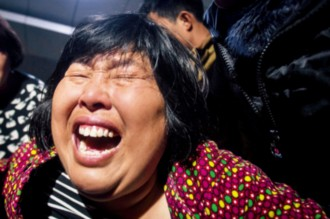
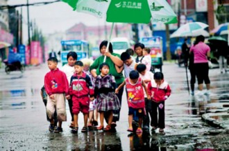

# 厉害女士（《人物》二月号推荐文章）

火灾后，袁厉害因突发高血压病倒住院，一度陷入昏迷。（摄影卢广等）

袁厉害（摄影卢广等）

袁厉害（摄影卢广等）

来自河南省兰考县农村的袁厉害女士，近期频繁出现在媒体与公众视野里。导火索是1月4日一场突如其来的火灾，她所收养的7个孩子在自家居住的房子里丧生。袁厉害成名已久，她的成名依赖于24年来她收养了超过100名弃婴。多年来，当地政府与媒体将她打造为一个典型的“中国式好人”——高尚、善良、无私、贫穷而生活悲惨，秉持着常人难以想象的道德标准，并不惜牺牲自己。 但经过《人物》记者7天的实地观察和调查，我们得到许多与此前描述互相矛盾甚至完全相反的事实： 在此前宣传中，袁厉害对她收养的100多个孩子一视同仁，关怀备至，视若己出。 事实是，这些年，袁厉害的孩子以残疾程度和相貌，被她分为几等。“头等”孩子得以享受最好的照顾，而最需要照顾的下等孩子，一度同垃圾、苍蝇、大小便挤在一起艰难求生。 此前，袁厉害对外承认的经济来源仅为20个孤儿的低保，并多次公开宣称没有一分钱存款。 事实是，袁厉害做生意的名声在兰考几乎人尽皆知，所涉面之广，覆盖修路、圈地、盖楼、讨债、协调纠纷等领域。在一栋刚被拆除的非法民用建筑里，袁厉害就投资了45万元。 此前，袁厉害对许多媒体宣称其没有房产。 事实是，据不完全统计，袁厉害为自己和家人在兰考自建或购买多处房产，保守估算超过20套住宅。 此前，在媒体宣传中，她深受当地百姓爱戴，人们为她感动并赠予其“焦裕禄第二”称号。 事实是，面对《人物》记者采访，许多当地民众讳莫如深，闭口不谈，也有一些人对她感觉复杂，甚至颇有非议。 此前，在外界舆论中她被置于当地政府的对立面，作为制度空白与官员渎职的受害者出现。对她的同情，加剧了人们对当地政府的反感与憎恨。 事实是，她和当地民政局、公安局、土地局、计生办等政府部门都存在不言而明的互助默契。这种默契甚至成为她财富积累的重要路径。 一方面，这个农村妇女缺少教育（小学一年级辍学），性格急躁、泼辣，有着朴素与善良的动机，另一方面，她精明、警惕、狡猾、心思缜密，自我保护欲望强烈。她熟悉明里暗里的各种规则，甚至是掌控媒体心理的好手，多数时候都能取得采访者信任，达成自身目的，并巧妙隐藏秘密。 做到这一切，袁厉害靠的是催生她的社会土壤与时代特征，是中国传统农村的宗法人情社会里翻滚半生的经验，和她性子里也许与生俱来的“厉害”。 **等级** 在袁厉害眼中，收养的孩子们被分为几个等级。最好的孩子多数曾为兔唇、心脏病患儿，成功接受过国家免费手术，目前与健康孩子无异。心脏病患儿更受青睐，因为他们看不出外在疤痕。袁厉害喜欢“漂亮孩子”。她收养有一对大眼睛、鹅蛋脸的双胞胎姐妹，为表重视，袁厉害让出一套铁皮房给“识字、能辅导文化”的表妹住，让她专门在此看护这对姐妹花。 为了防止被福利院带走，袁厉害像藏宝一样藏匿这些最好的孩子。她的策略是分散、隐蔽加上相对好的生活条件，经过筛选，孩子被分别送至儿子家、表妹家、姐姐家和360公里外“更安全”的河北农村。在那里，他们将得到袁厉害能够提供的最好照顾，秘不见人，也不允许抱养，除了身边最亲近的人，很少有人知道这些孩子的存在。 对那些被袁厉害分入“孬”类的孩子来说，生活的全部内容就是“活着”。他们患有重度脑瘫、重度小儿麻痹症或者重度白化病，连续多年住在兰考县人民医院附近一处名为“花园”的棚屋里，直到“花园”因为侵占他人土地被拆除。陪伴他们的，是苍蝇、虫子、流浪猫狗和屋旁高高的垃圾堆。曾多次到“花园”采访的前《大河报》记者林远（化名）说，他们两三个月也见不到一次“妈妈”，被长期冷落遗忘，甚至自生自灭。 有些时候他们也会被记起——被送给前来上门抱养孩子的陌生人，或是塞给前来要孩子的福利院，以及在媒体采访和好心人捐助时，展示“苦难而坚强的生活”。百度贴吧网友“可米秋”曾经见过，袁厉害拿条毛巾给脏孩子洗澡，她注意到当天有外地牌照车辆停在袁厉害家门口，“原来让他们去洗澡是又有人来捐款了”。她说。65岁的庞桂云曾不止一次想从袁厉害这里收养一个孩子，却苦于“实在挑不出来”，她看到孩子们的头油粘在床上弄不下来，在床上随意大小便，袁厉害从满床孩子里挑一个出来洗洗干净，擦巴擦巴递给她。 由于生存环境恶劣，得不到及时救治，“孬”孩子的死亡率最高。摄影师卢广目睹过“花园”的男保姆孔大爷将死去的婴儿套上塑料袋，扔进垃圾桶。 那些“不好不孬”的孩子，通常与袁厉害住在一起，被袁厉害带着洗澡、坐车、上学，或者就是在大街上闲逛，非常显眼。他们多数有着轻度残疾、白化病、兔唇，或者轻微小儿麻痹。采访中，很多人见过他们说脏话，打架，或者抢东西。一名曾经送月饼给孩子的记者看到，为了一块月饼，几个孩子大打出手。 其貌不扬的孩子想获得袁厉害的格外眷顾，有两种途径：其一是与袁厉害投脾气，如被称为“小厉害”的袁园是白化病孩子，也不算漂亮，但她刁蛮、霸道、脾气火暴，和袁厉害很像，深得其心；其二是勤做家务照顾弟妹，如袁金茹。她刚12岁，读小学六年级，有知情者称，常看到她洗一屋子弟弟妹妹的衣服。 袁厉害对《人物》记者承认，不认识的人（无论家庭条件好坏）想抱养孩子，只被允许在“孬”孩子里挑选。对她“有恩”的人或邻居朋友，可以在“不好不孬”的孩子里挑选。她不允许自己的孩子和别的孩子玩，别的孩子看到他们总是浩浩荡荡一大帮，也敬而远之。她的孩子们虽生活在社会中，却形同与世隔绝。 现在帮袁厉害照顾孩子的人，薪水为0。他们通常是当地老人，共同的特点是年事已高、无所事事、膝下无子。袁厉害有的是孩子。她送给他们“孙子”或者“孙女”并供其奶粉，他们以劳动作为回报。由于生活困窘，他们多数还从事其他兼职工作。 林远很难忘记在大火中死去的袁申，他曾是“花园”里最大的孩子，也是“孬”孩子们事实上的管家、厨师和家长。兼有轻度脑瘫和小儿麻痹的袁申，每天为十几个脑瘫、智障、小儿麻痹的孩子做点稀萝卜汤，煮几根玉米。林远问过袁申，这么辛苦，为什么还要跟着袁妈妈，袁申一字一顿地回答：“跟，着，袁，厉，害，有，饭，吃。” **战争** 1989年，从医院抱回第一个弃婴时，袁厉害显然没想过这么多。那时她是一个在医院门口摆摊的小贩，心肠软，“娃要死了你还能不管？”性子又烈，“家里谁也管不了我！”她不忍心一个孩子死，靠她活的孩子越来越多。养女盼乐曾对《人物》记者回忆，早年家里穷到上街讨饭，袁厉害要到馒头，总是先尽着孩子们吃，孩子生病她去拿药，自己病了却不舍得看。 1993年是袁厉害转变的关键节点：她听说邻近的开封有个地方叫福利院，专门养没人要的孩子，她养活十几个孩子，不堪重负，意识到自己必须做出选择，留下谁和送走谁。原来一视同仁的孩子，在她眼中第一次有了层级分别——她送走了3个“孬孩子”。因为国家补贴太低，福利院不愿收孩子，双方破口大骂。她把孩子丢下就跑，为了不被福利院的工作人员追上，她被迫坐了人生中唯一一次出租车。 袁厉害反复把这个故事的各种细节生动地描述给各家媒体。只是讲得太多了，有时候讲成“出租车”，有时候又讲成了“三轮车”。 这显然不是一次愉快的回忆，1993年后，她13年没再招惹过福利院。不过，随着国家政策风向的变化，她和福利院像两个存在领土纷争的邻国一样战事不断。 2006年，她渐渐出名，孩子的数量也达到了三四十个，当地一家电视台的记者提出，带着袁厉害去福利院送孩子，她就跟着记者去了。“他们照样不收！”袁厉害恨恨地说。 2008年，袁厉害收养孩子的人数已经超过开封福利院。福利院院长有一日突然找上门来，提出拉走全部孩子，“不分孬好都要”，“还又是请客吃饭又是给我买东西”，袁厉害后来才知道，“是国家的政策好了”。 政策指的是2008年9月5日民政部、国家人口计生委等五部委下发《关于解决国内公民私自收养子女有关问题的通知》（民发〔2008〕132号文件），依据这一文件，福利院每个孩子每月可以获得1000元国家拨款。 为了应对这场旷日持久的战事，她不得不事先做出判断：最好的孩子藏起来，最孬的孩子可以随时送走，不好不孬的孩子最好能够留下，实在没办法的情况下也只好送走。袁厉害“藏好留中放任孬”的分层管理日渐秩序井然，她恩威并施，孩子们要么因为爱她而拥护她，要么因为生存而追随她。 袁厉害近乎文盲，她手上有20个低保名额，却一时想不出20个正常名字，就把孩子们取名“袁哑巴”或者“袁瞎子”。如果有孩子死了或者离开，就会有孩子自动接替这个名字。随便是谁，重要的是能接着拿低保。 袁厉害自称，自己至今还欠着某超市几百块钱奶粉钱，2011年，她还告诉想帮助她的一个东莞企业家，孩子们3个人盖一条被子，希望他能捐一些棉被。这些信息用以佐证孩子们生活条件的恶劣。她对此的解释是：“没钱，精力也不够。” **财产** 袁厉害到底有多少钱？连与她最亲密的长子杜鹏也说不清楚。但袁厉害向《人物》记者承认，她为自己和家人自建或购买过6处房产，累计超过20套住宅，另有2间店铺、3处铁皮房，还有两块土地。 第一处被称为南院，是起火之地，分为上下两层，共四居室。几年前，兰考县人民医院扩建急诊室，袁家用了8间简易门面房换来了该房子。 第二处为杜鹏家（北院），为一套带院子的5层楼，杜鹏住在一层。对这套房子，袁厉害的版本为“2011年花了近10万买的”，杜鹏的版本为“地皮本来就是袁家的，袁家用地皮换了一层楼”，而一位与袁家关系亲密的知情人称，“整个5层高小楼都属于袁家，是袁家买地皮自己盖的”。 第三处为南院北院之间的6层高2单元居民楼，下有地下室。袁厉害称，她用一个企业家老板捐的10万元钱买下了该居民楼的第6层，要给收养的孩子住。房子已经建成半年多，但袁厉害始终没有装修，孩子们当然也没有入住。但另一不愿意透露姓名的知情人称，这栋房子为袁厉害出资、别人出地合伙入股建成，袁家占有半栋楼，不含地下室共6套住宅。 第四处为小儿子杜鸣的婚房。杜鸣向《人物》记者透露，他新婚时，母亲给了一套三室一厅的房子，价值10多万元。 第五处为杜鸣的养母住的房子——因为袁厉害养子太多照顾不过来，杜鸣出生不久，就交由养父母代养。这位养母告诉《人物》记者，老两口从河北邢台来到兰考后，住的房子也是袁厉害“让大队为他们盖的”。 第六处为一栋7层高、面积3600平方米、造价300万的住宅楼盘，在离袁家1公里的许贡庄村入口处，建于2012年6月。同月，该楼作为违章建筑被强行拆除。 楼盘的废墟，横在开封方向往兰考县城的必经之路上。1月14日晚7点左右，《人物》记者和袁厉害弟弟袁九星，以及袁厉害多年好友、兰考计生办主任王丽兰开车经过此地，天黑雾霾大，车子颠簸，接近此处，沉闷一路的王丽兰情绪突然高涨，她一把拍醒快要睡着的记者，再三示意记者向外看，“赔了一百多万啊。”她说。 随后，王丽兰承认，自己和袁厉害都是“楼盘主人”。袁厉害以股东身份投资参与该楼盘，按照当时签订的协议，该楼为4家所有。其中，杨姓村民以地皮入股占一份，其他还有3份预计每人投资90多万。而袁厉害和王丽兰合为一份，袁厉害占有该楼盘12.5%的股份，先期投资了45万元现金。 除此之外，袁厉害还有2个铁皮房出租给别人，另一处铁皮房安置养女双胞胎姐妹。在兰考县人民医院大门口的南北侧，她还分别经营了一个米线饭馆和副食摊位。 袁厉害否认她的财富积累与捐款有关，她说自己没有账本，捐款都随捐随花到孩子身上了。一个企业家捐的10万是最大的一笔，其次是《大河报》的“大河之爱”基金2万，其他“都是小钱”。 谈到与钱有关的话题，袁厉害的回答常常前后矛盾，例如，照顾孩子究竟需要多少开销，袁厉害就公开说过多个版本。她告诉《人物》记者，没多少开销，衣服都有，就管口饭吃。此前，她对许多媒体的说法是，平均每个孩子每月四五百，光奶粉钱一个月就五六千。这个数字被许多媒体转引。 每当有媒体质疑她的经济状况，或者用她那些前后矛盾的话询问她，她难以自圆其说，会突然嚎啕大哭起来，或者对天赌咒“一头碰死”，有时候干脆血压升高、昏厥过去。 **神通** 一位老邻居用“神通广大”来形容现在的袁厉害，她涉足的生意包括修路、圈地、房地产、替人讨债、协调纠纷并从中抽成，她的财富积累也主要来自于此。 半个世纪来，兰考一直生活在“道德楷模县”光环的笼罩之下，这里出过焦裕禄，从毛泽东时代起，每一代党和国家领导人都会莅临兰考，并分别做出“大力弘扬焦裕禄精神”的批示。 同时，兰考保存着几百年来传统中国社会的风俗，做生意不找公司或者律所，而是找一位德高望重的“中间人”。兰考人相信，有这位“中间人”在，生意的诚信就可以保障。 2005年，河南省发行量最大的报纸《大河报》报道了袁厉害收养弃婴的故事，这篇报道给她带来了极高的声望。一时间，兰考无人不识袁厉害，袁厉害也乐于谈论报道发表后流传的说法—“焦裕禄第一，袁厉害第二”。 随着报道增多，袁厉害的声望像滚雪球越来越大，使她成为一个天然的“中间人”，加上她聪明、仗义、办事麻利，和一些政府部门又有“交情”，很快跻身为这个行业中的佼佼者。她曾告诉媒体：“县里三条路都是我带领修的。别人5000，我只要3000。” 政府部门对袁厉害的依赖与信任，也是她一步步走到了今天这个位置的幕后推手。 帮袁厉害办下20个低保名额的民政局救助股原股长冯杰，曾在媒体质疑袁厉害非法收养时，为她进行过委婉的辩护，“兰考到现在都还是国家级贫困县，几十年一直没有能力建社会福利机构，开封市福利院又拒绝接收，我们只能默许袁厉害继续养育这些弃婴，并尽力给予物资帮助”。 多年来，医院、公安局、民政局等部门不断地往袁厉害处送弃婴，她也借此与这些部门达成了一种不言自明的默契。2011年，曾有记者目睹过袁厉害办送养手续的全过程。从民政局开具《弃婴捡拾证明》，到找110警察确认，再到城关镇派出所进行信息采集，给证明信盖公章，一路绿灯，办完这套程序只需两三个小时。 袁厉害并不忌讳谈论她的“社会活动能力”，她和孩子们看病、拿药多数时候不花钱，她也向《人物》记者承认，自己能“动用社会关系”给无证土地办土地证、给超生的父母办准生证、上户口，或者把扣押的违章车辆捞出来，办这些事都可以收钱。 兰考很小，坐当地最主要的交通工具三轮车，5元钱能去往县城的绝大部分角落。这里没有什么秘密，三轮车夫们能说出这个县城大部分房子是谁家盖的，地是谁家的，谁有钱，谁混蛋，谁和谁关系特别好。 兰考没有什么规划可言，它匪夷所思地混搭了半个世纪来中国城市、县城、农村能见到的几乎所有建筑形态，相邻的房子往往颜色、形状、层高均不同，甚至不在一条水平线上，常常一座看上去现代化的全落地窗高档住宅楼，紧邻着一个石棉瓦尖顶平房。“只要你有地，你想咋盖咋盖。”袁厉害的一位老邻居说。 如今很多时候，收养的孩子成为袁厉害用来办事或牟利的工具。听说哪儿有无主土地，她就率领“童子军”前往占领，搭个铁皮屋棚“火线入主”，以造成土地归其所有的既成事实。一名县民政局工作人员也曾对媒体透露，袁厉害借孩子向政府提条件，一旦不满足就让孩子在办公室拉屎撒尿，“大家都怕她”。 火灾之后，兰考城里弥漫着一种诡异的沉默。记者随机采访路人，对袁厉害三个字大多讳莫如深，有知情人提醒，当地人已被封口。焦裕禄陵园中，一对打扮“洋气”、本地口音的老太太听到记者问袁厉害，马上说，“我们都是农村来进城玩的，我们啥也不知道”。而在“花园”旧址，做花鸟营生的老邻居对记者撒谎道：“袁厉害天天都在，孩子吃得很好，过得也很好，没有条件差，我一直都看着他们长大。” 不过，在百度贴吧兰考吧上，兰考网友多多少少透露了他们的不满，一时间本地网友和外地网友骂架频频，外地人大多为袁厉害树碑立传，而本地人则对外地人“不知实情”嗤之以鼻。 这些年里，袁厉害是袁家上下四代人的核心，或者说经济支柱。女婿郭海洋略有遗憾地告诉记者，她至今不肯让儿子、女儿、女婿参与她的生意，长子杜鹏已经是3个孩子的爹，不与母亲同住，但月月工资都要上缴由袁厉害再分配。杜鹏并不觉得这有什么不妥。 对自家的经济状况，袁家成员掌握的信息不尽相同，根据他们和袁厉害关系的近远亲疏，依次递减。被认为是袁厉害接班人的长子杜鹏，知道母亲“做些生意，但挣的都是小钱”；次子杜鸣知道家里至少有4套房子，也不清楚具体数目；女婿郭海洋认为，袁厉害“被人利用”，“那些传说和我妈有关的楼，都是人家顶着她的旗号搞的”。而且，他们每个人都相信，自己知道的是全部。 衣衫褴褛的袁厉害带着她衣衫褴褛的孩子们走在大马路上，就像一支巡城的队伍。这一度是兰考的一道奇景，但在一场火灾之后，如今已不复存在。 **病人** 2011年底，袁厉害将“孬”孩子从“花园”搬入南院，对外口径为改善孩子生活环境，而真实的原因之一是，当时袁厉害和别人争“花园”的土地失败，袁厉害和孩子们被轰出来。 1月4日上午8点多，南院突然起火，很快蔓延到上下两层楼，屋里8个孩子，只有10岁的袁小十逃生，火灾的真正原因至今不明。 失火时，袁厉害并不像她此前向其他媒体表述的那样送孩子上学，而是正在县土地局和村民赵二争夺一处无主荒地的所有权。 失火后，福利院到袁厉害家，拉走了家里剩下的11个孩子。袁厉害也突发高血压住院。袁家上下不再工作，十几口人日日守在病床前。袁家人每天上网搜索关于袁厉害的最新报道，对身份可疑的访客随时打开DV和录音笔。 在《人物》记者采访的一周里，慕名来捐款捐物的人一天最多有十几拨。袁厉害总会一边亲昵地喊着“弟弟”“妹妹”“大哥”“大姐”，一边用两只粗大的手紧紧钳住对方：“心意收下，钱你拿走。孩子都没了，我不要钱！” 推诿几句后，她收下了其中的一部分，并熟练地让在旁记者记下好人名字，“多宣传宣传”。来人走后，她会费力弓起身子，让儿媳妇从她屁股底下把钱摸出来，数数有多少。 这一周里，有近百家媒体的记者来到这里。袁厉害很愿意谈她抱着一名央视著名女主持人哭了5分钟的感人故事。而面对大部分媒体都会提到的质疑，袁厉害几乎每一次都要拿命赌咒，“要是我（送小孩）收钱了，就枪毙了我！”“我有一分钱存款，我一头碰死！”有时还会流下泪水。而大多数记者们也似乎被她说服，不再继续追问。 大火至今，案件还在审理，包括冯杰在内的兰考县6名官员落马。这些官员此前与袁厉害关系都不错，她有些为他们抱不平，“下来的都是些小官，有的帮过我，就算没帮过，我去找他们也都听我说话”。 与此同时，各大网络论坛中，推举袁厉害为“感动中国”候选人的声援帖声势越来越大。截至记者发稿时，“天涯论坛”的声援帖有248条回复，帖中写到袁厉害“比雷锋更让人感动，比焦裕禄更加伟大”，“不是凡人，而是活菩萨”。 1月12日，“袁氏宗亲会”专程从湖南赶来医院，把袁厉害的名字记录在袁氏宗族的名人册上，这成为袁厉害评估自己人生的重要时刻。她直到第二天也不能平静，指着电视新闻上的教育部部长袁贵仁告诉记者，袁贵仁在宗亲谱上，“俺也在！” 少有人知的是，由于许贡庄村入口的那栋楼盘被作为违章建筑拆除，损失巨大，5个合伙人意见产生了分歧。袁家人一再重申的观点很明确：“哪怕钱都打水漂了，也不许曝光！”而大量媒体的到来让其他合伙人看到了解决问题的另一条门路，地皮主人和另外两名男性合伙人找到《人物》记者，希望通过媒体获得赔偿，挽回平均每人高达90万的损失。闻讯赶来的合伙人之一王丽兰见到记者，便开始讲述一个“好心人帮助袁厉害盖楼”的故事，编到一半，她发现之前其他合伙人已经和盘托出实情，只得离去。 家人担心的是，袁厉害真实的经济状况会影响她的形象，更何况“现在在风口浪尖上”。袁家人的口头禅是“现在绝不能提！”无论袁厉害的儿子、儿媳妇、女儿、女婿、弟弟是在喂奶，在吃饭，还是在看电视，都会冷不丁冒出一句，“不能提，现在不是时候！” 除了偶尔出门吃便饭，袁厉害的弟弟袁九星一刻不离开病床。他微蹙眉头，语气愣而急，对一切外人表现出警惕。现在，他更像袁厉害的官方发言人，除了鸡毛蒜皮的家常问题，都要代表袁厉害回答。很多时候，袁厉害有话想说，被弟弟噎了回去。好不容易趁袁九星不在，袁厉害刚开口，儿媳又自动取代了弟弟的职务——她坐在病床边，抱着孩子的胳膊肘始终抵在袁厉害腰间，随时准备在袁厉害说错话时捅一下——“妈，都说了，现在不是说这事儿的时候！” 但当家人不在身边看着时，袁厉害也会吐露一些真心话。她并非没有意识到这种角色给她带来的负担。“我又不傻，我知道很多时候就给人当条狗，可是怎么办呢，我想挣钱。”说着，她的眼眶有点红。 她从没过过一天有钱人的生活，敢挣不敢花，唯恐被骂“钱是骗低保、卖小孩来的”。她的棉袄早已破了洞，露出棉花，那是多年前，当地民政局一位局长的母亲亲手为她缝的“保护袄”，里面是一件黑白条纹衫，半年没换过，夏天当T恤冬天当秋衣。她低声说，“我不敢穿好衣服，怕人家说我”。 **（本文经《人物》杂志授权全文发布）**
