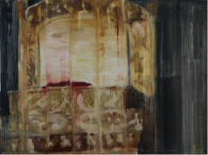
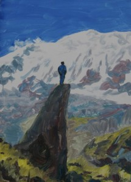
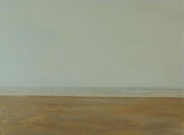

# 厚厚的阳光

** **

冬季，处在即将垂灭的末端，人被冬季的慵懒覆盖，一个宽敞的房间里，空空荡荡，潮湿的气味儿窜入鼻息，恍如隔世的客厅呈现在李枫的眼前，他穿着喇嘛戒裙，红色墩布，被烈日灼伤的脸蛋映射在后现代装饰风格的碎花玻璃上，假如说一个人风尘仆仆的从异地归家该是一件值得庆幸的事情，可是，此时，李枫悲剧的孤独的身影隔绝了庆幸。整整一年，他待在距离川藏喇荣佛学院不远的山谷中修行，他的衣服里还沾有星星点点的牦牛粪渣，柏木的火香味道沁入了皮肤一层层的灰垢里，藏地的冬季寒冷刺骨，风雪无常的摧残没有使李枫感到一丝凉意，因为那时他的内心被信仰的景象温暖着，在他的眼中到处是金刚与度母，刹土与神灵，那一座座安详平缓的藏地山川被绿色的杂草层层覆盖，夹杂在其中的荆棘与苍耳如同人性的晦暗被一片祥和的景象厚厚的淹没，一条河谷蜿蜒着穿过峰峦，光不像汉地的太阳那样爱惜自己，光肆无忌惮地的袒露出一种无畏，无所顾忌，无遮拦的冲动，在中午的时候，完全的突兀于整个寺院，山川，河流，冰雪。光把他所覆照的一切全部包揽，在藏地几乎没有黑暗，恰恰是几乎，那零零散散，谨小慎微的黑暗就尤其黑尤其暗。李枫右手撵着佛珠，将佛珠拿捏在食指与大拇指之间，用大拇指的指头肚向右缓缓有序地的碾过，一个咒语代表着息增怀诛其中的一种事业成像形成咒力，将心轮观想与上师、，佛陀融为一体，自己即是光明的谦卑的粒子，无梦想颠倒，无黑夜白昼之分，静止在满目空无的景色中安住，再安住，欲望被代谢成了善的实质，欺骗这个词汇在宗教中是有分别的。

藏地清晨的木屋，一束光从缝隙中穿过，泛着蓝色，细微的微尘与绒毛在光的影像中翩翩起舞，殆尽消散，李枫的鼻头麻木冰冷，眼看着自己的热气有力地的喷涌而出，念着祈祷文，丹田气上升与头腔共鸣，鼻腔喉轮相契合造成喁语的效果，在这个鸦雀无声的静地，浑厚的声波穿透了空间，与四壁的老柏木击打出藏地特有的唪经声，李枫此时如同彩色的经幡被山谷中的风吹动着，沉浸在自我造成的喜乐中开始了一天的欢喜，藏地人不穿裤装，裙子里一览无余，李枫套上了毛裙，线裙，内裙，再将戒裙折叠成两层，笔直的扥住，与腰部平行，折到右边屁股三分之二的位置，再用腰带麻利的系上，对襟的内衣，毛衣，墩布，披单，整个行头赋予李枫一个庄严的模样，站立在低矮的木结构屋顶下方，脚边堆放着纤细干脆的柴火和幽绿色的干牛粪，而柏木被李枫劈成了长约四十公分的精致圆木桩，靠着炉边一棵粗房柱层层排列，露水将玻璃裹上一层厚厚的水雾，爆裂，分离，凝聚成颗颗无助的水珠，顺着裂缝处滑落，消散，光愈发激烈，把稀薄的水雾片片割裂，直到无踪影，生上火的屋子，弥漫着柏木特有的香气，左手托着活佛赠送的福建瓷碗，绣着拙劣的双龙，李枫感到了加持，无上的荣耀，即便没有光，也可以想象出这个碗的珍贵，手工炒的青稞粉呈浅棕色，火炉上烹煮着大茶，待到水大沸时，倒入些许新鲜的牦牛奶，放几颗盐巴，取出像馒头似的金黄色酥油，用小刀削入奶茶中，金黄的油滴随着滚动环绕的泡沫无踪影，在藏地待了整整半年的李枫，熟练地将青稞粉抓入碗里，如同平缓的山峰微微隆起碗平面，奶茶绕着四周轻轻浇灌成环绕山川般的河流，烟气，白色的烟气泛着奶香，青稞粉的火香味窜入鼻子，右手撩拨着未曾沾上奶茶的干粉末，顺时针贴着碗边和着糌粑，待到完全饱和，吃透奶茶，碗边无残留的渣滓，双手搓揉糌粑滚入手心，手也温暖了，皮肤亦被油覆盖完全，安坐于地面，跏趺坐，暗红色的戒裙平整折于膝盖处四十五度角斜着压在脚底，手搭在膝盖上，两头受一串一百零八颗的檀木扁珠牵引，这条黑色闪着光的油珠子，被藏银与红珊瑚间隔，唯一一颗圆形的檀木珠子代表佛头，垂下来的银饰穿在污垢斑驳的黄色牛皮上，记着上万上百万的咒数，檀木珠侵入了汗水，油脂，污垢，咒力，杂念，液体，可在李枫的眼里这深沉的包浆无疑是代表着力量——信仰的力量。他开始念诵食供文，供养自己的上师，佛之刹土，六道有情，天道，阿修罗道，人道，地狱道，饿鬼道，畜生道等等无尽的众生，他的脑中反复观想出这些个陷入轮回的众生，脑子被图像填满，这些图像部分来自唐卡，书籍，图册里画的模样，变了形的由头脑呈现在幻觉里，类似卡通的样子喷着火焰，巨大的雷鸣，天上的乐土，饿鬼的颜色，假如把他脑子里的图像置于真实的空间里，那么，会是一个大笑话，大杂烩，幽默的讽刺，可是李枫几乎要想出火来的，终于升腾出一种满怀慈悲的喜乐，一种超乎寻常的大奉献，拯救了世界的得意，何止是世界，该是一个个无尽的宇宙吧，而自负是要关乎戒律的，那么李枫需要压制住自己那轻浮的心绪，自己浅薄的修行，又不能生出新的的恼怒或抱怨，这一丝的埋怨令李枫感到一时的懊悔，可是一个念了几百万，也许上千万咒语的修行者不会被如此小小的迷茫陷落的，他马上看到了光明，通体散发光的觉知，如此，他完成了这项壮举，开始吃糌粑了。

这个闭关修行的时节，整座庙宇的人都安坐在自己的屋子里诵经，荟供，布施，安住，禅修。李枫踏出院子，两只黑狗摇着尾巴跳跃着窜到他肥大的裙子边，留下了不规则的爪印，阳光夸大自己的作用，将白色的雪刷成了银色，光亮刺眼的银色，李枫眯着眼睛，弓着腰，穿过低矮的走廊，走下古老石板砌成的台阶，一条上坡的道路迫使李枫做出今日的第一个选择，向上是代表金刚手菩萨刹土的峰峦，去年法会，李枫晃晃悠悠地的爬到了临近峰顶的矮崖，忽然窜出来一只巨大的黄色牦牛拦住他的去路，并且步步紧逼，抱头鼠窜的李枫背部被汗液溻湿，自忖是因为触犯了菩萨的神灵，目前，在他见识到了小喇嘛的真知灼见后，他对于这些个无缘故的恐惧荡然无存，可是，在这个荒芜得的只能用信仰与神灵去填补空虚的圣地，崇敬的好处仿佛是天生自有的，即使当李枫从小喇嘛们的口中得知他们情欲的泛滥之后，他也没有对神有半点怠慢。

整座山谷，一座座木屋延绵着伸向了尽头，李枫一个人走在土坡朝着下面走去，漫无目的的走，走过井边，一个外出打水的爵母带着口罩，压制着自己的眼睛，因为出关的人不能看到生人，李枫镇定的走过井边，他想到前几日粉刷房屋的时候，一个小喇嘛告知他的秘密，小喇嘛露出一口雪白的牙齿，狎笑着，“你知道蒙蒙吗？她下山了，”“她下山干嘛啊？”小喇嘛撇着嘴唇右手朝着肚子画了一个弧形，继续笑着，牙齿闪着光，李枫刷着活佛家的屋子，刺鼻的油漆味儿连同这个消息一并令他头晕，“爵母该没有带胸罩吧，”李枫一闪而过的念头经常让自己惊讶,这些被修行掩盖住的念头，如同斗牛场中的困兽，稍有不慎，冲破牢笼，扑面而来，一个高深的修行者不会纠结于此念头，否则只会不停的懊悔，这一闪而过的念头自有美其名曰的名称，宗教中的大善巧在心里。

几条独木搭成的小桥下是人的粪便，苍蝇一片片的聚在上面，三头牦牛舔着人的尿液，取其中的盐巴解馋，李枫无目的地的走在房屋之间的甬道中，偶尔觑到走出门口的爵母，长久的闭关使得人眼神散发出一种扩张的性感的直视，哪怕只有一瞬，也足以令人感到压迫，刺激，而这一身红色的僧衣实在是最好的屏障，低下头或昂着头佯装空无地的直视，心里悄然灼烧欲望的火苗，高山上的彩色经幡随着风的涌动摇摆不定，因为幡上的经文以及造像使这些来自四川小作坊的红色，绿色，蓝色，黄色，白色的粗鲁料子变成了神圣的护佑，西南边的小路是通往尸陀林的快速路径，上一次李枫与葛让一起抬着木柴走过，三个月前，那时的太阳更加毒烈，中午李枫在藏经堂与僧众玩耍诵经，没多会儿，管家召集其他年长的喇嘛交集，布置经堂，下午有超度，购买贡品，制作朵玛与坛城，李枫与葛让接到一个赶往尸陀林的临时任务，葛让皮肤黟黑，身材颀长，两片通俗的高原红与其流利的汉语造就了他比其他小喇嘛更加健谈，他与李枫熟络的快，彼此成为了交心的朋友，与其说彼此，不如说是葛让愿意告诉李枫一些秘密，李枫也试探着窥探一些有趣的消息，葛让至今还有还俗的念头，他曾经与两个伙伴去过拉萨，穿着流行的牛仔裤，大约是汉地过时的装扮，他拿出一张照片得意的与李枫分享，那是在大昭寺前留的影，三个藏族少年，摆弄出台湾歌星的造型，他们觉得很帅，葛让说到帅的时候会在“帅”的读音后面加上一个“噶”，这也是川藏地区藏地独特的发音，他们绝大部分被汉化，宿舍里供着莲花生大士与上师的照片，而自己的床头却挂着台湾歌星的图片，葛让最崇拜的是一个台湾艺人，他在这位台湾艺人的照片下面挂上了一层层的七彩哈达，挂得的很高，葛让在路上告诉李枫一个秘密，他问李枫玩没玩过女人，李枫笑着点头，李枫甘愿取悦喇嘛，佛法僧是三宝，是要尊敬的，能与他们亲近是件荣幸的事情，葛让说他们三个在拉萨第一次玩女人，那次是在妓院里，五十元钱，舒服得很，舒服后面加上“噶”，“你们不怕得病吗？”“怕什么干净得的很，”葛让的手机里存着几个法会期间认识的女孩，那些远道来的姑娘与小喇嘛亲近狎昵，姑娘们同样觉得能与喇嘛亲近是荣幸的，似火的眼神令小喇嘛说出了“我爱你”，在一个夜晚，喇嘛的宿舍变成了快乐的地方，葛让说起自己一夜玩了七次，得意地的很，李枫想到他们不穿内裤的下体，在藏地温差剧烈的暴露下茁壮生长，那几位慕名朝圣的姑娘也算是饱尝的快乐了。抵达尸陀林，点燃柴火，葛让取出需要熏烧的头盖骨，放在火上烤着，葛让问李枫：“你害怕吗？相不相信有鬼，”“不害怕，鬼不会随便招惹人的，他们也很可怜，”“这里晚上冷得很，有鬼，鬼的叫声很难听，”李枫试探着问道：“你们既然相信有鬼为什么还敢玩女人啊，你出家了啊，”葛让坦然的说：“舒服啊，册陈活佛年轻时也玩女人，”李枫早有耳闻，所以没有惊讶表情，葛让继续说着：“册陈活佛年轻时玩了很多女人，他长得帅噶，昨天他开着三菱越野又停在金刚萨埵塔下的房子边上,”李枫轻声询问：“那个房子住着哪一家人？”“图嗒的房子，他们一家人都在里面，他老婆带着册陈活佛给的金项链，金耳环，”“图嗒不知道吗？”李枫显露出了一丝惊诧的神情，“知道啊，能和册陈活佛睡觉是荣耀的，呵呵，册陈活佛厉害得很，假如他生气，这个寺院都可以倒过来，他只要打个响指，”说这话时葛让嗄着嗓子郑重地的发声，李峰发现，葛让唯独诉说这些不可思议的超能力时，也可以这样说，只有他提到自己所敬畏的事情时，才会把眼睛睁大，弓着背，嘴巴向前突起，嗄着嗓子。

朝着东北方向斜着走到谷底，在两座山之间有一条浅浅的小溪窸窸窣窣流淌而下，顺着向上走，就会走到金刚亥母的修行圣地，那是一个天然的山洞，传说金刚亥母在此处修行过，通往金刚亥母山洞的山路上挂着层层叠叠的经幡，两旁翠绿的茂盛植被将天空夹成一块青蓝色，太阳的周围时而划过一条短小的彩虹，为这个神圣的地方增添了无尽的遐想，上一次法会，北京的小匡，脸长的像弯刀一样的男人，他少年时因为唆使他人错杀朋友而被关进监狱，父母费劲心思将其从牢狱放出来，送到杭州出家，他恨自己的父母，在杭州出家，香火旺的寺庙是一份肥差，他与李枫说，操着一口浓郁的京腔说起自己被富婆包保养的经历，那时的李枫惊异斐然，他完全想不到红尘也会降落于庙宇，而眼前这个桀骜不驯的青年饱尝了人生五味仍旧不改本色，冲动倔强，小匡在这个金刚亥母的圣地邂逅了一位来自日本的单亲妈妈，他爱上了这位单亲母亲，炽热的爱意把单亲母亲从颙颙的经堂中拽出来，他们一同下山，在成都的宾馆云雨一番，也许在金刚亥母的圣地他们早就开垦了一片性爱的乐土，李枫伴着记忆走到了山洞前，虔诚的礼拜，山洞里修行的师傅面色蜡黄，灰色的头发披在肩膀两侧，关于这位来自东北瑜伽士谣言更甚，几年前，瑜伽士带着一位女大学生来到这片圣地，共同落发，分别僧尼，二人同处一室，虽然谣言比山上的苍耳都要密集，但谣言也像风一样有去无回，这个冬季在山洞修行两年的瑜伽士，顶着黑风与银河，乘着与狼搏命的勇气，拿起斧头，翻过高墙，东方即将豁霍然的时间，那是最寒冷的时刻，劈向了那个与女大学生共处一室的广东管家，不了了之的谣言，在他骨折下山的事实面前消散，他如今坐在在山洞里，成就着一个磅礴的梦，极其寒冷潮湿的山洞洞口外依靠着一把板斧，山面伏着一只旱獭，一身暖软的绒毛可爱极了。

李枫用了半个小时走上金刚亥母山顶，午时的烈日将山峦下的庙宇，白塔，房屋加冕，湿寒的白烟氤氲起伏，阳光下的一切都那么易碎且脆弱，所有的建筑都像纸盒一样棱角分明，闭关中的人到了该吃午饭的时候，烟囱冒着股股白气，从西边刮来的风顺势带走原本垂直上升的烟气，河流看似缓缓地流过李枫走过的桥下，桥上的经幡向着东方招手，李枫可以清楚的看到自己院子里的两条黑狗一前一后像个蛤蟆似的晒着太阳，牦牛如同一块块大大的墨色点缀于绿草之上，西面的尸陀林一匹白马摇晃着尾巴低头吃草，鸟瞰整片山川庙宇，神秘一点点消散，人与自然在阳光下逐渐退色，如同李枫额头上的汗液，被阳光烤的荡然无存，李枫优雅地的坐定，在这块圣地之上，专注着自己将要熄灭的呼吸，眼睛如同盖在身上的棉被，一种虚无的寂寥将李枫连同周围的所有覆盖，李枫大声念着祈祷文，望着云彩在空中的把戏，淡淡地的吐出四个字：“世事如烟。” 

现在，李枫双盘坐在自家沙发上，面前的大彩电播放着久违的影像，父母偶尔驻足笑着凝视一会儿儿子的变化，总之这个居住了将近十年的家中并没有给他一丝留恋的气息，李枫终于换下僧袍，两条劈开的裤腿让他觉得露骨，晚冬的家乡更显得凋零，多数的树木散尽了叶子，零零落落的枯叶如同一个个将要灭亡的生灵，在风的催逼下无任何抗争，随时坠落地面，被人碾碎，道路两旁大片的墨绿色灌木呈现出的并不是生机，而是死亡后封存下的假象，装作繁茂的模样，挺立着，蓬勃着，凑近一看，那密集的尘土，稠密的蜘蛛网，明明是枯死的迹象，家庭无疑是温馨的，这里有依靠，有呵护，有支持，同样，这里具有猜忌，争斗，迫害，压力，人夹杂在世俗伦理的征兆中残喘，强迫自己阳光地的，明媚地的绽放，彻底的大虚伪，大谎言，李枫半年的遁归，让其濒临真实，对于他而言这是意料之外的，他去往圣地，是要脱离无望的现状，到那个描绘成刹土的地方寻找新的欲念——成佛，当他深入地的了解到现实本身，人性的满目疮痍，在真与假，美与丑，净与脏，宁与躁燥之间不再偏颇后，抵达真实，可是真实本身又是幻觉，这样的无望贯穿了他今后的认知，在家乡的日子里，他偶尔怀念着藏地的人与景，那嘹亮空灵的哼唱，深厚庄严的诵经之声，葛让的坦诚，小喇嘛雪白的牙齿，人性的坦荡，着实比汉地中的人有质感，更接近人，汉地的伦理把人之标准描绘得越清晰，人自身的内核越混沌，在约束面前，纠结的现代人混沌不堪，李枫这个没有标准，没有原则的人，不再抱有憧憬，这是谎言，李枫怎么能够成为不抱有憧憬的人呢，一个没有希望的人，怎样支撑自己度过余下的生命，爱情，是的，爱可以让一个人变得伟大，当爱情变得如同信仰一般，同样不要接近真实，看到爱情实相的人或变成亲情，或成为责任与利益附庸，那么一个把爱情变成信仰的人与一个拥有信仰的人有什么区别，李枫舍弃了信仰的幻觉后投入到新的爱情之中，遥远的爱情在叙述的时候会荡然无存，那些砰然心动的细节与盼望使得李枫重新燃烧自己的才情，此时，那被厚厚阳光覆盖的爱情转换成了抽象的诗歌，在文字之间形成节奏——

爱情的风于藏北深处的卷帘门悄悄开启，废铁生出了锈迹斑驳造就了生命之奇迹，把锈铁赋予灵魂，那是因为宗教中的领袖会轻而易举的造化出新的伟大的窣云，那些仰望蓝天的人不知疲倦地的沉湎于教理洒下的细雨，在细雨中万物生出了如同幻觉的绮丽，迤逦开阔的风景呼唤出崭新的冒着白烟的伟大，李枫在那片被一次次赋予憬然气象的净土中次次缠绵，夜晚，在蓝色，深蓝色风摆之中的李枫，搅动着星河，连同尘土都泛着星光之亮点，那一片片杂草中，木栏里几条黑狗，爬上了修行者的床边，在那层层的戒裙之下，一只冰冷的手抓住了阴茎，口里吐着热气，那是口里火气升腾的味道，性欲都冷却在屋子里，人的招摇，人的骗局，人的惨象与屋子里孤零零的佛像共同怜悯，是啊，那个木结构的房屋，舍家撇业的女人暗暗地修习佛法，一个叫做晋美的男人，不停地敲打门与女人的心，他编着歌曲，转发成彩信，女人终于感动，伦理在草原、，雪山中陷落，涤荡，两颗相依为命的心，随时坍塌，伏藏师就是魔术师，他取出佛像，宝藏，经文，转化成善知识，而魔法师转变成了利益与虚荣，李枫告别了伏藏之路在边陲的网络上遇到爱情，那个化成为信仰的女人，一副脱离宿命的仪态，将李枫拉入金刚亥母的山顶端，他不能说出“世事如烟”隽语，他的心逐渐化冻，他在爱情的启迪下开始了诗歌的节奏，终于，在即将靠近爱情的时候，宿命，无关人与景的宿命再一次将李枫推到了边际，也好，爱情悄然必然成为信仰，那光洁散发颢光的爱情，女人拥有着一切担当起爱的因果，李枫终于在夏日写下《五月的风》后与爱情会面，闪电雷鸣，风雨来袭，人在爱情面前全部焕然一新，夜晚两个相爱的人将时间凝固，冻结的时光连同黄昏的灯光一起冰封成琥珀，琥珀中的爱人混身长满黄色的斑点，心脏有力的翕合开张，爱情，爱情，爱情，爱情，即便是如同木心先生那样书写一万遍竹秀也无济于事，终究是一件傻得可爱可喜的幸事，爱情，在李枫的梦里兹兹生风，在色彩的渲染中滴落甜蜜的蔗糖，爱情又在纪德先生的豪言中愧疚，爱情又化解为无踪影的朽木，悄然然，施施然，有形与无形之间带给李枫一遍遍一次次的洗礼，那些被宿命诅咒的人，包括李枫，爱情中捡起了锄头，烈日当空的白昼，开垦着生命之乐土，其实，生命是苦痛形成的，点滴之间的喜乐冲淡了干裂无尽的黄土，李枫站在哪里，哪里都像固定的糟粕，永恒的悲剧。

归家的当晚，李枫坐在床边，靠窗的桌子上放着一碗水，水中映着吸顶灯的倒影，他不自觉的哼唱着一首自创的歌谣，带一些藏地特有的意味，长长的调子将整个人带入空旷辽远的河谷地带，一群群牦牛裹着厚厚的绒毛闲散游荡，孤独的马儿吃着夹杂人参果的青草，近处的帐篷走出一个带着两片高原红的姑娘，姑娘的笑声随着烟囱飘出的炊烟消失。夜晚的睡梦中，边陲的海滩上，一个赤身裸体的人，跏趺坐， 海水漫过脖子，两行眼泪汇入海洋，第二天，李枫没有醒来。 

 原文链接：[http://blog.renren.com/blog/255191867/884601634?bfrom=011201092#nogo ](http://blog.renren.com/blog/255191867/884601634?bfrom=011201092#nogo )

（采编：刘铮；责编：刘铮）
