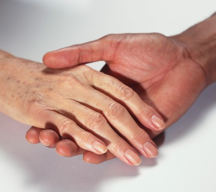
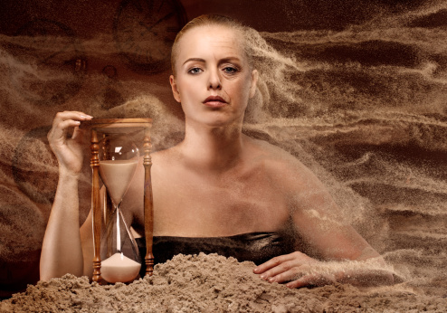

# 去英国旅行的妈妈

她是我妈。五年前，她把我送到欧洲去读书；五年后我毕业的时候，我在英国，她要来看我。

我开始不太赞成。大老远的跑来干嘛呢？她不会讲英文，做什么事都要我在身边。何况英国真的没有什么好玩的。结果她还是来了。

我去接她的飞机，她一身冲锋衣，背个小书包，拖着一个拉杆箱。在西斯罗机场中，稍显土气。

和许多妈妈一样，她到英国面临着很多的不习惯。而她的这些不习惯，也让我无所适从。比如，她会在店里试衣服的时候，大声用中文跟店员讲那衣服的尺码如何不准，自己原来体型很棒等等。而我只好在一旁飞速的挑重点翻译，最终告诉人家，我们再去别的地方逛逛好了。作为留学生，我平时很少去餐馆，就算去，也只对几家中餐熟悉。我带她去吃中餐，她吃的不开心：这东西国内一半价钱就吃得到，你带我吃这个干嘛？于是我从网上查了几家评价不错的西餐小馆，进去之后她又读不懂菜单。我给她从头到尾翻译菜单，通常是翻后面几道菜的时候，她把前面的给忘记了。最后还是胡乱点了一个，上来乱七八糟什么吃掉了，回头还是埋怨我，说不了解的地方就敢来，西餐也没什么好吃嘛。我跟她解释，说这是网上评价很高的地方，她教育我说，网上的东西不能随便信。虽然从来都不是一个小气的人，可她却习惯于在每一个价格后面加一个零，换成人民币，然后嘟囔一句：好贵啊。她会嫌弃外国人办事效率低，说结账了半天不来，一个劲的让我催促。她会嫌弃外国旅馆的条件不好。钱没少花，却怎么连个拖鞋都没有。她特别喜欢小孩子，看见“洋娃娃”总喜欢用中国人的方式逗人家。但我总觉得，那样似乎不太礼貌。她喜欢照相，随时随地的，会摆出各种造型，而且对相片的质量要求非常高，人的大小，景物的高低，都不能马虎。有时候为了照好一张相片不惜浪费很长时间。

有的时候，她让人哭笑不得。因为不会说英文，所以她特别愿意主动和一路上遇见的中国人，尤其是留学生聊天——这让我很不习惯。留学生们和她聊了一会之后，总会对我说一句：能带着妈妈出来玩，羡慕死我们了。如果说这话的是姑娘，她就会事后冲着我自豪的说：看，人家都羡慕你呢。仿佛是她帮我在姑娘面前加了分似的。

有的时候，她让人觉得很无奈。她会跑进化妆品店，开心的对外国化妆品行业做一番了解，虽然她很少化妆。我们的购物方式有冲突。这么多年独自在外，我习惯的是缺啥少啥径直走过去，拿了结账。而她习惯的是国内有人陪伴的购物体验，对于英国店员总是站在一旁让你自己看来看去觉得很不理解。她总是拿起她感兴趣的东西，让我在外包装上找出原料，原产地，生产日期。她会问我这东西是否适合她的年龄，而我一个男生，对化妆品着实不了解。我虽然日常英语还ok，但隔行如隔山，就算叫来店员，化妆品方面的问题也经常是所问非所答。

有的时候，她让人很心烦。她有着所有女人的敏感和不信任。尽管从来没来过，地图也不在她手中，但她总是要对我所走的路线提出质疑。我在和别人交流的时候，比如问路，买票，结账的时候，她总是在一旁不停的提醒我，钱要点好，不要被骗，票据要清楚，收据要留好等等。我在同人家英文交涉的时候，还要腾出一个耳朵来听她喋喋不休的中文。

终于有一次，好像是因为办退税，我们出现了分歧。我终于沉不住气了。我带着她走到海德公园，找了个长椅坐了下来，对她说，我累了，想歇一歇。她知道我不开心，倒也不急，坐在旁边，自己拿出那本Lonely Planet《英国》慢慢看起来。那是一本又厚又重的书，却是她一路上唯一的一本中文书，已经被她翻了好几遍。有时候我在火车上睡醒了，看她不是在翻那本书，就是在看着窗外。

过了一会，她轻轻的点点我，像个孩子一样对我说：

我想上厕所。

我叹了口气，把她带到附近的一个公厕，帮她投了50p，看着她走进去。等她出来，我又带她回到了那条长椅。

好像过了好久，她都没有说话。我回头看看她，她脸色很不好。

我想你爸了。她突然说了一句。

我忽然意识到自己做了一件多么可怕的事情。独自生活的五年早已经让我忘记了刚踏上这片土地的恐慌。我很自然的认为，我知道的事情，所有人都应该知道。除了 “English，NO”之外，她几乎不讲一句英文，更是一个字也听不懂。仿佛身穿一件厚厚的潜水钟，而我是连接她与外界的唯一通道。虽然每天都和她在一起，但我走在街上可以听懂路人的议论，看懂公交车上的广告牌。而她的一切，除了我，只有那本《英国》。

我隐约的记起，在我刚踏上欧洲土地的时候，也曾因为外文不熟，说话常常跳中文；也曾经因为在餐馆聊天声音大，引得邻桌频频侧目；也曾吃不惯那血淋淋的牛排和苦兮兮的咖啡；也曾将所有的价格乘以汇率，然后畏首畏尾的花钱；也曾向“洋娃娃”抛过媚眼，而被他们父母投回善意的微笑；也曾随身带着相机，在别人的目光中留影纪念。

中西方的环境相差如此之大，我怎么可以期待她在几天之内就做到我几年才领悟的东西？她敢于从自己熟悉的中文世界自己买张机票跑到万里之外的英国，就是因为我在这里，我是她的信心。

她确实愿意和遇见的中国人聊天，但往往都聊得很投机。很多人甚至和她互留邮件，约定回国联系。她确实喜欢通过我和外国人问这问那，但也说出一些比我有深度得多的观点让外国人惊诧。我们甚至遇到一位老教授，为了听我妈妈讲中国请我们吃了一顿不菲的晚餐。她确实做事很小心，可这是她一贯的作风，而我也因为保留了结账的票据，在稍后发生的事情上大大受益。她虽不会英文，却倾其所有，让我得到最好的教育。

我站起来，拉起她的手，对她说，咱们走吧。

去哪？

白金汉宫。

那是哪？

是英国女王住的地方。

她打开她的小书包，拿出那本《英国》， 嘴中念着“白……白……白……”打算找白金汉宫的介绍。我把书接过来，翻到了那一页，开始边走，边给她念：“白金汉宫，是位于英国威斯敏斯特城内……”

一段念下来，她似听非听，眼睛看着远方。

听了么？

嗯。

看什么呢？

她指着天边，对我说：

你看那边的天好低啊，云彩好像伸手就能够到。

初秋的伦敦有些潮湿，温暖的太阳晒出落叶腐败的味道。我越过她的头顶向她指的方向看去，才发现，原来五年没有和她并肩走过，她竟然矮了那么多。

和她在英国的旅行已经过去了两个月。我们已经回到了国内，而她也回到了自己熟悉的环境，每天依旧忙叨叨忙叨叨的赶场子上课，满意于饭店里服务员的速度，购物的时候被店员尾随着，随时问这问那。就好像那一个月的英国之旅从没发生过一样。只是偶尔，吃过晚饭，她会对我和我爸说，她有时候会恍惚的想起她在英国牵着我的衣角跟在我后面什么都不用愁的走着，那感觉真棒——

我也记得那感觉，那年我四岁。

 原文链接：[http://www.douban.com/note/248756825/](http://www.douban.com/note/248756825/)  

（荐稿人：佛冉；采编：姚昕毅；责编：姚昕毅）

 
