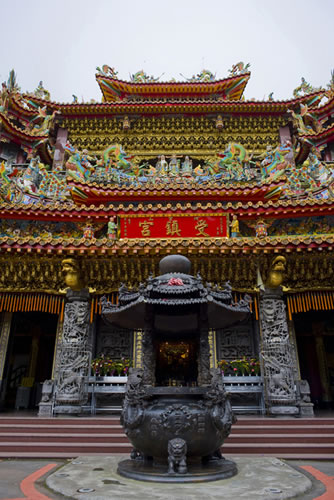
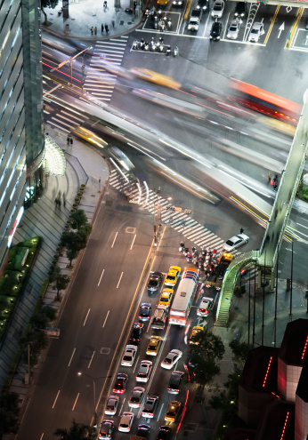

# 台北不是我的家

**台北不是我的家，我的家鄉沒有總統辯論，沒有全民開講，沒有全民最大黨。台北不是我的家，台北沒有煎餅果子，沒有南方週末，沒有郭德綱和王自健。台灣只是一個普通的地方，不管是欣喜過望，還是大失所望，都是我們的錯。不管我們對這個地方之前有多少的嚮往和憧憬，我們都是過客，不是歸人。**  

# 台北不是我的家

## 文/马军（国立台北大学）

 

台灣，對於像我這種在大陸的“憤青”來說，存在著一種類似鄉愁的東西。09年6月8號，我即將大學畢業的時候，曾經寫下這麼一段文字：

“我上辈子是台湾人，我经常这么说。

如果说我心里有一片海，我可以去青岛读海洋大学，可以去大连读海事大学，可以去秦皇岛读燕山大学。然而我还是来厦门了，因为这片海，叫做台湾海峡。

和所有厦大学生一样，我经常站在白城，只是我看到的不是海，而是台湾。我惊讶于对岸的中国人能够有如此多的热情投入到自我的管理，而我这边，却充斥的形形色色的假道义和二狗子。也许只有在那边，才能找到我今生存在的意义。

于是我考厦大台湾研究院，然而没考上，不知道是不是老天在考验我。

两岸以后会走到哪，我不知道；台湾会在我生命里留下什么印记，我不知道。

我只知道，台湾之于我，是蓝色的玫瑰花，这朵花我读了四年，才开始读懂。”

說實在的，阿裡山日月潭太魯閣，台劇台妹檳榔西施，這些東西對我的吸引，遠不如各種選舉call-in節目來得更深刻和直接。我們在大陸，每天期盼的事情，在台灣，那個我們從小被灌輸為“神聖不可分割的一部份”的寶島，已經確確實實地成為了現實。在台灣，領導人不再是高高在上的作威作福，而是要到市場巷弄里和每一個民眾握手鞠躬；新聞也不是每天報喜不報憂的光榮偉大正確，而是不厭其煩地對政治人物各種冷嘲熱諷。人總是把有好感的任何事物想像成完美。於是乎，像我這些沒去過台灣的人，對台灣便有了如此的想像：那邊民主成熟，法制健全，人民安居樂業，官員度日如年。

從小處說，有不在少數的大陸人知道“全民最大黨”；從大處講，民國熱，整整在知識文化界熱了一年。去對岸看一看，成了不少人的夢想。生活家們想去體驗一下偶像劇里的生活，而像我這種偽思考者，便處心積慮地給自己找一點來台灣的深刻的理由，於是，11年9月4號，飛機起飛前半小時，我在北京機場寫下了以下的文字：

“現在的中國，嚴格意義上，現在的大陸，是否病了，病成什麼樣子，病到什麽程度，明眼人一看，便知是不言而喻的事情。然而健康的中國應該是什麼樣子，恢復到什麼樣子才算健康，我想，對岸應該給出了樣子，每一個到過對岸的人，內心都會將在那個島的感悟作為衡量自身社會的一個標尺。那麼好了，我們知道自己病了，也知道健康的自己應該是什麼樣子，那便只剩了一個問題：怎麼將自己治愈成健康的樣子。

我想，此去求學兩年最大的意義便清晰得很了：去尋找藥方！我內心的聲音這麼告訴我，即便我知道，歷史上無數的知識份子都曾因此將人生過得無比悲劇。然而，在登機之前，我還是想用胡適的一句話為這篇文章結尾：等我回來，一切都會不一樣了。”

然而，不等我回來，剛到台灣，一切都變得不一樣了。從遠遠圍觀，到身臨其境，新鮮感豐富得很，失落感也直面而來。這個地方，和我們想像的，並不完全一樣。和想像的一樣的是，在這裡，捷運里整潔有秩序，公交車司機禮貌熱情，滿大街亮眼的台客台妹。但是，原以為政治熱情高於我們的台灣人，對大選的關注，卻遠不及我們這群外人；原以為呼風喚雨的媒體，本是強力的第四權力，來了之後卻發現，台灣媒體的新聞報導，往往幼稚得讓人噴飯。再說硬件兒，號稱全城wifi的台北，其實並非那麼方便，而手機費率甚至比大陸還要昂貴；傳說中繁華的台北東區，鋼筋水泥的密度，也遠不及北京上海。至於台灣人引以為豪的夜市文化，也實則是千篇一律，不管哪個夜市，基本上也都是米線雞排蚵仔煎，珍珠奶茶芒果冰，千篇一律得很。

像極了追隨了多年的電視劇，終於看到最後一集的時候，竟然得到一個和自己不一樣的全劇終。這難免不讓人失望，也更讓人思考。畢竟，是我們這些外人，突然走進了他們的生活。台灣人對生活的感覺如何，對政治的熱情高低，對媒體的關注程度，與我們都是無關的。如果我們對這些現象還有自己的微詞，那祇能說，是我們的心態出了問題。我們都以為來到民國是來到了自己的前朝，卻不知，現在的民國，已經變成了自己的鄰居。我們要做好當客人的準備，甚至，當外人的準備。

台北不是我的家，我的家鄉沒有總統辯論，沒有全民開講，沒有全民最大黨。台北不是我的家，台北沒有煎餅果子，沒有南方週末，沒有郭德綱和王自健。台灣只是一個普通的地方，不管是欣喜過望，還是大失所望，都是我們的錯。不管我們對這個地方之前有多少的嚮往和憧憬，我們都是過客，不是歸人。所以，我把原本是想一頭扎進這個地方的心態，現在換成近距離圍觀，心情便好得多，看東西，也清楚得多了。

 

（采编：佛冉 责编：黄理罡）

