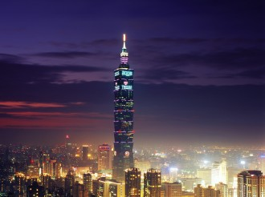
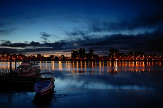
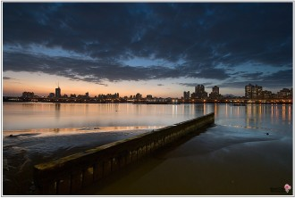

# 台灣——一席流動的盛宴

海明威在《A movable feast》中，將巴黎比作成一場流動的盛宴。

我很幸運，幸運的並不是像海明威筆下的那樣，年輕的時候有幸居住在巴黎。而是說，此刻的台北於我而言，也如一場流動的盛宴。

如何去觀這場盛宴，如果你以一個胃的角度來審視這座城市，那麼她已經徹底成了一場饕餮盛宴。你只需站在原地，走走逛逛。從前那些只存在於偶像劇與食字路口中的美食，全部都躍然眼前。你要做的，只是一個容量足夠大的胃與一個不是選擇恐懼症的心。

畢竟這裡是亞洲第一大小吃城。

整個城市躺著的。

我最初知道這個榜單，是因為西安也被評選為亞洲第二大小吃城。於是當我飛來台北的那天，友人跟我講，你看你這個2013年，坐擁亞洲十佳小吃城top2。你拿什麼減肥？

於是近年來，來台旅行的名義除了文化之旅，文藝之旅，浪漫之旅，又多了一個新名詞，那叫吃貨之旅。

談到一個城市，只談她的美食，給人一種以口來看世界的感覺。這口中，如果長著兩顆眼球，倒也還罷，但由口而至胃一直向下走，卻最終通到了外界，食物經由體內留下的，便是美。

用眼觀自然是另一種美，台北是這樣一座城市。驚訝的倒不是101有多麼的雄偉，而是除了101，整個城市是躺著的。從文化大學的後山上去，便能清楚的看到整個壯闊的景色。

這讓我想起了我的家鄉西安，站在終南山頂，如果運氣夠好，碰上一個好天氣。遠眺整個西安，這是一座臥著的城，四四方方，靜靜的坐在那裡，述說著幾千年的歷史。

於是在高樓林立的今天，像這樣子臥著的城市，卻更成了我夢寐的地方。如果你想觀高樓，那麼你大可以去北京、上海、廣州、深圳。更有條件也可以去香港、東京、拉德芳斯、曼哈頓一探究竟。

依山傍水的寶地

而台北就是台北，這裡是亞洲四小龍，這裡也是機車王國。

在這樣的一座城市，總是很難覓得自行車的痕跡。來台灣這麼久了，除了見到政府投放的公用單車外，幾乎再也無法見到普通單車的痕跡。於是讓我一度產生錯覺，那些單車環島的人們，是自己從海的對面托運而來的嗎？

多山又是這邊的另一幅場景，我們西安人在自吹自擂的時候，總是拿山與水說事。講西安南靠秦嶺，北依渭水，是一塊風水寶地，更是天府之國的原稱。於是那些個傲嬌的皇帝們總是喜歡來這邊安安穩穩的生活著，碰巧碰上一場叛亂，左邊嘉峪關守著，右邊潼關埋伏著，皇帝大可以繼續安心在長安頤養千年。長安長安，長治久安，雖然也不乏像黃巢這種，用對岸俗稱的方言叫做二桿子，一路由潼關殺進，冒天下之大不韙毀掉長安。以至於今日問我最討厭的一個歷史人物，我便依舊會脫口而出道黃巢。

山水總是寶地，西安人是這麼看的。我所處的淡水便是如此，來台之前，在蘇州的一個鹽酥雞店裡。那台灣老闆碰巧得知我要去淡江上學，於是順口便道，淡江在山上。會比較冷，溼氣重。

這裡也許便是台灣的山，這也就解釋了機車存在的必要性。從這坡上，往下走，右轉順著路大致一直走下去，便到了淡海旁。那裡的漁人碼頭，也是傳說中台灣八景之一，那叫做淡水斜陽。

在古代，這樣子依山傍水的地方的確是完全可稱之為寶地，這個寶島便是如此。但工業化之後也帶來了諸多威脅，在參觀紅毛城的時候，那裡寫道據說荷蘭人當初便是由淡江此地登陸。不費吹灰之力，可惜我對此地歷史實在是瞭解的少之又少，興許哪天興趣來了，定要去好好的考證一番。 而水卻又為這個小島帶來的機遇，海運時代，這個島借助著優越的地理環境，一躍成為東亞地區經濟的頭牌之一，卻又依舊是那個寶島。

這座城常存於心

這個可愛的島上，除了食物，城市，山水，剪不斷的，卻是文化與人。

拜台灣的電視節目所賜，我在很小的時候便學會了將垃圾念做了色，將和念成han。這是我第一次覺得，這是一個很奇怪，卻又很好玩的小島。 這裡的人生活著和你完全不同的節奏。但卻操著同樣的語言，寫著「同樣」的文字，祭奠著共同的祖先。海峽對岸的大陸，經濟一直不斷地高速增長，當今的社會氛圍頗像二戰後的日本，經濟在不斷的高速發展，民眾卻逐漸迷失了方向，於是就連大陸人也整天自嘲自己。更有悲觀主義者則是不斷指出諸如，此地文化早已斷失，中華，在海的那邊。

如果說一定要論述兩岸之此，恐怕是幾篇洋洋灑灑的論文也不能究其所以然來。但你清清楚楚能在這裡看到的是，這裡隨處可見的是捷運上到處有人在舉書閱讀，這裡隨處可以聽到的是謝謝，這裡的服務員不會以一副勢利眼的眼光看待你（我還未遇到過），這裡人的熱情令你不知所措，這裡存在著同樣卻又不同的文化。所以你不得不感歎，台灣，最美的風景依舊是人。

而讓我堅信的是，如果你年輕的時候有幸的在台北生活過，那麼無論你將來去到哪裡，這座躺著的城都會一直存在在你的心裡。

本文來自讀者投稿 責編：余澤霖
