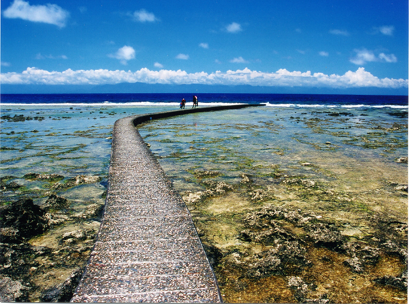
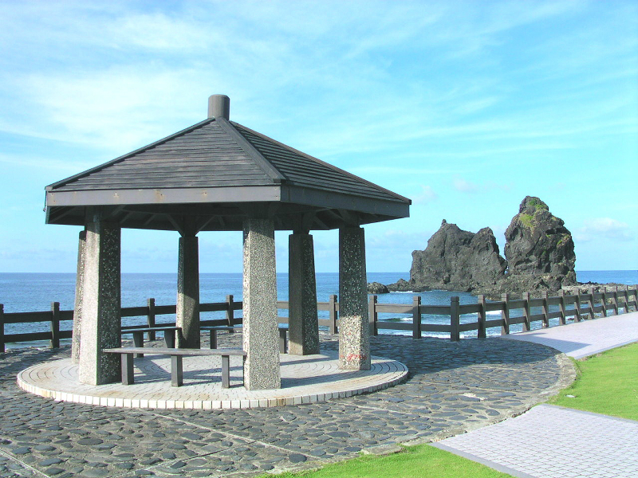
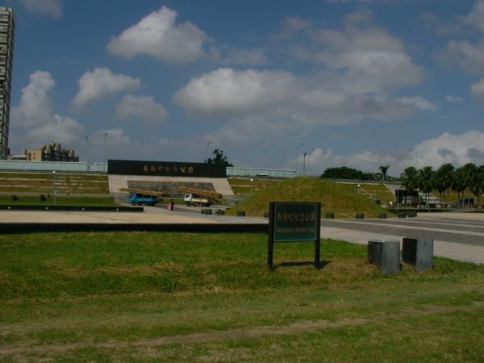
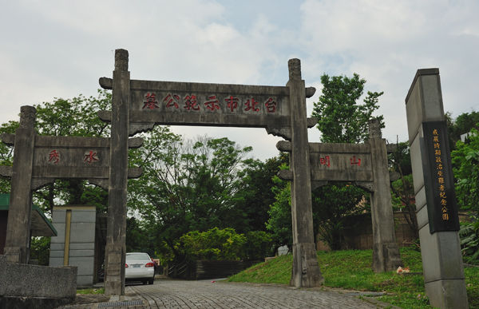
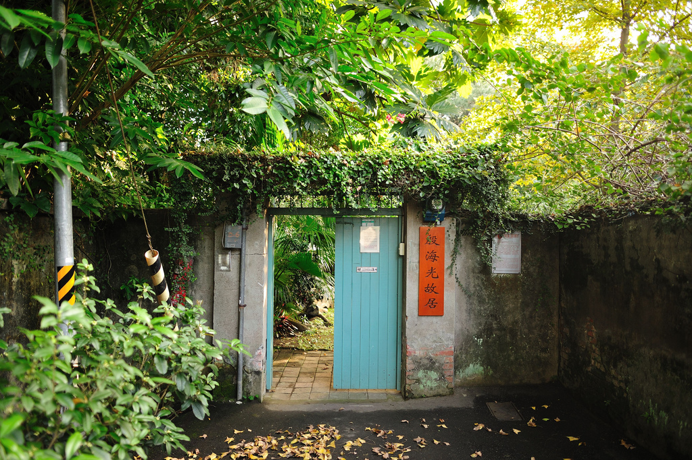
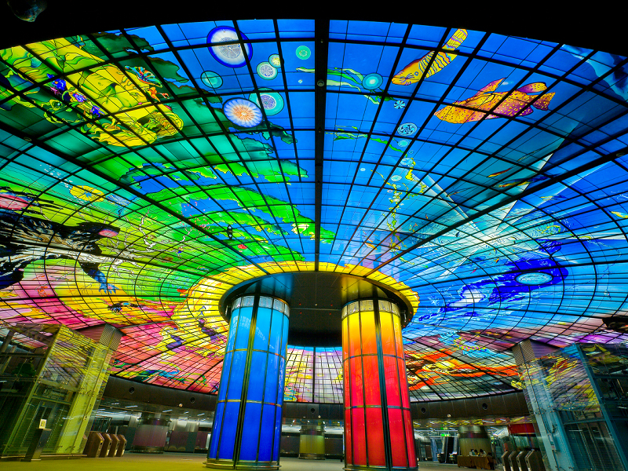
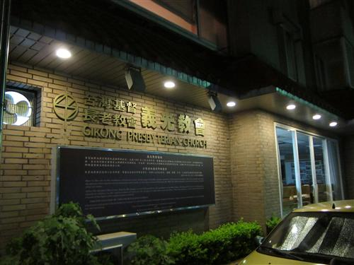
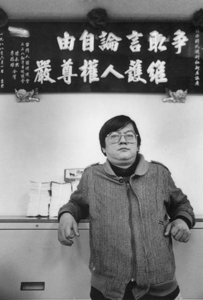
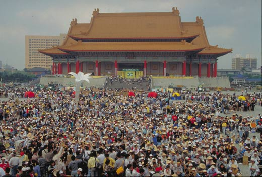
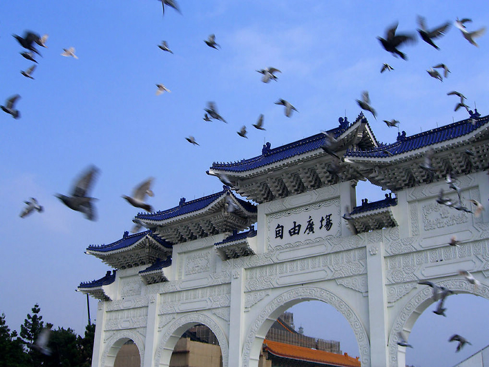

# 台灣民主地圖

這個島嶼在二十世紀的歷史，就是一頁民主的鬥爭史。

從二零年代開始就展開各種政治運動：有要求設置臺灣議會的立憲主義，有為工人農民爭取權益的左翼運動，還有追求民族解放運動。

但當然並沒有成功。

1945年日本戰敗，國民黨政權接收臺灣，許多臺灣人原本興奮地期待回歸祖國，沒想到新的政權仍然如殖民統治般歧視與壓迫他們。在這個背景下，1947年發生二二八事件，本地民眾武裝起義，國民黨政府武力鎮壓，屠殺成千上萬民眾，其後更進一步進行“清鄉”，肅清許多政治與知識菁英。

1949年國民黨政權內戰失敗，在年底遷移臺灣。就在國民黨中央政府來台之前，五月二十日臺灣開始實施全面戒嚴，為戰後臺灣政治拉下了濃厚沈重的巨大黑幕。

在那個黑幕下，是一條坎珂蜿蜒的一條民主抗爭長流，水上漂著的是腐爛的青春之花，沉在河底的是流淌著鮮血的肉體。

數千人因為政治理想，或因為錯假冤案，死於獨裁體制的暴力之下；另外幾千人被囚禁、被虐待、耗盡他們的青春與生命。更多沒有被囚禁、被消失的人，是在巨大的偉人銅像前，在無數的愛國標語和比標語更多的特務之前，沉默噤聲、心懷恐懼。

此刻，年輕的你試著掀開這個黑幕，看看裡面的人是如何一代又一代，一次又一次地試圖掙脫黑暗，爭取自由，並且最終拆下了這片黑色之幕。

在這條歷史之河中，暗黑退潮了，但河中那些不斷被歷史衝擊的小島仍背負著無數悲傷與苦痛，或者理想與激情。你決定一一拜訪那些沉默之島。

首先，你來到臺灣東南方外海的綠島。

這個迷人的小島現在是臺灣的旅遊勝地，充滿著青春、陽光與歡笑，美麗的珊瑚，以及臺灣獨一無二的海底溫泉“朝日溫泉”。

（圖一，綠島）

但曾經，這是一座恐怖的島嶼。因為海岸邊是兩座白色恐怖時期專門囚禁政治犯的監獄：臺灣省保安司令部新生訓導處(1951年─1965年)，和國防部綠島感訓監獄(1972年─1987年，通稱綠洲山莊)。

現在，這些牢籠和週邊區域成為綠島人權紀念園區。在刺人的陽光下，你會先看到海邊的“人權紀念碑公園”，這個公園成立於1999年十二月十日。在廣場中有一塊垂淚碑，上面刻著曾被囚禁于此的柏楊先生的句子：“在那個時代有多少母親，為她們囚禁在這個島上的孩子長夜哭泣。”。

在公園的坡道，牆上刻著一千多名為追求民主、人權奮鬥而遭到政治迫害者的姓名。你輕輕摸著那些早已被無數人摸到發亮的名字；是的，這些名字正是那歷史之河最閃亮的光芒。

（圖二，綠島人權紀念碑公園）

兩座監獄現在則改為展示廰，展出白色恐怖的歷史資料與相關檔，並讓人們感受當時囚犯的生活狀況。在那些依然幽暗的囚房中，你彷彿依然聽見那些暗夜的歎息之聲。

比來到綠島更悲哀的，當然是生命的消逝。

你來到臺北，走到新店溪畔的“青年公園”。這裡是人們從小來散步玩耍的地方，現在依然洋溢著幸福的味道：青年人談戀愛，爸媽帶著小孩散步，老人坐著享受時光。

但這裡曾是最最森冷痛苦之地：新店溪畔的草地是五零年代槍決政治犯的刑場。日治時期這一帶叫做“馬場町”，現在這裡叫做“馬場町紀念公園”。

在公園的紀念碑上寫著：

“一九四九年(民國三十八年)大陸內戰加劇，國民政府退守到臺灣，為了堅壁清野大肆拘捕異己份子，當時追求社會正義及政治改革的熱血青年，皆因觸犯戒嚴令法而被逮捕，並在這馬場町槍決身亡，因血流滿地不斷鏟土覆蓋，最後竟形成一座土丘；現為追思死者並紀念這歷史事蹟，特為建造馬場町河濱公園紀念丘，追悼千百個在臺灣犧牲的英魂，並供後來者憑弔及瞻仰！”

（圖三，馬場町紀念公園）

然而，公園中並沒有一一刻上這些受難者的姓名，當時的歷史也沒有被完整書寫。

一如另一個臺北市的紀念公園。

你從馬場町來到臺北六張犁的一座小山上，你知道，這也是當年許多在馬場町消逝的靈魂飄蕩的路線。

1993年5月，政治受難者曾梅蘭多年追尋五零年代同案被處以死刑的異姓哥哥徐慶蘭屍首，終於在六張犁的亂葬崗發現了他死去兄長的墓碑。這裡不只是他哥哥，還有二百多位白色恐怖死難者的墳塚。

這些墓碑分佈于 六張犁墓園三個地方，一人一小塊立石，上面刻著姓名，死亡年月日，有的刻有死亡地點如“馬場町”。當年被處死死刑的政治犯，若無親屬領回屍體，多埋葬於此。徐慶蘭當年遭受槍決後，因其家境貧窮，家人無錢領屍，遂被草草葬於此。 

經由政治受難者團體爭取，臺北市長陳水扁決議在馬場町、六張犁設立紀念公園，並進行相關歷史研究。後來在馬英九市長任期內，先後成立“馬場町紀念公園”和六張犁的“戒嚴時期受難者紀念公園”。

（圖四，戒嚴時期受難者紀念公園）

只是，雖然公園落成，此地卻仍是一片荒煙蔓草，一如他們的歷史、他們的故事是一段被人們遺忘的記憶。顯然，我們的政府仍是如此輕忽那些白色恐怖受難者以及那段歷史！

離開這兩個城市邊緣，你回到臺北的中心地帶：忠孝東路的“喜來登飯店”。這裡附近有行政院、立法院，是臺北的權力核心區。但1968年，這個飯店和附近區域是警備總部軍法處和看守所的所在地，意思是臺灣恐怖統治的核心。不論後來是送去綠島，或者送去馬場町行刑，被逮捕的政治犯都會先送到這裡來拘押、審判，甚至行刑。1968年之後，這個單位搬移到景美，附近還有負責偵防、逮捕和偵訊的調查局，負責軍事審判的軍法處和軍法局，執行監禁的軍法處看守所和新店軍人監獄，以及槍決死刑犯的安坑刑場。連成一氣的死亡地帶。

幾年前，景美的軍法處和看守所改制為“景美人權園區”。你在一個無人的午後來到這裡。一切都很安靜，天空有些陰暗。

（圖五，景美人權園區）

園區保留了當時的建築如法庭、牢房、接見室、洗衣場等等，並且有幾個精采的展示區：一區是政治受難者的文學、藝術與電影的文化展，包括他們出版的書籍與影片；另一區是臺灣人權歷史與史料文物展。還有一棟獨立屋舍是為了涉入“江南案”而被軟禁的前情報局局長汪希苓特別建的“高級”牢房，包含了書房、客廳與寢室。

在園區中的“第一法庭”，曾經進行了臺灣民主運動史上最重要的一場審判：1980年三月的美麗島軍法大審。

1980年2月黃信介、施明德、林義雄、姚嘉文、陳菊、呂秀蓮、張俊宏、林弘宣等八人被以叛亂罪提起公訴，並自三月進行九天的軍事審判。

你不知道看過多少次那八個人走進軍事法庭前的照片，他們的從容、堅定與勇氣總讓人落淚。但落淚的不只是你。國民黨因為受到國際壓力，且以為可以讓民眾看到他們俯首認罪的樣子，所以這場審判當時對媒體公開；沒想到，許多記者卻得以首次完整聽到這些民主運動者的理念，一面記錄一面落淚；而透過他們的報導，民眾眼前所見的，是這些受刑人或者悲壯或者無畏地走進法庭，侃侃而談他們對於政治改革與臺灣前途的理念。

最後，八人全部被判有罪，施明德被判無期徒刑。

在前美麗島的歷史，除了被處死，被囚禁，還有更多人失去了自由。

你從景美來到臺北最深具藝文氣息的街道：溫州街。

溫州街的一頭是無數的文青咖啡館、小書店，但在這一段住宅區，你如果拐兩個彎，會穿越時光隧道來到一片日式住宅區。這一帶大都是當年台大教授宿舍，最特別的，是殷海光故居。

（圖六，殷海光故居）

你當然知道殷海光。他的名字和雷震、“自由中國”如此緊密聯繫，他是自由主義在臺灣的重要傳承者，但也因此不容於國民黨。

殷海光晚年都居住於此。在庭院中，有他自己挖掘的“愚公河”和“孤鳳山”（其實只是一座小丘）。1960年雷震被以匪諜罪逮捕後，殷海光很難發表言論，並被特務嚴密監控。1966年，台大受到政治壓力不再續聘殷海光。1969年，殷海光在此鬱鬱而終。

但就在殷海光過世的歷史時刻，時代正要改變。

從殷海光故居走五分鐘，你會來到臺北市現在重要的文化地標“紫藤盧”，許多人來這裡品茶、看饒富味道的建築，也感受豐富的歷史。

這是一棟日治時期建築，1950年後成為關務署署長周德偉的宿舍。周德偉先生本身是海耶克學生，是一名自由主義者，五零年代時雷震、殷海光、夏道平等人經常在此聚會討論。七零年代中期後，此屋由其子周渝居住；由於周渝參與黨外運動，因此許多黨外人士與文化界人士經常于此聚會，舉辦活動。1981年正式改為公開經營的茶館，有更多思想與文化座談，迄今依然如此。

這個場所真正見證了臺灣從五零年代至今的民主與思想的火光。

你在這個歷史之河已經來到七八零年代爆發的民主運動。你必須再次離開臺北，來到高雄，去見證威權體制如何反撲七零年代的改革力量。

1979年12月10日國際人權日，美麗島雜誌在高雄舉辦一場示威遊行，從美麗島雜誌社到新興分局派出所前的圓環舉辦演講，警方強力鎮壓引發警民嚴重衝突。政府說員警對民眾是“打不還手，罵不還口”，但反對人士則指控警方“未暴先鎮”。更重要的是，事後軍警單位展開大規模逮捕。

當年的新興分局如今還在，前面的圓環街道當然不復見當年的煙硝。高雄捷運站則設立了一個“美麗島”站，並且有美麗的玻璃藝術“光之穹頂”。當年的美麗島事件受刑人陳菊現在是高雄市長。

（圖七，高雄美麗島捷運站）

美麗島事件是臺灣政治史上關鍵的轉捩點。整個七零年代的政治改革與文化運動風潮，到美麗島事件劃下了一個黑暗的句點，而可能讓臺灣陷入更肅殺陰冷的氣氛。然而，民間社會崛起的力量已非党國威權體制可以壓制的住，而將在八零年代更沸騰地展開。

你再度回到臺北。就在高雄的美麗島事件到次年三月景美的軍事審判之間，還有一個地方，一個臺灣民主運動史的巨大悲劇地點，你必須去。但記住，你必須忍住淚水。

1980年二月二十八日，當林義雄還在牢裡等待審判時，他在家中的母親和一對七歲的雙胞胎女兒，被不明的歹徒闖入，極為殘忍地殺害，長女林奐均被刺六刀重傷。林義雄赴殯儀館時，用頭猛撞著無情的冰櫃，痛哭哀號：“我做錯了什麼，為什麼你們都死了….”

（此刻當我寫下這些字眼仍然背脊發涼，眼睛濕潤）

林義雄的住宅後來被基督教長老教會買下，建為“義光教會”，每年二二八早上都會舉行追思禮拜。

（圖八，義光教會）

你知道，臺灣的民主轉型是以和平著稱，沒有大規模的流血衝突。諷刺的是，整個八零年代轉型是以林宅血案拉開了序幕，而以鄭南榕的鮮血結束。

那是1989年四月七日。黨外人士鄭南榕辦過一份又一份的黨外雜誌，並一再被國民黨查禁。他的雜誌社的口號是“爭取百分之百的言論自由”。

那年一月，鄭南榕因為言論不為國民黨所容，收到高等法院檢察署簽發“涉嫌叛亂”的傳票。他公開宣佈“國民黨抓不到我的人，只能抓到我的屍體。”並開始在雜誌社裡展開自囚行動，拒絕出庭應訊。

四月七日，警方前往《自由時代週刊》雜誌社準備拘捕鄭南榕，鄭以準備好的汽油自焚而亡，留下妻子與女兒。

（圖九，鄭南榕1947.9.12~1989.4.7）

1999年，這間鄭南榕當時自焚的原址成立鄭南榕紀念館及基金會。你來到這一間尋常臺北社區的公寓樓房，很難想像這裡曾經有這麼一場悲壯的大火。小小的紀念館中當然有許多歷史文物與資料，但最令人怵目驚心的，是鄭南榕自焚後的辦公室被保留下來。

鄭南榕自焚的一年多前，1987年七月十五日，臺灣解除長達三十八的戒嚴，但這只是開啟政治自由化的大門，真正的自由和民主還非常的遠：基本的言論與集會自由仍大受限制，國會也尚未改選。

於是，1990年，爆發了三月學運。

你來到“中正紀念堂”──這裡是為了紀念蔣介石這個現代帝王的廟，而幾步路之外就是總統府：獨裁者總是不願意離開權力中心。然而，建造者一定沒有想到，這個廣場會成為一座人民的廣場，抗議的廣場。

1990年3月，數千名學生來到他們戲稱為“中正廟”的廣場展開大規模靜坐，提出四大訴求：“廢除動員戡亂時期臨時條款”、“國會全面改選”、“召開國是會議”、“訂定政經改革時間表”，並以“野百合”做為三月學運之精神象徵。 青年的火焰在廣場上燃燒著歷史的新頁。

（圖十，三月學運，又稱野百合學運，1990.3.16~3.22）

一周後，在李登輝接見學生代表的次日，學生宣佈撤退。某程度上，當年野百合學運的前三個訴求都達成了，尤其是國會全面改選，讓臺灣在進入九零年代的門檻上更往民主體制的架構邁進一大步。但這當然不全是學生的功勞，而是民主運動長期推動累積的社會能量，學生們只是扮演了關鍵的臨門一腳。

走出中正紀念堂，你來到旁邊這條通往總統府前的大道。在野百合學運時，這裡還叫做“介壽路”，但九零年代中期改名為“凱達格蘭大道”。這裡曾是一個戒備森嚴的禁域，多停留幾分鐘就會密佈的憲警釘上；八零年開始，許多抗爭遊行都以此為終點，1994年陳水扁任市長時在這裡舉辦一場舞會，被稱為“空間解嚴”。這個總統府前空間的威權性格被逐漸卸下。

你曾經在這裡參加一場又一場的抗爭，氣氛緊張或溫馨的；例如1997年，你和數萬人為了抗議治安敗壞而遊行到這裡，用雷射光在總統府建築上打上兩個字：“認錯”。這是以高度創意進行意義深厚的反抗。2006年紅衫軍曾在這個凱達格蘭大道集會多日，也創下記錄。這兩年仍不斷有許多抗議活動，如農民連續來了兩年高喊“土地正義”。

這些活動大部分是溫馴而有禮的，不像八零年代的劍拔弩張。以背後的總統府為佈景，人們在這裡演講、唱歌、喊口號，有時席地而睡一夜，然後平和的結束。

的確，在這個時代，大部分時候抗爭劇碼都已經是人們熟悉的，而少見激烈衝撞。但能在總統府前守夜抗爭，能用鐳射光羞辱這個最高權力中心，這不正是那些被囚禁的青春，被犧牲的生命，他們用一生所夢想，所爭取而來的嗎？

_ _（原文授權自張鐵志，本文出自作者新書《**時代正在改變：民主、市場與文化想像》，**已於2013年一月在大陸出版） 

歡迎關注北斗兩岸：[https://www.facebook.com/BeiDouLiangAn](https://www.facebook.com/BeiDouLiangAn)（facebook粉絲頁） [http://www.renren.com/601607819 ](http://www.renren.com/601607819)（人人公共主頁）

採編：余澤霖 責編：余澤霖
