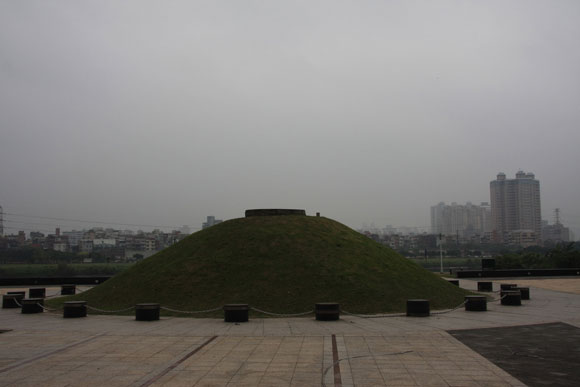
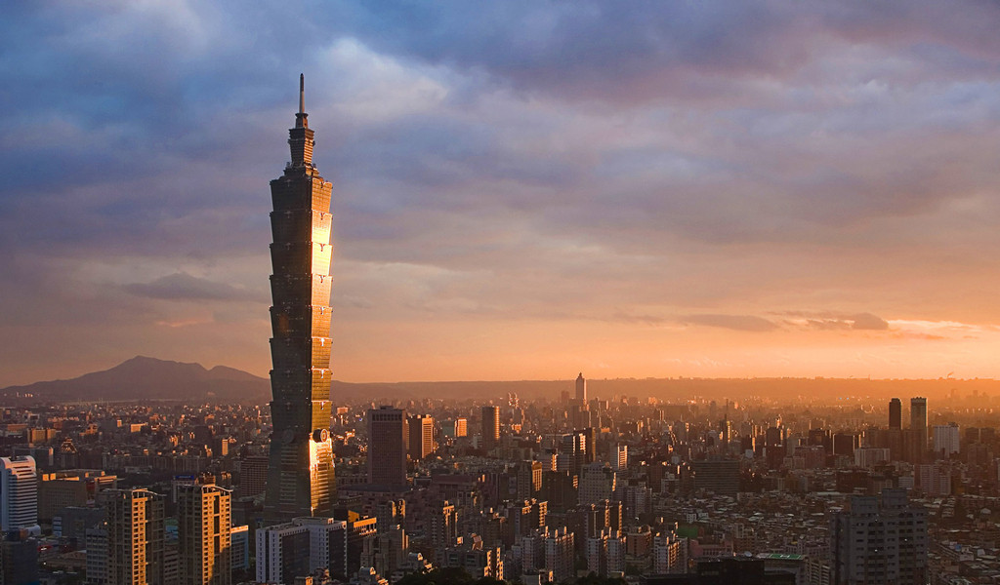

# 台灣爲什麽沒有左右派之分

大學時參加的學生社團是個曾經讓學校比較頭痛一點的社團，為何說頭痛，因為此社在臺灣民主轉型最劇烈的80年代中後期，90年代初期，在校內搞過一連串驚世駭俗的抗爭，每每讓校方頭大；此社團在當年臺灣的學運界也名噪一時，在那人人都想找機會走上街頭的那些年，每當有勞工抗爭、農民抗爭、計程車司機抗爭....等等各種抗爭的場子裡，都能見到社團的同學在其中跟著搖旗呐喊。

那時候，正是臺灣各大學“異議性社團”最興盛的時代，各校都有幾個像這樣讓校方覺得很難搞的社團。這些社團的成員個個都是“憤怒的大學生”，開口閉口經常都是“社會不公”、“剝削”、“異化”等明顯的左派符號，經常中午一群人圍著一小破桌子，一邊吃著盒飯，嘴巴裡都還是菜肉一邊爭辯著"路線"，這也難怪，社團活動經常就是讀書會，讀得都是左派經典，從馬克思《資本論》到比較新近瑪律庫塞《愛欲與文明》，但通常都是選讀而已，有時辦記錄片欣賞會，看得也是講述一些國外“集體農場”的案例，看得大家都熱淚盈眶抱拳暗自發誓，一定要讓英特納雄奈爾早日實現。

不過到了90年代後期，社會越來越開放，大家關心的事也越來越多元化，也越來越沒有大學生喜歡討論這類種"痛苦"的話題，所以這類社團也開始沒落，辦的抗爭活動也越來越無力，經常是“萬人響應，一人到場”。

我去參加時，社裡已經剩下小貓兩三隻，只有一個以天下為己任的學長在撐著。

到了大學畢業時，這社團已經倒了，清風吹散往事如煙滅，社裡桌子和櫃子被動漫社拿去用，後來的人也不知道這些轟轟烈烈的歷史，只存在前人心中。我很不爭氣得慶倖沒有擔任社長，因為在社長任內倒社要被校方處罰。

熱血學長光榮入伍去當兵，待他退伍後，我們幾個末代老社員相聚，告訴他倒社這件事後，他也只是笑笑沒說啥。

我們在KTV裡開了個包廂，學長剛公司面試回來還穿著筆挺的西裝，後來大家都喝得有些醉茫茫，有些瘋了。

恍惚之中，只聽見學長最後選了一首《國際歌》

“英特...納雄奈爾....就一...定要實現.....”

音才落下，學長猛然大哭了起來，又醉又哭，哭得真厲害，誰勸都沒用。

我們都以為學長覺得此生見不到英特納雄奈爾實現才哭，又以為他見到我們後輩不爭氣，把社給搞倒了，恨其不爭而哭。

臺灣許多自詡為天將降大任於斯人也的知識分子都有種遺憾，那就是臺灣根本就沒有嚴格意義上的“左派”存在，有的，大多是愛跟風的偽文青假左派。

有很多人會問，走資本主義路線的民主國家或地區，都有左派右派之分，為什麼在臺灣竟然沒有，許多知識分子大歎，臺灣沒有左派生長的土壤，對臺灣民眾之“恨其不爭”而痛心。

關於這點，以前阿扁當總統時，就已經給了一個很直接，但很殘酷的答案，他說臺灣的政治“沒有左右派之分，只有統獨之分”。

這話才一說完，立刻又在臺灣社會引發大討論，只是就跟其他一波接著又一波的討論話題一樣，最後又淪為口水仗，直到主持人說“好，我們進入下一個話題”。

結果，一般民眾對左右派是什麼還是沒有概念，又或著，在一般民眾的概念裡，"左派"或"左"這個詞抑或符號一出現，下意識得就會抵觸，因為“左”簡直就是共產黨的同義詞“共產黨好可怕”，所以“左”在臺灣根本沒市場；

那麼說來，一般民眾比較接受“右派”觀點嗎？可能很多民眾覺得，不是左派當然就是右派啦！民主社會不都是右派，可是如果你再追問下去，會發現，大多數民眾對傳統右派的概念，右派是什麼，右派支持什麼立場也完全說不上來；而對政治人物來說，你跟民眾講什麼是左派右派，或表明自己是左派立場或右派立場，選民還會嫌你囉嗦可能比不上直接說自己是統或獨還快。

臺灣真的沒有左派嗎？也許有人會跟你扯，李登輝以前也是共產黨員之類的往事，也許以前真的有左派，只是這種傳統已經中斷了。

臺北市青年公園南邊的新店溪旁有個馬場町紀念公園，綠意盎然，許多市民扶老攜幼來這散步，住附近的人會跟你說他們從小都是在這放風箏，現在還有一路延著新店溪而下的自行車道，遠處是環抱臺北市的青山，藍天白雲，流水潺潺，這裡是馬場町紀念公園。

孩童的嘻笑聲在暖暖的風中飄蕩，這公園的氣氛如此詳和，讓人心裡平靜，直到你走到那座小丘前。

你很難不注意到這座公園中央明顯凸起的小丘，土丘前有一小碑，若你不去讀那碑文，或許你會很自然得想要仰躺在那小丘看藍藍天空。

那碑上字不多，是這樣寫的：

馬場町紀念公園紀念丘(原來這小丘是用來紀念的！)碑文

“1950年代為追求社會及政治改革之熱血志士，在戒嚴時期被逮捕，並在這馬場町土丘一帶槍決死亡。現為追思死者並紀念這歷史事蹟，特為保存馬場町刑場土丘，追悼千萬個在臺灣犧牲的英魂，並供後來者憑弔及瞻仰”。

如果你對那時代氛圍熟悉，你一定會敏感得意識到“追求社會及政治改革之熱血志士”這幾個形容詞眼，沒錯，那就是指當時臺灣的“左派份子”，不管他是地上還是地下事實上，臺灣從日據時代就有左派份子，左翼份子存在，他們通常以讀書會的形式結合，有些人後來甚至潛至大陸到延安參加解放全中國的事業；而這"讀書會"在臺灣光復後更為流行，知識青年都想要認識馬克思，更熱血的都秘密加入了共產黨，認為只有共產黨能拯救中國，打敗腐敗的國民黨。

現在說臺灣過去是“白色恐怖”時代，而整個50年代，國民黨就是在抓這些不管是地上的，地下的；本省的，外省的；自己承認的，被人構陷的，可能的共產黨左翼份子，寧可錯殺一百，也不可以放過一個。

現在你知道了，馬場町紀念公園過去就是專門槍斃這些政治犯的刑場。

那小丘本來也不存在，而是被槍斃後，肝腦塗地，鏟了旁邊的土把血跡抹去，一次又一次，一層又一層，終於形成一小丘。這裡本來只是個不起眼的小公園，也沒什麼觀光價值，只是這幾年，也有少許大陸人士來到這裡憑弔，站在小丘前，默思良久，再灑上一瓶小白乾。

原來在這個地點被槍斃的，還有許多當年隨著國民政府來台，一直潛伏在國府高層的人士，比如公認為余則成的原型，那時擔任國防部參謀次長的吳石，以及一批在臺地下工作站的人員，幾年前《潛伏2》在臺北開拍，工作人員來先來此處憑弔。

就這麼個幾十年高壓管制，加上教育宣傳下來，“紅色”、“左”、“左翼”等帶有共產黨色彩的符號，在臺灣成為敏感詞。記得我看過一位臺灣知名教授寫的故事，說他好不容易考上大學了，在那個大學錄取率只有15%的年代，考上大學應該是歡欣鼓舞的事。他老爸問他考上什麼系，他答“社會學”結果他那忠党愛國的老爸頓時暴躁如雷，拍了桌子大喊“社會學就是共產主義！”氣得要跟他斷絕父子關係。

排版工人把中央排成中共，被抓去關；左拉小說被沒收，因為有"左"；馬克吐溫小說被沒收，因為馬克吐溫是馬克思的弟弟；《毛詩》被沒收，因為那是毛澤東的詩；小朋友用紅色彩色筆劃了一顆星星，被老師痛打一頓..........

這種現在看似不可能荒謬至極的事，我們今日當做笑話在看，但在當年可是讓人笑不出來的。幾十年這樣下來，你覺得，臺灣人能不對“左”敏感嗎？就算到了現在開放了，還是聞“左”色變，“左派”怎麼可能有生存空間國民黨在臺灣極力防“左”，那反過來說，國民黨就是“右派”嗎？

在那個年代，國民黨又必須靠美國，站在“全世界愛好自由民主的國家”一邊，以對抗共產主義，為了有別于"左"的共產中國，也必須宣稱自己是自由民主的一方，表面上的自由還是要有的，但對於宣揚真正右派自由主義思想者，如雷震、殷海光等人，還有其他反對他的人也通通都抹去。

如果從統治手段上來看，國民黨崇尚的是“一個領袖、一個主義、一個國家”，比如說以前大型慶典時一定都會高喊的“主義、領袖、責任、榮譽、國家”，將整個社會從上到下各階層與國家發展，國家榮譽緊緊得綁在一起，再把蔣介石塑造成民族英雄和救世主，全國人民都在他的英明領導之下前進，而實際操作手段則是威權獨裁的方式，將所有反對的人通通抹去，這又非常具有法西斯極端右派色彩。

如果單從組織運作上看來，國民黨其實是個“列寧式政黨”，它最重要的特徵就是“党國一體”，從外在看來，國民黨黨旗、黨徽、黨綱、黨章一樣不缺，並且嵌入了中華民國的各樣識別符號之中，用現代術語就是CIS企業識別系統；在內在看，國民黨從上到下有中央委員會、中央委員、中常委、中評委、黨代表等，在社會各個層面都有黨組織，比如軍方內有政戰體系，青年有青年黨部，婦女有婦女黨部，退伍軍人有復興黨部，各鄉鎮皆有"民眾服務社"，這根本就是從蘇共那套抄來的。

國民黨來臺灣後依然有這種特點，在來台後的重組中，權力更加集中在蔣介石手上，這種傳統直到現在都一樣，雖然已經不再“不斷革命”，但還是“中央集權”、“強調紀律”，誰不聽話就開除誰。

但很長一段時間，臺灣人卻又常常聽到“大有為政府”這類的宣傳，政府這樣自稱，這明顯就是社會主義者左派政府比較常在幹的事，從國民黨來台之初的土地改革，一直到蔣經國的十大建設，這都有濃濃社會主義計劃經濟的風格。

那到底國民黨是左派還是右派？

70年代末，臺灣的反對力量漸漸形成，這力量彙集越來越大，慢慢得把如勞工問題、環保問題、教育問題、言論自由問題，社會運動、工運、學運各種問題以及團體都團結在一起，大家都只有一個目標，就是打倒國民黨，這種情形，乍看就像是左派的大團結。

可是最終臺灣還是沒有形成左派氣候，原因在於，臺灣的反對運動一開始，主打的就是“本土論述”而非“階級意識”，“被壓迫已久的臺灣人對抗外來的專制政權國民黨”，而非“基層百姓聯合起來打垮党國金權體制”，反對分子很清楚，左派的傳統在臺灣早已經斷了，如果主打左派論述，在那臺灣“恐共”的氣氛下，一方面不會有百姓支持，另一方面政府馬上就會把你給掐死。

有很長一段時間，民進黨普遍被認為是“反商”，專門走基層路線，而事實上，在民進黨創黨當初，對於社會的各種現象還有不公，的確都有非常詳細的論述，也被人視為有左派色彩；民進黨裡有個派系叫“新潮流”，創党之初裡面的年輕人個個也都是熟讀社會主義經典，放洋到國外學了一堆“行動方法”回來，他們方法論述之激進，後來還被稱為“黨內紅衛兵”。以前大家還期待民進黨如果有一天執政，能夠為弱勢團體多發聲多爭取權利，只是待阿扁當了臺北市長，一直到當總統後，發現怎麼也跟以前國民黨一樣越來越向財團，向地方派系靠攏，像右派，又不像右派。

所以說，直到民進黨跟那些社會團體慢慢分道揚鑣，這時大家才知道，其實民進黨人為了得到政權也不是那麼左，只是以前各種社會議題只有黨外可以依靠，大夥暫時湊在一起取暖罷了。

在民進黨執政又下臺，國民黨下臺又上臺執政後，臺灣在經濟議題上，很明顯的發現，不管是那一黨執政，企業一直在影響政策，而政府一直在維護企業權益，向資方靠攏，對勞工問題不太關心，這又很明顯就是右派政府才會幹的事，但另一方面，臺灣明明是資本主義社會，政府卻又時不時的喜歡來給你出手干預一下，民眾也希望政府應該要干預，因為政府如果不做事就會被認為是無能，很少人會想政府應該少管點事，結果常常是不干預還好，一干預就越弄越糟。這一切不是都挺矛盾的嗎？

這還是跟大多數百姓還有傳統“明君情結”很有關係，認為政府什麼都該幫你做；而兩黨執政後也過了執政權力癮，認為政府什麼都該做，很迷信政府萬能，自己什麼都能做，從百姓到政府官員，都還活在“大有為政府”的思維裡；而這思維脈絡，跟過去的“朕即天下”一直到“黨即國家”的傳統很有關，“以天下蒼生為己任”，反了社稷百姓沒有你不行的驕傲，什麼都想做。

也許這就能解釋當年國共內戰時，為什麼美國的調解會失敗，因為中國的“兩黨”畢竟不是美國的“兩黨”；美國人天真的以為中國的“兩黨”可以平起平坐，輪流執政，就跟民主黨共和黨一樣，這些美國人就是不懂中國五千年的優良傳統：天下只能有一個主，不是你死就是我活，不是成王就是敗寇，這絕對是零合的。

為什麼不管是國民黨、民進黨，或是一般百姓對左右派的立場，認知都那麼混亂；這不像英國有工黨和保守黨，日本有自民黨和社民党，很清楚知道自己處在左右派光譜的那裡，但是在臺灣這些認知就變得有些錯亂，經常是要選舉的時候要儘量靠左，但是執政的時候，就儘量靠右。

我覺得一個很重要的原因，就是臺灣畢竟不是一個“正常國家”。臺灣就算有了140幾國的免簽，美帝也給你免簽，在國際政治的理解上仍然還是“中國臺灣”。

西方歐美國家可以高喊“歷史的終結”，西方經歷了幾百年才確立了民族主義架構，確立了民族主義國家主權，然後在這主權基礎下才開始討論政府與百姓的分際在那裡，國內的資源如何被分配如何來共用，以及發展各種分配共用的理論。但臺灣現在還在這個歷史哲學的邏輯過程當中，不管是統一，還是獨立，都要主權邊界大致抵定才能繼續討論下一個議題，否則前一階段未解決的事，都會影響到下一階段的判斷。

很顯然得臺灣現在就有這個問題。每當提出一個新政策，不管這政策是偏左或偏右，或者你根本就沒意識到他是偏左或偏右，但是經常都會被拿來先用是統或獨的眼鏡審視一番，而在這統獨的政治光譜下，“左”就不用講了，臺灣真正左派的脈絡及傳統早在上世紀50年代以前就斷光，現在你說你是“左”派，“左”就代表“共產黨”，而“共產黨”就代表“中國”，也等同是贊成統一。

那等於右派就是贊成獨立嗎？也不對，就像前面說到的，大多數民眾甚至是政治人物都搞不清楚左右派各在講些什麼，對所謂“左”、“右”的認知都很直觀粗淺：自由主義？自由很好，我喜歡；小政府？政府怎麼可以不做事；自由競爭？好，公平是應該的；增稅？下次不選你；企業減稅？這是圖利大財團...........一切，其實都是看心情。

所以現在想起來，還是阿扁最聰明，直接戳破了這個問題的本質。要分析臺灣的政客們在吵些什麼，用左右派思維來分析只會讓問題複雜化，但只要用統獨的角度去分析，通常可以瞭解個大概。

過了很多年，我又遇到學長。爆肝了幾年，他現在也榮升為資方的一員，過上了人人稱羨的小布爾喬亞生活，

而我終於知道他那天大哭的原因：那天下午，他去某大公司面試，本來一切都很順利，學長心裡也踏實，想說十拿九穩了。

“你贊不贊成員工組織工會？”

面試官最後冷不防問了一句。

那0.00001秒，過去搞的抗爭，讀過的理論，說過的話，在學長腦裡光速般，如人生走馬燈般流了一遍，然後，他冷靜下來，保持著一貫的淡定與自信，堅毅地回答：

“我不贊成”。

（原文授權自廖信忠，歡迎關注微博：[http://weibo.com/twxiaoliao](http://weibo.com/twxiaoliao)） __

歡迎關注北斗兩岸：[https://www.facebook.com/BeiDouLiangAn](https://www.facebook.com/BeiDouLiangAn)（facebook粉絲頁） [http://www.renren.com/601607819 ](http://www.renren.com/601607819 )（人人公共主頁）

採編：余澤霖 責編：余澤霖

