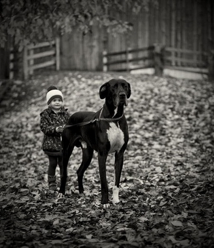
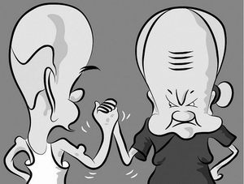

# 吃狗肉主义兄弟

每到冬至的时候，我与妻都特别紧张。

家中不大，却养了数量不少的狗，所以免不了要带着小伙子小姑娘们在附近走走。平日里没什么大问题，小家伙们也懂事，没有惊扰邻居的种种表现，不怎么叫唤，也未发生过攻击人的事。唯一不太和蔼的是住在楼上的由美国留学回来的大学生，因其夜里有着无法睡觉也无可奉告的理由，故而白天是其必要的休息时间，偏偏小家伙们白天出门时候是有动静的—这就打扰了大学生宝贵的看球时间。“看看你的狗，给邻居造成了多大的困扰！”，每次见到我，大学生都会这么说，我也曾想过告诉他关于他“Open shot from Lebron James”的声音能轻易掩盖小家伙们的声音，但想一想他必然有“看球是人的权利，怎么能把狗和人相提并论”，继而延伸到“是区委会的奴性教育才让邻居对你敢怒不敢言”，最后以“No human right in China ”为结束，过程大约也要三到四个小时，故而也忍耐他的牢骚。好在好歹是留过洋的人，也没有进一步的举动-比如发起小区居民一起写一封“关于我们愿意被为詹姆斯大帝的扣篮而发出的欢呼在早上吵醒而不是中午看见愚蠢的爱狗主义者遛狗或是支持德克·诺维茨基”这样会要了我老命的信，故而我也应对其启蒙我的蒙昧感恩戴德吧。

冬至却不一样，莫名其妙狗就失踪的事不少。比如独自关在院子里的狗一夜之间不见啦，遛狗时候被面包车强行用网子网走啦。这样的事发生不少，故而本身在附近红火的狗肉店也渐渐萧条了。大学生为此做过演说，呼吁大家要以人为本支持狗肉店夫妇云云，进而延伸到佛教是多么荒谬，最后以“No human right in China ”为结束，过程同样持续了三四个小时。最后狗肉店摇头晃脑的一变变成了重庆火锅，只有在冬至期间才会进行狗肉火锅的营业。大学生正在进行一项努力：以相对论来说明狗的失踪与冬至无关，吃狗肉是正常行为，狗失踪也是正常行为，两者不过是观测概念。不过近日里几次见他，他都愁眉不展，大概是因为相对论和“No human right in China ”无法联系到一起的缘故。这倒不是我所关心的，我所关心的只是看好家里的小姑娘与小伙子，别让他们成为观测概念就好。

这日的中午，妻领了狗儿们去近郊的公园，狗儿大多不会乱跑，唯一不老实的几只也用绳子牵着，这种事我们之前做过很多次，相当的放心；我之所以在家这是因为患了相当严重的感冒，中午看完了湖人队与步行者的比赛，科比·布莱恩特比赛结束后一言不发的回到了更衣室。“这也是观测概念”，我这么想，大学生理论还是有些作用的。比赛结束后且我又准备煮意大利面来打发空空如也的肚子时，门铃响了。妻断然不可能这么早回来，平日里也不会有朋友来找我，那会是谁？莫非大学生的民权意识觉醒来告诉我为了“human right in China”，我必须放弃养狗，那可不好办！

我拖拖拉拉地打开门，门口赫然站着奇怪的两人：一个大胖子，嘴成夸张的微笑，足足挡住了我家门的四分之三。另一个则又瘦又小，带着黑框眼镜，愁眉苦脸。两人的面部表情截然相反，身上又没有任何显著的特征，我努力回忆见过的一切人，决计不会有这样的人！

“打扰了，我们是普世公司的狗肉主义者兄弟，”愁眉苦脸的瘦子开口，“听说你养狗，我们觉得这是一件极其危险的事！”

“极其危险的事！”夸张微笑的胖子原模原样地重复了这句话，并以保持着他原有微笑的前提下，发出了极具恐吓性的声音。

“极其危险的事？”我重复了一遍，“抱歉，我的狗都有打防疫针，平时也不攻击人...”“极其危险的事！”胖子再一次嘶吼，并透露出要强行冲入房间里扫荡危险品的申请。一旁的瘦子转身还以白眼，“粗鲁！让我来给先生好好说。”话虽如此，瘦子却一步迈入了我的房间，胖子随后小心地跟进，容不得我有任何阻止他们的意思。既然进来了，小伙子们也不在，那倒无妨。我给他们沏了茶，今年春的龙井，说来还真是浪费，且万一他们说龙井也是危险品，那我该如何是好。

瘦子细细地喝了一口茶，“这是茶？”---什么奇怪的表现？我亦只有点头答复。

“茶不能当水喝，先生可知道。”瘦子继续喝。

“那是自然。”我回答，心里愈发拿不准对方的身份。

“那先生为什么还要喝茶？你肯定不知道，茶中含有的微量元素虽然可以补充一系列营养物质，但是他并不能给人类补充蛋白质，还有很多水中有他们没有的物质，而且茶的养生价值也很值得怀疑，帕格森没有提到过茶的养生价值。”瘦子目不转睛的盯着我。

“我想你们弄错了，”此刻我的心思全在意大利面上，可有不敢提及意大利面，“意大利面是不能当做比萨吃的，你为什么还要吃比萨？”我自己轻易地脑补出了他们要说的话。“我不是为了养生啦，不是为了营养或是别的才喝茶的，单纯喜欢喝。”

“那么你为什么要劝我们喝茶！”胖子一声断喝，我又是一惊，思绪开始从意大利面转到了报警。

“先生，”瘦子接着说，“你肯定不知道，茶作为待客之道也是值得怀疑的，既然茶可以待客，为什么咖啡不可以待客，酒不可以待客，你偏偏要用茶来待客？这就说明，您有被洗脑的危险。”

“我单纯是喜欢茶，所以拿我喜欢的与大家分享，而且本身也是好东西，与咖啡与酒有不一样之处。”我试图解释，虽然心里知道，多半是徒劳的。

“茶不能当水喝！”胖子一声断喝，然后喝了口茶。

“先生，你要明白，”瘦子看上去远比我耐心，“咖啡里面有的离子，酒里也有，茶里也有，可你偏偏拿茶不拿酒和咖啡。”

“可我喜欢茶！”忍无可忍的抢白。

“你喜欢的茶不是所有的茶！这世界上很多茶都不是你喜欢的，可你为什么要劝人喝茶！”瘦子面对我的打断显得温文尔雅。

我认输，决定不再说任何话，继续看看狗肉主义兄弟的表现。

瘦子看我还没有开悟，接过话头：“先生，我家是卖咖啡的，你见过咖啡豆刚从树上摘下来黝黑光亮的模样呢？你看着它长大，被制成咖啡，然后居然没有被拿来待客，心里好难受！”

如果说他们是推销员，他们一定是世界上最失败的推销员。我继续喝我的茶，后悔没有一开始就拿统一鲜橙多果汁与他们，那么他们大概什么话也没有，有的话也应该对统一说，而不是对我。一句话也不想说，这就是我的心情。

“先生，你得尊重我们！”瘦子的耐心慢慢消失，露出了一丝不耐烦，“你不懂，你还没弄明白，咖啡，茶，酒是一样的！”末了他还加一句：“刚才说咖啡的故事只不过是告诉你，咖啡，茶，和酒都是一样的。”“都是一样的，可我就爱喝茶，喝咖啡我会长胖，喝酒我肝受不了，茶有文化有传承，我喜欢，不成么？”我直说。

“茶不能当水喝！”胖子再一声断喝，并且砸掉了茶杯。若不是他这样的身材，我决计要反抗！然而现在若是反抗，定有种莫可名状的压力，胖子辐射范围太大，会带来我远不可预料的危害！况且只要他们走后，我爱喝茶，爱用茶招待人，仍旧是我自己的事。我并没有必要他们喜欢茶的意思，而他们不同，有着“你若是喜欢茶就是愚昧”这样高深而我无法理解之事，莫非又是一个观测概念？

狗肉主义兄弟与我四目相对，人世就是这么微妙，分明知道彼此都不喜欢对方，却因为这样那样的原因必须保持交流。继续说仿佛是彼此的使命，无法沟通，但又绝对不能放弃。

“这样，让我告诉您最后一件事，茶的某一部分物质和酒和咖啡是一样的，茶并不是真的有这样那样的功效，美国人也不喝茶，您懂了么？”瘦子最后一次尝试表达他的狗肉主义。

晚饭时分妻子回来了，带回来了肯德基的外卖全家桶，我已经准备好了狗粮。小伙子们吃得很开心，一只也不少。大学生终于找到了观测概念与No human right in China 之间的关系，因吃狗肉是观测概念，所以中国是断无发展航母之能力的，既无发展航母之能力，那么就是No human right in China。

壬辰年十月十五日

（采编：佛冉，责编：佛冉）
