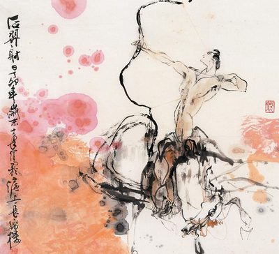
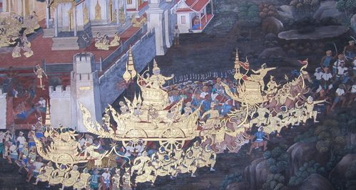
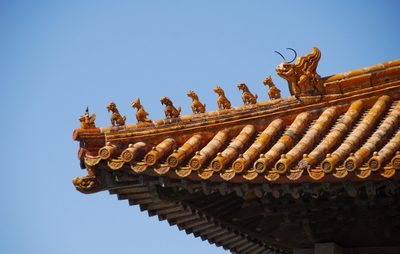
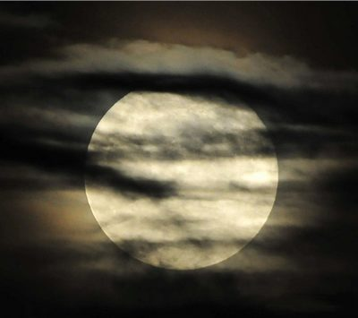

# 后羿射日及其后话嫦娥奔月

若不是那十枚太阳中出了个叛徒，本轮不到人间有英雄。

七号太阳为什么时候当班的事情和另外九个太阳吵翻了天。人们都以为这十个太阳是因为谁都不肯让出神座而执意同时普照人间。七号太阳可从不这么认为，对于它来说，最好是十天一轮班倒，这样自己可以有八天睡懒觉加上一天和三号太阳在阴影里套个近乎。然而太阳们谁都不肯从岗位上撤下去——本来十兄弟就长得一模一样，长期以来一直怀疑着自己可以被轻易替代，轮班制简直是公开承认十个太阳的存在是不必要的。

七号太阳提出方案b——那么我们到了晚上集体休息好不好，白天大家一起值日班，晚上都休假。这样的提议被一号太阳和二号太阳抨击为修正主义：作为太阳怎么能不以身作则，哪儿有自己跑去休息的道理。

在之后的很长时间里，七号太阳不光得全日全时工作，还不得溜号：其实没谁敢强制太阳上任，但七号太阳不得不天天在场以掩饰它即便不来也没有大碍的事实。

七号太阳很郁闷。

直到它对一个出奇美艳的蛇身女子说了自己的积怨，当脱口而出恨不得干掉那几个混蛋的时候自己也吓了一跳。倒是她眨着濛濛的眼诡媚一笑：兄弟相弑，本是常情。但是这件事情不应你去做，我曾捏出个人出来，他能替你杀掉那九个太阳。

七号太阳看着她细细白白的手指暧昧地插进黏土里。

什么样的人。

一个英雄。我给了他成为英雄的一切必备条件：神力，智慧，胆量…….

嘿这地面上跑的小伙子哪个不聪明健壮。

女娲叹了口气：……并且我在他知道力量的可怕之前就先给了他力量。

七号太阳不再追问。

它找到了这个男人，向他证实了人们一直疑虑的传言——煽动这场太阳的大屠杀它甚至不需要向他保证一个更美好的未来，只需要告诉他少了九个太阳并不会使日子变得更糟。于是这个叫做后羿的男人与七号太阳为誓，灭其兄弟手足，留其一昼出夜伏护佑农田，而后羿则立国以太阳之名，香火供奉。

后面的事情就像史书中记载的那样：后羿上射十日而下杀猰貐，断修蛇于洞庭，擒封希于桑林，统一东方诸部为十日国。硝烟流火中一个瞬间被无声息地遗失了：在面对茫茫白日之时，后羿将长弓挽得满满，箭尖在十个一模一样的光晕之间转了一圈，脑海中倏得一个闪念——

他忘了哪个是和他同谋主掌天下的七号太阳了。

但这也只是一瞬，后羿指尖一松，箭如流萤，毫不迟疑连射九发。

然后他指着那枚颤抖着的小太阳接受万民朝拜——现在天上只有一个太阳，留下的就成为七号太阳。

从此人们不复受烤炙之苦，农耕有序，百废俱兴。后羿称帝一方，连西王母都送来成仙药两枚以贺其丰功伟绩。射日的佳话更是家喻户晓到了被编写进基础教育的程度。私塾会考口试的最后一道题是数学题：天上有十个太阳，后羿同志英勇地射下了九个，从此劳动人民过上了幸福美满的生活————请问现在总共有几个太阳？

一个漂亮伶俐的姑娘举手说：是两个————一个在天上，一个在地上，后羿同志是最红最红的红太阳。

后羿对此非常非常之满意：小丫头叫什么名字啊。

姑娘水眸一转，盈盈行礼：小女嫦娥。眼神毛茸茸的，在后羿的心里挠起了一个念头。

直到大婚的那一天，红色的锦绣蒙上了媚眼如丝。街巷里的人们都在念叨着那个叫嫦娥的姑娘生了一双勾人魂魄的杏仁眼，不是好兆头。后羿并不在乎这些——金乌焚落也并非吉兆嘛——他要十日国最美的女人，而不是三姑六婆进奉的最吉利能生育的婆娘。他坐在金榻之上，抱着嫦娥娇软的小蛮腰，琢磨的是别的事：权力地位和女人他都有了，唯一不知如何是好的是那两枚西王母赐来的仙丹。他不想成仙，天上神仙冷冷清清，还不如人间霸王过得快活。他更不能放下一方伟业——更何况十日国近来因大婚课税加重，民怨渐起，更有人倚老卖老，说后羿不过是个有神力的毛头小子，不能在私塾里把他的故事和先哲放在一起。后羿被这帮口无遮拦的家伙气得七窍生烟，颁发了禁言令，却更加糟糕：有人在金殿外贴出了大字报——可怜！烈日当空尚可言，一君名成万马喑。后羿命人撕毁之后，城中孩童又开始传唱新歌谣：十日融融弗抬首兮，羿治弗开口。听得后羿抓耳挠腮，如果有足够多的仙丹的话后羿倒是更想一人一颗让他们全都乖乖消失到云间去。

嫦娥在他耳边吹一口气：比起穷山恶水，饱暖才更能养育刁民呢。大王需得明白百姓要的是什么。

嫦娥是十日国最美的女人，也是最聪明的。

后羿看着嫦娥，久久不动声色。

不日，传出嫦娥叛逃，独吞仙药成仙，藏于月宫。众哗然，当即对这女人不守妇道的咒骂甚于之前对后羿的牢骚。而后羿很快对此给出了答复：十日国是自由的嘛，不论是我的夫人，还是庶民百姓，都来去自由，我不做干涉。

后羿的宽宏大量得到了一致称赞，尤其是他还不顾人们对嫦娥的愤慨，将每年的八月十五月亮最圆的时刻设定为睹月思亲的节日，以示夫妻情深。

私塾里孩童们依然念诵着后羿的传说，夜间金銮殿月色冷清，人们抬头看看月亮，十日国最美的女子倚着桂树微笑，美目盼兮。在十日国之外，有这样一个地方，国无君，民可言。

只是没人提及，后羿弯弓搭箭，轻轻松松便能把那枚小月亮击落下来。

那天晚上嫦娥在后羿耳边说的话让她自己吞铅而死。她和那两枚仙丹一同埋在金殿后的牡丹花下，金秋月圆花好，总是开得格外娇艳。举国同庆之时，后羿也会掉两颗眼泪。

只是多年之后依然有好事者表示，更愿意去纪念嫦娥离去，那个没有月亮的晚上。那一年一度对于自由的祭奠，正是初夏时分。

（采编：万若涵；配图：季节扬；责编：刘铮）
