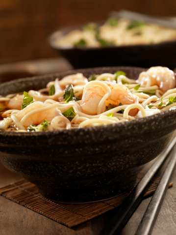
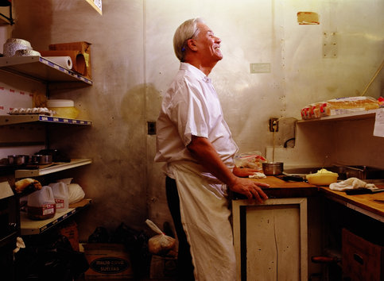

# 君子远庖厨

** **

盛情难却，这几天应友人之邀在碧山下了几顿厨。菜品不多，家常风味为主。自忖手艺不精，恐贻笑大方，所幸朋友高抬，每每咂舌相称，只得羞赧接过“大厨”的高帽，在朋友圈里继续招摇。高帽这种东西像极了《封神演义》里惧留孙手中的捆仙绳，一旦扣上，越挣脱越紧，倒不如欣然套上，物我两忘，只要不近身，就由它去吧。

听见朋友“大厨！大厨！”地叫唤，要说一点儿虚荣心没有那是假的，毕竟舞刀弄勺后，用围裙抹抹汗，，就着灶上的余火点一根烟，，看着食客们大快朵颐是不少鼎镬之徒一辈子的追求。哪怕是没人称赞，单是听那碗筷交错的叮当声，也是不可多得的享受。

近年来，随着“吃货”这个群体的壮大，人们对于厨师的价值认同逐渐提升，在关注欲望和本能的同时，开始逐渐将烹饪引向了一种有关生活态度与人生智慧的范畴里，“厨师”这个原本固化的符号里开始被掺杂进了越来越多丰富而又难以捉摸的内涵。

这事儿搁在古代的庖厨那儿是难以想象的。清末以前的中国人鲜有尊重厨师的传统，大多的名厨只是隐藏在文人暇时的随笔里，音容模糊，影影绰绰。像是绢画里的几处暗斑，不仔细看，很难觉察。就连后人追捧的厨圣伊尹，当厨子时也是奴隶之身，后来理政安民便再也无心厨艺了。伙房里的事儿大多被文人们视为下品，当然除了读书为官，当时还真没有称得上上品的事情，只是“君子远庖厨”这句话一出，似乎又把厨师们的地位给拉低了一截。

这话原文出自《礼记·玉藻》：君子远庖厨，凡有血气之类，弗身践也。大意是：君子之流离烹饪宰杀远些为妙，凡是事有血气的生灵还是别亲自动手了。当然引用这话最有名的还数孟老夫子，《孟子·梁惠王上》里齐宣王问孟子齐桓、晋文之事 ，孟子苦心孤诣地让宣王承认自己的仁慈，并告诫他以此仁心使百姓安居乐业可成大事。此篇末了，孟子补充了一句：“君子之于禽兽也，见其生，不忍见其死；闻其声，不忍食其肉。是以君子远庖厨也。”

本来只要阐明“君子少杀生”的道理即可，孟夫子却一竿子把庖厨连带着打下了水，很有当今动物保护组织里少部分狂热分子的风范。不过仔细揣测一番，孟子的话里可能还有一个较为隐喻的意思。

宣王问的是齐桓、晋文之事，而齐桓公就和厨子易牙有一段历史上有名的纠葛。当然，易牙烹子，易牙作乱的事情大家都已熟知，这里我倒是想从一个厨子的角度来描述一下这个人。好厨子讲究“一把盐，一把火”，分别代表着烹饪里两个重要因素：味道和火候。这个易牙就是名副其实的味觉大师。连含沙射影地抨击他的孟夫子也在《孟子·告子上》里讲：“至于味，天下期于易牙。”对于这个人神乎其技的味觉功夫描写最传神的当属《列子·说符》里孔子的一段话：“淄渑之合，易牙尝知之。”淄、渑二水即今山东临淄境内的淄河和渑水河，相传二水滋味不同，但相混后难以辨别，而易牙却能尝出差异来，这样发达的味觉放在今天的品鉴领域依然是很难想象的。

易牙是通过桓公宠妾长卫姬进宫的，这个女人对易牙是有知遇之恩的，易牙的厨艺最先感动的也是这个人的味蕾。后来长卫姬将其推荐给齐桓公，“好味”的姜小白从此“甘易牙之和”，夜半不哺时，“易牙乃煎熬燔炙，调和五味而进之。”（《战国策·魏策》），甚至当齐桓公想吃婴儿肉时，易牙果断烹其三岁长子以献，明代的冯梦龙在《东周列国志》里对这件事儿写到了一个细节问题，易牙呈菜时是并未向桓公说明这是人肉的，而是在桓公尝后大呼“何美而此？”时易牙才将材料娓娓道来。后人将阿谀的帽子不由分说地戴在易牙的头上我不置可否，但这个细节里我没有看到变形的脸和弯曲的膝，只有一个技艺精良的厨师在强忍悲痛，完成着自己对职业操守最后的献祭。

当然孟子以及后来的不少士人最看不惯的还是易牙在齐桓公晚年伙同竖刁发动的政变，关于这场政变，《左传·僖公十七年》载：“冬十月乙亥，齐桓公卒。易牙入，与寺（同侍）人貂（竖刁）因内宠杀群吏，而立公子无亏。孝公奔宋。”这件事儿往本质上讲，还是清宫穿越剧里的“多子争皇权”老套桥段。齐桓公本是听从管仲的意见想立嫡长子公子昭（齐孝公）为太子，后因宠幸长卫姬，又立其子公子无亏（又作无诡）为太子，这么一弄，两个儿子都在心中充满了对未来的无限可能，于是在桓公垂死时这才重蹈了二人亲爹的覆辙。

对作为厨子易牙来讲，拥立公子无亏也只是做了一个知恩图报的选择而已。因为前文提到，他的伯乐便是公子无亏的亲妈长卫姬，此时趁乱帮她儿子上位，我想于情于理都是说得过去的，况且沿着时间轴往上往下看看，重耳夷吾之争、，胡亥矫旨杀兄、，李世民玄武之变都大多讲述着类似的喜怒哀乐，所以孙开泰先生在其文章《易牙本传及其传说》里说：“易牙拥立公子无亏的行为至少不比拥立其他人更值得诟病。”

公子无亏事败后，齐孝公继位，易牙亡鲁，后寓居家乡彭城（今江苏徐州），潜心厨艺，与其祖师爷彭铿（彭祖）完成了一次跨越时空的汇合，当然这个膳祖圣地后来还诞生了狗肉屠宰大师樊哙。

后来的民间传说里，有两大菜系的建立与发展与此人相关，在鲁菜的咸鲜脆嫩，淮扬菜的清淡平和里隐隐约约都能找到易牙追求“五味调和”的影子，当初易牙做来为长卫姬治病的药膳也为后来食疗菜在徐州一带的流传打下基础。后代厨者对于易牙有着士人想不到的追崇，厨业三祖里他与伊尹、彭祖并称，明代韩奕的饮馔汇编《易牙遗意》，周履靖的《续易牙遗意》都以其名冠之。

尴尬的是，在那绢画上暗斑一样的历史记忆里，同有着易牙一样般毁誉参半的人不在少数，妓女董小宛，放浪文人袁子才，不务正业的尼姑梵正……他们大多有着或多或少相似的经历，当“下流”文明与主体思想的融合出现障碍，每一次坚守都成就了一次褒贬的分水岭。欣慰的是，百姓终究还是以食为天，煎炒烹炸的技艺还是在底层社会的建构里为浅显的快乐提供源泉。更可乐的是，这事儿与做爱不同，越浅显，越长久。

电影《料理鼠王》结尾处，那个面目憎狞的评论家在纸上写道：The average piece of junk is probably more meaningful than our criticism designating it so.

而厨子们大多这样想：任门外红尘滚滚，白大褂一穿，围裙一系，我还是烧我的菜，你还是吃你的饭。

 

（采编：刘铮；责编：周拙恒）

 
