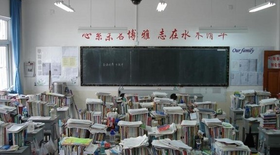
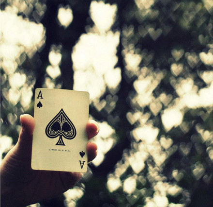

# 命运和岁月

** **

高二的时候，我坐在丁一鸣后面，有时候上语文课他还回头来跟我下那种很小很容易隐蔽的磁铁小象棋。当时语文要写作文，就允许看一些如青年文摘、读者之类的杂志，名曰积累作文素材，这大概是教室里唯一合法的课外书刊。有次丁一鸣拿了一本类似的这种杂志，他说你看这个名字你肯定没听过，叫“岁月”。我们一时间觉得这个名字有一种让人在可以公开调侃它的冠冕堂皇时内心又不得不有丝敬畏的感觉。后来丁一鸣还写了个纸条“岁月”贴在自己的杯子上，我也很爱写这种纸条，不过都是贴在他背上，有次写的是“俏也不争春，只把春来报，待到山花烂漫时，他在丛中笑”，有次写的是“东亚飞蝗”。

开头记叙这个小事，是为了说，本文的问题意识是很大的，虽然我只是想记述几个高三时片段。

#### 踢纸团

高三的时候，我们确实是过得很苦，除了跑操，没有任何可以活动的时间。我们就发明了一个游戏，是把废纸缠成一个蛋蛋，然后大课间在走廊里当足球踢来踢去。我记得每天五点半起来去学校跑操，就开始盼着下午可以踢一会纸团。而且这个游戏是全民性的，当然我们班也没几个男生。每次我们会在教学楼门厅里摆两个小门，刚开始是有技巧性地踢，后来就变成胡踢乱撞，这才是最畅快的时候。高中生是很重视装酷的年纪，但是踢纸团是脑残儿童欢乐多的时候。这算是一种歇斯底里的发泄么？我觉得不是。后来上了大学学到涂尔干的“集体欢腾”（collective effervescence）概念，我就很喜欢，因为我经历过。

#### 战友

这个比开头那个小事可能还要有基情。我和丁一鸣是好朋友，我们高三的时候，学习进步的历程也差不多。丁一鸣是很有毅力的一个人，我每次课间还总是会抬头看看，想着起来走动走动，但是他会一直坐在位子上，耳朵里面塞着隔音的橡皮塞，一副很酷的样子，于是我一看到他就只好赶快再低头做题了。当然他这么用功是因为被别人甩了。后来他还做了一个很装逼的事就是我们每天都要有一个同学在上课之前上台去做励志发言，讲讲自己目标什么的。大家当时都想去北京上大学，于是都会说自己想考一个北京的大学，但轮的丁一鸣的时候，他说：“我的目标是北京大学，注意，不是北京的大学。”当然，后来他也没考上北大。像我当时说目标是山东大学（在山东考山大也挺难的），至少后来还没丢了面子。

有天他突然跟我说，有个去北外考小语种的名额可能要给他，就是说他如果考上，就不参加高考了。当时我心里一下就很忐忑，后来几节课都没怎么专心学习。不过他后来说他不去，因为他还要考北大，于是我就放心了。

#### 传纸条

从小学到高中，不能不说人际关系的格局很大程度上是座位位置决定的。高二时候开始，我就跟她坐得很近，刚开始是隔着一条过道，后来是前后桌。不知道为什么我们就开始传纸条。后来就相恋，后来我们中间隔着一个同学，还天天传纸条，现在想来很对不起那个同学，打扰人家学习了。纸条上写了很多甜言蜜语了，但是我们很少在课下说话，牵手什么的更不可能。那些纸条留了很久，但是后来一次也没敢打开看过。

总之，这事不能说太细。

#### 命运

高中毕业留念册上，我给每个同学写的寄语都是一句话：要有用自己的努力达到自己想要结果的精神。我觉得高三就教会了我这个，但是真的努力就可以换来自己想要的结果吗？

我只知道在当时的情况下，人人最单纯的愿望就是考个好大学。但在山东，没几个人考得上好大学。我有个同学，成绩一直跟我不相上下，数学还比我好得多，这算是高考中的很大一个优势。他本来很想考上海财大，结果却是成绩平平，只能在省内上一个二本大学。当时我们可能不太懂大学对社会流动的作用，现在可以看到结果是什么了。

游戏只有一个，而且不得不玩。这就是命运啊。

不管你多么想把游戏玩好，结果很难差强人意。这就是命运啊。

有人说，毕竟高考很短，人生很长。而这正是其悲剧之处，你要用这么长的一个人生去稀释一个小小高考的结果。稀释得再好也会留有痕迹。

在这里我想给个人的命运妄下一个定义。命运包含三个因素，先赋地位、社会结构和随机事件。而命运又是一个动态的过程。所以命运大概就是个人先赋地位因经历的一系列随机事件影响而在社会结构中不断进行路径依赖的变动的过程。或者说得更简单一点，命运就是结构性的随机经历。

所以当我们谈到命运时总是有一种悲剧色彩，因为随机不能控制，结构无法对抗。谁能超越命运？大概只有马克思韦伯说的卡里斯马。

可这又如何，人生在世不称意，明朝散发弄扁舟。

#### 岁月

安妮宝贝说：“愿现世安稳，岁月静好。”但大多数人看到这句话的第一反应都是岁月静好个屁。

当然，岁月还是个好词。我们在公开调侃它的时候内心又不能不有所敬畏。

个人心中的岁月，就是自己对自己的建构。这里我想把命运和岁月区别开，用命运来表示社会的存在，用岁月表示个人的意义。而这个意义是由记忆积累起来的，由细小之处彰显终极。就像在前面我回想了这么多高中生活的细小经历，但它们的价值都很大。对我来说，我生活的意义，友情、爱情、理想，都是从这里面来的。这些岁月，在自我的意识中很清晰。个人行动的意义，无论是谁教给你的，只有从自己的经历中体会过，才变成自己的，否则就是一个按指令行事的机器人。有些人的经历是一样的，但是存留的记忆不一样，也就是他们对自我的建构不一样，他们给自己寻找不同的意义。想到高中，我想起来这么多美好的事。所以我很怀念，怀念它们就是怀念自己。

也许，岁月确实是命运决定的。但这是两个不同的层面，一个是规律，一个是价值；一个是实在，一个是表征。

社会就是上帝，你不能不对它俯首膜拜。可是正如你献给它的越多，留给自己的就越少。你信或不信，命运就在那里。可是岁月却不一定，取决于你生活的态度。而你想知道自己的生活如何也很简单，在一个你睡不着的夜里，是否听到了岁月静静流过的声音？

 

（采编：佛冉 责编：黄理罡）

 
