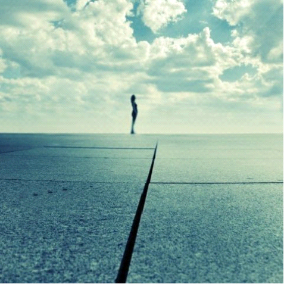

# 和悲伤谈谈

还在路上，但是究竟是告一段落。

个人的悲欢喜怒，不足让人挂怀。只是今天坐车路过我的最爱的Alster湖的时候，发现那里的姹紫嫣红不但是早就开了，而且是将近落了。只是在那一瞬间有极度的委屈。这是怎样的一个月啊，像我这么个假文艺真贪玩的人，居然对汉堡最美的一个月视而不见，居然就和整个春天擦肩而过。但委屈也好，感伤也好，就是那么一瞬间。窗外既然换了风景，就该学会换了心情。

或许是因为这一个月里被命运赶着连奔带跑，留给自己的时间，大多数都在路上。在公车，在地铁，在商场，在医院。有些经历会改变一个人看待世界的眼光，或者，别说这么玄乎吧，至少会给人另一个角度。而最近所获得的角度，就是去观察，思考，体会悲伤。

自己还在年少的时候觉得悲伤是一件很优美的事情，无论是林黛玉式的迎风洒泪，还是偶像剧式的悲春伤秋，随便给个悲伤的支点，就能撬起一连串优美的表演——对的，表演。有时候需要一些观众的熙攘配合，有时候甚至就是独角戏也能入戏至深，这种悲伤总是带有很强的代入感，表达悲伤的方式，语句，姿态，乃至悲伤的起承转合都是模仿代入着一个自己想象中完美的悲伤模板，可以来自文学，可以来自影视，有时也只是纯粹源于自己的想象：啊，我这么深得伤感着，多美。这种表演，模拟，享受悲伤美感的矫情心态，已经被辛弃疾一剑戳破了：少年不识愁滋味，为赋新词强说愁。

渐渐成长的过程中对于悲伤的美也好，丑也好，研究兴趣也会渐渐告一段落。总有更加花红柳绿的世界吸引我的眼光，当然也会有其他更为光怪陆离的情绪。小清新的自我陶醉无可厚非。但很少真正严肃的，正经的再去面对悲伤这个话题。这或许也算一种幸运，因为有些东西，如果不是被迫去经历去体会，谁会成天琢磨些沉重不开心的事呢。但近来的很多事情，让我无可躲避的，也是认认真真的，与人生中至为沉重的各种话题挨个过招。命运出手招招致命，但还好它在狼狈不堪的我面前手下留情。然而剑气所及，已然被煞到了。

我开始体验这种悲伤。它完全不浓烈，也完全不凶狠。它好像一个交情不深的熟人一样路过我的家门，然后面无表情，甚至还略有微笑地与我问好，说你好啊，对不起我来了，对不起我得动一动你的生活。它没有丁点少年时想象中的轻灵曼妙，也没有半点在林妹妹身上读到过的诗意萦绕。它随命运一起来，并不征询我的允许，也并不在意我如何应对，它脚步轻微，却并不停歇，友好地，却决绝地，捏碎一些我不再该幻想的美好泡沫，将我生活中那些乐颠颠飘在空中的浮躁欢喜缓缓地压回地面，然后平静地看着我的眼睛，叹一小口气。

So ist es. So ist das Leben.

我有过最初的慌乱不堪，也甚至有手忙脚乱地想要把它从我的生活里扫地出门，然后想要闭着眼睛去睡长长的一觉，在睁眼的时候大概还可以幻想什么都没有发生。结果呢，不用想，像是电影里演的美国壮汉遇见太极宗师，我招招用力，招招用错。渐渐地我无力，渐渐地我觉得疲倦不堪，我只是想躲在角落里偷偷地哭，想着为什么它走过了全世界，却一定要住在我的家。这种怯懦与狼狈，和小时候想象中拿姿拿态的悲伤真TM相差好远。而它仍然是那个交情不深的熟人，带着没有太多温度的笑容，偶尔叹一口气。

只是渐渐的，因为它，我开始注意到我之前似乎从未侧目的生活另一面。不期的命运改变了那么多人的生活，改变着那么多人的生活。有时候坐在公车上，我默默地看着每个人的神情，每个人的皱纹，每个人眼睛里忽远忽近飘着的那一块云。我看到纳言已久的老人，浑浊的眼神深处那些已经结冰的寂寞。我看到疲倦的母亲，蓬乱的头发里缠绕着的全是说不清道不明的烦恼。我看到许多因为各种各样的原因病倒的人，他们总会在某个时刻以完全相同的眼神看着窗外。而那种眼神里，我都认出那个与我交情不深的熟人。原来它在这里，原来它也这里，原来它无处不在。原来每个人都以并不优美的姿态和这个顽固的熟人做着抗争。失礼的，失态的，失望的。这是生活的另外一面，这是人们不愿意去分享不愿意去描述甚至不愿意去承认的一面。这悲伤的存在，让许多的人无助又难堪。然而每个人却都以自己的方式坚持着那些或许无意义的体面和尊严，把悲伤挤压在紧抿的嘴角，微颤的双手，和决绝的转身里。这所有微小的抗争，或者尊严与悲伤的和解，都带给我莫大的安慰和感动。

我并不能指望你能明白我在说什么。然而我想我渐渐在这不请自来交情不深的熟人身上，学到了什么。关于未期待的一切，关于变化，关于幻灭，关于抗争，关于和解，关于我自己。悲伤是一堂人生的必修课，或迟或晚而已。我并不期待能够早早修到这课程，但既然已然是生活的安排，那躲在角落偷哭显然也无法让我及格毕业。如果不能从这悲伤中提取到乐趣，那至少让我提取到力量。

所以，下次，当这熟人路过我的门口，我要叫住它，说，来，让我们坐下来谈谈。

（采编：何凌昊；责编：何凌昊）

 
