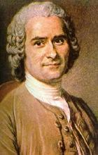
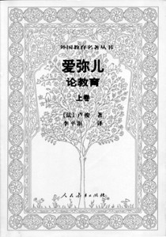

# 哲学帖副册之一——老流氓卢梭

**卢梭尽管充满了才情和抱负，可他偏又自恋自私，偏执多疑。他一辈子活得畏畏缩缩，窝窝囊囊，但他似乎试图穷尽自己悲催的一生来验证那个在《社会契约论》开篇提到的观点：人生而自由，却又无往而不在枷锁之中。**

很多人知道SM，但他们不知道SM是哪两个英文单词的缩写；

很多人知道S代表Sadism，M代表Masochism，但他们又不知道这两个英文单词的学术来源；

很多人在正册我写完萨特后，强烈呼吁我写萨德，我知道，比起萨德侯爵的哲学思想，你更想听因萨德（Sade）名字而命名的Sadism。

说到底，天不怕，地不怕，就怕流氓有文化。

众位看官，咱们副册第一位闪亮出场的男猪脚便是流氓中的大师，大师中的导师——让雅克·卢梭

哲学界文学界有一个让我非常讨厌的习惯，那就是：为贤者讳。比方说，卢梭那些个泡妞把妹拍婆子的破事，要是到了他们笔下，一定会肉麻兮兮地变成：啊，是真名士自风流！不过，对于卢梭，他们的为贤者讳计划直接泡汤，因为和其他需要娱记蹲家门口深度挖掘隐私八卦的哲学家相比，卢梭实在太省事，他直接在自恋式自传体文学《忏悔录》中，大言不惭地向世人宣告：哥就是一个喜欢被鞭笞的小M，哥就是喜欢masturbation！

《忏悔录》一出，众人皆惊。于是乎，卢梭同学在有些人眼里简直是敢作敢当的学术巨星，在另外一些人眼里不过就是猥琐老流氓。要是卢梭哪天在网上发个帖子，那么定会出现以下几种回复：

Id:康德（阳光老宅男）：沙发，鸡冻呀，楼主你成就了我。俺为了读你的《爱弥尔》都忘记下午四点出门散步，柯底斯堡那群傻子现在还以为教堂的钟坏了呢。PS:楼主我把你的正面清晰无码照供在书房了，晨昏三叩首，早晚一炷香。

Id：叔本华（我家狗狗“世界精神”最近老掉毛）：板凳，k！连我的偶像康德都说好，楼主绝对差不了。@黑格尔，黑傻蛋，你娃儿别整那些哲学垃圾了，赶紧过来膜拜大师吧！

Id：拜伦（哥要当诗人）：楼主威武，我要为楼主写诗！

Id：雪莱（济慈死，我心死，有事请烧纸）：赞ls，我也要写，我也要。

Id: 罗伯斯庇尔（雅各宾派万岁，万万岁）：谁有楼主qq？我想去围观楼主真人！

Id：罗素（哥的《西方哲学史》已出版，大家请支持正版，当当亚马逊有折扣）： lz就是一流氓，楼主的思想导致了希特勒的极权！

Id：以赛亚伯林（给马克思写传ing）：奇怪了，楼主好斗，粗鄙，缺乏教养，怎么这么多人顶贴？！

其实，历史上写《忏悔录》的卢梭不是第一个，比方说，奥古斯丁也写过《忏悔录》，可人家在书里字里行间都流落出对上帝的毕恭毕敬，对自我行为的深刻批判。然而，到了卢梭这里，《忏悔录》被堂而皇之地写成一个暴露癖患者的自白书，虽然在书中卢梭对自己的诸多恶劣行径直言不讳，但他却没有丝毫的羞耻感，相反，卢梭认为自己很傻很天真，是外面的世界很黄很暴力，自己个从头到尾都是个被命运玩弄的无辜可怜人儿罢了。

卢梭写了一本还不过瘾，又继续写了《对话录：卢梭评判让-雅克》，《一个孤独散步者的遐思》。通过卢梭在这一系列自白书中描述，我们基本把握了卢梭的一生。纵观他的一生，是经历丰富的一生，是多姿多彩的一生。如果卢梭有履历表，那“职业”一栏他会填：学徒、家教、小偷、小白脸、男仆、游吟歌手、浪漫作家、哲学家。话说卢梭这娃从小就没了妈，不靠谱的爹又因为惹上官司远走他乡，卢梭基本上靠着寄人篱下窘迫寒酸地长大，缺乏管教的他曾因为撒谎，偷盗差点成为“问题少年”，还好高雅的书籍拯救了他，使他能悬崖勒马没进一步发展成少年犯被抓进局子。卢梭在十六岁那年，投靠了贵妇华伦夫人，华伦夫人那年二十有八，丰韵撩人，油光水滑，街头古惑仔卢梭哪见过这阵势，顿时被华伦夫人的光辉母性形象秒杀，从此拜倒在华伦妈妈的石榴裙下，和华伦妈妈开始了一辈子剪不断，理还乱的乱伦之恋。

当启蒙运动大师伏尔泰誉满欧洲之际，卢梭还依旧是那个名不见经传的小白脸，被美貌风韵的华伦妈妈包养在古宅。不过命运女神这个妹纸，狡黠又无情，你追她，她懒得搭理你，你不追她，她又总是喜欢暧昧地撩拨你。卢梭的被撩拨就是很偶然，话说他在那天去看望被关在监狱的好朋友狄德罗的路上，看到了第戎学院的关于“艺术和科学的复兴是否有助于敦风化俗”题目的有奖征文小广告，卢梭看到广告后小宇宙蹭蹭爆发，回家立刻投了一篇稿子名叫《论科学与艺术》。关于这个有奖征文，当其他竞赛对手都在文中回答“是”并列举一二三点试图证明时，卢梭剑走偏锋地回答“不是”！卢梭认为，艺术与科学根本不能敦风化俗，相反，正是科学和艺术的出现，人类的自由遭到了扼杀。卢梭的反其道而行之，果然吸引众多眼球，他的论文立刻博得头筹，一夜之间，卢梭名声大噪。

卢梭在《论科学与艺术》一文中的思想我可以为大家简单地概括为九个字：“反文明纯天然复古风”。

卢梭认为科学和技术是源于人类的恶，人们迷恋天上的星星，于是有了占星术天文学，人们想实现自己的野心，于是有了雄辩术，人们因为贪恋吝啬，于是有了几何学，人们因为不切实际的好奇，于是有了物理学，科学与技术不是人类的福祉而是对人类的诅咒。

卢梭强调纯天然，推崇自然哲学。卢梭的自然包括清新的大自然界，但更多地是强调人的自然状态，即人在进入社会和文明之前的状态。人在自然状态下，人性本善，自由平等。卢梭的自然哲学，不禁让处在技术泛滥核爆炸整容成风时代的我们，扪心自问：工业文明必然带来幸福么？

卢梭倡导复古风，一辈子哼着周杰伦的《想回到过去》，内心充满着对田园生活的无限遐想，他眼中完美的社会应该落英缤纷，阡陌交通，鸡犬相闻，黄发垂髫，怡然自乐。卢梭认为高贵的德行在今天这个堕落肮脏的社会早已消失的无影无踪，只有回到在人类社会的早期才能找到它，卢梭极力赞扬柏拉图倡导的古代斯巴达社会。在卢梭看来，男女之间的关系最好也要返璞归真：小男女心生欢喜，小树林里约个会，生了孩子归女人养，这样又简单又省事。卢梭这个观点到是和咱们《诗经》里描述的情节雷同纯属巧合：“野有死麕，白茅包之。有女怀春，吉士诱之。林有朴樕，舒而脱脱兮，无感我帨兮，无使尨也吠！”

卢梭虽然是启蒙运动的杰出代表，但他实际上是启蒙运动的一个异类：启蒙运动的大多数都出身名门望族，羽扇纶巾风度翩翩，毕业院校也是985与211，名专业名导师，走的是“精英主义”路线，而卢梭则是草根出身，社会底层，没上过学，连学校大门都不知道朝哪个方向开。除此外，卢梭穿衣戴帽极为拉风，他经常裹一件亚美尼亚长袍，此举动在那群讲究鲜衣怒马，侧帽风流的贵族眼里，无异于秋裤外穿逛王府井西单。他们瞧不起卢梭，卢梭更看不上他们，他们强调理性主义，卢梭就强调感情至上；他们认为私有财产神圣不可侵犯，卢梭却认为私有制是不平等的起源，应该根除。

1753年，第戎学院第二次开展有奖征文活动，这次的题目是《人类不平等的起源》，尝到甜头的卢梭当然不能放过这样的机会，他再次跃跃欲试摩拳擦掌，投了一篇名为《论人类不平等的起源和基础》的论文，可惜这回他老人家名落孙山，未能获奖。然而，正是这篇落选的论文却对人类历史的进程产生了非常深远的影响。卢梭认为人类的不平等有两种表现，一种是自然的不平等。比方说：高矮，美丑，健康与否；而另外一种是政治、经济的不平等，而这是后天造成的，而私有制正是这些后天不平等的起源。卢梭把人类社会的发展状态分为“自然状态”与“社会状态”，在国家和社会产生之前，人类处于“自然状态”，人人自由平等，没有压迫、权力和奴役。然而，随着私有制的发展，人类进入“社会状态”，出现了贫富分化战争暴政奴役压迫。

私有制的出现导致了国家的产生，那么国家该如何运作呢？这就要涉及卢梭那本大名鼎鼎的政治学名作《社会契约论》。卢梭认为一个人太孤单，人们需要抱成团抵御危险，共同求生。团体中每个人需要让渡出自己的一定权力，组成一个政府，而政府又如何体现人们的意志呢？这就要分清二个概念： “公意”与“众意”。“众意与公意之间经常总是有很大的差别；公意只着眼于公共的利益，而众意则着眼于私人的利益，众意只是个别意志的总和。” 公意未必总是正确，但绝对应该是最符合大众的意志，而众意代表的是团体的意志，部分的意志。社会契约的目的就在于把每一个人的人身和全部权力置于公意的指导下，每个成员都要接受自己是整体不可分割的一部分。这同时也意味着如果你哪天不想服从公意，那么社会全体会强迫你必须服从。比方说，法律就是公意的产物，法律代表着社会全体的公意，服从法律就是服从自己，当然，如果你娃没事干想挑战下法律，那么你立刻会体验到什么是强制和暴力。

社会契约在卢梭那里和在霍布斯那里有着很大的区别，虽说二者都赞同人们让渡出自然权力，但是霍布斯认为人们应该把让渡出来的权力交给君主，而卢梭则认为应该交给由每个人组成的社会共同体。紧接着，卢梭在社会契约的基础上，进一步提出了“主权在民”的思想，这个思想可谓是《社会契约论》的精华所在。这个思想不同于霍布斯的“君权神授”，不同于洛克与孟德斯鸠的“三权分立”，卢梭的“主权在民”认为一个国家的主权完全属于这个国家的全体公民。卢梭认为主权就是公意的体现，人民主权不可转让，不可分割，至高无上不容侵犯，不可代表。说白了，人民要是哪天觉得政府没能代表我们的公意，那么我们就会揭竿而起推翻你。

研究卢梭很到位的罗素曾写道：“从卢梭时代以来，自认为是改革家的人向来分成两派，即追随他的人和追随洛克的人。有时候两派是合作的，许多人便看不出其中有任何不相容的地方。但是逐渐他们的不相容日益明显起来了。在现时，希特勒是卢梭的一个结果；罗斯福和丘吉尔是洛克的结果。”卢梭激进民主主义理论的“主权在民”思想，正是法国大革命的指导思想，法国的《人权宣言》和后来美国的《独立宣言》，都吸收了卢梭的观念。法国大革命雅各宾派的领导人罗伯斯庇尔就是卢梭的拥趸者，他还曾去拜访过卢梭。

如果说理性主义到了叔本华、尼采那里，已经病入膏肓，那么，从卢梭开始，理性主义就开始了有疾在腠理。卢梭反对理性主义，重视人的情感，学富五车的康德对卢梭这一点极为看重，康德觉得自己的哲学虽然严谨缜密，但却唯独漏掉了卢梭笔下那活泼真实的人性。康德于是极为推崇卢梭，他将卢梭的头像挂在自己卧室的墙头，卢梭的《爱弥尔》出版，为了一睹为快，康德甚至不惜打乱了持之以恒的下午四点遛弯儿。

这本让宅男康德爱不释手的《爱弥尔》，其实是一部教育学经典，在书中，卢梭以小说的形式讲述了一个被隔离开来的孩子的故事。卢梭以此来论证了一个非常重要的观点：教育要从娃娃抓起，对娃娃要实行自然教育，不能束缚和压制娃娃的天性，而应该去鼓励娃娃们表达和发展自己的天性。娃娃们的第一个情感是自爱，第二个情感是爱周围的人。娃娃们的教育应该远离腐败堕落的社会和文明，把娃娃们放在大自然的怀抱里，使他们尽情享受大自然赋予的权利。

《爱弥尔》让今天的教育家来看，也不失为一本充满真诚和良知的教育学著作，可惜的是，今天的教育是填鸭式应试教育，清华北大一年招生名额有限，哪里有功夫能顾得上娃娃们的天性。然而，这本倡导自然教育的温和的教育学著作，在当时教会垄断教育的背景下，却被定义为异端邪说，《爱弥尔》被当众销毁，可怜的卢梭，幼小心灵遭受严重伤害，加之当局的威逼迫害，卢梭的被迫害妄想症加剧。这时候，休谟向他雪中送炭。于是，卢梭奔赴英国避难。

我曾在正册《雌雄大侠波伏娃与萨特》里谈到，法兰西民族和中华民族的相似度很高，比方说我们都热爱俗世生活，讲究口腹之欲。除此外，我们两个民族的哲学也颇为相似，和其他讲究思维高度抽象，喜欢营造哲学体系的他国哲学家相比，我们两国的哲学较为注重感性思维，喜欢关注现实，关注感性，关注更多的经验层面。因此，和中国哲学饱受非议一样，卢梭也被怀疑到底算不算是一个哲学家。卢梭和别的哲学家的确不一样，他没那么关心哲学的本体论，认识论，他的著作也没用规范的哲学语言，但卢梭的的确确是位哲学家，而且他的地位还是哲学家中的导师，任何一个试图要编写哲学史的人，都不会漏掉卢梭这一章。

卢梭的一生是分裂的一生，是伪善的一生。尽管他在《爱弥尔》中呼吁要教育儿童，可他自己却狠心地把亲生的五个娃儿全部丢进育婴堂，他的理由无耻透顶：抚养这些孩子需要钱，于是我不得不去拼命赚钱，赚钱太累我容易过劳死，我死了孩子就没人抚养了，所以还不如直接送到育婴堂。卢梭甚至会抡起拐杖追着打路边因调皮撞到他的孩子；尽管卢梭在《新爱洛琦丝》用优雅的笔触描写爱情，开创浪漫主义的先河，可卢梭却一辈子却虐待自己那个不识字的妻子，提起妻子永远充满不屑和鄙夷；尽管卢梭强调情感大于理性，可他除了爱情失败外，友情上也颗粒无收，他和伏尔泰吵翻了，和狄德罗分道扬镳了，甚至对帮助他到英国避难的休谟，他也充满怀疑，最后也和人家恩断义绝割席断交了。

卢梭尽管充满了才情和抱负，可他偏又自恋自私，偏执多疑。他一辈子活得畏畏缩缩，窝窝囊囊，但他似乎试图穷尽自己悲催的一生来验证那个在《社会契约论》开篇提到的观点：

人生而自由，却又无往而不在枷锁之中。

哲学帖下期：《天才高帅富维特根斯坦》

 

（采编：徐海星；责编：黄理罡）

 
