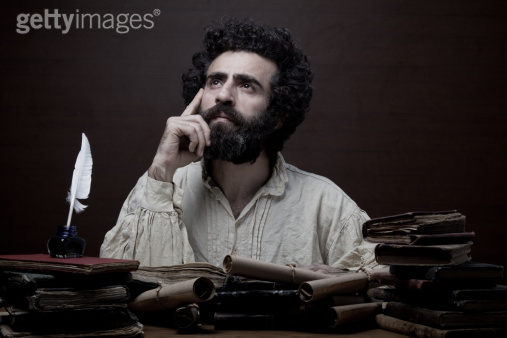

# 哲学帖副册之三——花花公子罗素

** **

1911年，英国剑桥大学，三一学院。

有位老师上完课，夹着讲义准备回家吃饭， 结果在转角处被一个神色紧张，腼腆羞涩地学生拦住：

“老师，您好。我想问您个问题，请问我是白痴么？如果我是白痴，我就去开飞艇当宇航员，如果不是，我就要成为一个哲学家。”

老师被学生搞得莫名其妙，遂硬着头皮对学生说：

“这样吧，你写篇论文交给我，随便什么题目，我看后给你回复。”数日后，老师看到了学生的论文。读罢第一句，老师就惊呼：

“Oh my Lady Gaga ！同学，你绝对是个天才，无论如何也不能去开飞机”老师的这一句话彻底改变了学生的命运，学生从此邂逅了人生的毕姥爷，开始上了哲学的道儿，而学生的到来，传统哲学也被搅得天翻地覆，上演了奥斯卡大片：《终结者》。

老师的名字叫伯特兰•罗素，学生的名字叫路德维希•维特根斯坦。如果可以，罗素一定会像亨伯特教授对洛丽塔一样，对维特根斯坦说：“啊，维特，你是哥的生命之光，哥的欲念之火。”当时的罗素估计没想到，他的这位天才学生日后竟成为他学术的灵感之源，并且很快青出于蓝而胜于蓝，成为他的竞争对手，批评拆台者，成为他一辈子的梦魇。

罗素是个公子哥，他出生在勋爵世家，他爷爷是伯爵，他爹地是子爵，不过可怜的罗素并没因为家世显赫而幸福，他很小的时候父母便相继离世，孤儿罗素由奶奶抚养长大。公子哥罗素很花心，他的花心不仅表现在婚姻上，还表现在哲学上。罗素这一辈子的哲学思想可谓变幻莫测，他总是用拿他今天的思想去批判他昨日的思想，可谓被我弃者，昨日之日不可留。然而，花心的罗素却有三样东西一生没变：“有这样三种简单而又极为强烈的激情主宰着我的一生，那便是：对爱的渴望，对知识的追求，对人类苦难的深切同情”。当然，这三样东西的顺序可不是随便排滴，罗素能把爱情排第一，绝非偶然。父母双亡有车有房的罗素是个绝对的爱情至上主义者，他这辈子一共结了四次婚，离了三次婚，且一辈子情人无数，这一点上罗素的哥们儿纷纷表示很生气：“凭什么你给我上一次礼，我却要给你上四次礼！”，罗素第四次结婚时已是八十岁的耄耋老头，不过，诺贝尔文学奖得主罗素的记录很快被另外一位诺贝尔物理学奖得主所打破，这位物理奖学奖得主八十二岁老夫娶二十八岁新妇，使得罗素相形见绌。

对此，我的评价：“为毛儿这些事，总要和数字八过不去？！”

每个人小时候都要上数学课，当你我上课时，听数学老师教了条公理一加一等于二，又教了个公理叫等量代换。即：如果a=b，b=c，那么a=c后，你屁颠屁颠地套用公理去做了一百道数学题，而这时，另外两个学生却在绞尽脑汁地思考，一加一到底是个啥子问题？为嘛儿a就非要等于c？于是，最后，你因为勤奋做题以高考数学满分的优异成绩考上名校，而那两位学生中一个姓陈的，成了哥德巴赫猜想第一人，成了著名数学家；而另一个姓罗素的，成了受人尊敬的哲学家，思想家，数学家，逻辑学家。

罗素年轻时曾和怀特海一起合作撰写《数学原理》，书写到后来，手稿堆积如山，他二人恨不得雇佣一辆老驴车把这堆手稿送到出版社。别人写书赚钱，他二人写书赔钱，出版社当时给他俩的回复是“出版可以但需自费”。于是乎，这部被称为二十世纪科学重大成果的三卷本著作，成了罗素和怀特海的一桩赔钱买卖。

正所谓一千个读者心中就有一千个哈姆雷特，而一千个哲学家心中也有一千个哲学。倘若，你问罗素“哲学是什么？”，罗素的回答一定是“哲学的本质是逻辑。”作为分析哲学的代表人物，罗素认为：凡是哲学问题，在经过逻辑分析之后，都称不上是哲学问题，而是一个逻辑问题。传统的形而上学之所以有那么多争论，是因为他们依靠的“逻辑”不正确。我们要了解罗素的逻辑分析方法，绕不开的一个话题就是“罗素悖论”。那神马是悖论呢？悖论（paradox）指的是明明自相矛盾却又能自圆其说的命题，正所谓假作真时真亦假，无为有处有还无。比方说，历史上有几个非常有名的悖论：

一个克里特人说：“我说这句话时正在说慌。”

然后，这个克里特人就问听众他上面说的是真话还是谎话？再比方：

柏拉图说：“我的老师苏格拉底老师下面的话是假话。”

苏格拉底则答道：“柏拉图上面的话是真话。”

于是，我们不论假设苏格拉底的话是真还是假，都会引起矛盾。这一系列悖论都可以用一个形式表示：即如果事件A发生，则推导出非A，非A发生却又推导出A。悖论理论如今被广泛地用于各种文学小说科幻电影创作中，科幻电影《十二只猴子》，《恐怖游轮》以及言情穿越小说《步步惊心》等都讲述了男女猪脚们千里迢迢穿越时空本欲阻止某事发生，结果却发现正是因为自己的到来才导致某事发生的悲催故事。（强烈推荐《恐怖游轮》，结构精致，哲学味道很浓）。

悖论虽然欢乐益智，但对数学和逻辑学来说，足以伤身。如果一个数学家一辈子研究证明的问题，被人发现基础环节出现悖论，那建立在基础之上所有看似精致的证明演绎推论，一秒钟之内将呼啦啦似大厦倾倒，这个倒霉蛋数学家会被气得吐血身亡。比方说，“罗素悖论”的出现就直接动摇了数学家弗雷格的公理体系，遭受打击的弗雷格从此心灰意冷，数学江湖金盆洗手回家卖红薯了。

出尽风头的“罗素悖论”，从集合出发，指出一切集合分为两种，一类集合以自身为元素，另一类集合不以自身为元素。关于这第二类集合，就产生了悖论：试问这第二类集合组成的集合，是自己的对象么？如果你回答说“是”，那么这个集合应该和它里面的元素一样，不是自己的成员，而这却与你的答案矛盾了；那如果你回答说是“不是”，那这一集合又成了自身的元素，这再次与你的回答相反。好吧，估计已经有人脑子已然一盆浆糊了。那我们来看个和“罗素悖论”等值的悖论例子吧：“理发师悖论”。一位理发师对外宣布：“哥只给城里那些不给自己刮脸的人刮脸”，试问理发师能不能给自己刮脸呢？如果他不给自己刮脸，则他属于“城里不给自己刮脸的人”，他就可以为自己刮脸；如果他给自己刮脸，他却不属于“城里不给自己刮脸的人”，他又不能为自己刮脸。

如何攻克悖论这个令人纠结的难题呢？罗素指出，之所以悖论能产生，是因为我们以任意的方式构造集合，这些集合的构造方式并不合法。我们认为一类事物既可以包含整体，又可以包含各个部分，但实际上这样构成的类是不合法的总体，它只要存在就会引起恶性循环。罗素为此提出了类型论：简单类型论和分支类型论。个体、个体的集合、个体集合的集合在系统上属于不同的层次，在逻辑上属于不同的类型，故而表述他们的符号和命题也属于不同的类型和等级。举个例子，如果一个人说：“哲学帖系列是垃圾”这是第一级的命题，那我们对他的话做出的反映：“他说‘哲学帖是垃圾’是垃圾”则是第二级的命题。低级类型的集合可以归入高级类型，但是高级类型的集合不能再看做是低级类型的元素。于是，我们再回到克里特人那个有名的悖论“我说这句话时正在说慌”，我们就要问他针对的是哪一级命题，如果“我说谎”是第一级命题，那他的“我说‘我说谎’”则是第二级命题。第二级命题不能再指称第一级命题。这样一来，命题不能反指自身，悖论的麻烦也不会产生。

为了对语言作更进一步地逻辑式分析，罗素提出了大名鼎鼎的“摹状词理论”。所谓摹状词指的就是由冠词普通名词以及限定语构成的专门用来表示事物的词组。摹状词一般由几个字组成，人们了解这几个字的特定意义，于是就就把握了摹状词的意义。比方说，一个专有名词“章泽天”，很多人一头雾水不知所指，但是摹状词就可以这样描述：“网络甜美奶茶妹清华校花”，这样一来尽管大家依旧不认识章泽天，却通过摹状词把握了她。罗素指出，因为摹状词，人们突破了个人经验的限制，通过摹状词的描述而扩大了个体的知识。而摹状词理论最大的意义就在于，它试图要澄清哲学以来一个非常厚重的问题：“存在”问题即“being”。用罗素自己的话：“如果你取任何一个命题函项并且断言它是可能的（即它有时真），那么这就给予了你关于‘存在’的最基本的意义。你可以用以下说法表达这个意义：至少有X的一个值，对此，这个命题函项是真的。”这意味着，我们经常在句子中用到的词，尽管词语本身存在，但词语本身代表的对象不一定存在。比方所，“金山不存在”，就意味着“就X的一个值来说，‘X是金的且是一座山’这个命题函项是假的”。所以，哲学上很多关于“存在”的似是而非争论，是因为赋予了摹状词太多的存在意义，这些问题可以通过分析哲学便可迎刃而解。

花心公子哥罗素曾说，他给自己贴的唯一标签是逻辑原子主义。罗素这一思想的形成很大程度受其学生维特根斯坦的启发。逻辑原子主义主张和物理学中世界是由“原子”构成一样，哲学的世界也可以分解成认识论上的最小单位，从而把握世界的逻辑构成。逻辑原子主义认为，构成世界的基本单位是原子事实，事实不等于事物。“一个苹果”是事物，而“砸中牛顿脑袋的苹果”则是个事实。一个事实就是一个命题，事实决定了命题的真假。每一个事实都属于客观世界，不是人脑自己臆想出来的。罗素认为，语言结构与世界的结构一致，世界通过语言可以被反映，那些反映世界的最基本，不可再分的命题被称为原子命题，原子命题反映了原子事实。原子命题又构成较为复杂分子命题，人类的一切知识都是原子命题通过数理逻辑以真值函项的形式重复地，复杂地连接而成。

为了追求知识的确定性，罗素挑选了武器：“奥卡姆的剃刀”。这位中世纪著名唯名论哲学家奥卡姆的方法论被概括为：“如无必要，勿增实体。”说白了就是化繁为简，如果一个现象有两种假说，那我们就采取最简单的那种假说。当罗素用锋利的剃刀去掉多余的枝叶蔓藤，他发现：直接的感觉经验和可靠的演绎推理是剩下的最基本的东西。于是，罗素紧接着就用逻辑，这个强有力的502黏胶，把各个支离破碎，分散不一的经验粘合在一起，这样构建的知识大厦，牢固结实，百毒不侵。

如果让我客观地讲，罗素在哲学上并不是执牛耳者，就其逻辑原子主义，我觉得并没有超过他的学生维特根斯坦，罗素自己也承认他的很多灵感是受到维特的启发。罗素的哲学思想经常发生变动，我们一方面可以夸奖他从未固步自封，他的思想总是不断推陈出新包容开放，但另一方面，这却反映出他哲学思想的不成熟不稳定。可尽管如此，我本人却非常喜欢罗素，喜欢的不仅仅是哲学家罗素，更多地是思想家罗素，身体力行有着强烈社会责任感的斗士罗素。

天才高帅富维特根斯坦一辈子清心寡欲，宛若空谷幽兰，他的哲学才华犹如高山，于高山，我们惟有仰止。而罗素，他夸父追日般对真理的追求，强烈的社会责任感，期待人类幸福自由的拳拳之心却能让我起立鼓掌。罗素，用今天的话来讲，是一位“公共知识分子”。“公知”罗素从来没有在自囿于书斋，他从来都不是一个无力的书生。当人类遭遇血腥罪恶、当不公正如影随形、当政治上宗教上的异端被残忍迫害、当核武器强悍粗暴地威胁着和平与安全，罗素挺身而出，不辞辛苦。当他的身份足以成为长江学者，教育部重大哲学社科项目评审人，名誉校长，足以被国家领导人亲切接见时，公知罗素却选择了另外一条路，这条路上他上过法庭，静坐过街头，下过大牢。他受得来多大赞美，就抵御住多少毁谤，他获得过诺贝尔文学奖品尝过泡沫四溢的香槟美酒，就领教过身陷囹圄铁槛牢门的冰凉。罗素于我，从来都不是一个面目模糊的哲学家，尽管他缺点很多：花心，为了赚稿费书稿质量良莠不齐，《西方哲学史》中错误很多……但这些并不妨碍我喜爱罗素：他真实，他有血有肉，他那么强烈地存在过。

罗素的《西方哲学史》，是我的哲学启蒙读物，那时的我初窥哲学门径，胆怯羞涩。这本清新泼辣，娓娓道来的哲学史，使我大开眼界，耳目一新：罗素竟然敢这样开哲学家的玩笑！哲学史原来也可以这样卖萌！尽管现在看来，罗素对很多哲学家的思想描述有误，对很多哲学家的批评明显醋意四射，但瑕不掩瑜。面对哲学群星闪耀，我们早已习惯跪地膜拜，但是听罗素讲这些伟人的囧事儿，我们一点一点站了起来。或许，我从来都没有喜欢过那种把哲学家的思想梳理地再清晰不过，却没有自己立场看法的哲学史作者，如果每个哲学家的思想都正确，那只能说明一点：作者错了。他本人还身在此山中，未曾勘破。

因为罗素的《西方哲学史》，哲学第一次也可以成为畅销书，哲学，这只傲娇的王谢堂前燕，才得以飞入寻常百姓家。委实，不可能人人哲学王，人类历史的发展归根到底还是在尘世粗糙地物质生产活动中，但哲学并不是高贵自矜，他人止步。哲学不是哲学家束之高阁的语言游戏，哲学以不用形式反映着每个时代的问题，回答着每个时代的疑惑，揭示着每个时代的矛盾。哲学对现实反映，犹如梦对现实的反映一样，不是那么地直截了当，一览无余。然而，就像叔本华的唯意志论走红，是因为1848年欧洲革命失败，理性主义灰飞烟灭；恰如萨特的存在主义风靡，是因为二战结束，满目苍夷，人们苦闷消极。哲学归根到底，是自己时代精神的精华！

于是，我翻身上马，手中紧握名唤“哲学十二钗”的利剑，猎猎西风，长衫如雪。此时此刻，我多么希望自己能成为哲学江湖里一位武林高手，高山之巅，夕阳之下，我迎风疾呼：

哲学，谁的哲学？！

哲学帖下期《海德格尔：农夫、山泉、有点田》

 

（采编：徐海星，责编：徐海星）

 
