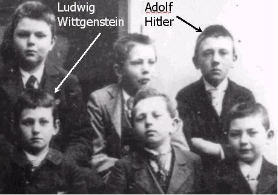

# 哲学帖副册之二——天才高帅富维特根斯坦

** **

所有通向哲学之路的人都要经过一座桥，这座桥的名字叫做伊曼纽尔•康德，这座桥通向了古典哲学。

所有通向哲学之路的都要翻过一座山，这座山的名字叫做弗里德里希•威廉•尼采。翻过这座山，你就会邂逅现代主义或者后现代主义哲学。

所有通向哲学之路的还要趟过一条河，这条河的名字叫做路德维希·维特根斯坦，这条河通向了哲学的没落。

那一天，云淡风轻，天蓝蓝；

那一天，奥地利林茨中学迎来了小正太维特根斯坦；

那一天，低年级留级生阿道夫•希特勒正忙着玩音乐玩美术幻想着变身萝莉杀手变身文艺男青年；

那一天之后，历史已经蓄势待发悄悄准备着被改变。

不错，你我都向往名校，名校之名，不仅有大师大楼大课大作业，还有着牛叉闪闪的大人物——那些令人艳羡的校友资源。林茨中学的学生打死估计都想不到，当年那两个差等生：孤僻犹太佬维特根斯坦，土包子乡下佬希特勒竟然有一天也可以改变历史：前者游戏般改变了哲学史，后者血腥地改变了人类历史。

维特根斯坦与希特勒是同学，在这一点上，所有正史，以及所有稗官野史都已供认不讳。但两者的区别就在于：野史永远充满了爱恨情仇，它牵强无聊地把希特勒的反犹主义归结为：矮穷锉希特勒对高帅富维特根斯坦的羡慕嫉妒恨。更有野史作者，紧紧抓住维特根斯坦是gay的小辫子，充分发挥狗血想象力添油加醋，演绎归纳推理，最后得出个令人发指的结论：希特勒恨犹太人，那是因为某一天，维特根斯坦这个gay粗暴地摁倒了希特勒。

对此言论，我欲哭无泪！

史料可以有纰漏，史实可以被篡改，但人脑如果没被驴踢，还是可以正常运转滴。用脚趾头想想也觉得奇怪，既然希特勒屠杀犹太人是对维特根斯坦羡慕嫉妒恨的升华，那么希屠夫干嘛不先杀了犹太佬维特根斯坦顺便毁掉维特根斯坦富庶的家族呢？

不过，说实在的，维特根斯坦也的确有太多值得希特勒嫉妒了。维特根斯坦家族极其富有，维特他爹是当时有名的钢铁大亨，几乎是欧洲最有钱的人。维特家的豪华房子堪比宫殿，经常是名流云集之所，可谓谈笑有鸿儒，往来无白丁。土包子希勒特玩艺术那会儿，心中的偶像是钢琴大师勃拉姆斯，当可怜的希特勒下学回家被自己那个酗酒又有家庭暴力的爹揍得吱哇乱叫时，勃拉姆斯正在维特根斯坦家的高档客厅里优雅地教维特兄弟们弹着钢琴。然而，月满则亏，水满则溢，维特根斯坦家族烈火烹油，鲜花着锦之盛不禁让人心慌慌。果不其然，这个被上帝给了太多眷顾的家族，也被撒旦下了恶毒的诅咒：维特根斯坦的三个哥哥相继自杀。于是乎，别的孩子童年的记忆是尿泥，维特根斯坦童年记忆则是一场接一场黑色悲凉的丧礼。从那时起，这个可怜的娃儿心里就有了一个怎么抹也抹不掉的念头——自杀。

维特根斯坦的存在实在让我等凡人满心羞愧，虽然同样被打上made by god的标签，但估计制造商上帝亲自制造了他，而我们，显然被上帝批发承包给了别人。维特根斯坦不仅是个高帅富，而且是个天才高帅富。俗话说，三百六十五行，行行出状元，只要维特根斯坦想碰哪行，他就必定是那行的状元：工科男维特根斯坦十岁时自己做出了缝纫机，自己比莱特兄弟还早地研发成功过飞机的发动机；理科男维特根斯坦数学和逻辑学一流；建筑师维特根斯坦自己设计建造过一栋房子，这房子包豪斯的设计风格，供暖和散热系统的完美到现在还被人津津乐道；艺术生维特根斯坦会演奏多种乐器，他的单簧管虽自学成才，却堪称专业水平；医科生维特根斯坦一步一个脚印，从医院看大门的，晋升为护士，再到医院实验研究员，他对一些医学问题的见解令专业医生都瞠目结舌；国防生维特根斯坦作战勇敢，又具有工程技术的才能，很快就被升为炮兵中尉；文科生维特根斯坦把哲学玩的风生水起，使得哲学在二十世纪发生了转向。

天赋异禀、气质凌然、家财万贯、龙章凤姿。当维特根斯坦拥有足够的优势，进而可以精英般俯视芸芸众生时，我们却发现，这个孩子，他一直不快乐。导致他不快乐的原因有很多：父亲的暴君专制，哥哥们的自杀等等，但他不快乐的根源只有一个：他有个难以启齿的秘密。

1903年，偏执天才魏宁格出了一本畅销书《性与性格》。《性与性格》这本书，看的我好气又好笑，但我吐血强推大家一看。这本书虽不科学但却疯癫。《性与性格》一书的观点，我可以为大家简单地总结为：世上无绝对男女，性格分雌雄两类。每一个人身上都有着积极的男性性格与消极的女性性格，最完美的莫过于摒弃女性性格，成为一个充满逻辑的彻底男性，然而，犹太人的性格却属于女性性格。女人们根本成不了天才，伊们的指导原则就是性欲，伊们被分为两种类型：母亲型与妓女型，女人中聪明者大都男人气颇浓。同性恋、自恋狂兼大男子主义魏宁格，在《性与性格》出版没多久后，就饮弹自杀了。然而，维特根斯坦却买了这本畅销书，别的读者估计也就看个热闹，但维特根斯坦却把这本书从内容看到思想，并自觉地把思想内化为行动。

另外值得一提的是，维特根斯坦自杀的那三个哥哥，大哥和三哥都是同性恋。行文至此，恐怕大家都已经猜到维特根斯坦的那个难以启齿的秘密了：不错，维特根斯坦是个gay!如果说《性与性格》是维特根斯坦准备精神出柜的强大思想指导武器，那哥哥们是gay的不争事实再次证明这个家族的X染色体的确发生了异常，生理上的出柜是造物主的安排。

当然有人会问，gay就gay ，至于那么讳莫如深嘛？不错，如果维特根斯坦穿越到今天，那gay的身份只会让他人气暴增：腐女们对搅基感兴趣，那是因为女人天生热衷于聊和男人有关的一切话题，归根到底她们还是对男人感兴趣；而男人们喜欢聊基友情，那是因为在男人心中，基友情早已是兄弟情的嬗变异化。然而，维特根斯坦到底生错了年代，他那个年代，同性恋在人们心中犹如洪水猛兽，肮脏龃龉。且不说维特根斯坦正统天主教徒的身份和同性恋不兼容，只消看看二战中纳粹对同性恋实行的残酷迫害政策，我们就足够理解维特为嘛儿如此这般遮遮掩掩。比方说，我看过一部名为《隐藏的恋情》的法国电影，片中男主人公因为同性恋的身份，就被纳粹残忍地摘除了脑白质。

因为这个dirty little secret，维特根斯坦一辈子活得压抑克制，几次在自杀边缘上徘徊游荡，还好哲学拯救他于水火。这个dirty little secret也正是维特根斯坦性格双重性的根源：他一方面有着魔鬼的高傲，另一方面他又时常猛烈批判自己否定自己，恨不得卑微地胸口匍匐着大地。

维特根斯坦的《逻辑哲学论》，是他早期思想的代表作，这本书写于第一次世界大战，那时他想自杀想疯了，本着“不想阵亡的士兵不是好士兵”，维特根斯坦准备借助战争来庄严完成自杀。打仗之余，维特根斯坦写完了他的这部格言式风格的哲学处女作。《逻辑哲学论》一书分为7个格言式主题：1 世界是一切发生的事情；2 发生的事情，即事实，就是诸事态的存在；3 事实的逻辑图像是思想；4 思想是有意义的命题；5 命题是基本命题的真值函项；6真值函项的一般形式是： 这也是命题的一般形式。7 对于不可说的东西我们必须保持沉默。

“世界是一切发生的事物”，貌似是同义重复，说了等于没说，实则是微言大义，曲径通幽。一般认为，世界是事物的集合，是我们认识到的事物和客观存在却尚未被我们认识到的事物的集合。然而，维特根斯坦却认为：世界是事实的总和。比方说，长在树上的苹果是一个“事物”，那么苹果落下砸到牛顿头上，就构成一个“事实”，事实代表了苹果在时空中的每一个运动轨迹。“事实”就是“事物”在时空中的状态，事物在时空中的每一个状态构成世界的原子事实，原子事实在逻辑中表现为“图像”，故而，维特根斯坦在《逻辑哲学论》的思想也被称为“图像论”，图像可以描述原子事实在逻辑中的运动和结构。可能有人要问了，为嘛儿图像这种逻辑的东西可以反映现实存在呢？原因就在于，要通过逻辑上的可能世界去认识现实世界，必须要找到两者之间存在的某种一致性东西，这种一致性的东西就是逻辑形式。比方说，通过地图我们可以认清祖国的大好河山，地图和大好河山之间存在的一致性东西正是逻辑形式。无论是逻辑的可能世界还是现实世界，能描述它们的都是逻辑图像，换句话说，任何一种图像都只能是逻辑的图像。

当然，维特根斯坦没有总是抽象地谈论逻辑图像，他进一步指出，命题就是事实的逻辑图像，人们通过文字声音等命题记号感知到世界上发生的事实。命题和事实的关系就犹如投影和被投影的关系，一个命题中的词语对应的就是空间对象。比方说命题“苹果掉下来”中，人们明白不是苹果这个文字符号掉下来，而是又大又圆的果子掉下来了。事实可分为原子事实和较为复杂的事实，而命题也分为原子命题和复杂的较为复杂的分子命题，原子命题对应着原子事实，维特根斯坦将最小单位的命题为“基本命题”，它的特征就是独一无二，没有其他命题会与之产生矛盾。

写完《逻辑哲学论》，维特根斯坦觉得自己已解决了世间一切哲学问题，于是他金盆洗手，返璞归真。为了贯彻落实国家提倡的向雷锋同志学习，为人民服务的伟大精神，维特根斯坦同志踊跃积极地报名参加了祖国偏远落后地区的建设，成为阿尔卑斯山脉脚下一个鸟不拉屎小山村的一名普通小学老师。从此，吟着陶渊明的《归去来兮》，维特根斯坦的孩子王支教生涯拉开了序幕。尽管这期间，维特根斯坦的《逻辑哲学论》早已令他君子闻名于诸侯，但他还是很淡定地干好小学教师的本职工作，爱岗敬业。直到有天发生了让他蛋疼的事件：因为殴打学生被家长起诉。维特根斯坦终于辞职不干了。

1929年，哲学家天才维特根斯坦王者归来，他重返剑桥大学，并顺利评上职称，成为三一学院的研究员。哲学上他梅开二度，开始批判令他功成名就的《逻辑哲学论》，从而进行新的哲学思考，并完成了后期思想的代表作：大名鼎鼎的《哲学研究》。在此书中，维特根斯坦开始抛弃世界的本质是事实，事实的逻辑结构是世界的逻辑结构的早期思想。他指出世界没有所谓的本质，有的只是“家族相似性”。他开始放弃对语言意义的关注，转而追求语言的用法，并形成了语言游戏理论。维特根斯坦的“语言游戏”理论，告诉大家哲学其实就是教人们如何正确玩语言游戏。关于什么是“语言游戏”，维特根斯坦说这个概念没有定义，就好比别人问你什么是“游戏”，你会对他描述什么是K歌、打麻将、斗地主等类似活动，以此类推，“语言游戏”也就是我们只能描述现实中或想象中的语言现象，而不能确切指出语言游戏究竟是个啥子东西。玩游戏就要讲游戏规则，语言游戏和所有游戏的规则一样，玩家都必须遵守。但游戏规则不是大家先遵守规则再玩游戏，而是在游戏中遵守规则。大彻大悟的维特根斯坦最后上演了哲学版的《终结者》，开始否定哲学，提出哲学无用论。

从维特根斯坦开始，哲学开始走向没落，连维特根斯坦自己都说：“搞哲学就是为了不搞哲学”。在维特看来，他的哲学与亚里士多德以来所有的哲学都不同，他的哲学不是构建哲学体系兜售哲学概念，他的哲学是对生活本身的描述。哲学史上之所以有那么多喋喋不休的争论，不是哲学家脑子不好使，而是因为哲学家们对日常语言的用法错误地理解了。诚然，语言是思维和世界的媒介，它表达传承着思想，语言也总是那么滴别有洞天，引人入胜。然而，语言就像《加勒比海盗中4》的食人美人鱼，诱人的芬芳下，是她獠牙的真实外表。语言很有可能早已远离真相，遮蔽真实，而人们迷恋语言，就好比男生迷恋dota女生迷恋lv，这种迷恋会产生虚妄的满足感，在这一点上，语言为各种误会矛盾争论助纣为虐。而哲学的任务就在于正确描述语言的用法，消除误会。哲学的目的不是探寻新真理，而是追求清晰，哲学就是“指给苍蝇飞出苍蝇瓶子的道路”。

关于语言哲学，我因为写过这方面的paper，所以感受颇多。比方说，你哪天手捧鲜花钻戒向你妹纸求婚：“妹纸，嫁给哥吧，爱情是婚姻的基础”。当你鼻孔朝天把握十足的等你妹纸热泪滚滚地说“I do”时，殊不知你那研究语言哲学的妹纸早已走火入魔，她蓬头垢面面无表情情绪呆滞：“基础？请你告诉我神马叫基础？x是y的基础，x可以属于y，比方说楼房的基础，也就是地基属于楼房，但x也可以不属于y，比方说雕塑的基础，也就是底座却不属于雕塑。”对此，我对语言哲学的评价，五个字：精致无生气！虽然语言分析哲学将哲学从宏观带入了微观，犹如拿着手术刀缜密细致地解剖了哲学，它可以清晰地标明哲学的五脏六腑。但哲学却是思维的抽象，具有高度的形而上学性，在一点上，语言分析哲学这把手术刀永远有鞭长莫及的地方，就好比你的手术刀再锋利怎么也解剖不出来中医的奇经八脉来。

有人学哲学，因为那是专业是饭碗是衣食来源；有人学哲学，因为他擅长爱好兴趣使然；然而，哲学于维特根斯坦，不是专业不是兴趣，是心灵的慰藉，灵魂的寄托，因为哲学他放弃了孜孜不倦的执着理想——自杀。维特根斯坦其实是个很容易让人心生怜爱的家伙，他一方面甘于平淡，独孤求败，另一方面他又急切渴望被关爱，在孤独和饥渴地希望被爱两种矛盾张力作用下，他一生的才华得到最大程度的迸发。这世上，每一个伟大哲学家的华丽出场，都改变了哲学。有的完善了哲学的体系，有的改变了哲学的方法，还有的升华了哲学的精神，只有维特根斯坦，他的出场，两次改变了哲学。第一次把哲学引向了逻辑实证主义，第二次把哲学带入了日常语言学派。维特根斯坦这一辈子思得苦，说得少，他在《逻辑哲学论》的最后一章非常酷地只写了一句话：

“对于不能说的东西，我们必须保持沉默”。

写到这里，我把头扭向窗户，窗外大风狂舞，阳光却通透，北京的春天不远了。维特根斯坦所说，世界和人类思想无法被言说，由此，我想到了华兹华斯的诗：

春天的树林给人的冲动，

能帮你把善良、邪恶，

把怎么做人的问题弄懂，

圣贤讲得没她透彻。

哲学帖下期《花花公子哥罗素》

 

（采编：徐海星，责编：黄理罡）

 
