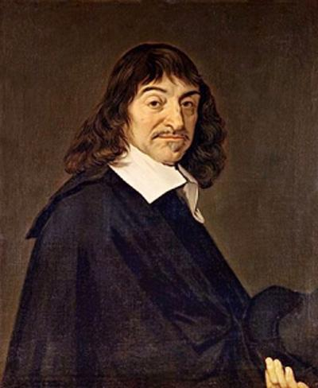

# 哲学帖副册之五——胆小鬼笛卡尔

** **

伟大的哲学家笛卡尔是累死的；

伟大的哲学家笛卡尔是累死在一位名女人手上的；

那位女人芳名：克丽斯蒂娜，瑞典女王；

如果瑞典中央电视台有《感动瑞典》节目，那笛卡尔同志一定会在此节目上被授予“感动瑞典十大杰出人物”之“人民的哲学家，女王的好家教”等荣誉称号。

其颁奖词为：从数学到哲学，从几何坐标系到“普遍怀疑”，从《方法论》到《哲学原理》，从法国到瑞典，五十四载春秋风华，一遇女王香消玉殒，他思故他在，他就是近代哲学的掌门人——笛卡尔。

笛卡尔同志的光辉事迹被全球媒体大肆渲染，传遍了世界的每一个角落，感动了无数哲学粉丝，却令其他哲学家心生不忿，其中罗素和萨特纷纷表示不满，于是向组委会提出申诉：哥经常上几百人的大课，经常搞万人演讲都没被颁奖，这厮不过就是教了几天哲学课，还是小班制一对一面授，怎么就被评为劳模了？

对此，组委会的回复是：你丫要是死了，我们明天就颁奖给你。

罗素和萨特于是堵在组委会大道上，抗议裁判的不公正待遇，嚎啕大哭，导致后续比赛延后1小时举行。组委会在不得已之下，授予罗素和萨特“哲学精神特别奖”。不过话说过来，这种给女王当家教的好差事，为毛就能把笛卡尔活活累死？这事儿我们还要从头讲起。

笛卡尔是个早产儿，他先天不足，能活下来就基本是个奇迹了。于是，在他成长的过程中，当别的小儿郎背着书包上学堂时，笛卡尔躺在床上睡觉，当别的小儿郎背着书包下学堂时，笛卡尔依旧躺在床上睡觉，因为身体孱弱，笛卡尔得到了早自习和晚自习的豁免权，于是乎，他一天中大多数的时间都是萎在床上坐月子，并一辈子乐此不疲。恋床癖患者笛卡尔在温暖舒适的床上，被滋生出无数灵感。比方说我们都知道的，他躺在床上一抬头看到屋顶墙角蜘蛛在织网，于是受启发创立了笛卡尔几何坐标系；再比方说他躺在床上太久一会儿做梦一会儿清醒，似梦非梦，似虚还实，怎样区别梦境还是现实？于是他又提出了大名鼎鼎的“我思故我在”。

所以，当喜欢温暖的笛卡尔到了瑞典，斯德哥尔摩的严寒立刻让他哆嗦得吃不消了，加之尊贵的女王殿下偏又喜欢早上五点起床听哲学课，于是可怜的笛卡尔最后连恋床和睡懒觉的优良习惯都无法保持下去，四个月后，笛卡尔终于累倒了，他被诊断为肺炎，很快就一命呜呼了。

谈起哲学家笛卡尔，我们中国学生普遍耳熟能详，因为这厮在我们中学政治课里上镜率极高。比方说：下面哪句哲学命题体现了西方主观唯心主义的观点：

A 人是人妈生的妖是妖妈生的 B 吾爱吾师吾更爱真理

C 我思故我在 D 风动？幡动？仁者心动

官方正确答案：C

什么？有同学提出质疑，D也是主观唯心主义的观点。

拜托，请认真审题，是西方！！！D是慧能说的。

而实际上，这道题并没有正确答案。

笛卡尔的“我思故我在”在中学政治课里被简单粗暴地归结为“主观唯心主义”，老师会告诉你，因为“我思考所以我存在”是非常片面地，反驳的例子也可以随手拈来：植物人机器人虽然不思考，可不是也存在么？

如果笛卡尔的这句哲学命题这么容易就被人驳倒了，那他的近代哲学开山鼻祖的地位就是吹出来的了。然而，笛卡尔在哲学史上的地位非常之高，和他同时代的哲学家培根、霍布斯、伽利略、斯宾诺莎都无法与他相提并论。正所谓熟知不等于真知，笛卡尔的“我思故我在”的涵义十个人里有九个人都没有真正明白，这句命题不是“我思考所以我存在”那么简单，也不涉及唯心主义唯物主义，这句命题本是个认识论命题，笛卡尔本人也不是主观唯心主义哲学家，他是一个强调精神和物质都是独立实体，且并存独立的“二元论”观点持有者。中学政治课本里给某一个哲学家“贴标签”的做法的确太简单粗暴，断章取义了。我们不能为了衬托“唯物主义”的高贵白富美形象，就非要将“唯心主义”刻画成瑕疵纰漏明显，令人嗤之以鼻的傻丑憨。

“唯物主义”与“唯心主义”早已不是简单的孰是“好人”孰是“坏人”的三岁小儿之争。殊不知，某些简单粗陋的唯物主义有时还不及精致的唯心主义对人类社会更有用些，列宁说：“聪明的唯心主义比愚蠢的唯物主义更接近于唯物主义。”另外，再容我客观地说一句，推动人类哲学史发展的，其实更多的是唯心主义哲学。

言归正传，我们该如何正确理解笛卡尔的“我思故我在”呢？先看两个问题吧。

问题一：看过电影《盗梦空间》的都知道，有时梦境和现实无法区分，在没有Cobb拥有的旋转小陀螺的情况下，那如何证明你我现在正在经历的一切是现实而不是梦境呢？

问题二：看过电影《楚门的世界》的都知道，有时真实生活和真人秀场无法辨别，如何证明你我现在的生活是真实，而不是像Trumen那样正在经历一场业已被安排好的秀场？

笛卡尔的“我思故我在”正好回答了这两个问题。经常像笛卡尔一样经常喜欢赖床的人都有过类似的感觉，觉睡得多了，就似乎分不清哪个是太虚幻境哪个是真实人生了，笛卡尔纠结一番并擦掉眼屎后，终于找到了问题的答案：即用“普遍怀疑”来证明我的存在。“我思故我在”法语为“Je pense，donc je suis”，“思”翻译为“怀疑”更加准确。意思是：当我怀疑一切事物都是虚假的时候，那么正在进行怀疑的思维主体“我”必然可以确定是实际存在着的。也就是说，我可以怀疑一切事物，但“我在怀疑”却不容怀疑。

笛卡尔的“我在怀疑”并不是仅仅是对具体事物的怀疑，而是要对整个人类、对世界、对上帝的绝对的怀疑。通过绝对怀疑，引导出不容置疑的哲学的原则：“我思故我在”。“我思故我在”正是笛卡尔哲学的第一原理，他的独门秘籍，笛卡尔的哲学历程由此拉开了序幕。

这时，问题来了。如何从“我思”证明或者推断出“我在”？

“我思”只能证明我思维的存在，却不能证明我肉身的存在呀。没错，如果你能提出这个问题，那么，恭喜你，你已经真正理解了笛卡尔的这个命题。笛卡尔的“我在”并不指我肉体的存在，而是指我精神的存在，心灵的存在。也就是说，我可以怀疑我的肉体存在或者怀疑有我生活的真实物质世界的存在，但我不能怀疑我的怀疑存在。

从“我思”到“我在”，我们看到，在笛卡尔那里，思维的主体“我”不可能是别的，只能是一个正在思维、在怀疑、在思考、在肯定、在否定的东西，“我”没有形体，没有物理肉身，我的存在只是我心灵的存在。笛卡尔是哲学史上著名的“身心二元论”的代表，在他的世界里，有两个独立的实体：身体和心灵。身体的性质是广延，心灵的性质是思想，世界就是这样一种二元世界。而人的身心之间之所以能够作用，笛卡尔认为存在着“上帝”和“松果腺”二个中介。“松果腺”是解刨尸体时在人脑袋中发现的东西，这个东西就是相距遥远的身体和心灵交流时需要的媒介了。

笛卡尔拿着他的“普遍怀疑”的哲学武器，确立了心灵的存在和身体的存在后，紧接着，他就要确立上帝的存在了。笛卡尔论证到，当“我在怀疑”时，就意识到了我自身存在的不完美，因为之所以怀疑正是因为认识上的不完美，我的不完美恰恰是相对于上帝的完美而言的。那么，完美的上帝观念来自于哪里呢？我作为有限的观念和不完美的存在物自然是不能产生上帝这个完美的观念，那么这个观念一定是一个完美的东西也就是上帝置于我脑中的，综上，上帝必然存在。

罗素在《西方哲学史》中形容笛卡尔“懦弱胆小”。没错，笛卡尔正是一个胆小鬼。他幼年体弱，恋床无比，自然较弱慵懒。成年后的他谨慎小心，循规蹈矩，他总是一身黑衣，外出不忘套上棉长袜御寒。他给自己制定了几项行为守则：“服从我国的法律和习俗，笃守我靠神保佑从小就领会的宗教，在其他一切事情上以周围最明智的人为榜样，遵奉他们在实践上一致接受的那些最合乎中道、最不走极端的意见，来约束自己。”“永远只求克服自己，不求克服命运，只求改变自己的愿望，不求改变世间的秩序。”。

笛卡尔曾写了《宇宙论》来论证地球是运动的，宇宙是无限的，可他总忘不了布鲁诺当年曾被火刑伺候，所以当他刚一听到伽利略也被宗教裁判所的领导喊去喝咖啡时，他立刻紧张无比地取消了此书的出版。尽管笛卡尔一辈子小心翼翼，笃信上帝，不离经叛道，可上帝依旧不买他的帐。笛卡尔死后十三年，他的著作被罗马天主教会列为禁书。为嘛笛卡尔又是辛辛苦苦又是讨好献媚地演绎证明了上帝的存在，最后还落得如此下场呢？

原因就是:上帝本存在，何需你证明！

笛卡尔你以为你证明上帝的存在，你就是虔诚教徒了。你怀疑上帝存在本身就是大不敬，哲学本是神学的婢女，你却自作聪明地从哲学角度解释宗教，从“我”出发证明上帝，在宗教裁判所眼里你丫这就叫“高级黑”。

笛卡尔一辈子唯一一次放纵自己就是在巴黎游玩时，他那时刚刚告别家里温暖大床去认识世界，到了浮华绮丽的巴黎，就结识了一堆儿有钱公子哥，于是每天巴黎红灯区流连忘返，筵席不断，豪赌频繁。不过幼年时良好的教育和对学术的向往使他很快厌倦了这种徒掷年华，放荡乏味的醺醺大醉。于是，他决定去参军修行。别人参军强身健体，建功立业，笛卡尔参军是觉得军队的清规戒律生活很不错，而且不易被之前那些酒肉朋友打扰。于是乎他成为了一名不领津贴，不上战场，不做勤务的文职士兵。不知道笛卡尔是没有国家操守感，还是过早地拥有了欧盟意识，反正两年里他一个法国人先后当过荷兰兵、巴伐利亚兵、匈牙利兵。三十三岁时，笛卡尔开始蛰伏荷兰，隐遁乡野，为了不让昔日的狐朋狗友找到他，他东躲西藏，狡兔多窟，先后换过十三个城镇，有过二十四处住房。

笛卡尔，这位胆小怕事，无论是在生活上还是在精神上一点都不“英雄”的哲学家，却被黑格尔推崇为“哲学史上了不起的英雄”。黑格尔曾说：“从笛卡尔起，哲学一下转入了一个完全不同的范围，一个完全不同的观点。”挑剔龟毛的黑格尔和喜欢损人的罗素，面对笛卡尔，他二人都厚道起来：“笛卡尔是近代哲学的始祖。”笛卡尔究竟做了什么丰功伟绩，如此哲学青史留名呢？

因为，在笛卡尔的引领下，哲学开始了一场轰轰烈烈的“认识论转向”。

在此之前，古代的哲学家苦恼于“世界是什么”的本体论的研究，中世纪的经院哲学家纠结于“唯名论”与“实在论”之争，到了笛卡尔为首的这一辈哲学家，他们开始意识到，问题不在于唯名论的“个别”与实在论的“共相”究竟哪个才是实在，而是人们怎样做才能真正地把握实在。就好比你我小时候，总是天真地相信世界就是我们的眼见与耳闻，长大后，我们眼界开阔，发现课本上所讲的与现实并不一致，眼睛有时也会欺骗自己，于是我们开始总结思考，反思究竟如何才能获得正确的认识。

从满足于认识到“什么”到怎样才能获得正确的认识，这个就是近代哲学的“认识论转向”。

而“如何获得正确的认识”正是近代哲学史上一次轰动的、到目前为止都没有分出胜负的著名辩论赛：

欢迎大家收看由罗马天主教会冠名播出的《欧洲哲学家辩论赛》。

辩论题目：知识究竟是来源于理性还是来源于经验？

正方：知识来源于理性 VS 反方：知识来源于经验

正方队名：唯理论 VS 反方队名：经验论

正方队长：笛卡尔 VS 反方队长：培根（缺席）

一辩笛卡尔：我思故我在 一辩洛克：心灵白板说

二辩斯宾诺莎：神即自然 二辩贝克莱：存在即被感知

三辩论莱布尼茨：单子论 三辩休谟：不可知论

正方陈词：一切知识来源于理性。比方说，三角形内角之和等于180°就是清楚明晰，绝对可靠的先天理性知识。我们追求的是普遍必然的真理，而这种真理是“天赋观念”，也就是说，是我们人一生下来就具有的，是上帝赋予给我们的先天性观念和知识，认识事物的方法就是演绎法，即从简单的观念原则演绎出人类的整个知识。知识怎么可能来源于经验？听说对方队长沉迷于实验，大冷天跑到雪地里试图研究冷冻术，往鸡肚子里塞雪，后不幸染上风寒，不幸牺牲，我方表示十分遗憾。再次强调电视机前的观众朋友：珍爱生命，远离实验。因为，人类的一切知识都是“天赋”的。

反方陈词：报告主席，对方辩友进行人身攻击，实在有失风度。不过对方队长也好不到哪儿去，一个大老爷儿们成天赖床不起坐月子，身子骨都那样了，还敢和瑞典女王画心形线闹绯闻搏版面……

主席大惊：素质，素质，注意素质。

反方继续：我方认为，人类的一切知识来源于经验，得到知识的方法就是科学的归纳法，正是经验材料刺激人的感官才能在人的头脑中形成认识，而检验认识是否正确就要看内心的知识和外界的实在是否一致。我方队长在世时，曾提出“四假象说”，即“种族假象”、“洞穴假象”、“市场假象”、“剧场假象”。这四种假象正是人们正确认识事物道路上的拦路虎，故而我方队长提出要重视科学实验，观察自然，取得感觉经验，然后逐步归纳出公理原则，达到普遍真理。

……

其实，经验论与唯理论的纷争可以用一个荼毒所有中国文科生和考研学生已久的十分恶毒又恶俗的题目来概括，那就是：

试论感性认识和理性认识在认识中的作用，及其相互关系。

这个辩论赛最终没有分出胜负，直到很久之后老宅男康德上场和了稀泥，康德写了本《纯粹理性批判》，没有解决问题，但最终折中调和了唯理论与经验论。

笛卡尔生活在17世纪，那个时期是人类文明史上的智力期。有识之人风云突起，人类群星闪耀：笛卡尔、霍布斯、培根、伽桑狄、斯宾诺莎、洛克、帕斯卡尔……笛卡尔能在众多哲学家中脱颖而出，独领风骚，成为那个时代的宠儿，正是因为笛卡尔成为了一个先锋，整整铺陈了一个哲学时代。

1650年2月的一个清晨，给女王讲课累倒的笛卡尔因为生物钟使然，突然又睁开了眼睛：“现在几点了？”

仆人回答：“四点了。”

笛卡尔挣扎着坐了起来，刚说了句“该起床给女王讲课了。”就又倒下了，然后，他呢喃着说完了此生最后一句话：“灵魂该上路了。”

笛卡尔死后，一种强调“我”的主观性与自我力量，一种强调“思”的理论价值的哲学时代也开始上路了。

哲学，向着近代哲学，

大风乍起。

 

（采编：应宁康；责编：徐海星）

 
