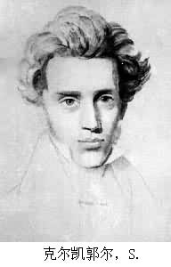

# 哲学帖副册之六——落跑新郎克尔凯郭尔

** **

1837年，日德兰半岛，丹麦。

安徒生此时已经发表了《海的女儿》、《丑小鸭》、《野天鹅》等一系列美丽又忧伤的童话故事。在这一年里，他又发表了小说《不过是个提琴手》。令他万万没有想到的是，自己的这篇小说竟会受到冷落。更令他痛心的是，在一本文学评论里他竟然被人无情地嘲讽：“安徒生更适合乘车去欧洲考察，而不是研究人类的情感史。”

许多年后，已经成为童话大师的安徒生都不忘在自传中调侃式地提起这件令他耿耿于怀的往事。而那位写下刻薄评语的评论家，正是另外一位丹麦人：克尔凯郭尔。

很多人喜欢电影《海上钢琴师》，片中那位孤独忧郁远离世俗，放弃爱情，沉浸在自己精神世界里的天才钢琴师的原型正是克尔凯郭尔。只不过，克尔凯郭尔不是一位天才钢琴家，他，是一位天才哲学家。

哲学家与女人的关系一直为后世所津津乐道。

这一点倒不是后世多八卦，而是因为贵圈存在着一个颇值得人玩味的现象：三分之一的哲学家都是独身主义者。比方说柏拉图、笛卡尔、斯宾诺莎、莱布尼茨、伏尔泰、康德、帕斯卡尔、克尔凯郭尔、斯宾塞、尼采、叔本华……

而哲学家与女人的关系也总是表现为一个悖论：远离女人似乎更能成为一个哲学家，可每位哲学家背后却似乎都有一位令他或魂牵梦萦或咬牙切齿的欲罢不能的女人。尼采有莎乐美，叔本华有他老妈约翰娜·叔本华，帕斯卡尔有夏洛，萨特有波伏娃……

克尔凯郭尔也有蕾琪娜。

当克尔凯郭尔和蕾琪娜订婚的消息传遍全城时，大家都感叹这一对小男女可真是郎才女貌，豺狼虎豹，匹配度极高。他二人出身皆是上流社会，一个是富贵才子，一个是锦绣佳人。另外，克尔凯郭尔又心仪蕾琪娜多年并主动求婚，郎有情，妾也有意，天作之合莫过于此。然而，天意向来高难测，订婚后的第三天，克尔凯郭尔就有了悔婚之意。接下来的日子里，克尔凯郭尔多次暗示蕾琪娜，想让她主动退婚，可陷入爱河的蕾琪娜兴奋地像只小鸟，忙碌地备嫁妆选婚纱印喜帖，未能领悟克尔凯郭尔之意。于是某天，纠结逡巡了很久的克尔凯郭尔痛下决心快刀斩乱麻，他将婚戒退回给蕾琪娜，并呈上一封拒信，这封拒信没什么特点，大意就是：“我不能使你幸福。”收到信后蕾琪娜震惊无比，苦苦哀求克尔凯郭尔回心转意，无果，克尔凯郭尔离意已决，一段美姻缘就此打住。

关于为什么克尔凯郭尔临阵脱逃，在一百个世俗人眼里有一百种世俗的解释，但真正的原因世俗之人却很难理解：克尔凯郭尔在灵与肉，世俗世界与精神世界的纠结中，选择了灵与精神世界放弃了肉与世俗世界，他把自己像祭品一样贡献给了上帝。

克尔凯郭尔（Kierkegaard），这个名字，在丹麦语中，除了有教堂的意思，还有墓地的意思。而克尔凯郭尔的书被取名为《或此或彼》、《恐惧与颤栗》、《畏的概念》……这一切的一切似乎向我们直观地传递了一个信号：克尔凯郭尔是一个纠结又不幸的人。

没错，克尔凯郭尔的肉体羸弱佝偻畸零，克尔凯郭尔的精神焦虑恐惧绝望，他把自己陷入孤独精神的泥淖中，愈陷愈深，难以自拔。

说起来，不幸的人大多都有一个不幸的童年。

克尔凯郭尔的父亲老克尔凯郭尔，曾是放羊娃，年轻困顿时他曾抱怨生活诅咒过上帝，中年发迹后，又在正房夫人去世的守丧期内，与丫鬟发生了不该发生的事。丫鬟有孕后， 为了孩子的名分，他娶丫鬟为妻。然而，作为虔诚的宗教徒，老克尔凯郭尔觉得自己的两次渎神行为罪大恶极。为此，他冷落妻儿，怀着强烈的原罪感，活在自己营造的森然抑郁的环境里。

对于小克尔凯郭尔来说，童年永远是一抹灰暗色：在这个家里母亲不像母亲，更像一个女仆，永远少言寡语逆来顺受；而父亲不像父亲，他永远表情阴鸷态度粗暴。他的童年残缺，没有爱。或许你我身边也有过这样的小孩，畸形的家庭，爱的缺失让他们过于反叛，很容易就走向极端：他们喜欢打架斗殴，滋惹是非，挑战秩序。如果克尔凯郭尔是一个体格健魄的孩子，他也许也会通过这样的途径反抗父亲的管束，发泄自己的情绪，可偏巧克尔凯郭尔又生的弯腰驼背，瘦弱如豆芽菜，他无力反抗。于是乎，一扇向外发泄的大门关闭了，而另外一扇向内的通向精神世界的大门，向他打开了。从童年起，克尔凯郭尔就远离人伦世俗，只活在自己的精神世界中。

老话有云：“三岁看老”，心理学的研究也早已表明，童年对一个人性格的形成至关重要。叔本华、克尔凯郭尔等哲学家悲催的童年提醒着各位男生：请务必善待自己的妻儿！提醒着各位女生：请爱自己的孩儿！哪怕世界会为此会少了一位哲学家。

赋予一个人生命的确伟大又崇高，但你们对待他的态度又将在某种程度决定他的一生。我宁愿世界多一位喜乐平安的凡人，也不愿世界多一位如克尔凯郭尔这般孤独绝望的哲学家。因为，他们活得实在太苦，太苦。

然而，上帝似乎不介意让克尔凯郭尔承受更多的苦难，克尔凯郭尔的母亲还有五个兄姐都先离他而去，而此时老克尔凯郭尔也已偏执到了极点，他固执地认为自己正在接受上帝的惩罚，上帝不会让自己的孩子活过33岁（耶稣33岁被钉死在十字架上）。步入暮年苟延残喘的老克尔凯郭尔经常借酒消愁，一日醉酒后他向克尔凯郭尔吐露了一个惊悚的秘密，这个a skeleton in the cupboard究竟是什么，我们现在不得而知，只知道又是父亲在性行为上的邪恶。得知秘密后的克尔凯郭尔行为反常性乖张，他从此决定不做天使，要做野兽。他开始远离神学和哲学，决心去拥抱新鲜热辣的生活和人群，并打算通过“犯罪”认识生活。他开始和一群纨绔子弟混在一起，泡酒吧混夜店进赌场。可这些只不过是放浪形骸却算不上“犯罪”，直到有一天，他终于违反了治安管理处罚条例。

那一天，他去了一个地方。

那个地方是人的动物性和欲望的原始场。

那个地方，叫青楼。

然而，克尔凯郭尔却失败了，没有人知晓那晚究竟发生了什么，只知道克尔凯郭尔在日记本上颤栗愧疚地仅记下了一句“野兽般的咯咯笑声”。

野兽，他身体孱弱没能力当；地狱门口，他徘徊又不敢进去，克尔凯郭尔的自我反叛最后以失败告终。从此后，上帝呀，上帝，一个青年再次虔诚地皈依于你，且发誓不弃不离。

请原谅我费了如此多的笔墨，讲述着关于克尔凯郭尔的故事。其实，在阅读哲学家的作品时，你就会发现，对于有的哲学家，你直接阅读他的作品即可而不必知道他的生平经历，但对于像克尔凯郭尔这样的哲学家，他的哲学作品几乎就是他的自传和心内独白。不了解他的一生，不足以把握他的哲学思想。

接二连三的苦难使得克尔凯郭尔一生的主打调就是：抑郁、怀疑、敏感、孤独、绝望。然而，当爱情降临时，当一个如圣母玛利亚般温柔光辉的女性能温暖他干涸的心房时，他又哆嗦地拒绝了。

拒绝了蕾琪娜的克尔凯郭尔开始在信仰的精神道路大步前进，而之前与蕾琪娜的交往，也成为日后克尔凯郭尔写作时的素材和持续不断的灵感土壤。无独有偶，另外一个推崇他，视他为精神邻居的文学家卡夫卡，也曾和订了婚的未婚妻退了婚。不过卡夫卡是退了又订，订了再退，折腾不休。克尔凯郭尔和卡夫卡的相似处很多：1.都是存在主义大师，基调都是孤独绝望；2.都有婚姻恐惧症，都有过退婚经历；3.生前都默默无闻，死后才名声大噪。

克尔凯郭尔死后将近一百年，他的思想才得以引起人们的广泛关注，各种理论流派都纷纷追认他为先驱。马克吐温曾写过一篇讽刺小说《他是否还在人间》，故事主人翁法国著名画家米勒，穷困潦倒，于是和几个朋友商量决定装死，他的朋友们借他快死的消息炒作鼓吹他的画，他“死”后画作价格果然青云直上。马克吐温借小说讽刺了人们对于艺术的势利态度。其实，又何止是在艺术界，在文学界哲学界也一直存在着这样的现象：作者生前受尽凄苦，死后作品方才洛阳纸贵。然而，在我看来，这并不能简单地归咎于世人的虚伪和势利，而是作为一个文艺工作者，他的作品和理论尽管是他所生活的那个时代的反映和精华.但有时，却总会前卫地超越他生活的时代，世人不懂，后人才懂，情有可原。

克尔凯郭尔死后一个世纪，人们惊讶地发现他竟然是一位三栖明星。他在存在主义、精神分析学说、宗教神学三方面有着过人的成就。存在主义三剑客雅斯贝尔斯、海德格尔、萨特，都承认克尔凯郭尔是领路人。正如他的书名《或此或彼》所要表达的，克尔凯郭尔的存在主义是一种选择，人只有在自由抉择中才能获得自己的本质。在克尔凯郭尔那里，存在不是一个名词，而是一个动作，只有人才谈得上“存在”。因为，只有人才会孜孜不倦地追问“我是什么”。存在是一种生动的活泼的个体的存在，而不是普遍的群众的存在，此外，克尔凯郭尔认为存在还有三境界。

存在三境界之审美阶段

代表人物：唐璜、浮士德

克尔凯郭尔在《或此或彼》的第一部分提出了审美阶段。这一阶段是一种感性阶段，追求的是感官的愉悦和刺激，在这一阶段并没有固定的道德标准和宗教信仰。比方说，著名历史人物唐璜就是这一阶段的典型代表。唐璜的人生态度就是享乐主义，他勾引女人，却又始乱终弃。他今朝有酒今朝醉，他的人生被肉欲和情感所支配。然而，审美的欢愉稍纵即逝，感官快感之后无聊与空虚便长驱直入。浮士德此时取代了唐璜，浮士德的人生态度是怀疑主义，怀疑终将吞噬一切，审美只能借助于绝望，人在极端绝望的情况下，“跳跃”（leap）到另外一个存在境界，伦理阶段。

存在三境界之伦理阶段

代表人物：苏格拉底

克尔凯郭尔在《或此或彼》的第二部分提出了伦理阶段。这一阶段突破了审美阶段的感性限制，人们开始追求德行和法则。伦理的人倾向于理性，信奉德行准则和义务。比方说，苏格拉底就是为了坚守良心和真理而放弃认罪，被判死刑。当弟子们认为判决不公，怂恿老师不去执行甚至越狱时，苏格拉底却选择了遵守法律，从而牺牲掉生命。

当然，伦理阶段并不完美，它有着自己的缺陷：普遍的伦理法则并不能体现个人的存在，也不能包容个人的具体行为，在《恐惧与战栗》中，克尔凯郭尔就提出了亚伯拉罕的难题：上帝命令教徒亚伯拉罕杀子，倘若亚伯拉罕杀了儿子那是不道德的不伦理的；可若是不杀，又违背了上帝。亚伯拉罕面对的道德困境正显示了人自身的有限性，于是再一次“跳跃”，步入宗教人生吧。

存在三境界之宗教阶段

代表人物：亚伯拉罕

宗教阶段的人已经摒弃了审美阶段的物欲与肉欲，也摆脱了伦理阶段中道德法则和伦理义务的束缚。人此时面对的，只有上帝。亚伯拉罕最终听从上帝的指示，含泪杀子。最后关头，上帝突然用一只公羊代替了亚伯拉罕的儿子，蜡烛瞬间点亮音乐轻轻响起，人们大呼“surprise!”上帝紧握亚伯拉罕的双手：“同志，恭喜你，顺利通过了组织的考验！”

亚伯拉罕在这场考验中，境界得到了升华。

在宗教阶段，人依靠的是非理性之外的神秘，是一种“荒谬”。宗教的人不是理性的人，是一种非理性的追求情感和意志的人；宗教的人也不是社会化的人，是一个个追求个性和自由，在人群中却依然感受到孤独的人；宗教的人更不是那些看似虔诚却又一无所知循规蹈矩的教徒们，他们说到底不过是遵循着教规和仪式的伦理阶段的人。宗教阶段的人，体验着人生的莫大痛苦，当痛苦到生活对他毫无意义，上帝就会降临。宗教的人，是“信仰骑士”，惟有信仰才能在荒诞偶然的存在中，仰天大呼“啊，请赐予我力量吧！”

克尔凯郭尔笔下的人，都是一个个非理性的个体，他们的内心生活痛苦神秘，不为外人所知。翻翻西方文明史，我们发现，人的自尊心曾遭遇了三次重创。第一次是哥白尼的日心说，哥白尼告诉人们，不要以为自己就是宇宙的中心，咱们赖以生存的地球其实是围绕着太阳转的。第二次是达尔文的进化论，他用大量资料证明了一个事实：人没有多神圣，不过是猴子变的，和其它一些动物也都是近亲。第三次是弗洛伊德的潜意识理论，人的一切活动的根本动力其实不是什么理性，而是动物性的本能冲动，非理性从此有了深刻的穿透力。

然而，克尔凯郭尔比弗洛伊德早了半个世纪。

克尔凯郭尔生活的那个年代，黑格尔同学的理性主义哲学在欧洲大陆上极为畅销。黑格尔建立了一个体系，在这个体系里，“绝对精神”经历了正——反——合，演绎出了世界，演绎出了世间万物。黑格尔的哲学强调普遍性而忽视个别，个人只有融入群众，成为世界历史，才能获得意义。所谓的个人的情感，离开历史，没有什么实在的意义。

克尔凯郭尔对黑格尔的哲学体系十分反感：你丫也太功利了吧，不愧是柏林大学的校长，可真会替官方搞思想政治教育工作。按照你的理论，每个人必须顺应历史顺应潮流，融入人群，才能获得意义。那我这样边缘化的人呢？我一辈子没正经工作，没结婚家庭，没生儿育女，没顺应主流，我是不是就没有存在过？

克尔凯郭尔狠狠清算了黑格尔的哲学：存在是荒谬的，个体是善变的，你用逻辑推演出一个坚固的体系，可人类的感情意志却超越逻辑。你以为你的体系是宫殿，可它并不适合人类居住。

克尔凯郭尔去世时仅42岁。和另外一位存在主义先驱尼采一样，他也晕倒在大街上，送入医院后不久就死了。克尔凯郭尔用自己短暂却苦难的一生证明了他不可复制的“存在”，他那孤独、焦虑、绝望、恐惧、颤栗的存在，他就是“那个个人！”（克尔凯郭尔的墓志铭）

此刻有谁在世上某处哭，

无缘无故在世上哭，

在哭我。

此刻有谁夜间在某处笑，

无缘无故在夜间笑，

在笑我。

此刻有谁在世上某处走，

无缘无故在世上走，

走向我。

此刻有谁在世上某处死，

无缘无故在世上死，

望着我。

————里尔克

克尔凯郭尔去世的那天是11月11日，如果他泉下有知，后世那么多单身小男女日后将会在这天热闹地过一个节，孤独惯了的他是《或哭或笑》，还是《恐惧与颤栗》呢？

 哲学帖下期预告：《马基雅维利：枪杆子里面出政权》  

（采编：应宁康；责编：徐海星）

 
