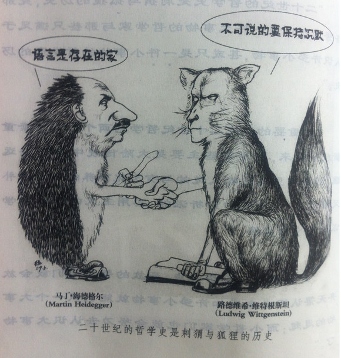
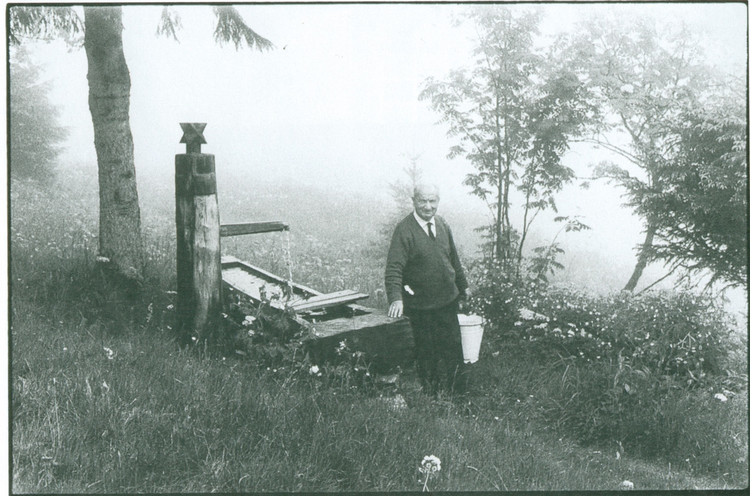

# 哲学帖副册之四——海德格尔：农夫、山泉、有点田

** **

“二十世纪的哲学史是刺猬与狐狸的历史，是那些努力想认识一件大事物的哲学家与那些只满足于认识许多小事物，甚或只是一件小事物的哲学家的历史。”

——怀特《分析的时代》

多瑙河静谧地流入大海；

黑森林在薄暮中愈发凝重；

托特瑙山的羊肠小道盘旋曲折；

斜光墟落，鸡栖于埘， 牧人驱犊返，猎马带禽归；

姑娘牵挂小伙，吟着：式微，式微，胡不归？

野老念着牧童，倚杖候于荆扉；

田园派哲学家海德格尔即此羡闲逸，怅然写下《存在与时间》。

其实，一切像极了旧式小说：穷书生天资聪颖，遇见恩师挚友，奋发自强，终于功名在手，声名鹊起，后娶妻生子成为教授，一切顺然，直到邂逅富家女学生。他二人，一个是中年才子才华横溢，一个是绿衣美人娇俏可人，试问开辟鸿蒙，谁为情种？都只为风月情浓。中年男子遭遇爱情，立刻被爱情狠狠撞了一下腰。师生情迅速升级为师生恋，干柴烈火，一发不可收拾：鸿雁飞信用密码写，约会偷情按步骤来：门敲三下灯关两下。很不幸的是，这份郎情妾意很快湘江水逝楚云飞，穷书生为了得来不易的功名利禄抛弃了女学生，并为了更高的利益沦为恶势力的鹰爪，他背叛师门，与挚友割席断交。小说最后陟罚臧否，当然是恶势力遭到围剿，惩善扬恶，穷书生幡然悔悟，恩师挚友情人也大度地原谅他，一幅港式大结局的温馨团圆画面，临了别忘了最后一句台词：“呐，做人呢，最要紧的就是开心。”

穷书生——————海德格尔饰

女学生——————汉娜•阿伦特饰

恩师———————胡塞尔饰（现象学大师）

挚友———————雅斯贝尔斯饰（代表作《历史的起源与目标》）

恶势力——————阿道夫•希特勒饰（友情客串）

关于海德格尔和汉娜阿伦特的爱情，我在哲学帖《美女 才女 痴情女汉娜•阿伦特》篇，曾站在女性主义角度给予了诠释。在哲学帖《海德格尔：农夫、山泉、有点田》中，我更想说的是，这场爱情不仅仅只是一对儿迷途男女的师生恋，它早已升华为哲学史上一次著名的哲学爱情事件。

海德格尔是一个来自农村的孩子，如果他活在今天，人们会亲切地称呼他为“凤凰男”。当这个脸上挂着两坨高原红，脚底粘着黑深林泥土的芬芳，从小因参加劳动而肌肉发达，穿着打扮极度具有城乡结合部特色的土包子初次踏入德国那高雅，文明的哲学圈子时，又有谁曾料到，这个山沟沟里出来的乡巴佬，有一天会撼动整个德国哲学界，成为自黑格尔之后，德国哲学史上最伟大的转折点。他的《存在与时间》尽管艰深晦涩，却承上启下，继往开来，成为念天地之悠悠，独怆然而涕下的一本伟大的思想深刻的旷世哲学著作。

人类的哲学其实是桃园结义的三兄弟，这三兄弟的名字分别叫做：本体论、认识论、伦理学。其中大哥本体论就是研究世界是由什么构成的。高中政治课上，老师会告诉你：“世界的本质是物质，桌子大树苹果都是物质，它们都由分子原子组成。”于是，那堂课后，我们中的很多人立刻成长为一个不信任何鬼怪神灵的唯物主义者，尽管我本人也是一个坚定的唯物主义者，但那时的我，却很认真地向老师提出了疑问：“老师，那物质又是什么？苹果桌子的原子分子借助工具都可以看得见，但物质这个东西却看不见摸不着，物质是抽象的概念，但概念属于意识呀，那世界岂不是由意识构成？”我的政治老师在蛋疼了几分钟之后，终于很淡定地给了我答复，他没有直接回答我的问题，仅仅用一个反问句就结束了我所有的疑问：

“xxx同学，我上次布置的政治作业你为什么还不交？”。

其实孩提时代的我们天生就是一个哲学家，我们对生死、天空月亮星辰、蚂蚁打架、仙人掌开花，都充满了好奇和疑虑，我们觉得世界充满了魔法与奇迹。然后，我们一天天长大，直到我们开始拒绝童话，直到大人用约定俗成的规矩开始灌输我们，直到教条刻板的政治课开始扼杀我们所有灵动的思维，直到我们对“为什么”再也提不起兴趣，直到……

直到我们也变成大人。

庆幸地是，那时，在我即将沉沦为冷漠的大人之际，我幸运地遇见了海德格尔的《存在与时间》，高中老师没答复我的问题，海德格尔一股脑地答复了我，并且充满诗意。海德格尔的《存在与时间》是一本告诉大家“存在是什么”的哲学书。存在问题，即“being”问题，从哲学诞生之日起，就令哲学家们魂牵梦萦。一部哲学史，就是一部being史，从泰勒斯认为世界的本原是水，赫拉克利特认为是火，毕达哥拉斯认为是数，再到苏格拉底的“一般”，柏拉图的“理念”，亚里士多德的“实体”，存在问题越来越演变成：“存在是什么？”当每一个哲学家都眉头紧蹙搜肠挖肚地想找出存在是“什么”，试图找到一个本体来解释存在时，存在本身却遭人冷落了。

海德格尔的“存在”德文是“Sein”，这个词在英文中被翻译为“being”，中文又将它译为“存在”，其实“Sein”不仅仅是存在的意思，它还有“是”、“有”的意思，将它翻译为“是”更加准确。在海德格尔看来，所谓的存在是水是火是实体，都混淆了一个概念：那就是“存在”与“存在者”。水火都是存在者，但不是存在。就如我手中拿着一个东西，我告诉你这个东西叫“书”，你于是可以说这个东西存在，但我进一步问你这个存在又是什么呢？你就难为情地回答不上来了。我们能捕捉到存在者，却捕捉不到存在，正所谓“道可道，非常道；名可名，非常名。”“存在”的意义就是一个过程，就是一个动词“是”，而“存在者”是一个名词实体。哲学的目的应该是追问存在者的存在，为什么存在？怎样存在？而不是苦苦纠结于“存在是什么？”。在海德格尔看来，“存在”与“存在者”，“是”与“是什么”的混淆，使得哲学史就是一部“存在”不断被遮蔽的历史，冷淡“存在”，过分亲热“存在者”，哲学早已误入歧途了。海德格尔这一思想后来被法国一个叫萨特的矮个子斜眼锉男继承地发展，这厮提出了一个名叫“存在先于本质”的命题，又写了几本关于存在主义的小说剧本，竟然风靡一时，后来连诺贝尔文学奖也主动向这厮示好，不聊，这厮竟然鼻孔朝天地拒了人家，这厮的妹纸还是个赫赫有名的女权主义战士。

花鸟鱼虫、飞禽走兽、木石山林，尽管存在，但它们从未意识到自己的存在，存在的意义不是仅仅是能够成为存在者，而是“为存在本身而存在”，这个意义的只能在人的身上显现出来。海德格尔专门给人起了个名字叫“Dasein”，中文名叫“此在”。我们先在此简单地回顾下关于人的哲学史吧：

Id女娲（女神，干嘛呵呵去洗澡）：人是我用泥捏出来的。

Id柏拉图（想出柜了）：人是没有羽毛的两足动物。

Id第欧根尼（犬儒帮九袋长老）：楼上，哥家冰箱里有只褪了毛的鸡，这就是人？

Id亚里士多德(吾爱吾老师，吾更爱真理) ：人其实是理性的动物，lSS我爱你，耶~

Id培根（哥不是香肠腊肉）：人是万事万物的中心，是世界之轴。

Id马克思（人家的信用卡又刷爆了，恩格斯快救我呀）：人的本质是社会关系的总和。

Id叔本华（我家狗狗“世界精神”终于不掉毛了）：人的本质是欲望，咦，黑格尔人呢？好久没骂丫了。

Id卡西尔（哲学人类学有点意思）：我弱弱地说一句，人是符号的动物吧。

Id海德格尔（仰视元首希特勒的手）：人就是“此在”。

在海德格尔看来，要理解《存在与时间》，必须先理解“此在”，也就是理解人，因为只有人能决定自己的存在，知道自己何去何从。人不仅关心自己的存在，也关心其它存在物的存在。“此在”通过存在者的三种存在方式，将世界密密麻麻地展开，勾勒。这三种存在方式分别是“工具的在”，“现有的东西的在”，“世界的在”。举个例子，人需要穿衣，制造衣服需要针线等工具原料，这些工具就是“工具的在”；紧接着，衣服又会引出棉花，棉花就属于“现有的东西的在”；而棉花又会引出大地、土壤、河流、天空，于是引出“世界的在”。

电影《被嫌弃的松子的一生》一句台词：“生而为人，对不起”不禁让我恻然有所感。人生在世，善恶、真假、美丑、生死，有无永无间歇地殊死搏斗着，而人的本性就是“畏”与“烦”。“畏”(Angst)，不是一般意义上的畏惧害怕某个东西，抑或畏惧某个关系网会产生的结果，而是畏惧“畏惧者就在这个世界之中”，说白了，畏毫无对象，漫无目的，是一种无名恐惧。人在畏面前，一片空无，正是因为人作为时间性的存在者随时随地都可以死去，畏才使得生存可以在死亡面前披荆斩棘，杀出一条血路。 “烦”（Sorge），又被译为“操心”，人们活在世上，与物打交道叫做“烦忙”，与他人打交道叫做“烦神”，在烦忙烦神这一过程中，人总是容易失去自己的个性，有人开始迷失失落，有人变得千人一面人云亦云，人们开始丧失自己的本身，开始“沉沦”，沉沦为一个毫无特点的单面人。海德格尔的这一思想后来又被法国那个矮个子斜眼男继承地发展，提出了“他人即地狱”的著名论断。

人以“沉沦”的方式存在着，胆怯懦弱逃避，似乎沉沦为“常人”就能找到他们的“家园”，就能躲开恐惧，可殊不知，那无名的畏惧就是奥特曼，而人永远是小怪兽。小怪兽上穷碧落下黄泉，都逃脱不了奥特曼的追打，就如人上天入地也逃不过一死。人到底要死，但生存的意义正是“向死而生”，死亡的可能性唤起了生存的真正意义。人的超越性使得人能够通过对死亡的领悟而通向本真。

因为生，人走向沉沦；

因为死，人走向澄明。

桃花谢了春红，太匆匆，无奈朝来寒雨晚来风。《匆匆》里说：“洗手吃饭默默时，日子就溜过去了”。小沈阳说：“眼睛一睁一闭，一天过去了；眼睛一闭不睁，一生就过去了，hou~”海德格尔说：“此在的存在即时间性”。传统的时间观认为：时间游离于人的生存之外，由过去，现在，未来三重解构组成。过去是已经发生了的现在，未来是尚未发生的现在，时间是一个线性的流逝过程。而海德格尔却认为真正的时间不是过去现在未来依次交替的线性过程，而是不分过去现在未来的一种循环。在海德格尔那里，过去，现在，未来被叫做“曾在”、“当前”、“将在”。人并不是作为现成的存在者而存在，人没有事先定义好的本质，人总是不断地选择、创造、，超越着自我，故而人的本质正是他一辈子生生不息所做作为的总和。“曾在”、“当前”、“将在”三者的牵引，使得人这个此在因为存在，而成为曾在。人生当应“寄蜉蝣于天地，渺沧海之一粟，携飞仙之遨游，抱明月而长终。”真正的时间并不在乎长短，一瞬间即可以澄明一段人生。

的确，人面不知何处去，桃花依旧笑春风。

咫尺，天涯。

瞬间，永恒。

至此，海德格尔将时间与存在融为一体，完成了他那本思维广袤深邃，遣词造句变幻莫测，语言独特晦涩的20世纪划时代的哲学著作《存在与时间》。

因为纳粹事件，晚期的海德格尔隐居在黑森林的小木屋内，深居简出。人初静，月初吐，荏苒盈虚，澄澄今古，农村娃儿海德格尔终于回归大地，解脱精神，摆脱牢笼，开始试图为自己，为哲学找到一个宁静的“家园”。他开始用“思”和“诗”来代替对“此在存在”的分析，用“语言是存在的家”来取代“时间本身就是存在的境遇”，他提出了“诗人哲学家”，人类应该艺术地生存，而不是技术地生存，并借用荷尔德林的诗来告诉大家“人，诗意地栖居吧”。

对于海德格尔，我总是很难用一个定语去修饰他。也许，海德格尔有先见之明，他担心自己的一生的种种劣迹会遭人逅病，于是，他在讲课时，对哲学家的生平显示出极度冷漠。他在课上讲亚里士多德，就一句话“亚里士多德出生，工作然后死去。”委实，作为一个自然人，海德格尔是彻头彻尾的卢瑟，当他向纳粹投怀送抱的那一刻，他被人唾骂的下场早已注定，尽管从海德格尔的生平来看，我们能理解农民气质的他，对土地的热爱会很容易成为狭隘的民族主义者，又或者，如海德格尔的门徒为他辩护的那样：海德格尔一介书生不懂政治；海德格尔当了纳粹大学的校长也是为了不让别的纳粹分子成为校长；海德格尔当校长是为了推行他的哲学主张，等等等等。无论这样的借口还有多少，然而，海德格尔为了利益，投靠纳粹助纣为虐，在危难中弃自己的犹太老师胡塞尔，犹太恋人汉娜阿伦特，朋友雅斯贝尔斯于不顾，我们就可以看出，海德格尔的确不是一个高尚的人，没错，他是一个小人。

尽管自然人海德格尔臭名昭著，但哲学人海德格尔却令人动容，他早期走出神学的牢笼，研究哲学；中期被纳粹抛弃后，爱上浪漫诗人荷尔德林的诗；晚期隐居在云深不知处的黑森林里研究咱们老子的《道德经》，海德格尔人生的每一阶段都散发着思者的智慧，所向披靡，于是你不会再讶异为嘛儿富小姐汉娜•阿伦特会爱上这个大老粗。海德格尔在哲学史上的地位非常之高，他承上继承了尼采、叔本华的悲观主义哲学路线，又启下了汉娜阿伦特、伽达默尔、马尔库塞等一批自己的学生。福柯曾说过，海德格尔是对自己至始至终最重要的一位哲学家，他的哲学发展全是拜海德格尔所赐；哈贝马斯认为海德格尔的哲学是自黑格尔以来德国哲学最重要的转折点。

读海德格尔的哲学，总有种力量，让我想哭。老子说，天地不仁以万物为刍狗。子贡对仲尼说：愿有所息。孔老二答道：生无所息。不错，人一生劳作如蝼蚁，生无所息。天下熙熙皆为利来，天下攘攘皆为利往。有的人仰望苍穹，生命升华；有的人选择沉沦，生命在时间的氧化中萎顿。白云苍狗，苍穹微尘，我们人类踽踽而行。然诗无邪，诗，是人们在死神统治下的奉献和清醒，人生如诗，哲学如诗，我们都是怀着浓浓乡愁的游子，去寻找灵魂得以栖居的家园。20世纪两次世界大战核技术互联网转基因试管婴儿整容术，当技术早已不是“去蔽”而变成冷冰冰僵硬无色彩的流水生产线，当21世纪痛苦冲突鏖战照样不间断地上演，于是，真理的敞亮，诗意的栖居愈发弥足珍贵。

英国发生工业革命之时，法国发生着政治革命，德国发生着哲学革命。德意志这个民族孕育了引无数哲学好汉竞折腰的哲学巨擘：康德、黑格尔、叔本华、尼采、海德格尔……但这样一个民族却又能全民打造出一个嗜血杀手希特勒。也许这正应了那句话：

德意志，要么拷问世界，要么拷打世界。

哲学帖下期《胆小鬼笛卡尔》

（采编：徐海星，责编：徐海星）

 
