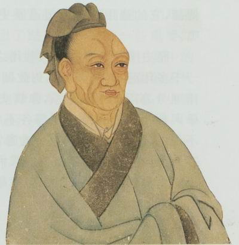
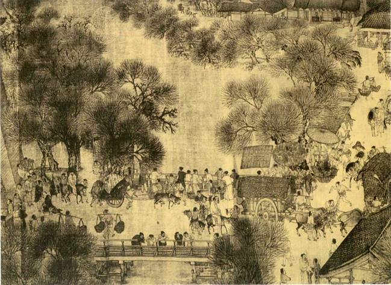

# 商业资本的理论史考察及其进入农业的意义

** **

### **前言**

商业资本理论作为剩余价值分配理论的重要组成部分，通过剖析商业资本的地位和商业利润的来源，揭示商业资本的运行机制。早在汉代，商业资本从简单商品流通中产生：通过对商品贵卖贱买，商业资本同时占有小生产者和统治阶级的剩余产品。进入现代社会后，中国对农业出台扶持政策，促使商业资本纷纷上山下乡。回把握业资本运行机制对于中国引导商业资本参与农业现代化建设具有积极意义。

#### **一．司马迁与马克思商业资本理论比较**

早在资产阶级经济学家考察商业资本运行机制之前，西汉史学家司马迁在《史记＊货殖列传》中通过总结商人的功绩，建立市场预测理论，商品购销理论和绩效评价理论。后来，重农学派将资本主义社会商业资本当作一种特殊的产业资本考察其运行机制，从而未能如实反映资本主义生产关系。马克思在考察产业资本运行机制的基础上考察商业资本运行机制，从而厘清商业资本的地位和商业利润的来源。

在将货殖界定为以增加财富为目的经营货物后，司马迁一反中国重本抑末的传统，从多方面论证发展商业的重要意义。在他看来，致富代表人的本性，因而否定商品交换的观念是不可取的：人们应该通过经营冶铁，稼墙，渔盐等行业，成为商战中的成功者。范蠡，子贡，白圭等经商成功的人士无不是将各自资本用于生财的典范。同时，司马迁以品性为标准将致富分为本富，末富和奸富。前者取决于自身经营能力，因而是正当的，后者取决于违背公序良俗，因而需要被取缔。

基于对发展商业重要意义的肯定，司马迁提出市场预测理论，商品购销理论和效益评价理论。在他眼中，无论子贡根据物以稀为贵的准则看准贵卖贱买的时机，还是白圭将木星运行状况与庄稼收成丰歉相联系，都为他们正确预见行情起到关键作用。由于市场预测的落脚点在于建立购销关系，所以商人需要根据供求状况判断价格涨落，进而加快资金周转。此外，司马迁通过将商业经营成果与千户候占有的剩余产品类比，得出利润是评价商业经营成果的一个重要指标的结论。

马克思认为资本主义社会商品流通规模扩大要求产业资本家建立庞大的商业网，从而为商品资本向商业资本转化创造条件。为了增加雇佣商业职工，产业资本家必须增加投在流通领域的预付资本，从而降低利润率。由于一定资本总会充当商品资本，所以产业资本家可以与商业资本家各司其职：前者专注于剩余价值生产，后者专注于剩余价值实现。商业资本家以向产业资本家预付货币资本为条件获得商品，再以出售商品的方式回笼货币，从而完成商品资本向货币资本转化。

虽然商业资本不参与剩余价值生产，但是商业资本以独立的资本形态参与商品流通，可以起到缩短流通时间，扩大生产规模和提高利润率的作用。由于商业资本周转不受个别产业资本周转影响，所以商业资本家可以同时为多个产业资本家销售商品，从而在同一时间内完成数倍于产业资本的周转。同时，商业资本家可以集中经营商品，由此节约的商业资本将进入生产领域，以提高剩余价值与预付资本比例。

#### **二．汉代商业资本进入农业和相关产业的动因和表现**

继中国于战国时期确立土地买卖制度后，土地交易在汉代以前所未有的规模开展。由于封建制国家保护土地买卖合同，所以农民获得将土地卖给商人的激励，促使商人加大投资农业力度。在文景盛世到来之前，土地兼并在楚汉战争后长期经济重建制约下尚未使农业危机浮出水面。随着汉末商人加紧与官僚和地主勾结，商人投资土地成风必然使土地兼并愈演愈烈。即使统治者采取一定限田措施也无济于事。

**（一）投资土地有助于提前收回投资**

汉代自然经济占据统治地位，促使商人将资本投向土地来早日收回投资。虽然汉代官营企业和前朝相比获得大发展，但是它们在工商业中占据比重依然微不足道，决定商人基本上不会将资本用于经营这类企业。土地作为一种生产资料，具有生息资本的性质，意味将土地与资本结合可以成为一种有利的投资方式。投资土地不仅能带给商人地租，而且能让他们获得一种安全的不动产——不像一般财物那样容易灭失。换言之，投资土地兼备收益性和安全性，因而受到商人青睐。

**（二）投资土地有助于减少破产风险**

与此同时，汉代推行严酷的重农抑商政策，促使商人将资本投向土地来避免破产。汉代统治者不但禁止商人经营许多重要商品，而且规定他们不得做官和充当发配边疆的对象。在这种情况下，商人在扣除用于满足温饱，享乐需要，维持简单再生产和发放高利贷的开支后，只得将个人财产用于购置土地来扮演地主角色。由于兼有商人和地主身份可以聚敛财富和掌握权力，所以汉代逐渐形成官僚，地主，商人三位一体的局面，更不用说地价稳定意味商人具有稳定的地租收入。

**（三）在经营采矿业中倾向于雇佣奴婢**

中 国从战国时期开始在采矿业上突飞猛进，使汉代商人看好采矿业投资前景。在经营采矿业中，汉代商人不但大量雇佣农民从事开采和冶炼，而且雇佣大批奴婢从事这些事务。由于雇佣奴婢成本－效益比往往低于雇佣农民和奴隶，所以汉代商人尽可能多地雇佣奴婢来提高回报率。在从经营采矿业中获得巨大利润后，商人将其用作借贷资本，使得高利贷前所未有地在民间盛行。只是汉代高利贷不像资本主义社会的那样多在生产盈利，所以收取高额利息必然加剧债务人负担。

**（四）商业利润的本质不为剩余价值**

不难想见，汉代商业资本运行机制和资本主义社会商业资本运行机制大相径庭。姑且不论汉代商业利润和产业利润都不来自劳动者创造的剩余价值，从而无法让平均利润规律发挥作用，汉代商业资本大量被固定于土地，不利于商品价格随商业资本周转加快而降低，即商业资本周转缓慢不利于降低单位商品加价程度。当然，汉代商人不占有雇工剩余劳动，决定汉代非生产性流通费用并非从剩余价值中扣除。

#### **三．当前国内商业资本进入农业动因和表现**

虽然重农抑商政策废止使今日中国商业资本和汉代商业资本不可同日而语，但是两类商业资本在逐利本性上并无二致。表面上看，属于弱质产业的农业缺乏比较利益，因而难以迎合商业资本盈利偏好。实际上，当代中国农业在相关技术创新和制度创新推动下经历华丽转身，对于商业资本的吸引力大大增加。在克服农业发展资金瓶颈的同时，商业资本大量进入农业使种子，粮食，瓜果等市场规制遭遇窘境。

**（一）现代农业利润率高于平均利润率**

不同于传统农业利润核算局限于初级农产品生产，现代农业利润核算囊括初级农产品生产，加工，储存，销售。换言之，现代农业利润核算涉及整个农业价值链和实物链，意味农业利润率未必低于其他行业。事实上，国内粮食在经过深加工后形成的附加值往往大大高于粮食本身价值，使得中国不少地区农业利润率高于30%，而全国平均工业利润率不足6%。加上国家在取消农业税后对农业采取四补贴措施和全球农产品价格持续上涨，商业资本进入农业自然有利可图。

**（二）现代农业类似资本密集型行业**

由于现代农业具有高技术含量和商品化程度的特征，所以发展现代农业需要大量物力资本和人力资本投资。相比于农户数额往往不大的自有资金，商业资本能以强大的增值能力提高农业物力资本和人力资本投资水平。商业资本可以在确保规模经营的前提下与先进农业科技结合，从而更新作物品种，升级水利设施和打破农业生产的季节性约束。在从农业经营各环节寻求利润的同时，商业资本可以参与农村道路，医院和学校等公共工程建设，从而推动农村全面建设小康社会。

**（三）地方政府积极参与农村土地流转**

随着商业资本日益来到国内农村拿地，地方政府介入土地流转的倾向大大增强。许多地方成立土地流转服务中心，负责集中土地，寻找业主，商定价格等。中国法律尚未禁止商业资本以承包和租赁的形式占有农业用地，与发达国家限制商业资本进入农业形成鲜明对比。虽然中央18号文件不鼓励企业到农村圈地，但是地方政府出于创收的考虑，对此置若罔闻，使商业资本顺利进入农业。在这种情况下，农民自愿流转土地多变成政府强制流转土地，从而引发大量征地纠纷。

**（四）商业资本改变农地用途危害凸显**

商业资本为了增加农业利润，不但会增加农业经营规模，而且会改变农地用途。固然，商业资本在农村拿地可以通过疏通农业生产和流通渠道，推动农业实现纵向一体化发展。然而，不乏企业在农村圈地后将其用于修建旅社或改种经济作物，从而有悖国家保障粮食安全的目标。这样，年长农民在出让土地后往往遭遇再就业难题，以致只得以租金作为唯一收入来源，何况农村生活成本上升使其入不敷出。

### **四．引导商业资本进入农业的政策定位**

商业资本进入农业在缓解农业资金短缺的同时，引发日益升级的征地纠纷和相关问题，意味商业资本进入农业如同一把双刃剑。企业到国内农村圈地既能盘活农村市场，又能让农民沦为雇佣劳动力，表明商业资本进入农业为中国解决三农问题带来机遇和挑战。无论结合司马迁和马克思的商业资本理论，还是依据汉代商业资本进入农业史实，国家在引导商业资本进入农业中必须以保障农民土地权益为中心。

**（一）鼓励商业资本成为农业升级的推动者**

毫无疑问，商业资本作为商品资本的转化形式，由于不参与价值创造，而属于非生产资本。不过，这不是说商业资本无法以流通资本的身份搭建价值创造和价值实现之间的桥。商业作为一个与农业和工业并列的经济部门，通过实现农产品价值和使用价值，确保农业再生产顺利进行。认识到商业发展与农业发展之间的相关性，发达国家基本上鼓励商业资本参与农业升级。既然如此，中国应该深入推动大而全，小而全的农业经营协作化发展，以便为提高农业附加值铺平道路。

**（二）从完善市场体系着手深入改革流通体制**

不同于具有完善流通体制的发达经济体，中国尚未建成发达的市场体系，从而延缓流通体制改革进展。国内农产品市场和其他市场一样充满不正当竞争，如发布虚假广告，贩卖伪劣商品，盗用他人商标等。由于农产品和其他市场都无法依靠自发秩序规范运作，所以中国必须加强农产品市场行政规制和法律规制。除了加强农业经营者征信体系建设外，中国还应该健全农产品储备制度和风险基金制度和价格保护制度，从而推动统一，开放，竞争，有序的农产品市场体系形成。

**（三）打破地区封锁来避免农产品无序竞争**

农产品销售利润貌似来自农产品加价，实则来自农业劳动者创造的剩余价值，表明农产品销售利润是商业资本家凭借预付资本获得的平均利润。农业资本家和商业资本家以资本转移的方式竞争，从而使农业和相关产业利润出现平均化趋势。只有在具有完善市场规制法的前提下，农业资本家和产业资本家才有望合乎公允地转移资本，否则难免加剧农业资源低效配置，城乡收入分配不公，农产品和相关产品价格大起大落。这要求中国在打破农产品市场地区封锁上苦练内功。

**（四）预防资本垄断农业来减少农村纠纷**

商业资本进入农业后带来技术改进往往以资本替代劳动力为代价，从而为资本垄断农业创造条件。在失去若干年土地使用权期限内，农民非但无法依靠事农桑过上自给自足的生活，反而必须到非农产业就职来获得生活来源。商业资本和地方官员对农民的共同压榨导致许多农村出现偷盗与防盗，入境和驱逐之间的矛盾。在国内依然依然有超过6亿农村人口留守故土的情况下，中国不应忽视防治资本垄断农业。

 

### 【参考文献】

 ［1］付强：《漫谈西汉商业资本的畸形发展》 ［J］. 《读写算》 2010，（27）：55-58 ［2］黄宗智：《小农户与大商业资本的不平等交易：中国现代农业特色》 ［J］. 《开放时代》 2012，（3）：35-39 ［3］吕亚荣，杨春超：《工商业资本进入农业与农村的土地流转问题研究》 ［J］. 《华中师范大学学报》 2012，51（4）：62-68  原文链接： [http://blog.renren.com/blog/393322011/883245376](http://blog.renren.com/blog/393322011/883245376)  

（采编：彭程；责编：彭程）

 
