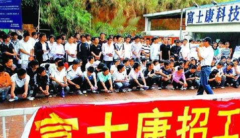

# 嘉兴路8号的日与夜（上）

**当时的他感到困扰，但并不抗拒，与他绝大多数同学不同，李晔是极少数在进入富士康前就对富士康这家低调的公司有相当了解的人。李晔喜欢IT行业与网络，所以很早就知道这家隐形巨头，在入校后选择加入“富士康定向专班”也并非与其他人一样抱着“能多学一门课程”或是贪图额外的富士康助学金，而是出于对自己未来工作打算的目的作出的决定。但在这时，他并不明白他将要面对的是什么样的生活，仅仅是出于相当单纯的想法，“我希望能尽快拥有收入自立”。**  

# 嘉兴路8号的日与夜（上）

## 文/姚昕毅（威海职业学院）

  **周六 凌晨4:25 烟台富士康生活区宿舍**

李晔觉得有些疲惫，决定给自己冲杯麦片，杯子就在电脑桌上左手边，麦片在一步外的衣橱内，开水出门右转十三步，二十四小时无限量供应。

富士康的生活区宿舍像一个蜂巢，质密而合理，任何一个房间到饮水机的距离不会超过三十步，每台饮水机上都会有两个引人注目的标签，一个是“请勿注视，内有紫外线杀菌灯管”一个是“滤芯定期更换记录”，这构成了一个合理的保证，让你确信，你的健康公司也会替你负责。

实际上公司负责的不止这一点而已。

李晔接下来要上长达三周的夜班，根据他的经验，他习惯提前两天开始调整生物钟，用他自己的话说，他要“出国”了。

回到屋里，二十平米的房间里住着六个人，四台电脑，因为都是年轻男性，而且刚过完周末，屋里很乱，但其实并不拥挤。因为房间朝北，采光较差，所以屋里总有一种霉菌生长的气味，混合着屋角垃圾篓里腐坏的零食以及体味，让刚刚在外面进来的李晔感觉稍有些不适。

李晔在一年前一个匆忙的夏天来到这里，当时他是他所在大专“富士康合作班”的一员，在五月的一天他被通知，十天后他与专班的所有成员必须前往富士康烟台公司做为期一年的“实习”。在未来的十天内他必须参加提前举行的大二期末考试，补完所有毕业所需的“课程绩点”，完成所有毕业手续，整理行李，并清空宿舍。

当时的他感到困扰，但并不抗拒，与他绝大多数同学不同，李晔是极少数在进入富士康前就对富士康这家低调的公司有相当了解的人。李晔喜欢IT行业与网络，所以很早就知道这家隐形巨头，在入校后选择加入“富士康定向专班”也并非与其他人一样抱着“能多学一门课程”或是贪图额外的富士康助学金，而是出于对自己未来工作打算的目的作出的决定。但在这时，他并不明白他将要面对的是什么样的生活，仅仅是出于相当单纯的想法，“我希望能尽快拥有收入自立”。

两个星期后他搬到了现在的这个宿舍，居住至今。

 **周六 凌晨5:30 富士康生活区宿舍**

张敏推开门，看到李晔还没睡，毫不惊讶，无声地挥挥手打了个招呼，然后把袋子里的东西递给李晔，那是一个冒着热气的煮玉米。

张敏刚刚下班，富士康的夜班与白班几乎毫无差异，只不过是以晚上8点为起点，张敏下早班，凌晨五点，生活区的餐饮街的商人们刚开始起火做饭，张敏吃腻了，所以在路边购买了旁边村民偷偷售卖的煮玉米。

每一个富士康厂区都建设在城市的远郊，周围都曾有着荒芜的农田跟村落，而随着富士康的生长，周围的村落几乎也在朝夕间改变了面貌。

几乎所有的村民都投入了商业与服务业，小到张敏刚刚购买的煮玉米，大到各种非法运营的黑车、简陋的网吧、美发屋、餐馆、各种小商品店，几乎每一家村民都购买了汽车，建起了崭新的二层楼。

金钱总伴生着矛盾，在烟台富士康的员工间口耳相传着各种“传说”，某人下夜班抄近路走，被人抢劫，某人在黑网吧里被人奸杀，某人在某理发店被黑了几百块。官方也早已发布了很多通告，例如禁止坐黑出租，一经查出记过处理。

为此，张敏的下班路要绕道多走很远的路才能回到生活区，本来有一条直线的近路，但公司在厂区与旁边的村落之间围起了长长的铁丝网，彻底切断了这条路线。

但张敏还是很高兴能买到玉米，尽管只有夜班的早班才能买到，因为那位村民只被允许在早晨六点之前在生活区必经的路口售卖，这是保安与他达成的妥协默契。

 **周六 早晨6:00 富士康生活区宿舍**

李晔觉得时间差不多了，于是叫醒林乾，然后去睡觉了。

林乾跟李晔，是同学，一起来富士康实习，进入同一个车间，但在不同的岗位上。

林乾罕见地保留着在学校养成的良好习惯，穿衣、叠被、洗漱。

洗漱间很快挤进了几个人，然而水流很小，富士康出于为了禁止员工洗衣与防止浪费水的目的，把所有宿舍区的水流都调的很小，每到早晨洗漱，林乾都觉得这是一种折磨。

出门前林乾抄起几件衣服，准备到楼下送洗，富士康提供免费的洗衣服务，一方面方便了员工，一方面节省了用水，所有衣服只需要第一次投洗时添加编号，之后只需要投入衣箱，就有专人取衣，送洗，分拣。

林乾在走廊上依次敲响几间门。很快几个人走出来，他们都是同学，在同一个车间工作，每天如果不是白夜班分开，都会一起去上班。

几个人嘻嘻哈哈的出门，每个人都没有忘记带上厂牌，在富士康，没有厂牌寸步难行。

从宿舍区到他们工作的车间，步行需要四十分钟，这还是在早晨可以走厂区内近路的情况下，烟台园区在富士康全国的园区中排第三，整个园区的两个极点之间的步行距离接近一个小时。所以每天早晚的上下班高峰，园区内会有专门的摆渡车运送跨区上班的员工。然而每天坐摆渡车，都必须排200多人的长队，让不少小伙子望而却步，例如林乾，如非冬季结冰积雪或是天气异常，林乾都不会坐车，而且速度差不多，因为出于安全考虑，厂区内所有的机动车速度禁止超过15公里每小时。

从宿舍到林乾所在的工作地点，林乾要经过五道警卫岗，在任何一处，警卫都有可能查验他的厂牌。厂牌上有按月变换的镭射标签，经常有人因为忘带厂牌或是忘记更换标签而被扣留或是禁止通行，按照富士康的规定，课级以上可以签字临时批准员工进入，理级以上免于检查，高级台干（台湾干部）还会受到警卫的敬礼待遇，如何分辨高级台干？林乾来到这里的第二个月就无师自通，快步、眼镜、白发、运动鞋、双肩背包。

 **周六 早晨7:55 富士康某事业群某车间门岗**

王谨每次进入车间前都会下意识地摸一下自己的口袋，他不止一次地把自己的手机带进车间了。

这是很大的麻烦，出于保密考虑，富士康禁止员工携带非简易手机（无摄像头、无储存功能）进入三线门岗，即使是无储存功能的简易手机也必须经过批准贴上特殊标签后才被允许携带，简单理解就是可以把自己的手机带进厂区，但不准带进车间，违者可能开除处理。

所以更衣室里大家都会拿出手机，关机放进金属衣橱内，换上防静电服，进入车间。

王谨还记得第一次手机被误带进车间的经历，那时他刚入厂不久，一次他因为迟到，急匆匆地进入了车间，而直到他再次出门扫描的时候金属探测器在口袋的位置响了。警卫扣留了他的手机与厂牌，并让他写下了一份声明，“本人在明确公司规定的情况下，擅自携带手机进入厂区，停留时间**时-**时”，并签字。

当时他吓坏了，因为警卫一再警告他，私自携带手机会面临最低记过最严重开除的惩罚，这全看部门主管的意见。

最终，他被记过，事实上很少有人真的因为这件事而被开除，但他的手机在一个多月以后才通过重重申请取回，而这部手机已经接受过各种检查。

而后主管私下里告诉他，不要那么死脑筋，如果不小心带进来了，可以告诉课长或是他，课长以上有权利免扫描进出，除此之外，便只有孕妇拥有这项特权。

 **周六 上午9:05 富士康生活区公交车站**

林可今天请假了，理由是身体不舒服，实际是她想休息。

在此之前，她已经连续上了28天班，在每年的9、10月份，几乎所有的事业部都会加班，每一个人都会获得丰厚的回报，一个一线工人可以获得4-5千元的收入。

对于加班，与外界想象不同，绝大多数富士康员工都非常希望加班，这源自富士康的薪资制度，没有奖金、没有计件绩效、没有额外津贴、很低的基本工资，但加班费严格按照国家标准支付。基于加班费的倍率，很少有人会放弃双休日可以获得的加班时间，更别提在9、10月份会额外奖励无一日请假的员工的几百元全勤奖金。

林可还记得她初来这里时非常排斥加班，在一线工作，经常意味着12小时手脚不停，车间里没有可供休息的椅子，实际上有也没用，因为你的工作任务迫使你根本没有休息时间。

但现在的她对于请假则有一种负罪感，她已经不再是一线员工，基本工资提高意味着一天的加班费收入让她难以无视。但她也实在受不了了，她来自城市家庭，少年时期未吃过苦，来到富士康她见识到了一个完全不同的世界，尽管她已经习惯高强度的工作，但像之前那样连续几十天工作，还是让她感觉吃不消。

这并非是体力不济，而是纯粹精神上的负担。

每个人都知道，在每年的这个时候，即使是工作多年的老员工都会变得脾气暴躁起来，连续重复积累的工作压力，即使是丰厚回报的诱惑都显得软弱无力。

请假却也不是那么难，事假是绝对不批的，但病假无论如何都是可以请的，尽管主管会再三强调，如果没有医院的证明，绝对按旷工处理，但有经验的员工都知道，花几块钱在生活区医院挂号并形容一下感冒发热症状，医生会很不耐烦地给你开一些感冒药，并替你写好病历，这意味着可以以此销假。

在近乎所有人都被要求加班的9、10月份，富士康生活区公交站点人很少，这是非常罕见的，绝大多数时候，这里经常会等三到四辆车才能挤上。烟台园区有十万员工，有接近一半在园区生活，在此人口基数之下，一切事物都难以用常规思路度量。

在富士康专门有部门负责与开发区公交部门协调交通，为此延长了一些线路使公交车可以直接到达公司园区，增加了有些线路的班次，有些线路还会在工作日上下班期间特别改变线路。但即使如此，租住在开发区的人也永远会抱怨早晨的交通，拥挤的让人窒息。这或许是个无解的难题。

 **周六 上午10:15 富士康某事业群某车间办公室**

林乾一天的工作做完了。

林乾的工作是生管，负责生产计划的安排和协调工作，在他手上控制着S客户某游戏机产品返修电路板的生产计划与全部产品的物料计划。他只是一个刚毕业不到一年的大专生，但如果他的工作出现错误，将会导致全球热销的某款电子产品的断货。

但事实上他不可能犯错，因为这份听起来很复杂的工作其实简单的无以复加，林乾常常在想，如果找来一名高中生来做，大概也能做的很好。

因为高度的分工化与模式化，富士康善于分工，不止在生产部分，行政辅助岗位也是同样的运营哲学，把工序高度解剖细化，并且形成高度程式化的解决方案，对于任何一个人来讲，犯错都是一件不容易的事情。

所以看似复杂的生产安排，对于林乾来讲，无非是收集生产数据，物料供应数据，然后把数据整合到表格里，根据后段需求计划的变动做轻微调整，整个活动类似某种机械运动，他经常想，他每天的工作其实完全可以由一个编写好的程序代替。

没有这么做的全部理由大概是程序不会处理意外吧，然而所谓的意外，林乾一个月也不一定会遇到一次，或是因为天气原因某物料到货时间异常，或是生产上有些问题，每次出现这些事情，他都会比平时兴奋的多，然后整个办公室的气氛也好像突然活起来了一样，然而从未出现过实际生产上的影响，至少林乾从未遇见过。每一次，尽管紧急，但总能化险为夷，这依赖着数个部门的通力合作。

然而这样的事情真的很罕见，绝大多数时候，林乾跟今天一样，用一个小时收集各种现场数据，一个小时完成表格与计划的制作，期间收发各种邮件电话沟通各种部门，如果没有异常，他的动作又够快，他总可以在十一点之前闲下来。

但这样是不行的，在富士康车间里，并无任何娱乐方式，没有手机、任何存储设备禁用、电脑只连内网、报刊禁止带入，你只被允许工作。而且，林乾的背后就坐着本车间最高级的领导，他只能让自己忙下去。

一般他会拖慢自己的工作速度，然后他会珍惜每一封邮件，无论是否跟他有关，所有公共邮件他都会一个字一个字的阅读，时不时的他会去车间闲逛，与相熟的员工闲聊几句。

他还有自己的秘密，如果领导恰好不在，在他自己的电脑里秘藏着一个文件夹，里面有几本小说跟一些学习教程还有几个小游戏，这个文件夹流传在内网的很多电脑里，这是信息沙漠里唯一的绿洲。他也是无意间在领导的办公电脑上发现，并运用了一点黑客技巧获取了这个文件夹。为了防止被发现，这个文件夹一般被他打包加密，隐藏在层层系统文件夹之后。

 **周六 中午11:30 富士康某事业群某食堂**

长长的队伍被线带分割，曲折排列，很多人低头摆弄着手机。

王谨有些饿，但并不因为马上能吃饭而感到丝毫舒缓，因为他讨厌这里的食品。

很少有人不讨厌食堂的饭菜，尽管同事间经常流传某某食堂的饭菜会好一些或是多一些，但大多是无端的幻想，除了工作地点临近生活区的幸运儿们可以享受商业街丰富多样的午餐，大多数人被限定在自己所在区域的食堂，这里并没有什么硬性规定，只不过是时间不允许罢了。

王谨所在的区域有三家食堂，其中有一家还是自选餐厅，但是在王谨看来，全都是一样的，他的习惯是选择一家，吃到自己想吐为止，然后再换，以此轮回。

王谨总是感到奇怪，尽管每个食品窗口都贴明了每种食品的成分分量，据说都经过严格的营养计算，然而他永远都觉得自己没吃饱。

尽管一般米饭或是馒头都是无限量供应的，但很少有人会额外取拿，因为口感实在一般。

每天不可选择的午餐都是一种折磨，为此，王谨专门练就了一项技能，边吃饭，边用手机看小说，同时在脑子里想象各种美食下饭。

每一个月，公司意见汇总排名第一的永远是食堂问题，这也是一个不可解决的问题，每天有接近十万人次的就餐，分散在一个半小时以内，这又是一个近乎奇迹的工程，难度远超过攻克iPhone制造工艺。

每天有几吨的食品材料送进来，还会有几吨的剩饭运出去养猪，食堂工作人员在早上五点开始工作，分两班一直工作到凌晨一点。四顿饭、几十万人次、制作数吨的食品、保证营养与安全，在此之后任何一个理性的人都能得出口感问题不在考虑之列的结论。

每天各部门会统计第二天的就餐人数以确定食品供应，这个数字非常重要，在王瑾的记忆里就曾经出现某日午餐时间未过半就出现大米供应不足，于是几百人的长队被疏散到其他食堂的场景。

有时部门还会特别通知，不要都去**食堂，因为人数太多食品不足，而**食堂又出现食品浪费。这是没办法的，尽管都是糟糕，大家也总会比较后做出选择，是更长的队伍还是更差劲的食品。

 **周六 中午1:00 烟台市开发区长江路**

林可刚刚结束了她美妙的午餐，结账时，工作人员突然告诉她，因为是富士康员工，可以享受八折优惠。

然后林可发现原来她忘记摘下挂在胸前的厂牌。

这一幕在开发区经常发生。一个公司带来一个城市的改变，这很难想像，但这确实发生了。

富士康员工是最好的消费者，他们大多在二十岁左右，月收入不菲，然而在公司里的支出很少，压力很大，所以非常有消费冲动。

与一般人想象中的市郊完全不同，烟台开发区长江路是不亚于烟台市中心的繁华所在，大型超市、高档服装卖场、电影院、电子商品城还有数不清的各色饭店。

林可还记得她第一次从富士康坐车出来，到达长江路时，以为已经到达烟台市区而下车。然而这里也确实可以满足她的各种需求。

这里的的销售周期与富士康有着相同的呼吸频率，几乎开任何店都能盈利，也因此，这里的租金丝毫不亚于市区的繁华路段。

在每个月的11日左右，都是这里商人的狂欢节，邮局里永远挤满了人，每个工商银行的提款机都取不出一分钱但依然有很长的队。

没错，那天是发薪日。

（未完待续）  

（采编自投稿邮箱；责编：麦静）

 
