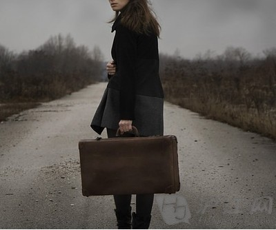
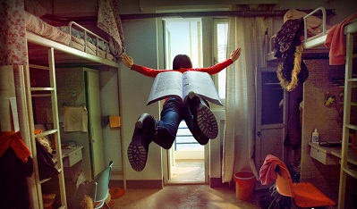

# 回家啊

** **

意料之中，在北京的第一个凌晨，在时差的刺激下早早地睁了眼。

一半是真，一半是梦，感觉飞机起飞的轰鸣声总不时地响起在脑袋顶。从几万里高空带下来的漂浮感模糊感不确定感，还在持续中。只是嗓子口刺刺痒痒的干燥感，提醒我毋庸置疑地，我又回到北京了。

在汉堡的时候接待过一位中国客户，他说我十几年前来过汉堡。我问那现在感觉如何，变化大么？他说哪有什么变化，什么都是老样子，连没建完的楼都好像还在那边立着。

哪能跟北京比，他附加一句。然后他笑，我也笑。

这世界，哪个城市可以与北京相比呢。哪个城市比它更像野心勃勃的孩子，每天貌似相同又每天决绝不同地长起来；哪个城市比它更像薄情的小妞，眉目含情却又面目冰冷地轴起来；哪个城市比它更像无声的海洋，把无数年的时光，无数人的年华，无数故事的起落，无声无息地吞噬起来。它让我那么亲近，却从未觉得了解。让我那么想念，却从未真正归属。我甚至没有奢望过能够见到老朋友一样的它。我想总是期待着，被它惊喜，或者被它惊吓。

因为一切的改变，对于它，似乎都是合理的。

降落北京到现在，已经见过我忍辱负重可亲可爱的驻京办主任，已经被款待过一餐几近奢侈的美食，已经坐过了出租，经历了大小堵车N次不等，已经坐过公车，听过售票员满嘴跑葫芦的京片子。我坐在车里顶着所有的疲惫和新鲜看北京。要去的地方都是些熟悉的名字，但是莫名其妙地总是有许多的陌生感漂浮在空气中。要么是一栋半欧式的楼，要么是一家从未听说的大商厦。要么只是我。而我只是客。

由于非常北京特色的堵车，公车跑得居然比出租快多了。而印象中极其罕见地，我居然还在高峰期的公车上闲闲散散找到一排空座。我落座不久，就上来了一群大孩子。（啊……老了啊，居然要用孩子来形容大学生了……）三个男孩，两个女孩。他们很快聚集在我旁边的空座，显然对于这个几乎中奖一样的待遇也颇感惊讶。他们拎着大堆五颜六色且显然没有好好打包的行李，难掩兴奋地用方言叽叽喳喳。我听懂了他们字正腔圆的陕西话，还有冒着一股憨气的甘肃话。我看着说话的女孩红扑扑的脸蛋和被挤得乱糟糟的头发，她的普通话里混杂着北京的儿化音和典型的西北腔，她开始想打扮自己更像个大城市的姑娘，但她显然没搞懂她要追求的那个叫做时尚的是什么鬼东西，同行的男孩子技巧生疏地和她开着有点点暧昧的小玩笑，她开心地扬起鼓鼓的脸蛋，笑，露出大颗并不精致的牙。

她开心地嘟囔着，啊，终于要回家了啊，高兴死了！

我毫不避讳地看着她和他们，无声地笑。我想他们一定觉得我有点奇怪。但什么都不能打扰他们从大北京第一次回家过年的好心情。他们会拎着大堆杂乱无章的包包在西站的人群中张皇地行走，在排队进站的人群中一边拥挤一边不忘叽叽喳喳，他们会第一次见识到春运的挤绝人寰，并在深夜晃荡的火车硬座上睡得东倒西歪，男孩子会有一点强装绅士的要强，女孩子会有一点被体贴照顾的心暖。他们一定买了大堆实际没用的礼物给爸妈和朋友，现在满脑子期待的，一定是和高中毕业后各奔东西的朋友们一起神吹海侃的饭局。

他们是北京的外地孩子。是要从北京回家的外地孩子。我，也是啊。

他们当然不能明白我笑的时候，眼前站着的就是十年前的自己。他们当然无法去想象，十年的时间，他们可以长成一个什么样的人。他们还没开始为这种奔袭中的生活而纠结，不知道，或许也并不在乎自己将在北京度过的这一段生命，对于自己又有什么意义。他们只是想舒舒展展地把心敞开，让西北的风沙北京的风沙一股脑地往生命里吹。自有它的不堪和粗糙，也有它的爽朗和不羁。哈，我，也是啊。

他们不能知道我笑的时候，心里在一句一句地跟他们对着话。最多的时候，只是跟他们说，对啊，老乡，我也要回家啊。

 

（采编：楼杭丹；责编：麦静）

 
