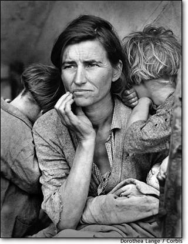
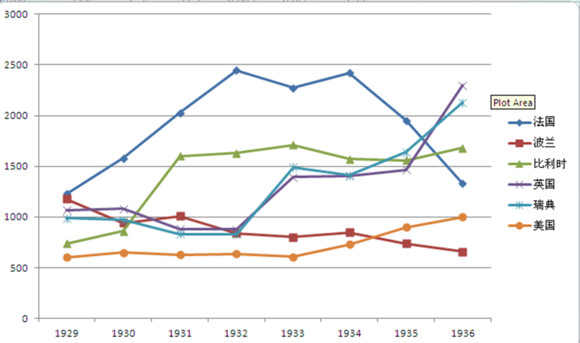
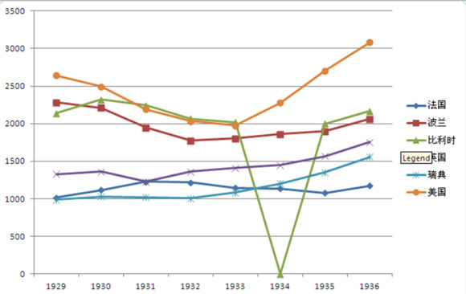

# 回顾大萧条（一）：疯狂的黄金时代和黄金的恶魔面孔

**编者按：发生于1929年的全球性经济危机，亦即所谓的“大萧条”，彻底击碎了人们关于资本主义黄金时代的美好梦想。毫无征兆地，整个世界的经济体系崩溃了——股市暴跌、银行倒闭、生产停滞、失业率高企。“看不见的手”不再魔力无边，而古典经济学家们预言的曙光久久未见踪影。终于，在“这片腐坯的土壤之中，迟迟长出了一株今天被称为宏观经济学的新学科。”（萨缪尔森语）伴随着“动物精神”、“流动性陷阱”、“总需求”和“乘数效应”等一系列崭新的概念和分析框架，凯恩斯和他的《通论》横空出世。从此，政府不再是经济角斗场上的看客，而是越来越多地参与到比赛的进程之中。自由放任的时代一去不返了，在各国政府的刺激政策和监管之下，世界经济开始缓慢地恢复活力。**

**但是，围绕大萧条的争论，却并未随着经济形势的好转而告终结，反而呈现出愈演愈烈之势。究竟是什么导致了大萧条？政府在大萧条中扮演了怎样的角色？真的是凯恩斯主义拯救了世界吗？这些问题，贯穿了整个二十世纪后半叶的宏观经济学发展史。而每当经济陷入停滞或者衰退，大萧条的幽灵都会悄然出现，并在我们心头投下一片不祥的阴影。**

**熊彼特说：“如果一个人不掌握历史事实，不具备适当的历史感或所谓历史经验，他就不可能指望理解任何时代（包括当前）的经济现象”。一切社会科学，归根到底都是研究人的学问；而只有通过历史，我们才能对人类的天性和行为方式有一个清醒而全面的认识。这就是为什么每当遇到社会危机，我们都会去史书之中寻找救赎之道；这也就是为什么时至今日，研究大萧条仍然有其重要而深刻的意义。谭锦华君主笔的这一组文章，以其详实的史料和生动的剖析，为我们拉开了历史帷幕的小小一角，使我们得以梦回百年前，重温那场活跃着天才和政客，充斥着绝望和恐惧的伟大戏剧。**

那是一个恐怖的时代，世界经济经历了一场浩劫，作为一战的延续和二战的开始，1929~1933年大萧条（这分成两个阶段：1929~1930信贷萎缩和1931~1933英镑危机）将宏观经济学从微观经济学中独立起来，也吸引了众多天才的注意，凯恩斯、弗里德曼、哈特、萨金特和卢卡斯等众多天才都提出了很多新的理论来解释为什么大萧条会发生，为什么它会持续那么久和为什么它会蔓延到全世界。

那么首先，让我们回到历史，去看看这个起于黄金，再止于黄金的货币浩劫。

#### 一、黄金时代：1918~1928

1918年11月，第一次世界大战结束，人类为这场战争付出了很大的代价，包括一个当时被证实非常有利于社会稳定的货币制度：金本位。

简单来说，金本位是指一个国家发行的法定货币价值是直接与黄金挂钩的，中央银行制定货币与黄金的汇率，同时也允许人们自由的把货币兑换成黄金的一种货币制度。这个制度保证了一件事，就是央行是不允许胡乱发行货币的，在货币/黄金汇率固定的情况下，我们可以从央行发行货币（即央行票据）来倒推央行的黄金储备的，黄金储备也限制了央行能够印发的货币最大量。

这个制度在古代是得到支持的，并且被全世界大部分国家所接受（中国、日本和朝鲜等使用银本位），原因有二：一是古代的生产力有限（虽然黄金冶炼产量也很有限），货币需求不会太大；二是趋向通缩的货币制度有利于债权人有害于债务人，而古代是个以农业为主的时代，保护储蓄是异常重要的。

在工业革命之后，生产力突然爆炸，虽然相应的黄金冶炼能力也得到了增强，但黄金的产量已经不能满足货币需求，古典金本位制就更趋向于通货紧缩了。

这种紧缩在一战爆发后就立马变得不合时宜，债务人政府发现借贷成本太高了，为了赢得战争，参战国（欧洲大陆）和一些被卷入的国家（美国）废除了金本位制，世界进入了通胀时代，战争机器开始刺激生产力进一步增长。

但在一战之后，法币制度已经失去了它的存在理由，各个国家开始恢复金本位制，1925年英国率先进入，而1928年回归的法国是最顽固的支持金本位的国家，其主要原因是法国仍然是个以农业为主（相对于英美等）的国家。到了1929年，除了西班牙以外的欧洲大陆与除拉丁美洲以外的美洲大陆已经完全回归了金本位的回报。

受惠于一战的需求激增和法币制度的总供给增加，商业银行创造了前所未有的放贷规模（跟现在一比小巫见大巫了），至于为什么法币制度下商业银行放贷会超过金本位制下呢？

这得从金融行业，特别是商业银行开始。

金融的基础是什么？是商业银行，通过吸纳社会存款并放贷给有需要的人完成资本转换的机构。学过经济学101的你肯定知道，发放贷款会增加社会货币供给的。鉴于金本位是一个那么远古的货币制度，多数人已经没有涉及过，现列出金本位的货币供给方程如下：

M1=(M1/BASE)*(BASE/RES)*(RES/GOLD)*(PGOLD*QGOLD)

（打开括号作用相等，这个不用说吧。）

第一个括号代表的是M1与货币基数之比（货币基数是流通货币+商行准备金），也就是货币乘数，第二个括号是货币基数与央行资产之比（央行资产包括外汇和黄金），第三个括号是央行资产比央行储备黄金，第四个括号是黄金汇率乘以黄金储备量，则是以本币计价的黄金价值。

如果我们对其求对数，并限定黄金价值的增速恒定的话，会发现，乘数决定了货币供给；同样，如果限制其他因素，也会发现黄金价值的增速决定了货币供给的增速。

如果你问，为什么央行不把货币/黄金汇率调低呢？

真聪明！罗斯福怎么没想到呢？事实是，民众不愿意。

连金融制度已经如此高端了的现代，普通民众还觉得通缩比通胀好……

1929年，古典金本位制度重新建立，随后农产品价格下跌，随后股市崩盘……

但最恐怖的还没开始。

#### 二、被黄金吞噬

那个年代，人人都爱古典经济学，人人都是市场原教旨主义者（法国除外），我们资本主义就是依靠无形的手啦！现在突然价格下降啦，我们就失业嘛，市场之手会带领我们走出困境的！

股市崩盘不是什么问题，华尔街建立到那个时候，崩盘也不是几十次了。但问题就在于，这次的恐慌崩盘带来了两个恶果，一是货币投机；二是信贷困境（这两个都不在这一章讨论）。

从宏观上来说，信奉古典经济学的各国政府纷纷把矛头指向了信贷过度上。的确，经过了一次世界大战和黄金十年，全球的贷款份额是很庞大，导致银行可能不够流动性来维持自己经营了，那么我们就开始存钱吧！

嗯，胡佛总统是这么说的，然后……然后就没有然后了。

后来的故事我们都知道，一个叫凯恩斯的男人写了一篇通论，一个叫罗斯福的男人开始了新政，用一句很吊的话叫，rest of that, is the so-called history。

但是仅从金本位1925~1929年建立，世界性的大萧条从1929到1936年这个时间上的“巧合”并不能说明真正的问题，弗里德曼和舒瓦茨的理论也不能建立起来，这还需要另外的比较。

法国，为弗里德曼的理论付出了很多，它充当了一次实验者，又充当了一次对照组。

还是先从对照组说起吧（虽然实验组更早发生）。

由于主要政治势力——农民的存在，金本位在法国异常受欢迎，（有土地的）农民很少借贷，但会储蓄，他们是天生的债权人，再加上法国曾经有一次美好的尝试，让它的金本位更加优越（实验组的故事），它于1928年回归金本位，直到1936年才废除金本位实行法币制度，在这8年里，法国的经济一直没有让人看到希望。

除了法国，倒霉鬼波兰和比利时都是黄金家族的一员，他们直到大萧条的末期才废除金本位制，而1931年英镑危机发生之后就果断脱离金本位制的英国已经复苏，1933年才废除金本位制的美国也已经有扭转迹象了。

（各国黄金储备变化：1929~1936，各国脱离金本位制的时间如下：英国1931；瑞典1931；美国1933；法国、波兰、比利时1936；）

由于各国存量不一样，本图仅表现趋势，因此对于每个国家的黄金储备有所缩放，例如美国储备全部除以10，而瑞典储备全部乘以10。

金本位制国家和非金本位制国家的黄金储备变化，从1931年开始就明显改变了，你能想象吗？金本位制国家的黄金却流入了非金本位制国家？！（这个问题我们接下来讨论）

而如果我们来观测M1变化的话，这个改变会相当明显。

（M1变化：1929~1936，数值做缩放处理，比利时1934年发生货币危机）

明显可以看到的变化是，英国和瑞典的货币开始扩张，而美国在1933年脱离了金本位制之后货币也开始扩张。

由于危机爆发时货币的短期非中性，各个资本主义国家的实际工资高于均衡工资，因此很多人被挤出就业市场，而在货币扩张之后，实际工资才开始与均衡工资靠拢，失业率也才有所恢复。

更重要的是信贷，废除金本位制在一定程度上激活了信贷。英国和瑞典在1931年废除了金本位制之后，次年（1932年）的货币乘数就达到了危机前水平，而英国才刚刚爆发了英镑危机。

这种发展的极不均衡让我们看到了一个事实关系，这个事实关系也印证了弗里德曼与舒瓦茨的理论：大萧条因信贷和通胀突然停止的刺激而爆发。（什么弗里德曼否认菲利普斯曲线的孩子还是回去看看书吧。）

接着说法国为货币主义做出的实验性贡献是：1926~1928年，伟大数学家亨利·庞加莱的堂弟，法国总理雷蒙·庞加莱所带来的庞加莱稳定，他的具体作法是：事先算出社会需要的总货币供给，通过算出社会所需要的M1数值来确定货币/黄金汇率，这为法国带来了异常稳定的经济增长（虽然只有3年）。听起来是不是很像货币主义的主张啊？

 **三、市场的力量？预期的力量？** 

古典经济学里把市场的力量吹得神乎其神，实际上任何一个学过中级经济学的人都知道市场的力量漏洞百出。而且，说到底，市场的力量实际上是预期的力量。

就好像我们所说的均衡一样，当价格偏离均衡的时候有套利者进行套利，于是价格又回到均衡点。这个理论没错，而且在实际生活中我们也看到了很多次了。但实际上它预设了一个前提：人们预期价格会回到均衡。

但如果人们不这么想呢？如果中国每一个人都预期房价还会继续上涨呢？当然你会说房价总有一天会跌下去的嘛。那当然，一个概率为亿分之一的事件，理论上说你不断尝试也有可能发生的，这个跟预测生死一样嘛。谁都会死，但如果市场之手的滞后性那么大，我们还要抱死市场之手吗？

1929年的大萧条正是有了这样一种预期，人们预测金本位会支撑不住，金本位国家会苦苦支撑自己的黄金储备，于是汇率投机异常活跃，这也导致了金本位国家对非金本位国家的黄金净流出。

同样的，如果人们预期这家银行可能破产呢？

这就是美国迟迟没有恢复的原因。由于金融制度的突然改变，刚刚成立的联储并不打算对存款进行再保险，这导致美国的商业银行遭受灭顶之灾：当人们预测A银行可能破产的时候，人们就会赶去A银行提走自己的存款，银行是不可能把全部存款放在家里而不放贷的，因此银行不会有那么充裕的现金。为了兑现自己对储户的承诺，银行只能卖掉自己的资产（在银行的资产负债表中，资产是发放的贷款，而负债是存款），而资产的变现能力并不好，银行只能折价卖，这更激发了人们对A银行倒闭的预期，更多的人挤兑，最终A银行破产。

这叫做预期的自我实现（self-fulfilled）。

这才是相机决策的要点，当市场预期悲观的时候，政府和央行要保持乐观；而当市场预期乐观的时候，政府和央行要保持悲观。

回顾大萧条下期：《商业银行的溃败、清算所与美国联邦储备》

（未经作者许可，请勿转载）

 

（采编：宋晓慧，责编：徐海星）

 
