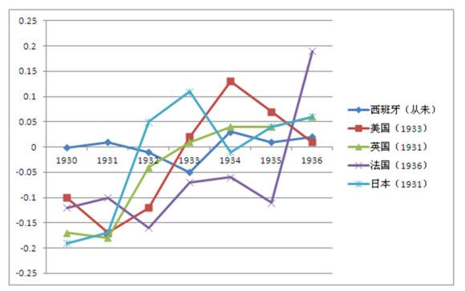

# 回顾大萧条（三）：再探金本位

**现在人们讨论金本位，提起它的优越性，必然会说到一点：维持金融稳定。但金本位不是稳定器，它没有自我稳定的机制，而根据上文对金本位的分析，它具有的是自我伤害的机制。从这一点上说，大萧条之所以发生，可能由于资产价格泡沫和放贷过度，但大萧条为什么会成为大萧条，金本位则一定脱不了干系。**  **六、“先生，是萧条而不是衰退。”** 

作为从业民工，我同意今年刚荣登对冲基金经理榜首的Bridgewater创始人Ray Dalio的意见，经济衰退只是实体经济的一次调整，而萧条则是实体经济开始艰难的去杠杆化（de-leverage）。

衰退是经济周期的正常步骤。在经历了狂热和泡沫之后，经济会重回理性（其实是实体经济财富不够了，价格自然就回来了），这样的轮回我们经历过很多次，并不可怕。但萧条就不是那么一回事了，前文已述，萧条最大的两个特征是：1）信贷冻结，银行不愿意放贷给一般贷款人而愿意把钱投资给有质量的产品（flight to quality）——国债；2）通货紧缩，批发和零售价格不断下降，实际工资上升，失业率激增。而这两个特征也具有自我增强的特点：它们自身会形成一种循环，把经济拖向深渊……直到有勇气的人愿意再投资和消费，但那时价格已经跌到谷底了。

那么萧条的原因是什么呢？在这一点上，如果用经济周期理论来解释，当然是行得通的：消费上升推动了资产价格上升，人们预期资产会进一步上升，于是他们借贷并且在上升的社会消费中获利，银行根据历史数据发现借款人的还款能力很强（目前来说当然是）于是放心的继续借款，资产价格上涨会增加就业（工资决定理论，CD函数的一阶微分），人们会乐得继续消费……直到市场负担不起那么高的价格。如果信贷问题并不大，资产泡沫也并不高，中央银行和政府提供了反周期策略，那么这次调整会是一次衰退，通胀率有所下降，资产价格下降，民间投资虽然少，可仍然还有，就业率也不会下滑太多。可如果是萧条，当然情况就很不一样了。

同样，当我们了解到萧条与衰退的主要不同，我们也可以制定一些相应的反周期政策来熨平经济周期的影响：这些政策包括，政府设立金融公司并把发放国债获得的资金通过金融公司贷款给中小企业；政府主持大型投资项目；中央银行调低利率，对问题银行进行贴现处理等。这些策略都针对萧条的两个问题，目的是激活信贷和制造（温和）通货膨胀。

我同意大部分萧条的发生都是由于借贷过度导致的（例如2008年），银行贷款给不应该获得贷款的人，金融衍生品又将各大金融机构、普通投资人和借款人全部绑在一起。但1929年的情况却并不是这样，当时杠杆严重的国家并不是受难最大的美国和法国，而是1931年开始复苏的英国：作为世界储蓄货币的发行国，英国享受了现在美国享受的待遇：债务货币化。

而另外一个值得关注的地方在于，如果我们把时间段取得更长，会发现1929年前经济虽然过热，投机严重（证券业的杠杆率很高），但银行信贷并不算很高。这推出了经济周期理论无法解释的一个问题：是什么情况让经济陷入萧条的呢？我们应该从1918年出发，去寻找答案。

 

### 七、拥抱金本位，拥抱死亡

1918年，一战结束。

次年6月，美国重新回到金本位时代。而1925年英国进入金本位则标志着Dorothy又重新回到了Oz国，只可惜她的银鞋跟这次没什么魔力了（绿野仙踪）。

而各国回到金本位时代的主要原因有两个：1）战时通胀毁坏了政府的信贷名誉（通胀是一种债务货币化），使得政府筹集资金变得更难；2）战后发生在中欧的恶性通货膨胀刺激了人们寻求货币价值稳定的急切诉求（也不想想战败国多少赔款，自作孽啊）。

Anyway，金本位，我们回来了。

需要说明的一点是，100年前的金本位不是金币作为货币，而是金兑换本位：中央银行发行票据，而这些票据是由黄金支撑的，持有人可以自由地将票据按固定比例兑换成黄金，但本质上纸币和金币没什么区别，纸币的成本更低而已，为什么提到这个，下面会告诉你。

金兑换本位由于确定了固定汇率，因此也就确定了货币发行量，当然，如果货币是完全保证金制度的话。对于一个非营利性的机构，金本位下的中央银行应该是完全保证金制度的，意味着你发行一美元绿票据，背后就有一美元的黄金作为支撑。黄金的储备需要雇佣人力和制造堡垒，央行也需要会计入帐，铸币厂需要印刷工人……这些都是成本，不过一般而言这些成本都被纳税人给承担了，当然也有例外。

例外就是，英国央行，英格兰银行。

英格兰银行是一家营利性机构！是的，你没看错，营利性机构。它在当时的主要职责是为商业银行提供贴现业务和发行公众债务（就是英镑），同时要自负盈亏，成本当然也得自己摊着。基于这样一个情况，和黄金产量根本不够的现实，英格兰银行开发出来了一种新型的金本位制度。

如果你看过拙文第一章，你应该还记得商业银行是怎么制造货币的。对，是部分准备金制度，商业银行留存一部分存款，其余全部放贷。英格兰银行干的也是这事儿：我只要保证你平时想要兑换成黄金的时候有就行了，哪里需要完全保证呢？我也部分保证吧。于是一个最后贷款人决定给自己增加杠杆。

这招后来被推广到了全球，美联储也用这玩意儿，但是杠杆率比英格兰银行低得多。这个制度保证了当时的世界货币英镑能够跟得上国际贸易的需求，但也为后来的危机埋下了伏笔。

前面讲到金本位是具有自我通缩性质的货币制度，但除了黄金产量限制，它还有一个更加棘手的通缩效应：如果黄金是货币的价值支撑，那么假设黄金从A国流入B国会发生什么呢？对于黄金净流出的A国而言，它为了维持货币在国际贸易中的地位，不得不选择通货紧缩、减少货币量来保证货币黄金汇率固定；但对于B国而言，它是具有选择权利的：它既能多发货币带来通货膨胀，又可以不发货币以其他形式把这些黄金给冲销掉，如果国内正在经历通胀或国内没有货币贬值意愿，B国基本是不会选择多印钱的。这样的此消彼长，货币供给就会越来越紧。

而部分准备金制度就更起到了推波助澜的作用：如果英格兰银行为货币准备的部分准备金是40%（事实上，美联储是40%，英格兰银行差不多是20%），意味着它的货币乘数是2.5倍。如果这时候发生了恐慌，一部分人们预期英镑可能贬值，于是要求将英镑折回成黄金。简单的计算题：如果有1000万英镑要求兑换成黄金，那么央行要减少多少货币供给以满足英镑黄金汇率稳定呢？

答案是2500万。

1933年3月，法国预期美国可能无法履行固定金兑换制度，于是将自己手里的美元兑换成黄金，由于2.5倍的杠杆和部分准备金的损失，美国爆发了规模超前的银行倒闭潮，当时的罗斯福总统不得不要求银行业全部休业整顿（哼，自由经济）。

而各国在战后达成了一致性的协议：让货币回到金本位且货币黄金兑换回到战前水平。这对于债权人（如果不赖账的话）是好的，让你丫多发债，你他妈还啊还啊。但是对于欠债过多的国家就不是那么一回事了。1925年5月英国进入金本位，经济学家凯恩斯就指出英镑已经被严重高估，果然在苦苦支撑了2年多之后，1931年英镑危机，英国干脆退出金本位救活了自己。

货币回到战前水平，这是一件很省时省力的事儿，寻找过去美好时光嘛。但问题就在于，那些年错过的大雨你是回不去的。战时超发的货币和债务还需要还，日子还需要过，身边的沈佳宜已经皱纹一大把，淋雨就肺炎。而这时候货币突然的减少，给中小企业带来的不适感是非常强烈的。金本位让货币被逼减少，通货紧缩一触即发，以前的正常债务全部都变成了泡沫。

谁去戳破这个泡沫呢？

1929年美联储决定整治期货和股票市场上的投机行为，那时候的投机杠杆很大（如果你看过Jesse Livemore写的《股票作手回忆录》你就会知道），将利率调高，进入紧缩周期，这一下子使得企业日子变得艰难。当然，先到来的还是股票崩盘。

上一章我们浅尝了非货币因素，现在还是回到货币上来说。

实体经济的溃败会导致货币汇率层面上的波动。当然，人们主要考虑的问题是货币会不会贬值。我在一篇文章里有讲过，套利和投机的不同点是，套利寻求的是价差，而投机寻求的是波动，因此波动越大，引起的投机行为也就越多。

设想一下，如果你预计英镑会贬值，你会怎么做？如果你有英镑，当然在还没有贬值的时候兑换成美元嘛，如果你没有英镑，当然就卖空咯。按照现代交易视角，如果市场上接盘的人太少会导致价格暴跌而你又没卖干净就会有损失。但是在当时，还有一个不得不接受的交易对手存在：它就是中央银行。

所以实在不行，你就把它兑换成黄金嘛。

那些聪明的投机者（比如那位华尔街巨熊Jesse Livemore，他1929做空几乎一切证券，一战成名资产上亿，但在之后的投资中赔个精光，1940年饮弹自尽）懂这个逻辑，监管者中央银行未必就不明白，所以在经济衰退时期进行紧缩和吸收黄金救成为了一种军备竞赛，同样，这也是一种自我伤害。法国和美国吸收了大部分的黄金，那时候法国和现在的法国不一样，它不是个纯粹的工业国家，在国际贸易中也不是主角，但它却拥有近四分之一的全球黄金储备。

在吸收黄金的同时，为了不让市场对本国货币失去信心，经济虽然已经走弱，但咬咬牙也得要减少赤字。这里面的逻辑很好理解，工业走弱了税收减少，你的偿债能力就减弱了，这时候你还增加赤字，不明摆着要违约么？这种说法也对，但是如果我这项目就差你这100万，给了就活我净赚1000万，没了就死，你断了我的银根我怎么办？

额，胡佛总统没想那么多。

你可能会问，为什么现在美国债务都超过100%了，美国还不控制其赤字呢？

因为中央银行的权力发生了变化。

在1929年危机爆发时节，美联储的工具只有一个：贴现。贴现这个事儿是这样，问题银行发生挤兑，可是钱全在贷款里，怎么办呢？我就把贷款打包卖给美联储，美联储把钱给我，我再还给储户。但这里出了个问题是，如果商业银行不卖给我呢？

所以美联储当时没法干预市场。（以至于后来是由联邦政府出面成立复兴金融公司来代理行使干预金融市场职能的）

这也同样带来了一个事实，那个时候中央银行由于不能公开市场操作（买卖国债），于是不能把主权债务货币化，再加上金本位的影响，冲淡债务这招是没办法的（呃，德国这个……）。

总之，当时政府错误的使用了货币政策（金本位制）和错误的使用了财政政策（财政紧缩）导致了世界性的大萧条和大紧缩。当然，也有一个例外。

西班牙，一个被遗忘的国家。一战之后，国际联盟本来是想给西班牙救助性的贷款以帮助西班牙重建的，可最终还是搁置了，这也导致了西班牙成为欧洲唯一一个未回到金本位制的国家。这个美丽的错误导致在1929~1936年全球性大萧条间，在世界经济中完全不值一提的西班牙却出人意料的保持了金融稳定。

（1930~1936年各国批发价格对数差分，括号内为脱离金本位的时间）

不用算也能看出来西班牙的波动性最低。而法国1936年以前都处于紧缩状态。受到复兴法案的刺激，美国1934年批发价格扩张，但好景不长。

现在人们讨论金本位，提起它的优越性，必然会说到一点：维持金融稳定，但上图清晰的告诉我们，金本位不是稳定器，它没有自我稳定的机制，而根据上文对金本位的分析，它具有的是自我伤害的机制。从这一点上说，大萧条之所以发生，可能由于资产价格泡沫和放贷过度，但大萧条为什么会成为大萧条，金本位则一定脱不了干系。

回顾大萧条下期：《国际视角下的全面萧条》

 （未经作者许可，请勿转载）  

（采编：宋晓慧，责编：徐海星）

 
