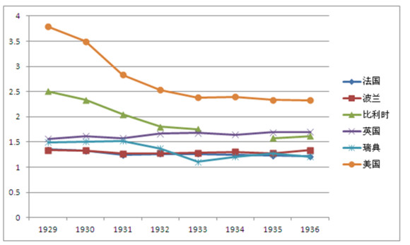
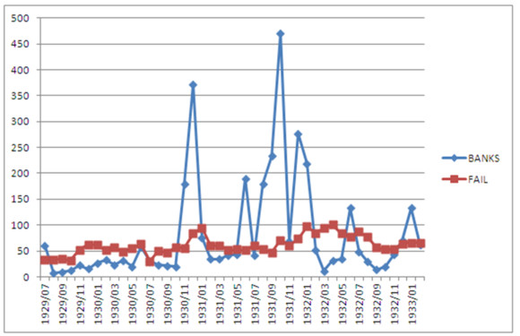
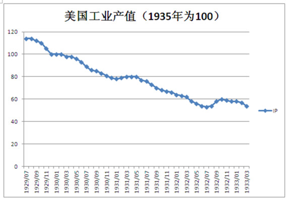
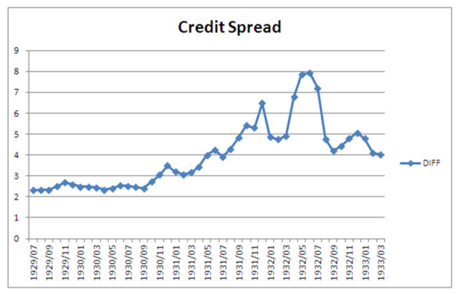

# 回顾大萧条（二）：商业银行的溃败、清算所与美国联邦储备

**金融业是创造信贷的地方，但同时也是最依赖信贷的地方。它能被称作万业之母，靠的就是源源不断的为各行业创造资本。但是它的资本，同样也（大部分）来自于信贷：它以利息借入储户的钱，并以差额借出给需要资本的企业与个人，为了抵御风险，它也会留存一些借款和股本。**

 **四、只是一个货币问题？**

在上一章里，我们一起回顾了金本位是如何束缚经济发展并延长大萧条时间的。战时的高杠杆，战后的人为去杠杆化扭曲了货币供给，导致了货币供给无以为继，最后导致大萧条的发生。

但是我不知道各位是否还记得，在上一章中，我有一张图并没有给出，但这张图却非常重要，直接影响着弗里德曼与舒瓦茨理论的实用与否：货币乘数变化。

在弗里德曼和舒瓦茨眼里，一切都只是个货币问题，战时的增发，战后的紧缩导致了经济的同步紧缩。弗里德曼同样相信，只要货币供给保持稳定增长，例如4%的温和通货膨胀（克鲁格曼很喜欢这个数字），由于预期的作用，就会面朝大海春暖花开世间安稳岁月静好，人们和谐地走在温和膨胀充分就业的康庄大道上，向着更快更高更强的人类目标前进……

只可惜，完全不是这样的，前文中三个在1933年前放弃金本位的国家里，美国却仍然处于信贷萎缩的状况，而且观察前文关于M1的图可以发现，美国在脱离金本位之后，货币已经开始扩张了。

（货币乘数的变化：1929~1936）

货币已经奔腾，可信贷仍然紧缩，经济依然没有好转。

这里，需要解释一下信贷对于现代商业社会的作用。可以说，现在我们的整个社会都建立在信用上面，当然，对古代社会也一样，只是现在更为重要。举一个很简单的例子，小明和小红是两个商人，小明想要一辆自行车，在他眼里自行车值120块而他有100块；小红有一辆自行车但想要钱，在她眼里自行车值80块。双方都是第一次交易而且以后也不一定能够相逢一炮泯恩仇，如果规定先交自行车再交钱，那么对于小明的最优策略是什么呢？

答案：拿了自行车就走人。而小红会预料到这个结局，所以她的最优策略是拒绝这个交易。

但现实情况和博弈论模型刚好相反，小明拿到了自行车而小红拿到了钱。博弈论研究者们把这左右博弈均衡点的力量称为谢林点，而在商业社会中，这个谢林点就是信用体系：为什么小红敢于先赊给小明（哪怕就一会儿）？因为人们对信用的珍视导致了小明不付账的情况很小（但也可能有，所以要设立合同制）。

人们相信银行开具的证明能有价值，所以才有了银行票据；商业对手相信公司有还债能力和意愿，所以才有了商业汇票；货币基金相信投资银行能够稳定的还款，所以才把钱借给了雷曼……呃，最后一个我们后面再讨论。

另外，从会计的角度，如果没有信贷，ROA（Return on Asset，资本回报率）就等于ROE（Return on Equity，投资回报率），这会让公司发展更为缓慢，资本积累更慢，劳动力需求更少，消费也会更少，社会会陷入更慢的循环中去。而且，在抵御灾难性风险的时候，信贷有时候也能给企业更多的帮助。而在有了信贷的时候，公司会更倾向于使用借贷资本（并支出一些小成本）来支持它的日常财务需求。

金融业是创造信贷的地方，但同时也是最依赖信贷的地方；它能被称作万业之母，靠的就是源源不断的为各行业创造资本。但是它的资本，同样也（大部分）来自于信贷：它以利息借入储户的钱，并以差额借出给需要资本的企业与个人，为了抵御风险，它也会留存一些借款和股本。

但如果信贷冻结了会导致什么情况呢？看看2008年，贝尔斯登危机开始于旗下两支对冲基金的巨亏，由于对冲基金的高杠杆性贝尔斯登负债累累。它履行了其信贷义务，却缺少支撑其运转的流动资金，贝尔斯登想要借债，却发现由于账面漏洞太大没人再愿意救急，只能接受2美元被摩根大通收购的命运，而它位于华尔街的总部大楼都比其收购价高……

这就是1933年的情况。货币在增发，政府在努力创造就业，但信贷依然萎缩，资本在50000美元以下的公司损失近50%。这又回到一个问题，为什么信贷市场仍然被冻结？

#### 五、幼年美联储、老摩根和清算所

在一战前夜，美国爆发了一次严重的银行挤兑危机，分散在各州的商业银行纷纷因为流动性不足而倒闭。这时候一个民间组织站起来充当了最后贷款人、调控银行挤兑问题的角色，它被称为票据清算所（或票据交易所），这个组织背后的财团是JP·摩根，也就是现在摩根士丹利和摩根大通的创始人，老摩根。

需要了解的背景是，美国第二个中央银行已经破产很久，因此清算所这个银行业组织承担了中央银行的责任：在挤兑发生的时候禁止将存款转变为现金，给问题银行提供最后贷款（通过票据交换）。

但在1929~1933年的金融恐慌时，美国联邦储备，美国第三个中央银行已经成立。人们自然而然会认为美联储会行使其责任义务：成为银行的银行。

按照弗里德曼和舒瓦茨的说法，清算所当时错误的认为美联储会承担起供给资金的责任，因此并未对大规模商业银行倒闭进行任何干预。可惜联储这时既没有这么大的权力，又没有足够的管道对此进行监管干预，美国的银行倒闭潮即将开始。

（美国银行资本倒闭与产业资本倒闭：1929.7~1933.3，1933年3月银行业休业，倒闭资本太过巨大，放在一张图上会影响观察趋势，故被截断）

金融恐慌是一种预期，而且是一种极容易自我实现的预期。前文已述，人们预期一个银行即将倒闭，如果没有外力救助，这个银行一定会被市场吞噬。由上图我们也可以看得出来，银行业的倒闭是集中的，而产业的倒闭是长期的。

这还是在说银行被预期的力量吞噬的故事，而银行因为预期的力量而毁灭产业的故事也在同步上演。

由于金融恐慌的爆发，幸免于难的银行为了应对可能的挤兑风险，将会把更多的存款放入金库而不是借给有良好品质的贷款人，良好的贷款人得不到资本的支持就可能失败破产。信用事件的爆发会让银行暴露在信用风险中，于是银行可能更加惜贷并调高借贷标准，这种信贷配给会导致我们都知道的局面：银行决定借钱给不需要钱的公司。

这是很滑稽的故事，但却是非常真实的，在危机中美国中小企业损失殆尽，然而资产超过5000万的大企业们却在安全的彼岸看着恐慌的大火，它们手里握着大把现金却不敢再投资，不敢再多雇佣工人；更多工人失业，更少的社会需求；于是大企业们会庆幸：还好我当年没投资。

银行也是一样的，连摩根财团都开始惜贷，它们并不是没钱，只是不打算把信贷规模恢复到危机之前：要攒着钱应对可能的危机呢！

（美国工业产值：1929~1933）

银行市场萎缩，那债券市场呢？

做风控的人都知道有一个名词叫做flight to quality（奔向质量），讲的是当危机来临之后资本疯狂逃入国债，推高国债并继续增加企业信贷成本。在1929~1933年的市场信贷市场里，也发生了这样的事情：

（Baa级债券与国债收益率差额）

为什么会造成货币增发但信贷仍然萎缩的经济灾难呢？或者说，为什么单纯的货币政策解决不了商业银行的溃败呢？

除了我上面所讲到的银行惜贷问题，还要提到的一个原因是伯南克在其论文里提到的信贷中介成本的增加。由于金融恐慌，市场情况变得很复杂，要预测借款人的还款能力就会变得更难，于是银行会对没把握的借款人进行更深入的调查，这使得信贷的中介成本变得很高，银行的利润会减少。根据巴塞尔协定（那时候还没有，但这个是差不多的），银行的留存收益是用来弥补预期损失（Expected Loss）的，利润减少，银行的准备金就需要更多，能贷出去的钱就更少。

这是社会性的金融溃败，借款人苦苦挣扎，而银行也岌岌可危。

但，善于比较的你，是否发现一点：为什么英国就很快走出了危机而美国却苦苦挣扎呢？

伯南克给出的原因是：因为美国的银行法导致商业银行小且多（自由主义么，小的是美好的），而且跨州设立银行是违法的，这也杜绝了银行间的互相收购，除了你在名字上想点儿办法：比如你叫做JP Morgan Group，或者citigroup。

回顾大萧条下期：《再探金本位》

（未经作者许可，请勿转载）

 

（采编：宋晓慧，责编：徐海星）

 
