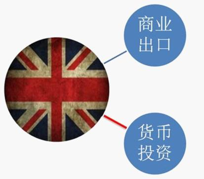
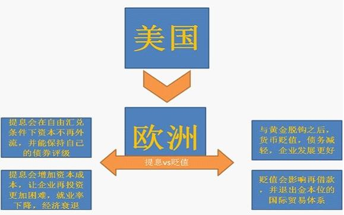

# 回顾大萧条（四）：国际视角下的全面萧条

**我们一起回顾了大萧条形成的原因，错误的财政政策和错误的货币政策一起造就了这场灾难。这场灾难以信贷冻结为顶峰，以政府注资为转折，以经济复苏为结尾。正如奥巴马所说的，“you got hit by a truck… it's not easy for you to recover soon”。**

 **八、史前文明**

如果我们把资本主义经济用1929至1933的大萧条来一分为二，那么在大萧条之前的史前经济是怎么样的呢？

让我们把时间轴拖回到1774年，来看个究竟。

在那一年，对历史进程影响最大的事件莫过于美国独立战争。当然这不会是我要讲的重点，重点是，自1717年艾萨克牛顿爵士（没错，就是被苹果砸的那位）将金银汇率调的过高（意味着人为将黄金贬值），黄金劣币在1774年成功将白银良币驱逐出市场。而在当时的世界里，西欧各国还使用的是金银复本位，而远东和拉美仍然使用银本位。

虽然复本位有过一些抵抗，但随着工业革命在英国兴起，金本位还是随着英国的商品扩张影响到了全世界，西欧、美国、拉美和日本都逐渐进入了金本位。

金本位提供了稳定的汇率和长时间的通缩环境，这为主要债权人（殖民地国家）提供了很好的资本利得收益，英国由此建立了非常完善的国际贸易路线管理系统和发达的金融业——伦敦繁华的金融区处理了当时近80%的国际结算业务。

是什么造就了英国强大的影响力？工业革命当然是一个方面，其实另一方面，自由放任的经济思潮也起到了很大的作用。由于那时人们普遍认为自由贸易对交易各国都有帮助（不这么认为的都会被英国舰队炮轰而被迫签订互为最惠国的协议），关税壁垒并不明显，这才得以让英国商品进入全世界市场。

学习过基础的国际经济知识的看官都知道，商品流动会引起货币的反向流动，如果商品出口，那么必然会带来资本的进口。这个道理很简单，小明卖苹果给小红，这个动作的结果就是小明拿到了钱，而小红拿到了苹果。

我为什么要费力讲这么浅显的道理？原因是，这是理解大萧条，同时也是理解现在的欧债危机、之前的美债危机的基础知识。

小明拿到了钱，如果仅仅是存在自己家里，那么家里储备的货币（在当时就是黄金等价物）会越来越多，这样会造成他家的通货膨胀。

（商品出口会导致资本流入本国，增加货币供给）

通货膨胀对于债权人是不利的，因此代表大资产阶级的英国政府必须要将其花掉。花掉的方法就是对外投资。

（直接将经常账户盈余用于资本输出，英国的商品和资本都流向全世界）

当然，如何投资，投资债权还是股权，英国还是有自己的想法的。对于欧洲大陆上的法国、德国和奥地利，英国主要通过投资债权的方式；而对拉美和远东，则主要通过股权的投资方式。资本利得是如此之高，以至于英国产业开始逐渐空心化，大家都去玩儿金融去了。

当然，随着技术的扩散，英国岛国资源的劣势还是显现出来了，德国超过了它，后来者美国又超过了德国，世界出口逐渐被这三个主要国家所控制，英国实体经济的劣势已经有些明显，但由于金融强大盈利能力，英国的经济并没有造成多大影响，只是主营业务从出口纺织和机器，变成了物流和保险。

（英国的主要产业已经变成了出口服务和金融投资）

而这时候，虽然美国和德国的工业实力已经是全球第一和第二，但他们的投资资金仍主要来自于英国借款。这就变成了英国提供资金三国生产，但是物流和保险得靠英国，英镑世界货币地位依然没有受到什么挑战。

既然英镑不会受到挑战，那么英格兰银行和它地下的金库也不会受到挑战，金本位彼时成长卓越，核心国家互帮互助，边缘国家任其死活。一战以前，英国、法国和德国都发生过黄金流失事件，但各国央行互帮互助，通过相互借款解决问题。而边缘国家，如被迫进入金本位的拉丁美洲，则经历着非常痛苦的高利息和经济抑制。

金本位在任何时刻都会带来固定汇率制度和严格的货币政策管制，这本是无法调和的，但核心国家的互相帮助保护了脆弱的金本位，却给资本主义带来了剥削的骂名：高贴现率让资本变得稀缺，相对的便会让劳动力变得便宜和让资本家扩大再生产的成本过高，这使得劳动力报酬低且失业率高企。马克思所描述的资本主义初级阶段的邪恶的确是沾满鲜血的。

那为什么各国会选择这样的制度呢？第一是劳工力量当时非常弱小，不足以和社会上层把持的议会相提并论，劳工的呼声是得不到政府支持的。第二是金本位的通缩性质有利于债权人不利于债务人，此时欧洲核心国家是远东和拉美的债主，使用金本位能获得更多购买力。而最重要的第三点是，由于经济学家还未能发现通货膨胀与就业的关系，这使得政府们通常认为货币政策和就业是无关的。

不过上述的互帮互助并没有持续多久，因为它们迎来了一战。

 

### 九、新世界

一战带来了全新的世界格局。英国和德国的战争几乎中断了欧洲的商品交易，同时面对不断膨胀的战争债务，参战国一致脱离了可兑换性，此举被认为是退出金本位的标志。而在这之前，黄金就已经纷纷逃往安全的国家了。

德国的经济在一战里受到的冲击是最大的，由于它是欧洲内部交易的最大出口国，战争切断了德国人的经济来源，同时本土作战也让德国的固定资产遭受了打击。一战结束之后德国经济受到重创。英国也是一样，虽然没有把战火燃到本土，但英国的生产能力较德国和美国已经有很大差距，战时生产已经影响到了出口，一战前英国的商品占了拉美总进口量的30%，而一战之后，英国占有的市场份额已经不足14%了。

参战国所带来的巨大市场需求空缺会由其他工业体来填补，美国从欧洲的债务人一跃成为世界的债权人，那时候的美国更像是现在的中国：环境污染严重，无视劳工环境，资本至上，最大出口国，购买外国公债……不过一战的爆发也为另外一个国家的崛起打开了道路：日本。日本此时刚刚完成工业化，正愁产品销路，一战爆发打开了致富之门，日本产品涌入欧洲和拉美，这些商品虽然质量不好，但因为其价格低廉，仍然受到了市场的欢迎。

一战之后，主要债权人们都变成了主要债务人，而美国则为它们的战后重建输血。由于各国战事导致资本流入美国，美国承受了巨大的流动性压力，亟待输出；同时各国资金缺口逐渐增大需要借钱来缓慢复苏，华尔街一跃成为了债券的天堂。各家银行、投资银行和信托公司甚至在外开设门店，像推销肥皂一样向寡妇和老人推销债券，这些债券看起来很好：政府公债，美元计价，固定黄金汇率，高过银行利息，简直是无风险高收益之典范。

那时的资金流动是怎样的呢？欧洲大陆重建需要美国的支持，遏制共产党在欧洲的蔓延更需要美国支持，于是这形成了一个资本循环的莫比乌斯环，金钱在这个环里永不休息的运作着：欧洲渴求资本进入，于是在华尔街发行债券；华尔街的资本大鳄们承销债券之后，将其卖给普通美国人，于是货币从美国流出，流向了欧洲大陆；迫于共产党的压力，欧洲大陆必须正视劳工的需求，组建工会，增加福利和建设工厂，美国流出的钱会迅速的进入欧洲社会；但归根到底，由于原材料和设备都来自于美国，因此这些钱又通过欧洲向美元进口又重新回到了美国手里……

 

（这是当时美国的图，也是2008年时候中国的图，也是现在的德国的图）

美国将大量的资金外借，目的是想要降低本国的通货膨胀程度，当时的央行和政府仍然不明白通货膨胀率与就业率的关系。这种抑制虽然起到了作用，但由于欧洲复苏导致的需求实在强劲，证券化的资产价格被抬到新的高点，美国人民异常兴奋，纷纷把自己的养老金、孩子的学费等等投入证券市场，期望获得一个良好的回报。在欧洲的情况也是一样，美国资本潮水般涌入，各国都在兴建项目，除了一个国家：法国。

法国的经济依然萎靡，虽然看起来工业正在重建中，但这个国家越来越依靠进口，储备资本已经不多了，国家承受着通货紧缩的压力，法国只能幻想让德国赔款来救自己一命。

剩下的故事我们都知道，德国对法国这种掠夺行为嗤之以鼻，法国无计可施决定入侵鲁尔和阿尔萨斯，这两个都是德国工业命脉，法国以为夺走这两个地区便能收回战争赔款，而当时的货币投机者也是这么认为的，法郎停止波动，开始稳定。但之后鲁尔地区的工人开始消极怠工，不愿意为法国人工作，加之占领费用不断增加，法郎又开始极不稳定。

一战之后，世界货币的格局逐渐从英镑主导变成了英镑美元两驾马车，但作为权力交割的仪式，英美两国的货币政策交流会议却从未开启：当时美国国会普遍存在着“分裂主义”的想法，对英国提出的要求置之不理。直到1925年，美国宣布美元重新以战前平价恢复可兑换性，彻彻底底的进入了金本位。

前几章已经提到过，金本位的自然通缩性质让债务人痛苦不堪。但各国的状态还不太相同：英国由于缺乏实体经济支撑，战后英镑便已经贬值，回归战前平价实际上是人为升值了，而美国在一战期间吸纳了近乎所有的欧洲的货币流出，黄金储备惊人，回归战前平价对它而言并未升值，在大萧条中，英镑率先遭到投机者攻击，黄金流失惊人，而刚刚开始的时候美国仍在不断吸纳黄金。

书归正传，1929年刚刚成立没多久的美国第三任央行美国联邦储备，为了应对暴涨的证券投机，决定提高对票据的贴现率。贴现是银行再融资的重要部分，提高贴现率就是提高了利息成本，美国利息增加，杠杆交易成本上升了，银行叫苦不迭（一战后的货币政策变迁基本可以看成美国自私整别人最后搬起石头砸自己脚的血泪史）。

但这么一个对内的政策却引来了外部巨大的变动。由于美国利率上升，欧洲的融资成本突然开始膨胀，以前的利息已经吸引不到美国人了，要吸引美元融资，必须要增加利率。而且一个更重要的问题是，在欧洲的货币似乎也发现了美国利率上升后所出现的套利机会，这将进一步引发资本逃离潮。

正在重建中的欧洲突然遭受了这样的打击，留在它面前的只有两条路：（1）为了防止资本外逃，也增加贴现率大幅提高利息，这样做的成本是实体经济很可能因为缺血而死；（2）宣布暂停货币兑换，大幅贬值，将资本管制后被迫留在国内的资本放大发展实体经济。成本是将会退出国际贸易市场。但你要明白的是，当时人们的经济学水平还停留在硕帝那水平，不知道货币政策对就业率造成多大的影响。所以为了保证自己仍处于国际贸易中，欧洲国家开始被迫升值。

  

提息给欧洲和美国造成了多大的影响请参见前文。

这种行为最后演变成为了军备竞赛，投机资金主宰了金融市场，央行们被迫相互提息以保证对资金的吸引力。实体经济发展突然又变得不重要了，保卫黄金才是最重要的。

不过由于预期的存在，欧洲政府的提息也并未造成多大的资本环境改善。特别是在英国，凯恩斯曾认为回归战前评价的英镑被高估15%，虽然有人诟病他所使用的数据（麻省的物价水平高于美国均值），但经过修正后，英镑依然被高估了10%左右。这让英镑持续受到货币投机者的攻击，英格兰银行不堪重负，于1931年宣布停止兑换。

余下的，被我们称为历史。（关于详细的变化，请参见前文）

 

### 十、美国

美国是我们在这场浩劫中要关注的重点，这不光因为其巨大的经济份额，还因为其从隔岸观火的债权人摇身一变成为受损最深的失业大国，这种转变值得我们去观察。

诚然，美国存在着资产泡沫，当贴现率提高，海水退潮，的确发现了很多光着屁股游泳的人，但在当时美国仍然是一个主要的资本输出和商品输出国，和2008年靠着廉价外来资金（主要是中国和日本）炒高资产价格不一样。而从前章的数据里，我们也能看出，银行借贷的杠杆并不高。

那为什么提息会导致美国经济受到重创呢？

如前文所述，当年美国银行的自我稳定机制不是美联储的票据贴现，而是票据清算所，这些清算所由老牌大金融家们所掌握。1929年股市崩盘的时候，投资银行损失惨重，而商业银行的生活还算过得去，但（商业银行与投资银行）一体化运行的机制使得商业银行背上投资银行沉重的债务。为了拯救投资银行部，大型金融机构当然会减少放贷，也同时会减少对票据清算所的支持。票据清算是当时美国很多小银行的资金命脉，一旦得不到支持，这些小银行就可能陷入流动性危机。

但美联储并没有解决好这些小银行的生计问题，随着经济环境的恶化，贷款的弱流动性和存款的强流动性就会给小银行温柔一刀。当银行发生挤兑，票据贴现又不能给其支持的时候，银行就会破产。前文讲到过预期促成的挤兑原因。有朋友质疑是不是有了央行作为最后贷款人，就不会产生挤兑了？

当然不是了，但这可能是那位朋友知识点不清晰（或者我语言有歧义），央行不会在没有抵押的情况下提供贷款的，如果一家银行已经没有了任何央行认可的抵押物，央行依然不会贷款给它（因为它们是僵尸银行），这家银行里的存款就依然很有风险。真正保护银行存款的是大萧条之后建立的FDIC（Federal Deposit Insurance Company，联邦存款保险公司），这个公司为每个账户提供不超过25万美元的存款保险。

基于金融安全的考虑，美国通过了Glass-Steagall Act，强行拆分了商业银行和投资银行。（这个法案后来在1999年被废止，评论员们普遍认为这也是导致次贷危机愈演愈烈的原因之一）

FDR的上台也导致了美国黄金的进一步流失。由于投资人们相信富兰克林罗斯福上台之后将会使用财政手段刺激经济，美元可能会退出金本位，纷纷在这之前卖出美元，法国更甚，1933年法国要求将自己的所有美元储备兑换成黄金，导致美国金融大震荡，而FDR才刚刚上任2个月。

美国资产泡沫破灭的时候，外部经济环境也在急剧恶化，奥地利最大银行破产；德国联邦银行救助德国两大银行；这些国家既是美国的主要商品出口国，同时还是美国的主要债务人，再加上小型银行的破产。三重打击，美国经济一落千丈。

FDR上台的第一个政策便是宣布银行休假，此举被认为是脱离金本位的一个标志。随后的大力改革主要应对着三个方面：

（1）稳定物价。此时美国深受通货紧缩之害，商品价格不断下跌，大型企业都不愿再进行投资，个人也不愿意再进行消费。美国政府主要通过政府购买的方式，如购买了农产品再将其焚烧，来减少流入市场的商品供给。

（2）创造就业。一是通过政府直接投资修建基础设施的方式；二是政府发行债券，再经由国家复兴金融公司低息贷给中小企业发展；三是政府直接入股银行公司，让银行保持信贷市场流动。

（3）改革失业救助制度：在凯恩斯看来，失业救助是经济自我稳定器，改革失业救助制度也会增加社会购买力。（btw，医保不是稳定器，黑我大凯恩斯的时候别黑错了）

其他的，仍被我们称为历史。

 

### 十一、我们能学到什么？

这是本系列的最后一章。我们一起回顾了大萧条形成的原因，错误的财政政策和错误的货币政策一起造就了这场灾难。这场灾难以信贷冻结为顶峰，以政府注资为转折，以经济复苏为结尾。正如奥巴马所说的，"you got hit by a truck… it's not easy for you to recover soon"。

总结一下我们所观察到的：

1. 杠杆化最严重的国家不一定是最痛苦的国家。如果及早进行货币扩张，它也会是最早恢复的那个。

2. 如果不加以控制，商品和资本的主要输出国会最终变得最痛苦。

3. 必须要接管问题银行，但不必要救助吸血僵尸（指那些没有资格成为央行救助对象的银行）。

4. 医疗和退休制度所造成的财政窟窿不是稳定器，不能因为医疗和退休造成的财政赤字而放弃接管问题银行。

这四条在2008年也得到了印证。

那么在2012年呢？

我们来设想一下，如果德国还不决定救助，如果德国民众仍然不愿意承受通胀压力去解救连续一年房价下挫的西班牙，欧洲又会演变成怎样？作为欧洲商品与资本的输出国，德国会交出怎样的答卷呢？

 

### 后记

本文行文仓促，很多地方有纰漏有错误，也来不及一一勘误，还请见谅，也欢迎各位批评指正。谢谢大家。

（未经作者许可，请勿转载）

 

（采编：黄美琳；责编：徐海星）

 
