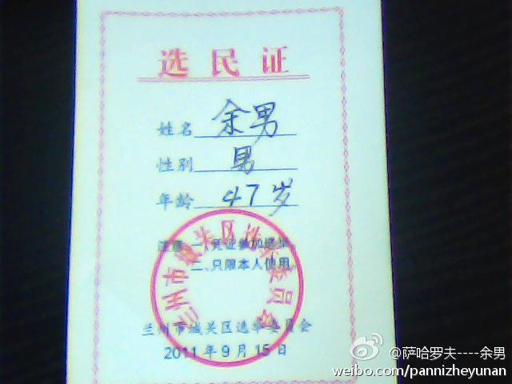
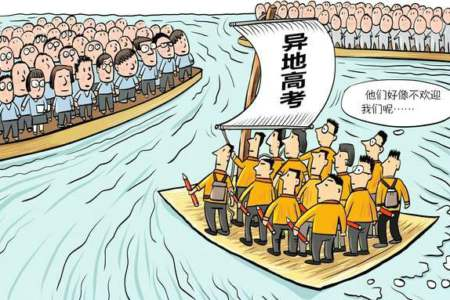

# 困顿与希望——我的23周岁生日献词

我是1990年1月4日清晨八点多出生的，满23周岁的时点，我正好在从北京到兰州的飞机上。

此刻，我所住酒店的对面是兰州大学，我所在的区是兰州市城关区。在这个特殊的日子，这一切似乎有冥冥之中的安排。

兰州大学是许志永本科期间的母校，无论你怎么评价许志永和他的公民运动，他都是一个独特的理想主义者。我最初开始在线下介入公共生活和事件，也是从人大代表选举和“异地高考”维权开始，践行政治权利，争取社会平等，是当代中国公民社会最重要的议题。恰在今日，过去两年的许多画面一一浮现，我是中国社会洪流中一滴水珠，在这时代潮涌中沉浮。

兰州市城关区有一个网名“余男”的人，2011年9月参选过城关区人大代表。虽然他最终落选，我为他写过一篇报道，名叫“兰州人余男的人大选举”。这是我刚开始实习一个多月时的文章，是第一次写带有故事性的稿件。这篇报道发在财新网上之后，两三个小时之后即被删除，这也是我这一生第一篇被“和谐”的报道。

**一**

前几天各地的“异地高考”方案基本上都出了。方案令人失望，北京、上海两市一个交上一篇白卷，另一个选择原地踏步。

“异地高考”维权的实质到底是什么？不同的人有不同的答案。很多人认为这是一个公共政策问题，伴随着人口输入地和人口输出地之间的利益再分配，伴随着本地人和外地人之间的权利消长，甚至牵涉到大城市是否深陷大城市病，并进而步入拉美化的深渊。

当然，有另一些人则认定这是一个公民权利问题，能否“异地高考”的关键在于国家是否承认人民的迁徙自由，是否为自由迁徙的人民提供他们所需要的公共服务。随迁子女家长作为迁入地的纳税人，其子女在迁入地接受教育的权利不可让渡，也不容商量。

两个答案，其实都没错。

经济发达地区自然不能单单只使用中西部劳动力的“人口红利”，却不承担其子女教育的责任。为“异地高考”设置高企的门槛，并不只是避免外省人来考大学给当地考生带来的竞争压力，更是将外省籍务工者子女排除在当地中小学教育体系之外。“留守儿童”问题的形成，关键就在于发达地区对于本应承担的公共服务责任的逃避，而这种“逃避”因其显而易见的好处仍将继续。

如果说中共不搞“民有、民治、民享”，只坚持所谓税收“取之于民、用之于民”的原则，排斥随迁子女就地高考进而拒绝其就地入学的安排都不合情理。外地人和本地人都是民，凭什么要“取之于本地人和外地人，用之于本地人”？“迁徙自由”本来应当被作为最基本的人权之一受到保障，却因为1958年的一纸“户籍登记条例”而被彻底剥夺。本来作为社会管理和公共服务手段的户籍，却成为附加特殊权利的身份契约，改革开放之前，户籍成为限制民众自由迁徙的最大法宝，改革开放之后，户籍又变成在起跑线上就把民众分成三六九等的怪胎。

同样毋庸置疑的是，在没有招生考试机制改革和公共服务均等化改革的配套之下，开放“异地高考”在承认公民“迁徙自由权”的同时，也必然会造成公共治理新的失序。不改变区域间教育水平的巨大差异，任何新的制度设计都不能在保证分数面前人人平等的公平原则之下避免“高考移民”。一些论者提出的“自主招生”改革，在权力仍对社会构成深刻影响的当下，非但增加大量社会成本也将导致高考作为社会流动渠道功能的崩塌。

“异地高考”问题正是当今中国面临诸多问题的缩影，改革与发展问题交织，争取权利与利益博弈并行。不公正的体制导致的畸形已经形成巨大既得利益，对于畸形体制的纠偏举步维艰。公允地说，“异地高考”问题在中国重大社会问题中并不算最为困难，庙堂之上的衮衮诸公纷纷把儿女送到国外，这个问题并没有什么来自于最高层的强大阻力。但即使是面对北京、上海仅仅占全国总人口数不到2%的本地户籍普通居民的可能反弹，政府采取的态度就已审慎之至，那些真正关乎中共执政集团核心利益的变革，又如何会有动力？

**二**

刚刚过去的这一年，我告别了我的学生生涯。

即使用欢笑荣耀换一句誓言，也不可能夜夜在梦里相约。多少朋友各奔东西，多少往事随风飘远。就在2012年那个燥热的夏天，我们的欢喜悲伤都被一一定格。

我成为一名全职工作的记者。我开始在突发事件时去一线采访，去体验记者工作最为精彩、刺激的部分。

寻找真相的过程中，存在着许多的困难，这是对个人的挑战。我的温和性格，少有在现场“打鸡血”感觉，过去几年的经历让我在许多时候不是不顾一切地冲锋在前，反而有些瞻前顾后，谨小慎微。

即使是这样，我们仍要努力去接近真相，这是你的工作，也是你的责任。我们并不容易获得每一个现场的详细资料，我们也很难从最可靠的信息源得到全部的准确信息。寻找更多的信息来源反复求证，在现场采访、文本证据、公开资料的基础上，去拼接事件乃至于事件背后的生态链条，是记者工作的常态。在每一个接受采访或者不愿意接受采访的人背后，或许都有其复杂的利益诉求。甄别繁杂的或许彼此矛盾的信息，需要经验积累成的判断力。而我自己，还很稚嫩。

蓟县大火，死者十人。在这个国度，这样的死亡人数本不足以占据那么多的媒体版面。“死亡300人”的不实信息在短短几天中疯狂传播，背后操盘的力量到底为何，我们不去深究。但我感知到的是，民众对官方的极度不信任，政府对于重大灾难事故信息公开的缺失，对于媒体采访的监控和钳制，正是使政府公信力加速丧失的源头。“蓟县大火”是我入职之后的第一篇报道，这篇报道因为事实上的不准确而充满缺憾，但媒体报道和强大网络舆论的力量，最终迫使当局通过电视媒体发布现场的图像，信息封锁之后，他们付出的公关代价和澄清成本都超过他们的想象。

互联网时代的“公民围观”，正在每一个社会事件中给当局带来新的压力。年底出台的“互联网实名制”政策，很大程度上正是为了对网络言论进行管控和震慑，但已经日渐成长起来的中国公民，恐怕不会因为倒行逆施而噤声。自由的闸门一旦打开，便无法关上。

王树杰死了，他的家庭得到400万元的补偿。

没有想到，第一次去辽宁是因为盘锦的枪声。9月21日那个血色清晨之前，王家人并没有想过事情会发展到那个地步，王家人手持的汽油瓶，本来只是用于恐吓拆迁者以换取更高额征地拆迁补偿的工具。然而，王树杰意外点燃了自己，本不该在执行调解任务时持枪的张研扣动扳机，酿成一场血案，盘锦市的后二十铺村一时成为舆论焦点。

最近几年，征地拆迁过程中的暴力事件频发，从唐福珍事件到宜黄事件，从钱云会到王树杰，人们在面对一般的征地和“强拆”时已经麻木，许多民众呼天抢地的个案，在外人看来实在已是司空见惯。就在盘锦采访的时候，许多拆迁户都向我讲述他们家遭遇拆迁，被当局断水断电，乃至于露宿街头的事情。这些事件中并非每一个拆迁户都是百分之百占理，但让我最有感触的是，对话和沟通渠道的匮乏使得民众和政府之间的对立已没有缓冲之阀，乡绅社会里的有序图景不复存在。动荡之中，人们愤怒的阈值越来越高，然而，遭受苦难的个体并且减少。微博时代让每个人都可能成为新闻中心，围观者的胃口却也越吊越高。

上访不是出路，一般的事件找媒体，媒体也不可能搞个案援助，家家的被侵犯都报道，人人的问题都解决。中国社会需要制度性的解决问题的管道，政府的权力要削减，更要柔软，社会的力量要拓展，更要壮大。代议机构和司法机构应成为民众寻求公正的寄托，而不是政府意志的工具；全能政府要从各种矛盾一线退出，还给不同利益主体在规则下平等博弈的空间。

**三**

飞机落地，我打开手机刷微博。陈宝成写了一句“大禹穿越来治水，炎黄子孙无春秋”，我心里头一惊，除了《南周》，难不成《炎黄》也有事？

很快，我看到了“炎黄春秋编辑部”的声明，“炎黄春秋网”今天九时许被关闭，具体原因不明。作为《炎黄春秋》的老读者，从2008年以来《炎黄春秋》我期期不落，我熟悉《炎黄春秋》的尺度。或许对于《南方周末》而言，在许多时候指出“皇帝没有穿新衣服”是件有挑战性的事，因而只能用“春秋笔法”，但《炎黄春秋》这一本经常在正文里出现八十年代的（此处省略两个姓名）名字，犹如别的媒体提（再省略两个姓名）一样正常的杂志，说当局没有遵守《宪法》，最高权力机关实际上不是全国人大，简直是稀松平常。吴思说不要联想到献词，我以为然。

然而，《炎黄春秋》网被关闭的理由为何？打开网址便知，“您访问的网站由于未备案而被关闭。 请您尽快进行工信、公安备案，有关备案问题请联系服务商！”，这样的词句无论如何都很难不让人联想到一周以前全国人大常委会刚刚通过的“网络实名制”法案。表面上看，似乎这只是一个经营问题，涉及的“备案”与上周人大常委会的“规定”也没有直接联系。但新法甫行未见任何成效，当局却突然搞出这样的玩意儿，只能增强外界关于当局将加强网络言论钳制的猜想。

我们不知道炎黄春秋网何时才能重开，或许这一轮“备案审查”的时间并不会很长。但今日的事件已经开了恶劣的先例，以往每次想整肃《炎黄》，当局总会和编辑部有你来我往，但至少不摆在台面上，而今想要敲打某个媒体的网站，随时随地都可用无厘头的原因来封站，今天我们不为《炎黄》说话，谁知道下一个被整肃的媒体网站是谁？

过去一个多月，XXX三人“新风频吹”，个人对XX二人虽然不抱期待，但也不认为XX会下最近这一组臭棋。(此处省略398字）XXX口碑已经坏到无以复加，干脆制造些难堪让大家对X、X也彻底失望，更能避免XXX铤而走险，坚定不移地和僵化保守分子一起走这条注定会走进死胡同的道路。

小时候，我曾是“革命派”，希望有一天一个从海外领导革命的政党改变这沉闷的一切。中学时，我因《南周》和《炎黄》成为“改良派”，寄望以体制内革新的渐进路径建成宪政中国。而今，当《南周》和《炎黄》已被逼迫至此，我只能放弃对体制内改良的一切幻想，自由中国在民间，公民中国在草野。

**四**

“201314”，被许多人视为结婚的良辰吉日。因为它的谐音是“爱你一生一世”。

而这个被视作吉祥的日子，却是中国新闻史乃至于中国社会变革进程中一个黑暗的时点。

在这个黑暗的时刻，我们看到的希望，来源于我们自身。昨天，面对被阉割的报纸，《南方周末》编辑记者在微博上表达自己的愤怒，《南方周末》编辑部发出了措辞强硬的声明。而今天，我们正看到《南方周末》昔日的编辑记者发出呼吁，声援自己曾经的同事，我们也看到数十个曾在《南周》实习的年轻人，也参与类似的连署。

《环球时报》说，微博上的“意见领袖”不少支持《南周》，这是个事实。民意汹涌，知识界传媒界坚定的共同立场，即使是官方背景的小报也不得不承认。在微博上发声支持《南周》的，有长期关注宪政进程的法律学者，有战斗在争取公正司法第一线的知名律师，有家财万贯的富商大贾，也有在管制更为严格报道方向更为正面的电视台就职的主持人。“言论自由”，不是媒体人的顾影自怜，也不是一小撮人的自说自话。争取《南周》的自由，就是争取国民自己的自由，捍卫《炎黄》的权利，就是保卫国民自身的权利。

“言论自由”不是空中楼阁，不是和普通人生命毫不相干的宏大叙事，而应当以涓滴细流融入生活，让每个人可以自由言说表达，而不畏惧言论可能带来的风险与后果。“因言获罪”，不是一个距离我们时空十分遥远的历史概念，而是实实在在发生在我们身边的鲜活例子，为了谢朝平，为了方竹笋，为了任建宇，也为了或许彼此并不相识的你和我，神圣的权利我们决不放弃。

“言论自由”不是痴人说梦，不是为了比照某种境外制度的观念产物，它关系到我们能够生活在一个怎样的社会。当人们面对突发事件时，没有勇气对外界讲出真相，当人们在遭遇不公时，没有机会进行公共讨论，社会上的不公不义就会在沉默中被掩藏，而社会进步的契机也会在噤声中被一再错过。为了不再有预审的报纸，为了不再有禁令的报道，为了不再有雷区的选题，也为了你我能够在一个开放的平台上进行公共博弈，任何的自由我们都绝不让渡。

今日，从南方到北国，从存有宪政理想的耄耋老人，到勇敢表达声音的“90后”南周实习生，都行动起来。于是我们赋予“201314”全新的含义，我们将热爱这片土地一生一世，我们将守护真相一生一世，我们将捍卫自由一生一世，我们将推动法治一生一世。

今天我许下两个愿望，庹震早日下台，炎黄春秋网早日重开。今天，我们保有一个梦想，我们梦想有一天这一片土地得到上苍眷顾，成为宪政民主的文明之邦。中国梦，梦之难。梦再难，仍要追。

今晚，我伫立在黄河大桥上。黄河水从脚下汨汨流过，一如她千万年以来从高山向大海的赴约。今夜，古老的大地仍旧被黄河、长江与珠江滋养、灌溉，在酷寒的冬季，人们虽因河流获得生机，却注定只能凭借内心的信念去构筑希望。

我们对“中国梦”的追求是正如这滔滔的江河，江河水日日滋养我们，江河水也将流进我们梦中。江河水日日激励我们，江河水也将常驻我们心中。

像往年一样，很多朋友给我生日祝福，很遗憾不能一一回复。说实在的，这个生日我过得并不快乐，但唯有信念，能让我继续前行。

(采编：佛冉；责编：周拙恒）
