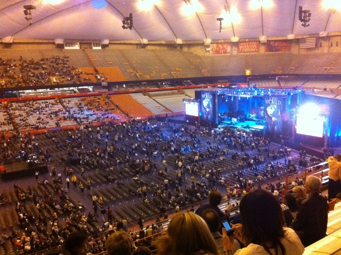

# 围观诺贝尔和平奖得主的奇葩之夜——演员，和影响力

** **

十月九日的Syracuse University，傍晚时分的人群把校园周边的小吃街挤了个满。美国人一排排坐在沿街的台阶上啃着墨西哥卷或汉堡包，大多数亚洲面孔从小饭店打包出来后、匆匆拐进校园——大约还是不习惯美式的过分随意。我不知道他们中有多少人和我一样，为了看同一个人而来，反正事后听Syracuse的同学说，平日是不会有那么拥挤的。我和同来者大约是介于这两类人中间：我们拐出小吃街，进了校园，找了个还能晒到最后一抹夕阳的台阶，席地，一边吃一种袋状的卷饼，一边讨论一会儿到底会看到些什么——事实证明，这种讨论通常意义全无，因为即使猜全了100种可能性，现实总是充满幽默感地向你展示第101种。

那个年份是不能提的，那个人的名字也不能提，所以到底该怎么说起他呢？总之是在那不能提的一年获得了和平奖的那个不能说的人。国内的臭名昭著和国际的声名远扬，任何不对政治或是历史或是宗教或是文化彻底无感的人，都会忍不住好奇这究竟是怎样一个人吧？一路上，我问同行的女孩，为何心理学的她会愿意买了门票、乘三个小时的火车、只为看一场这个人主持的音乐会时，她给我的答案基本是这个意思。而我自己，本科前对政治绝非无感、而是彻底反感，却阴差阳错，不仅进了美国的graduate school，还号称要研究political sociology，偶然得知有这样的机会时，自然是哪怕翘课砸钱也要去看个西洋镜的（嗯，所以我翘了期中考之前的统计复习课。。）。事实证明，社会学和心理学是一种非常彪悍的组合。演讲结束时，我俩执手相对泪眼、感叹如果没有彼此作伴吐槽，难保在这60分钟里真睡了过去，那可就对不住100多刀的门票加车费了。

来张concert现场的图吧。开场时，核心区域的位置已被坐满，周边也是目测超过90%的上座率。观众中一部分是syracuse的学生，其他是当地居民——父母带着5、6岁的孩子，半百以上的老夫妻，粗嗓门的典型Sam大叔，等等。暖场的节目可真无聊，三个胖阿姨献上了一首上周写的赞美诗，几个美版文青带来东南亚调调的小合唱，一对打扮如吉祥三宝的巴基斯坦中年夫妻对了歌，总之若是去少数民族地区玩过、或是参加过文艺汇演的孩子，应该都能脑补那个情景。不过对于美国观众，这些应该都是新鲜的，偶尔一瞥，扑面一股东方情调，印度香般恍惚迷离，所以他们兴致昂扬着，死命拍手、尖声口哨，simply enjoying the big show.

我该怎么描述他的出场呢？戴眼镜，满面笑容，红色藏袍，他走至台前，观众起立，如潮水涌动，他双手合十，躬身行礼，一切无比正常，然后。。然后，不知怎的他拿出一顶syracuse university的红色鸭舌帽，如魔术师向观众致敬一般，单手执帽划出半圆，潇洒地行礼，将那顶帽子罩到头上。美国观众被这串行为点燃了：唔，他们想到了？最最西方的礼仪，他们心中最最东方的人物，多么完美的结合啊！或者是我不能想到吧？尖叫和掌声再次汹涌澎湃地推向舞台，那个风口浪尖的人物镇定自若地笑着——他自是见惯了这种场面、大概剧本上写的就是如此吧。他说：sit down, please! 观众被他含混的口音和憨厚的神态逗乐了，一边拍手一边坐下。哦！“憨厚”？我怎么能用“憨厚”这个词呢？可是，又有什么词比“憨厚”更合适呢？在他用一口broken English演讲的过程中，观众一次次地被逗得前仰后翻：当他不知道如何用英文表达、转身看着一边躬身垂首而立的翻译，又在翻译说完后、滑稽地冲着观众一点头“that's it!”时；又或者话筒突然不出声时，他作不明所以状，歪着头对话筒又吹又拍时。

他的英语实在不好。同行的女孩俯身过来问我：“你说那些美国人真的能听懂他在说什么吗？”我余光偷瞄了眼身边坐的白人小哥，他双目微闭，脑袋微微前倾，我却觉得随时有砸下去的可能——亲，你睡了吧。。可也不能怪这位专程买票前来的小哥吧？他的演讲实在没有太清晰的内容——大约反复是呼唤每个人内心深处的 a little piece of peace，要在此基础上建设一个universal community，还有就是21世纪属于年轻人。可他的口音太含混了，好几次，连同步打出的字幕都断了。那心理学的女孩又说：“其实他们也听不懂他在说什么吧？但身边人都聚精会神的样子，自己也只要这么装。”我忍不住笑，说：“像皇帝的新衣一样呢！”终于，坐在身后的美国女孩忍不住了，轻轻问她同伴：“Can you get what he's talking?” ”Eh...." 我们对视一眼，偷笑，再瞄一眼身边的白人小哥，一觉睡醒后正竭力地盯着字幕牌。

那么这是一场失败的演讲吗？若是你看到观众哪怕大多数时候听不清他在说什么、却依然爱死他了的样子，你就一定不会这么觉得。应该说，这是一场每一步踩准了美国人的点的演讲。他说：“one person, just a little . But, two persons! Ten persons! One hundred! One thousand...”还要我继续吗？下面掌声和尖叫已经淹没了他的声音。。人们爱他不端架子，爱他会用排比，爱他说"you are making a contribution to peace of the world!"——虽然事实上他们只是参加了一场有东南亚小调和巴基斯坦版吉祥三宝的音乐会。。。人们最爱的，大概还是他，一个从任何角度看都应该是传奇并高高在上、有信仰有勇气的人——77岁的老人，从西藏这东方的东方而来，和最最可恶的communism和authority对抗，却表现出一种被夸饰的天真和亲切：前者让他有趣并值得被关注，后者又消抹掉伴随前者的距离感。所以他再是空洞地重复着everyone can make a difference，或是和平全靠你我他，或是这是看着他站在那儿、憨态可掬，都可以了。毕竟，美国文化的主流是消费文化，消费文化便是花钱买快乐，若是50刀的门票便能体验与“精神导师”亲切互动、激发内心的小和平并促进世界的大和平的话，从任何角度看都是个good deal吧！

那天演讲结束时，看台上的人潮再次涌起，为他拍手，为他尖叫，一如欢送一个篮球巨星，或是pop star。他退到一边坐下，之后上来的演员总要躬身与他握手，直到他提前乘专车离开。

从雪城回来的路上，一路补眠，接下去的几天也都没有太多去想这件事，不是没有感觉，而是太多感觉，却不愿意表达——我该说吗？那种微妙的屈辱感，当看着原本认为是宗教领袖的人物，娴熟地从美国流行文化的工具箱中挑出合适的道具，装点在藏式的袍服外，信手拈来，点穴般精准地戳着美国受众的笑点，全场掌声雷动。他如一个出色的演员，77岁高龄却自如游走于差异极大的东西方文化之间，出入两套全然不同的礼仪——一套是宗教的、神圣的，在其中他是不断转世的活佛，是精神的最高领袖；另一套是世俗的、娱乐的，在那儿他和政客、脱口秀主持人、歌星一样，是长袖善舞的演员，比着谁能兜售更受欢迎的娱乐，竞逐在受众群中有限的影响力。宗教、精神领袖的符号，是他得天独厚、独一无二的资源，而任何资源只要处理得当，都可以被做成一笔好生意。我问：他失败了吗？那不妨来做个想象，经过了这一场哪怕内容上空洞无味的演讲，虽然他决口没有提一句政见，当下一次媒体上出现和他有关的消息时，受众们会更喜欢哪一边呢？这当然是一笔好生意，他褪下自打成为转世灵童的那一天便承载起的近乎于神的法相庄严，玩转美式流行文化的魔术，观众因他神圣而来，享用了与这传奇的亲密无间而去，事后一回想：“他也没什么深奥的嘛！”可他传播观众最喜闻乐见的快乐，他收割胜对手于无形的影响力，这当然是一笔好生意。美国，这个奇异的国度中最奇异的一点，恐怕是你分不清市场、娱乐、政治的界限：不能把自己卖出好价钱的政客，不是好政客。有部电影里说："It doesn't matter who you are; what matters is what people think you are."所以想要卖座，就要收拾好多重人格、演受众眼中可爱的角色。硬通货是美元，硬通货背后的硬通货是影响力：这么硬，那么软，该如何互换怎么计算？

（采编：周拙恒；责编：周拙恒）

