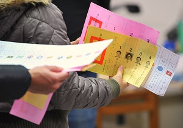

# 国家，正在你脚下

** **

蔡英文的一支竞选广告里，最后几句话，令人感到温暖和震撼：“站在你家的顶楼，这里是你的国家。国家伟大吗？国家，正在你脚下，需要你来爱她，改变她。”

今天，1月14日，中华民国自由地区的第五届总统选举将会在台澎金马举行。1809万对岸同胞将用手中的选票，决定台湾未来四年乃至于整个华人社会未来一段时期的命运。

十六年前，华人世界数千年历史中第一次由人民直接选举一个政权的最高领导人，李先生顺利当选连任。那时候，我还没有上小学，对于那一年的紧张气氛，我的记忆里完全没有概念。

十二年前，我已经上小学四年级，那时候网络还不发达，中国大陆的民众对于对岸的社会，很大程度上只有模糊的感觉。那时候家里也收不到凤凰卫视，只是知道国民党下台了，新上台的这个人叫陈水扁，他以“新台湾人”自居。

八年前，当时的我对国民党有着相当的好感。连战、宋楚瑜以两万余票输掉选举，我也感到十分地遗憾。

四年前，马先生当选实现政党二次轮替。在中国大陆，国民党重新执政的消息也让很多人有不同解读。那时候，我在《财经》杂志上读到一篇人民大学教授张鸣的文字：事实证明，威权的政党，只有完成民主的转型，才有可能长久地生存下去，并且走向新生。字里行间的言外之意，大陆人都能感知到。

总统直选十六年，在过去的四次，我对于对岸的选举都是真正意义上的“隔岸观火”。直到2008年大选时，我还不认识任何一个台湾的朋友。那时候，我们眼里的台湾大选，只是电视媒体中的播报。

而现在，我认识了越来越多台湾的朋友，他们有闽南人、客家人还有外省人。他们有的关心政治，有的热衷文艺，还有的关注商业。

他们在facebook和人人网上分享视频，在自己支持的政党和候选人页面下点击“赞”，表达自己的观点。他们有的每天更新选举的行情和自己的看法，但更多的，并不太讨论政治议题，他们的生活远不是蓝绿橘三种色彩。

这是太平洋西岸的宝石和珍珠，这是全世界落差最大自然景观最丰富多元的海岛之一，这是传统的中华文化道统与西方、日本文化共同浸润的土地，这是2300万人的家园。

在这个岛屿上，我们的闽南、客家或外省籍的朋友，都是移民的后裔。他们的祖辈从明季以来，跨越海峡，来到陌生的热带岛屿，筚路蓝缕，开拓、垦殖。他们的祖辈从1940年代的烽火中走来，成为四海飘零的一员，又在这片新生土地上重新生长，发芽。

他们，有的是坚毅勇敢的农人与渔民的后裔；他们，有的是中国精英或普通农家的孙子和孙女。

他们，和我们操着同一种语言，有着同一种肤色，但是却和我们拥有完全不同的政治、社会与生活方式。

去年我生日的时候，一位中南部的闽南籍朋友送给我一幅台湾中南部的地图，还有一张嘉南平原沃野的明信片。金黄色的麦田等待收割，蔚蓝色的海洋拍打海岸。他们对于这片土地的情感，真挚而朴实。

珦如说喜欢上江蕙的《落雨声》，想起卖花的老阿嬷。嘉芸说总是听胡德夫的《美丽岛》，那片土地上有水牛、稻米、香蕉、玉兰花。

我的台湾朋友，有的蓝，有的绿，然而我知道他们与我们有一种特殊的连结，有一种休戚与共的关系。

2011年到2012年，是中国大陆的地方选举年，逾9亿选民将在这960万平方公里的土地上投票，选举县市区和乡镇民意代表。我和我的朋友们，有的是在任的谋求连任的人大代表，有的是初次参选的新候选人，有的是到全国各地做选举观察的志愿者，还有的是努力在媒体禁令夹缝中打擦边球的记者。

我们，一起经过了2011年中国大陆这些选举中数不清的违规，违法甚至“奥步”。有的投票站外戒备森严，数十辆警车只为了某一个“捣乱”的参选人及其支持者不搞出乱子。有的投票所内问题重重，秘密写票处根本没有或形同虚设。有的选民投票时工作人员指指点点，让选民勾这个叉那个。

我们知道，这其实不是选举，这只是走过场。

我们的选举，还不如台湾的两蒋时代。

从四十年代末宣布戒严，到1991年终止动员戡乱，四十多年的时间里，不分族群，不论左右，全台湾支持自由民主的人们办杂志，拼选举，党外运动的洪流与政治改革的时势相互契合，终于以“宁静革命”的方式创造出台湾民主转型的奇迹。

这片曾被白色恐怖笼罩的土地，这片曾经深陷党禁报禁的土地，这片曾经有许多禁歌和禁书的土地，这片曾经要在总统的姓名前面空一格就像北朝鲜放大领袖名字一般的土地，终于开出了民主自由之花，让海峡此岸的中国人羡慕。

然而，我们知道，这个大国没有台湾的路可以简单重复。

在2011年，我们时常听到朋友的人身自由受到限制的事情。嘉芸有一次改状态，说她对于这样的消息还是会感到错愕。

她说：“温暖不易，正义更远。”

是的，对于每一个有着宪政民主理想的大陆人而言，每到台湾选举的时候就会百感交集。就像一千多年前的诗人王维写过《九月九日忆山东兄弟》，朋友们去投票选择他们的未来，而当局却总是想把我们挡在政治参与的大门之外。

“站在你家的顶楼，这里是你的国家。国家伟大吗？国家，正在你脚下，需要你来爱她，改变她。”

站在北京的CBD，这里是我们的国家。这里有光鲜的大楼，也有无数北漂不为人知的辛酸和苦楚。我们想要爱她，想要改变她，让这个城市的空气更好一点，道路更畅通一点，机会更公平一点，制度更平等一点。

站在上海的陆家嘴，这里是我们的国家。这里有万众瞩目的证券交易所，有全中国最高的写字楼，同样也有全国最高的物价，有许多年轻人因为高房价失落的梦想，有许多抱着希望而来却最终不得不面对的巨大失望。

站在四川的山野，这里是我们的国家。这里的春天有盛开的油菜花，却没有什么青年和壮年。老迈的父母守在竹林掩映的屋子，远行的儿女在广东或江苏的工厂里辛苦忙碌，他们的孙子和孙女成为“留守儿童”或是大城市中城乡结合部边缘化的“打工子弟”。

这片脚下的国家，有无穷无尽的希望，有无穷无尽的苦难。

没有医疗救助的贫民，没有可见未来的尘肺患者，被歧视的弱势群体，被拆迁的失地农民，每一个人都有并不卑微的愿望，现在的他们需要的是阳光的权力、公义的保障和公开的表达。

一个拥有民主宪法的国家，在一个小小的岛屿上因为所谓的战争状态，冻结四十多年人民的自由与权利。让被剥夺的民权逐渐回归到人民的手中，这便是整个二十世纪后半叶台湾政治史的主旋律。

对于一个没有宪政基本架构，没有经济充分发展基础的大国，对岸四十年五十年走过的路，我们注定还要走更久。

其实，我们和对岸的许多年轻人一样，我们都是这个兔年的“首投族”。

你们做志愿者，你们参加选举造势，你们开始你们的政治参与。在此岸，在这样艰困的环境下，我同样看见了比你们更勇敢的年轻人。

我记得北邮校园里因为举许志永宣传海报被校方人员批评和施压的女学生，我记得北外校园里奔走在吴青和乔木办公室里的志愿者，我记得那一个个年轻人的名字，广州叶瑞立803票，北京黄明浩860票，北京张诗羽3186票。

像张耕维说的，相信未来的中国大陆，你们也能拍出像民进党一些竞选文宣的广告，展现你们曾经怎样一路走来。

不论蓝绿，我的许多台湾朋友们对中国大陆的社会变革，都带有最真诚的期许。而我们也都深知，只有中国大陆不断接近文明的价值，两岸才可能实现永续的和平。

今天，选票在每一个台湾选民的手中。今天，国家仍在每一个大陆人民的脚下。

我们去行走，我们去观察，我们去记录。

我们去做志愿者，我们去做宣传员，我们去做吹鼓手。

我们言说，我们也践行。

我依然相信，改变将从每一个“我”开始。

华人世界的每一个公民，请记得：

国家，正在你脚下。

国家，正在我们脚下。

声明：此文对民主进步党竞选广告的援引与本人政治立场无关，竞选广告中的政见不代表本人立场。 

（采编：楼杭丹；责编：麦静）

 
