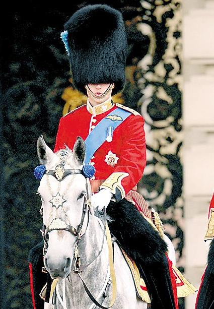

# 国王的死

** **

尊敬的女士们、先生们，尽管我已经喝醉了，但是，我清楚地知道：我必须在此时此刻，也就是我准备开始向你讲述这个故事之前，向您道歉，因为这并不是一个您迫切要读的故事。那么，也便请您放弃对于这个故事的所有希望。当然，也许在这之前，您早已放弃对于这个世界的一切希望了。是的，我正醉着呢。可是，我的大脑还在运转——就像我清醒的时候一样，就像我做梦的时候一样。那么，我可以引出一个形而上的假设，一个神秘主义的假设：我们清醒的时候和梦境之间的界限未必是那么的清晰。如果用一个比喻作为理解这个假设的桥梁，那么，我想说：当我们越过梦和醒的界限的时候，就像一条鱼从太平洋游进了大西洋。

也许现在这一切只是个梦：你梦见一个醉酒的人正在讲故事给你听。尔后醒来，你依稀记住了些情节，便根据它们写出了些什么。但我必须强调一点：这个梦的主体不是你和我，而是我们两个中的每一个。因为，我也正梦见我喝了些酒，正在讲述一个可能存在过的王国的故事。也正因为这些，对于你们，对于所有看过这页纸的女士和先生们，诸如“你们读了一个故事”之类的表述是不甚确切的。我想，较为确切的说法应当是：你们每个人各读了一个故事。

在我把你完全弄糊涂之前，这个老掉牙的故事应当开始了。很久以前，在一个安详的国度，有一位受人尊敬的国王——而这并不那么重要，重要的是：这位国王有一个儿子，而这位王子以美貌著称。他的美貌是如此惊人，以至于在他尚且年幼的时候，便已经开始对那些注视着他脸庞的惊异眼神感到恐惧。这种恐惧使得王子甚至不愿意被任何人看见自己的面容。王后已经过世多年了，所以老国王更是将儿子视作上天留予自己的珍宝。于是，从五岁起，为了保护这位储君，王子便被戴上了一层红色的面纱。这么一来，别人就再也无从看清王子的脸。与此同时，王子自然也从此再不能看清过他人的面庞。因此，长大后的王子无法认出任何一个人，甚至包括镜子中的自己。于是，国王又不得不规定：为了让王子能够辨识人的身份，城堡里的所有人，无论女仆、侍者还是群臣，必须根据身份穿上不同的服装。当然了，这规则发挥作用的范围也包括了王子和他的父亲——国王自己。

故事里的时间来到了一年冬天。这个冬天的天气是如此之寒冷，那些负着柴禾的骡子可以在结冰的河面上走过，丝毫不用担心冰面被重量压碎。而寒意甚至也入侵了城堡，年迈的国王便吩咐侍者在自己的卧室里燃起了壁炉。而国王并不知道：厄运也跟着寒意一道袭击了这个平静的王国。不久以后的一个早晨，国王被发现躺在熄灭的壁炉旁的台阶上——没有了呼吸，皮肤上没有覆盖一件衣衫，而这些衣衫也没有能在城堡里的任何一个地方被找到。

国王就以这样难以理解的方式突然死去了，这出人意料的死亡仿佛在城堡内部引起了一次爆炸，那冲击波仿佛要击散这里每一个女仆、每一个侍者和每一位大臣的灵魂一样。有人找到了那夜守在国王房门外的侍者。

“你有发现有什么异常之处吗？”侍者诚实地回答道：“没有，国王回来以后只是洗了个澡，并没有发生什么怪事。”

莫名的恐惧和悲伤如同附着恶灵的藤蔓，顺着坚实的墙壁，在整个城堡迅速的生长着。很快，王子赶来了，依旧无人能看清他英俊的面容。而他红色的面纱因为沾上了许多泪水，而变成了樱桃红色。

“侍者，请带我去看看我可怜的父亲。” 王子带着哭腔虚弱地对身旁穿着粗陋服装的男人说。

侍者便领着王子来到国王尚未穿上衣服的尸体边。透过樱桃红色的面纱，王子茫然地看着面前这具樱桃红色的尸体，他渐渐停止了哭泣。一切就这么费解地陷入了静谧之中。过了许久，王子才转过头，将信将疑地问道：“侍者，这确是我的父亲么？”

侍者回答道：“没错，这正是先王的遗体。”

恰是这时，女仆们慌慌张张地走进来，领头的那个手里拿着另一套国王生前的华服。她们七手八脚地开始将它套在国王已经僵硬的尸体上。看着这些穿着粗陋衣服的女人，看着父亲的衣装，王子这才得救版地再次泪涌而出：“喔，让开一下，女仆们。让我看看……我那可怜的父王。”

总之，国王千真万确是死了，光溜溜地死了。而王子自然而然地继承了父亲的王位。当然，他也将要搬进他父亲所死去的房间。

晚上，新国王回到了房间。看着陌生的一切，想到父亲匪夷所思的亡故，王子感到这里是如此的寒冷。他便吩咐道：“侍者，请为我点着那壁炉。”不消一会儿，壁炉里火焰的热量便开始向房间弥漫。可新国王依然感到一阵阵的寒意。他又吩咐道：“侍者，请为我准备热水，我要洗个澡。”不久，侍者来到新国王身边，深深地俯下身，说：“尊敬的陛下，热水已经为您准备好了。”

“侍者，你可以出去等候了。” 新国王站在镜子前，用一种听上去并不那么坚定的语气说，“这是国王的华服，我穿上它，便再也不是过去的自己了。”

也许是因为白天过于悲伤，正沐浴着的新国王在腾腾的蒸气里感到一阵阵的眩晕。他一个人从浴室摇摇晃晃地走进房间，却发现自己刚才脱下的衣服不见了。因为身体的无力，他便裸着身子，坐在昨夜自己父亲惨死的台阶上，一口口地喘着粗气。新国王恍惚地看着壁炉，火焰似乎不那么旺盛了。而他却并没有唤来侍者——因为还有比这更让他感到惊异的东西：在那壁炉的边上，台阶的对面，新国王发现了一只木马玩具。这只木马玩具对于如今的新国王来说并不陌生，因为这正是他小时候的心爱之物——这个“小时候” 自然是指，的是这位俊美的新国王还没有被戴上面纱的时候。那小木马永远带着粉红色的马鞍，想必是一只可爱的小牝马吧。而这只小牝马，在这个夜晚神奇的出现了 。新国王没有功夫想关于这夜晚的牝马的来龙去脉。他只是无力地躺在台阶上，仰头看着天花板。他奇怪地看到天花板渐渐变作了透明，一些男人和女人正在楼上来来往往的景象渐渐从中浮现出来。新国王模模糊糊地从下向上看着这奇异的场景，而很明显的是，这些人是无法看到他的，只是各自做着工作。而更加奇怪且巧合的是：新国王发现这些男男女女都是赤身裸体，但却又若无其事的忙碌着。“我大概是看不到衣服了吧，”新国王念叨着，他又搜寻般地四下张望了下， 我连我自己的“衣服也看不到了。”

新国王就那么有气无力地斜躺在台阶上。他侧过他那俊美的脸，看着远处的镜子，念念有词地说着：“这些没有穿衣服的男男女女又究竟是什么人呢？”这么说着，新国王忽然也很想到镜子前，去看看自己没有外衣遮蔽的身体。可是，他却发现：自己再也无法动弹了。

第二天，城堡里便传出了新国王暴毙的消息。

“夜晚，魔王骑着牝马离开了宫殿，

化身为国王城堡里生火的侍者。

他伴着国王和他美貌的王子，

吞噬了他们华丽的外衣。

又用幻象和炉火里的毒气，

留下了两具樱桃红色裸露的身体。”

就像莎翁的诗句，“我遇见了那晚间的牝马（I met the night mare）”。

（采编：应鹏华；责编：麦静）

 
