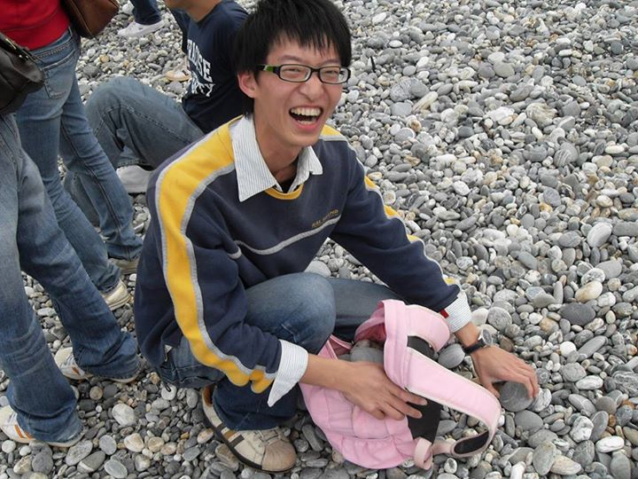
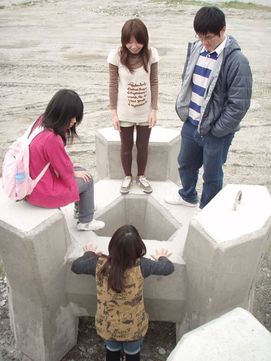

# 國家考試教會我的3件事

據說，標題有這幾個字的文章都會紅，所以我很不要臉的盜用一下。
 
今年高考放榜後，媒體照例出現很多這類報導，如一般行政榜首，「每天晚上會先把隔天的三餐準備好，帶到圖書館，通常是牛奶麵包或御飯糰等方便易食食物，從早上8點到晚上12點，除了吃飯、上廁所，都在念書。
 
她說，紓壓方式就是哭一哭，有時真的很累、壓力到了頂點，她是邊讀邊哭，但只許哭10分鐘，哭完趕快再念書。」（來源：http://www.cna.com.tw/News/aIPL/201309170239-1.aspx）
 
考選部網站也有一個「榜首經驗分享」專頁，如調查局特考財經組榜首說，「必須要能夠體會並且實行『寒』字更深層的內涵，那就是心理素質，強烈的自我要求以及堅定不移的信心，克服自身的惰性，不斷鞭策自己隨時進步再進步，除了『堅持』、『努力』以外，『自律』最為關鍵，一如汽車廣告所說的『專注完美、近乎苛求』。(來源：http://wwwc.moex.gov.tw/main/introduction/wfrmExperience.aspx?menu_id=1317）
 
每年看到這種新聞，總是很虐心，為什麼公務人員的素質一定要建立在這種壓迫、勞役的基礎上？難道快樂學習就會安樂死？
 
因此國家考試起碼有3個值得討論的問題：人力資源管理的效率、教育及考選的技術、與民主憲政的相容性。不過以下只針對高、普、初、地方特考的行政類科，其他我不熟悉；特別是，只針對制度，而不是人。最後再提出可能的改進方案。
 
###（一）人力資源管理的效率###
 
人力資源管理最基本的原則就是適才適所。通常只有用人機關知道自己需要的人才，甚至首長不會比科長更了解該職缺所需的特質及技能。
 
國家考試會這麼受到歡迎，除了外面勞力市場過分苛刻外，公平也是主要原因。因此這套人力甄選途徑，就是用公正的機關、統一的考試、冷酷的考題、集體的分發建立起來的。可想而知，從阿里山鄉衛生所到行政院原子能委員會，從監察院到法務部矯正署臺中監獄，通通把用人這件事外包給不相干的外人－考試院。
 
你能想像Google要募一名軟體工程師，卻委託可口可樂的人資部來代勞嗎？或者木柵國小徵一個教師，委請哈佛大學校長來審核。
 
台灣的公務人力甄選，除了把家務事丟給外人外，還用風馬牛不相及的考題來過濾應試者，最後實際進入機關的，還是電腦選的。從頭到尾，組織連要進用的新人長什麼樣都不知道，豈不像拋繡球招親？
 
我們都知道保險的理賠額度愈高，保費就愈高。而「不公平」就像一種風險，控制風險的力道愈大，付出的成本就愈多。這個成本，就是人力資源配置的不效率。人員像大風吹一樣，隨便吹向一個機關，怎麼有效率的起來？除非我們承認公務機關由任何人來任職，本質上都是一樣的。
 

 
###（二）教育及考選的技術###
 
考過國考的人，應該不會認為讀那些教科書可以增長知識、訓練思考、加強工作能力，甚至大部分會同意，生吞那些名詞、條列、口訣，跟真正工作完全是兩回事，可見填鴨式教育已經向上延伸到公務人力的養成。
 
相對於中學教育不斷在爭辯適當的教育學習方式，考選制度卻沒有一絲檢討的聲音，有的只是媒體、補習班、考試院強力行銷榜首一天只睡幾個小時、寫了多厚的筆記、用了哪些記憶法、犧牲了多少休閒、禁絕了人際往來、苦守多年的寒窗、背負了沉重的社會壓力……最後，一戰成名！
 
其實這些人的心理素質是非常強硬的。我比較不解的是，為什麼最高公務人力主管機關要推廣這種價值？
 
你有看過哈佛大學MBA招生委員會，主動詳列申請教戰守則嗎？你最好待過厲害的大企業、做過跨國生意、頂著顯赫的頭銜……
 
你應該也沒聽過耶魯大學法學院自製LLM申請攻略，明講要在知名事務所工作、得過辯論比賽冠軍、擁有很多國際經驗……
 
他們更不會把最重要的潛規則──要很有錢──寫出來。
 
這些看起來很「勢利」的條件，通常都是代辦機構、補習班、網路論壇跟你講的。而我們的考試院則是直接跟你定義，要成為優秀的人才，就要自我剝削！
 
隨便揀幾道題目，就可以看出高普考怎麼虐待考生：
 
＊請依照客家基本法的內容，寫出「客家人」、「客語」、「客家人口」三個名詞的定義為何？並寫出桃園縣、雲林縣、高雄市、臺東縣等之客家文化重點發展的鄉（鎮、市、區）名稱。（102年高考客家歷史與文化）
 
（我要向把以下這個背起來的人致敬……）
 
＊請說明北埔姜秀鑾家族，曾經幾次奉諭由何人率領金廣福墾號團練之隘丁參與護臺戰役，每次結果如何？（102年高考客家歷史與文化）
（幾次、何人、結果……那政治學也來考一下歷代總統與黨員政爭大事紀好了）
 
＊危機爆發前、爆發中及爆發後，組織各應從事那些運作？並請申論危機管理對於公共管理之啟示與應用。（102年高考公共管理）
（依照理論，如果大樓失火，我要先成立危機管理小組、危機情境監測系統、危機資源管理系統，再call 119；火撲滅後，如果大樓還沒燒完，我要成立評估系統、加速復原、從教訓中學習，最後寫一篇文字華美的報告）
 
＊請解釋何為內容分析，並說明其適合進行的主題。（102年高考社會研究法）
（寫得出內容分析是啥，真的會用內容分析做研究嗎？其實我蠻想拿數十年來的國考考題做內容分析……分析教科書產業的商機）
 
＊下列那個國家的憲法規定：「公務人員係全體國民之服務者，而非部分國民服務者」？ (1)我國 (2)美國 (3)日本 (4)英國 （102年高考行政學）
（這麼不通順的文字，我國憲法起草者的文筆應該沒這麼差吧）
 
＊所謂「政府運作在正面上要能坦白公開，在負面上要能抑止腐化」，此一敘述係指行政責任的那項意涵？ (1)正當程序 (2)職能 (3)公正 (4)課責 （102年高考行政學）
（回答這題，好像在玩踩地雷）
 
＊受收容人之親友申請會見，下列何種情形，收容處所得拒絕之？
(1)受收容人於同日已會見親友2次
(2)受收容人於同日已會見親友1次
(3)受收容人於同週已會見親友1次
(4)受收容人於同月已會見親友1次
（102年普考移民法規概要）
（這這這這……是繞口令嗎）
 
＊依地方制度法規定，縣（市）人口在一百六十萬人以下者，縣（市）議員總額不得超過幾人？ (1)55人 (2)57人 (3)60 人 (4)62人 （102年普考地方自治概要）
（內政部長你來回答看看）
 
這些題目不是對實務一點幫助都沒有，就是太實務了，等到去上班自然會強迫知道。更別提什麼訓練創意、獨立思考了，那對國考而言太不切實際。
 
這種檢驗方法，跟工廠有什麼不同嗎？有，真的不同。機械掉了一根螺絲釘可能會故障，考生少背一個項目，國家應該不會有什麼損失，唯一嚴重的是他大概會跌20個名次。
 
在什麼都能考的國度，一年可能有上百萬人耗費心神在這種應試學習裡，這就是我們公務人力需要的競爭力嗎？
 
無論在什麼領域，筆試一定有它的極限。用沒效度（validity）的手段來獵人頭，就像拿捕蟲網來撈魚、拿網球拍來篩穀子、拿電風扇來吹考卷一樣「隨機」。
（來源：http://pds.exblog.jp/pds/1/200706/30/27/a0104227_10294173.gif）
 
 
###（三）與民主憲政的相容性###
 
公平與效率是一種trade-off，哪一邊多一點，另一邊就會少一點。所以我們必須先釐清，到底在國人心目中，公務人員最重要的價值是什麼？
 
有兩種基本角色，一種是維持型，一種是開創型。
 
舉例介紹兩者的差異，假設政府打算促進勞動力回流農村，於是打算補助返鄉務農青年兩年最低薪資。
 
如果是維持型官僚，就會協助政務老闆起草政策說明書、找預算、開公聽會、擬定執行細節、追蹤發放進度等，他可以把所有程序做得妥妥帖帖，讓長官沒有後顧之憂。
 
幾年後錢花完了，承辦人再把以前的公文拿出來改一下、名稱換上更炫的，接著再找預算、發公文、填表格等，延續幾年來穩健的政策。
 
這還有一個好處，政策績效很好看：多少人投入農業、總共發出多少錢、農村人口增加多少、預算執行速度等等。至於幾個人半途而廢、幾個人是幽靈人口、農產通路有沒有改善、農民收入是否提升，就是個謎了。
 
如果是開創型官僚，可能會在接手政策時，思考一下恰不恰當。比方他可能明查暗訪，推測農民賺不到錢不是老闆給薪太少，而是層層通路商吃掉其中的利潤。
 
他可能會勸長官撤回，或是修正政策，但這樣必須負起更多的政策成本，不但找自己和同事麻煩，也可能得罪既有領取津貼者。
 
其實兩種模式都有理論基礎，早在韋伯提出科層體制的概念時，就假定透過科學、理性、嚴謹的組織設計及教育訓練，每個人的貢獻都能轉化成組織所需的成果。
 
而且政府職能不外乎兩者，服務與管制。前者，只要態度好一點，基本上人人都做得來。至於管制，政府可能成立委員會，將監督職責外包給專家學者，官僚只要維持程序即可。
 
還有一點，不管是什麼國家，政府部門頂多作為社會轉型的「後盾」，而不是「領航」，因為一個政府再怎麼大有為，也沒有足夠的資訊基礎預知最好的政策選擇。因此政策大多是被社會氛圍逼出來的，哪個團體的動員能量大，政府就倒向哪一邊。
 
最後，事務官不太需要負擔政策責任，他們唯一要承擔的是：道德責任──我所做的一切，是不是配得上人民託付給我的終身職。
 
因著這個終身職，我就算要大破大立，無論是阻擋不合理的政策，或是偷偷洩漏資料給外部團體，機關也不能奈我何，最多將我冷凍、打乙等。因此公務人員有最低限度的保障去追求所希冀的價值。（參考http://www.tfd.org.tw/docs/d6t4/265-272.pdf）
 
因此也請考試院搞清楚，鐵飯碗從來就不是獎勵，而是一種託付！這一層因果關係沒有釐清，台灣的文官制度就離英、美的「功績制」很大一段距離。
 
明清開科取士，有泰半原因是皇帝為了對抗外戚勢力，便透過考試掄選一批聽命於皇帝的及第者，協助治理國家。這種觀念進一步延伸為現代耳熟能詳的「行政倫理」，也就是──無條件的順服。（參考http://www.tfd.org.tw/docs/d3t3/07.pdf）
 
看看這則報導說的，「董保城特地為考生準備『狀元飯』，依明朝古禮製作甜點八寶飯，讓考生沾沾喜氣。」顯然在考選部長的意識中，國家考試仍與前現代的科舉無異。（來源：http://news.chinatimes.com/focus/11050105/112013091800075.html）
 
###（四）可能的改進方案###
 
其實上述兩種人角色，在政府組織是可以兼而有之的，我想了幾招「各取所需」的方法，但只是非常初步的想像，有待更多討論。
 
1. 四階段篩選
 
具有技術門檻的職位，或中階（比方6職等）以上文官，採取筆試->資料審查->面試->試用四階段。
 
筆試仍由考試院統一命題、考試，選幾倍於缺額的「文官候選人」進入第二階段。
 
在第二階段，由候選人自己向用人機關投遞履歷及必需資料。通過書面審查後，進入第三階段面試，接著各機關自行公告錄取人。
 
第四階段，錄取人至機關試用三個月或更長的時間，機關如認不適任，可以解除聘任，並再次公告職缺。至於俱樂部般的基礎訓，就可以省了。
 
通過考試的候選人有點像自由球員，可以在一定年限內保有資格，隨時向各機關投遞履歷、重複錄取；今年沒有中意的職缺，也可以等到明年。
 
文官候選人的制度在於控制人際網絡不公平所帶來的風險。意即，某人就算在應徵時輸在關係，總不至於所有用人機關都接受關說。況且老是屈服於關說的機關，除了名聲會臭掉外，也必須承擔新人後台硬卻能力不足的後果。再者，常常徵不到人的組織，必然須檢討管理是不是出了問題。
 
2. 抽籤
 
5職等以下且不具技術門檻的行政職位，如總務、文書、研考、戶政、民政等，只要按照標準程序就可以完成的工作，採取抽籤。
 
參與抽籤者，必須先通過基本智力測驗，只要達標就取得抽籤資格，因此不能限額。中籤者的試用期要拉長，比如一到兩年，只要期間內解聘，就要再抽籤。抽籤資格也有一定年限，超過時效未中籤，就要重考。
 
不過採取抽籤與否，仍舊回歸用人機關的裁量權，如果願意對所有職缺付出審查資料、面試、試用的成本，就可以捨棄抽籤一途。
 
如此，行政類科不必再分高、普、初考，約聘僱也可以用抽的。但最初以抽籤錄取者，就有升遷的天花板。想跨過6職等的鴻溝，就乖乖回去參加四階段篩選。
 
3. 考題設計
 
考題以引導考生思考、想像為主，比如上面的題目可以改成這樣：
 
＊「客家」有哪些層面的內涵？客家基本法的規範內容是否滿足「客家」一詞的內涵，有沒有需要補充或改善的？
 
＊桃園縣、雲林縣、高雄市、臺東縣等有許多客家文化重點發展的鄉（鎮、市、區），請至少舉一例說明為什麼客家文化會在這個地方扎根？該地對客家文化後來的發展有什麼影響？
 
＊北埔姜秀鑾家族曾多次奉某某某諭令率領金廣福墾號團練之隘丁對抗入侵的外國勢力。請問民間組織為什麼願意響應清廷的護臺行動？對客家文化造成什麼影響？
 
＊假設政府推出十二年國教政策，遭學生、家長及教師團體質疑超額比序不公，甚至有關說的可能，他們打算舉辦反國教大遊行，要求政府廢除國教、回復基測。假設您是教育最高主管機關的中階公務人員，您會怎麼處理這場危機？
 
＊人民腦海中的公務人員形象，可能來自傳播媒體對公務人員的報導。假設你要用內容分析法研究公務人員被媒體塑造的形象，請略述您的研究問題、研究設計。
 
對考生而言，「為什麼」、「怎麼了」、「怎麼辦」，應該比「是什麼」、「哪幾個」重要很多；天馬行空卻符合邏輯的答案，也遠比背出原理原則有價值。另一方面，已經當到教授的批改老師，當有判斷邏輯性的能力，因此選擇題就可以免了。
 
回歸人力資源管理的原理，筆試從來只是專業能力的最低門檻，而不是甄選人才的終極工具。
 

 
 
###（五）結論###
 
抽籤聽起來很駭人聽聞，不過如果我們同意，考試內容跟實際工作一點關係都沒有，那國家考試僅存的價值就是公平。如果要公平，什麼方式比得過抽籤呢？
 
換個角度來看，大鍋炒的人力甄補，固然對個別考生是公平的，但人力資源配置的不效率，對國家卻是不公平的，也對不起沒有參與考試的國民。
 
然而，每年出現在榜單前的畫面，像是父子抱頭痛哭、情侶相擁而泣、孩子大呼爸媽我可以養你了……這類「一舉成名天下知」、「吃得苦中苦」的價值繼續在媒體及官方的推波助瀾及複製下，眾所依賴的「階級翻身」途徑，就愈來愈難動搖了。
 

(採編：余澤霖)